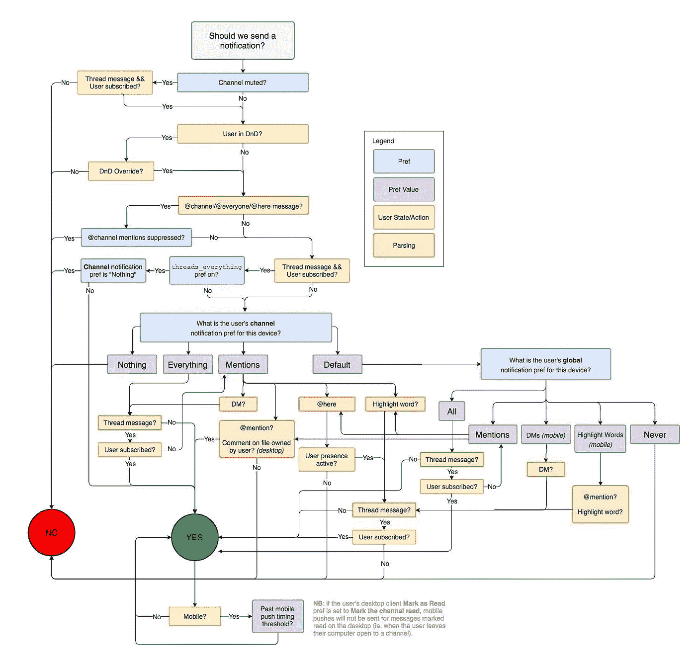
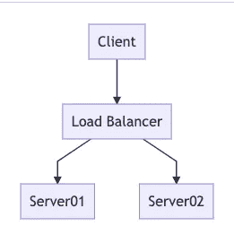
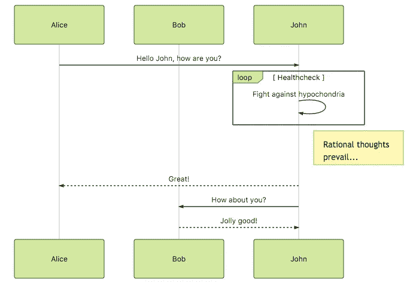
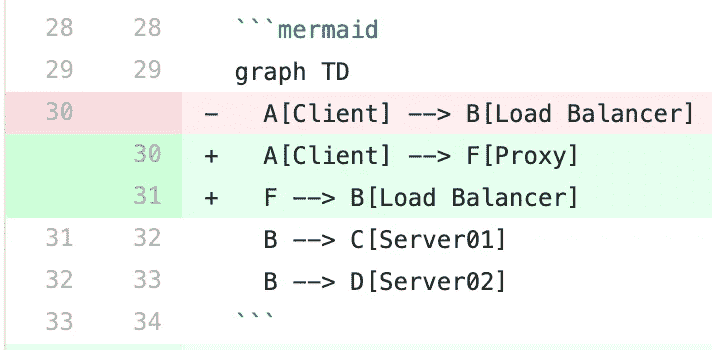

# 用美人鱼制作有趣的图表

> 原文：<https://betterprogramming.pub/making-diagrams-fun-again-with-mermaid-8a2c9ea3e471>

## 有时候，一个好的图表是形象化一个概念的最好方式


安德鲁·布坎南在 [Unsplash](https://unsplash.com/s/photos/diagram?utm_source=unsplash&utm_medium=referral&utm_content=creditCopyText) 上的照片

如果你已经用传统的方式学习了软件工程，并且在这个行业有了一些经验，你可能想知道我如何在同一个句子中使用“有趣”和“图表”。给我几分钟时间，你就会知道怎么做了。

# 我们真的需要图表吗？

当你在非公司工作时，很容易忽略图表。图表通常用于有许多团队、部门、工程师、外包资源和复杂法律义务的公司。

在这种情况下，它们通常被用作官僚工具，而不是传递知识的方式。这使得我共事过的数百名工程师讨厌用图表来记录事情。

然而，当我们加入新的团队，讨论新的架构想法，或者展示我们项目的路线图时，我们仍然会在白板上绘制图表。

这是因为，有时候，用语言来解释事情几乎是不可能的。

下面是 Slack 的流程图，展示了应用程序并决定是否发送通知。



你能想象只用文本来记录这些吗？或者更糟糕的是，你能口头上向某人解释这一点，并希望他们真的会记住它吗？

# 为什么我们不使用更多的图表呢？

我在软件工程师中经常看到的是，许多人非常害怕画序列图或状态图，甚至一些基本的流程图。

开发人员通常喜欢一个精心绘制的图表来解释软件或基础架构，但是他们自己却不愿意画一个。最常见的原因是绘制图表所需的工具。

即使没有上百个，也有几十个图表绘制工具，它们有着本质上相似但实际上不同的界面。学习这个新的用户界面，画出你想画的东西，导出到一个通用的格式，将导出的文件插入到你的文档中。

然而，几个月后，你画的那些漂亮的图表就会过时，你需要重新画一遍。但是这一次，您将需要找到那些图的源文件，或者如果它是一个在线工具，您将需要获取帐户凭证。

这个过程本身充其量只是一个小麻烦。然而，如果绘制原始图的人已经离开了公司或者不在，更新这些图可能会很麻烦。

在这种情况下通常会发生的是，那些图从来没有得到更新，并被丢弃。我见过太多漂亮的图表就这样被浪费掉了。

因此，维护成本是开发人员不愿意绘制图表的第一个原因。

第二个原因是这些图表工具提供的用户界面。花哨的、视觉上吸引人的拖放工具肯定令人印象深刻，但人们通常需要经常重新排列元素。

当您需要一直移动元素来为您添加的新元素腾出空间时，这是一件非常痛苦的事情。甚至能够自动化这种重新安排过程将是一个惊人的时间节省。

# 美人鱼有什么好的？

使 [Mermaid](https://mermaidjs.github.io/) 有趣的是，它让你以一种基于文本的、友好的方式定义图表。这反过来使得维护和版本控制这些图表变得非常容易。

它还可以让 Mermaid 根据您对图形的定义为您计算出来，从而让您不必自己组织图形中的项目。下面是一个基本的例子，说明这个定义是什么样子的，以及它意味着什么。

```
graph TD
  A[Client] --> B[Load Balancer]
  B --> C[Server01]
  B --> D[Server02]
```

这转化为:



这是负载平衡器的简化流程图。向美人鱼表示我们想画一张流程图。我们也可以得到一个`sequenceDiagram`、`classDiagram`、`gantt`、`pie`，或者一个`gitGraph`。

例如，序列图将被定义如下:

这一定义将产生:



嗯，那太简单了！继续下去，看看美人鱼提供的更复杂的例子[。对于具体图表的详细语法和选项，请查看本文末尾的链接。](https://mermaid-js.github.io/mermaid/#/flowchart)

# 可维护性

我之前提到过，美人鱼的方法在可维护性方面对我们有利。有什么比谈论版本控制更好的方式来谈论可维护性呢？

正如我们编写的代码一样，图表中的变化将首先在 Git 的 diff 视图上可见。

因为 Mermaid 是基于文本的，所以 Git 中的差异在变化方面更加明显，也更容易跟踪。下面是一个常见图表变化的示例`git diff`:



# 探索实时编辑器

如果你懒得设置和试验美人鱼，你可以从它的[实时编辑器](https://mermaid-js.github.io/mermaid-live-editor)开始。探索你的图是什么样子是非常简单和直观的。

该工具还可以让你下载你的最终作品作为图像文件，所以如果你只需要快速绘制一些东西并张贴在某个地方，你会喜欢它的。自从我开始使用它，我的闲聊变得简单多了。

# 发展环境

如上所述，[美人鱼的 live 编辑器](https://mermaid-js.github.io/mermaid-live-editor)是一个很好的起点。然而，在编辑 markdown 文件中的图表时，我们当然需要更容易和更集成的工具。

如果你使用 Visual Studio 代码， [Markdown Preview 美人鱼支持](https://marketplace.visualstudio.com/items?itemName=bierner.markdown-mermaid)是一个不错的插件，可以在 VS 代码中可视化你的美人鱼图形和 Markdown 文件。

## 在 GitLab 上

如果你正在使用 GitLab，你很幸运。GitLab 已经在他们的 markdown 渲染器中支持美人鱼了。这意味着你可以安全地使用它。这里是链接到[他们关于美人鱼](https://docs.gitlab.com/ee/user/markdown.html#diagrams-and-flowcharts-using-mermaid)的文档。

## 在 GitHub 上

遗憾的是，GitHub 原生不支持 Mermaid.js。这项功能请求已经搁置了大约四年。这留给你两个选择:

1.  使用浏览器扩展神奇地处理任何 markdown 文档中的 Mermaid.js 标记。我推荐[这个美人鱼扩展](https://github.com/BackMarket/github-mermaid-extension)。
2.  使用[这个 CLI 工具](https://github.com/mermaidjs/mermaid.cli)将您的图表标记转换成 PNG 文件，并在您的 markdown 文档中引用这些图像。

即使可以使用持续集成(CI)工具自动化第二种方法，我还是会选择第一种方法。

## 论大西洋汇流

有一个插件可以添加到你的 Confluence 设置中，允许你将美人鱼图形导入到你的 Confluence 页面中。[点击这里查看](https://marketplace.atlassian.com/apps/1214124/mermaid-plugin-for-confluence?hosting=server&tab=overview)。

## 在自定义文档网站上

如果您计划创建自己的文档站点，您可以自己托管，并希望在上面包含对 Mermaid 的支持，一个好的方法是使用静态文档站点生成器，如 [Docsify](https://docsify.js.org/) 或 [readthedocs.io](https://readthedocs.io/) 。

这不仅能为你提供内置的美人鱼支持，还能让你省去建立网站的大量工作。

然而，如果你已经有了一个网站，并希望在你的网站上无缝地支持美人鱼，你所要做的就是添加美人鱼的 JavaScript 包，它将编译你的美人鱼定义并呈现相应的图表。您可以通过运行以下命令来安装它:

```
yarn add mermaid
```

或者，如果你有一个没有捆绑器的网站，你也可以通过`<script>`用老方法插入这个包:

```
<script src="https://unpkg.com/mermaid/"></script>
<script>mermaid.initialize({startOnLoad:true});</script>
```

然后，您将如下定义您的图:

更多细节和配置选项，[查看这里的文档](https://mermaid-js.github.io/mermaid/#/usage)。

# 自定义图表的样式

你可能已经注意到，美人鱼的默认造型还可以，但它不是最漂亮的。你想改也没人会评判你。

例如，我做了一个定制样式，使它适合我雇主的品牌颜色，这样在工作中使用时看起来更专业。如果您想在与工作相关的演示过程中使用这些图表，这也可以为您节省一些额外的精力。

美人鱼使用 CSS 来设计图表的样式。这让我们可以扩展 CSS 定义，并根据我们的偏好赋值。

如果你要将美人鱼导入到你的网站中，只需添加带有正确选择器的 CSS 就足够了。查看最后的链接，查看每种图类型的 CSS 选择器文档。

如果你从美人鱼图形定义中生成图像，也可以添加你的风格。美人鱼 CLI 是一个很好的工具，可以从命令行界面生成这样的图像。您可以使用`-C`或`--cssFile`选项将您的 CSS 附加到它上面。

遗憾的是，在 GitHub 或 GitLab 等第三方解决方案上使用 Mermaid 时定制样式并不简单。除非你使用的服务明确支持它，否则没有任何官方方法可以做到这一点。

# 最后的话

如果我引起了你的兴趣，我建议你看一看，试试美人鱼。这可能会节省你很多时间，让你再次喜欢上图表。

感谢阅读我的文章。请在评论中告诉我你对此的看法。

# 有用的链接

*   [美人鱼. js 官方网站](https://mermaid-js.github.io/mermaid/#/)
*   [git lab 上的美人鱼. js](https://docs.gitlab.com/ee/user/markdown.html#diagrams-and-flowcharts-using-mermaid)
*   [人鱼合流插件](https://marketplace.atlassian.com/apps/1214124/mermaid-plugin-for-confluence?hosting=server&tab=overview)
*   [流程图语法和自定义样式](https://github.com/mermaidjs/mermaid-gitbook/blob/master/content/flowchart.md)
*   [序列图语法和自定义样式](https://github.com/mermaidjs/mermaid-gitbook/blob/master/content/sequenceDiagram.md)
*   [甘特图语法和自定义样式](https://github.com/mermaidjs/mermaid-gitbook/blob/master/content/gantt.md)

— [奥赞通卡](https://medium.com/@ozantunca)

## 订阅更多

如果你喜欢这篇文章，并希望得到类似的其他文章的通知，[你可以在这里订阅我](https://ozantunca.org/subscribe)。我还会不时地给你发送免费的课程和电子书。我保证永远不会给你发垃圾邮件👍。