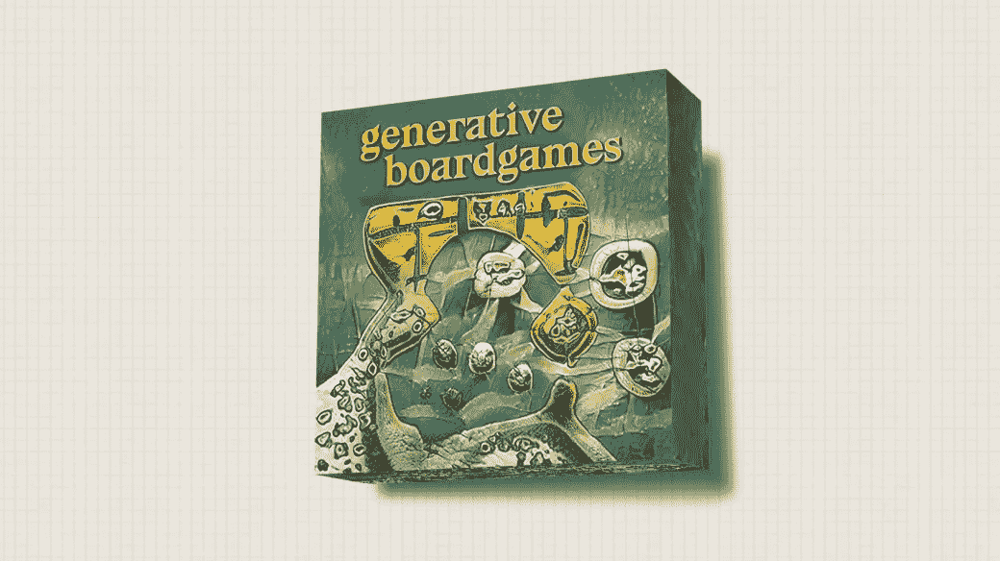
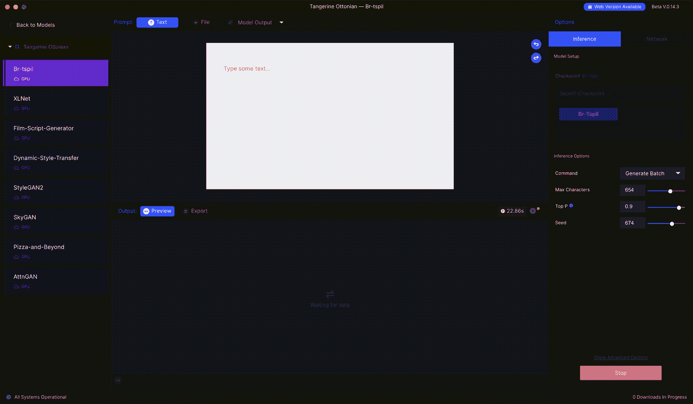
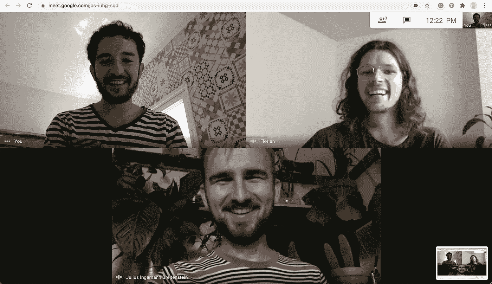
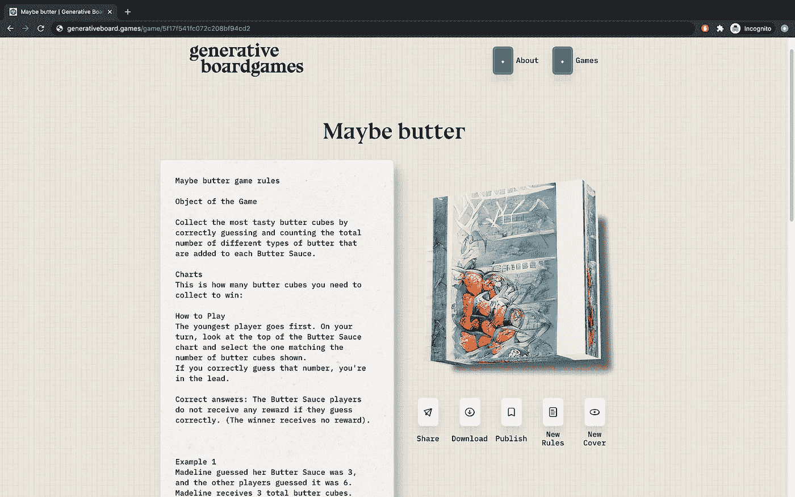

# 制作生成性棋盘游戏

> 原文：<https://betterprogramming.pub/making-generative-board-games-1778d6267d8b>

## 当你给一个神经网络一些棋盘游戏规则会发生什么？



生成性棋盘游戏封面艺术

# 这个想法

在某个时候， [Julius](https://www.juliusingemann.com/) 有了用一些棋盘游戏规则训练一个神经网络的想法，看看会发生什么。快进两个月左右，[和](https://www.generativeboard.games/)发生了生财棋盘游戏。

Julius 是一个桌游爱好者，也是我以前合作过的交互设计师，他把我介绍给了 [Lucas Terra](https://lucasterra.com/) ，一个来自圣保罗的超级天才设计师，他在 Nubank 工作。我们共同决定，利用人工智能生成棋盘游戏的想法值得探索，因此我们开始构建一个服务，使您能够创建自己的游戏，浏览以前制作的游戏库，当然，还可以玩游戏。

# RunwayML


RunwayML 应用程序

整个项目是围绕 RunwayML 构建的。它们提供了一个平台，这使得与机器学习的交互像创建 Instagram 故事一样简单(某种程度上)。单击您想要用作基础的模型(或创建您自己的模型)，用数据集训练它(或保持原样)，将其添加到您的工作区，并开始使用它。一切都运行在他们的服务器上，你不用担心 CPU，GPU 等等。

他们最近增加了一个功能，您可以将您的模型作为服务托管在他们的服务器上。(AIaaS？)这是我们最后决定用的。我们将数据作为请求传递给 API 端点，并获取模型给我们的任何数据。太棒了！

# 样机研究

在开始构建实际的应用程序之前，我们必须做一些原型设计来获得概念证明。RunwayML 应用程序可以让您在五分钟内建立并运行一个模型，这有助于您快速获得一些结果。

为训练一个模型产生第一批棋盘游戏样本获取数据需要更长的时间。首先，我们必须获得模型的实际训练数据。幸运的是，许多网站提供了一个很大的棋盘游戏规则和封面库。为他们建立一个网页抓取工具并没有你想象的那么难。[我之前写过一篇关于这个话题的文章](https://medium.com/@florian.porada/create-an-ai-powered-podcast-generator-based-on-gpt-2-ad08b4bf3099)。如果你打算朝那个方向做点什么，可以去看看。

一旦有了数据，就可以将它添加到 RunwayML 中，并开始训练模型。一般来说，训练步骤越多，输出就越精确(越好)。



在 RunwayML 中测试模型

经过一些测试和调整，我们有两个训练模型。一个改进的 GPT2 模型使用超过 2，500 个游戏规则进行训练，一个 StyleGAN 模型使用超过 15，000 个棋盘游戏封面进行再训练。

# 建筑物

## 环境

最终，我们决定继续这个想法，用它做一个实际的东西。完全远程协作面临一些挑战，但克服这些挑战并不难。

管理 [GitHub](https://github.com/) 中的代码，并使用他们自己的项目管理功能，可以让你很好地了解谁在做什么，以及目前处于什么状态。将任务链接到“拉”请求有助于您跟踪项目的实施并检查团队的工作。

[Figma](https://figma.com) 是我们玩视觉游戏的主要场所。您可以立即为页面创建 UI 元素、用户流、情绪板或资源。此外，讨论这些想法并添加意见或评论对协调所有事情大有帮助。



完全遥控

通过适应不同的时区，团队电话当然也是可能的，并提供了一个很好的机会来赶上和有一点数字咖啡休息。

## 技术

对于该应用程序，我们使用了带有自定义 Express.js 服务器的 [React.js](https://reactjs.org/) 框架 [Next.js](https://nextjs.org/) 和用于保存创建的游戏的 [MongoDB](https://www.mongodb.com/) 。

我喜欢能够将前端代码移动到后端的概念，反之亦然。它使您能够非常快速地绘制和原型化特征，并四处移动它们。如果某些东西需要更多的计算能力或者数据量很大，就把它移到后端，以减轻客户端的负担。

## 规则生成

生成棋盘游戏文本部分的 API 有一个`max_characters`限制。这意味着，在这种情况下，一次 API 调用只能生成 1，024 个字符。

对于一个完整的规则集来说，这个数量太短了。一种解决方案是将多个请求链接在一起，并将结果合并为一个。这里你必须知道人工智能文本生成器需要一些输入来构建。最初，你必须为你想玩的游戏提供一个名字——例如，“个人太空入侵者”这将用于第一批生成的文本。

这里有一个问题:为了获取下一个调用的上下文，我们从 RunwayML 获取响应，并将其用作下一个调用的输入。这样做允许模型将已经生成的文本合并到后续调用中，从而创建一个连续的内容片段。

```
// some pseudo code for handling the contextlet counter = 0;if (counter === 0) {
  input = gameName;
  counter += 1;
} else if (counter <= 3) {
  input = response.data.generatedText;
  counter += 1;
} else {
  counter = 0;
}getRules(input);
```

只要 API 允许，您就可以将这些请求链接在一起，从而绕过`max_character`边界。

感谢 RunwayML 团队在开发期间和之后的支持！

## **封面艺术一代**

为了获得游戏的封面，我们创建了一个包含 512 个随机浮点数的请求，作为来自 RunwayML 的托管模型 API 的输入。StyleGAN 的工作方式是，512 个浮动中的每一个都将被用作我们想要的图像的样式指南。你可以在这里阅读更多关于这是如何工作的细节[。](https://nanonets.com/blog/stylegan-got/)

对于每个请求，一个新的随机数组将被构造并传递给宿主模型。由于这是非常随机的，封面不会从您提供的游戏名称中获得任何上下文。有很多方法可以解决这个问题，比如说，通过实现某种[at ngan](https://github.com/taoxugit/AttnGAN)来解决，但是我们还没有到那一步。

## 把它放在一起

现在我们有了两种关键成分，我们需要一些漂亮的包装。
在 Figma，我们已经准备好实施设计。Figma 提供了导出组件和复制样式的特性，这在大多数时候加速了组件的构建过程。

在 [three.js](https://threejs.org/) 和[spring-three-fiber](https://github.com/pmndrs/react-three-fiber)(React 的 three.js 包装器)的帮助下，我们添加了一个简单(但很漂亮)的数字盒子，我们在上面加载了生成的图像作为纹理。

所有数据出现在客户端后，可以发布到以前生成的游戏列表中，下载成 PDF 格式，打印出来带到下一个游戏之夜，或者丢弃，这样就没人知道这个游戏了。



## 部署

多亏了 [GitHub Actions](https://github.com/features/actions) 和 [Docker](https://www.docker.com/) ，部署变得非常简单。一旦一个新标签被推送到存储库，构建过程就会被触发。它将所有内容打包在一个 Docker 映像中，并将其推送到 Docker hub。之后，新的 Docker 图像将被自动拉入 web 空间，服务将重新启动。

我考虑过使用 Kubernetes 集群，但是在这种情况下，开销太大了。现在，编写一个小的 Bash 脚本来处理拉取和更新就可以了。

# 我们学到了什么

总的来说，我学到了很多关于与神经网络的互动，以及不同类型的神经网络如何以不同的方式使用。机器学习有其有用的一面，但就目前而言，在我看来，它更多的是支持创造性的过程，而不是完全接管它。

一般来说，在安排任务和沟通时，与一个完全处于不同时区的远程团队一起工作是一种很好的体验。

此外，我确实了解了 React 和 Next 中的一些新特性，这总是一个很大的优势。

发布一个对公众开放和可用的项目肯定伴随着应对人们创造的挑战。

# 后续步骤

这个项目没有具体的下一步。在我们发布它之后，我们将处理一些反馈，增加一些改进，看看它会如何发展。这一直是一个有趣的附带项目，没有任何附加条件。如果我们碰巧获得了 GPT-3 API 或其他一些可以改善体验的有趣的东西，我相信我们也会找到一些时间来玩它。

网站上有一个[捐赠](https://www.paypal.com/cgi-bin/webscr?cmd=_s-xclick&hosted_button_id=F3RLUZYGXM8RY&source=url)按钮，因为主持模特和应用程序正在花费我们的真金白银。如果你喜欢这个项目，你可以帮助我们保持在线和工作一段时间。

现在生成你自己的游戏，别忘了玩得开心。