# 用 Python 制作网格

> 原文：<https://betterprogramming.pub/making-grids-in-python-7cf62c95f413>

## 臀部要方

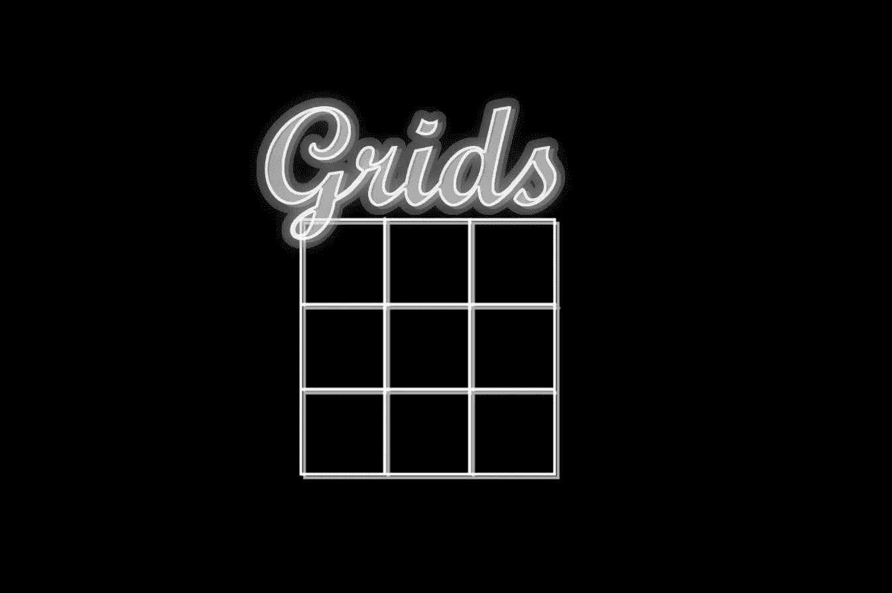

作者照片。

在某些时候，你可能需要为一个项目或编码面试问题(走迷宫、搜索)制作一个网格或类似网格的视觉结构。网格也是在画布表面有序放置对象的基础，在更复杂的情况下，如等轴视图和平铺游戏。

这篇文章希望以一种无痛的方式把我们从零网格带到中级网格。

*注意:这里讨论的代码和概念在不同的语言之间是可以互换的，但是有些语言提供了更好的本地体验，并且网格需要原语。Python 因为没有原生的/简单的 GUI 解决方案而臭名昭著，所以我将使用下一个最好的解决方案:*[*pygame*](https://www.pygame.org/news)***(****如果你想编码就安装它):*

```
pip install pygame
```

*或:*

```
python3 -m pip install pygame==2.0.0
```

Pygame 并不是一个真正的 GUI 库，而是一个简单的游戏引擎，你可以在几分钟内安装并理解它，然后适应你的 GUI 或你选择的语言。请看下面的速成片段……

# 先决条件

下面是一个小脚本，在 pygame 中创建了一个窗口，一个要在上面画画的表面，还画了一条对角线。大部分是设置好的。重要的是代表我们画布的窗口/表面大小和在空间中取两点并画一条线的`drawline()`函数:

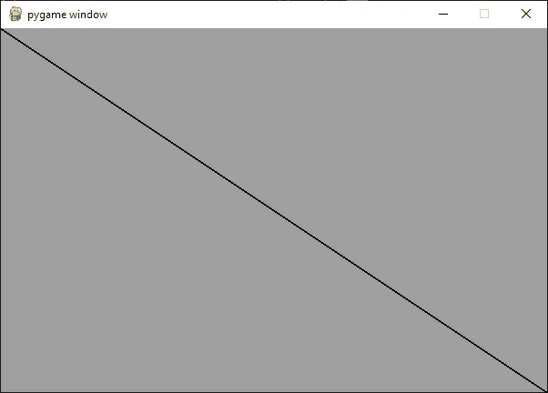

# 基本网格

网格的前身是一个简单的矩形，我们可以通过制作四条线并添加一些填充来创建它。关键是理解坐标系。这是我们将要编码的图表:

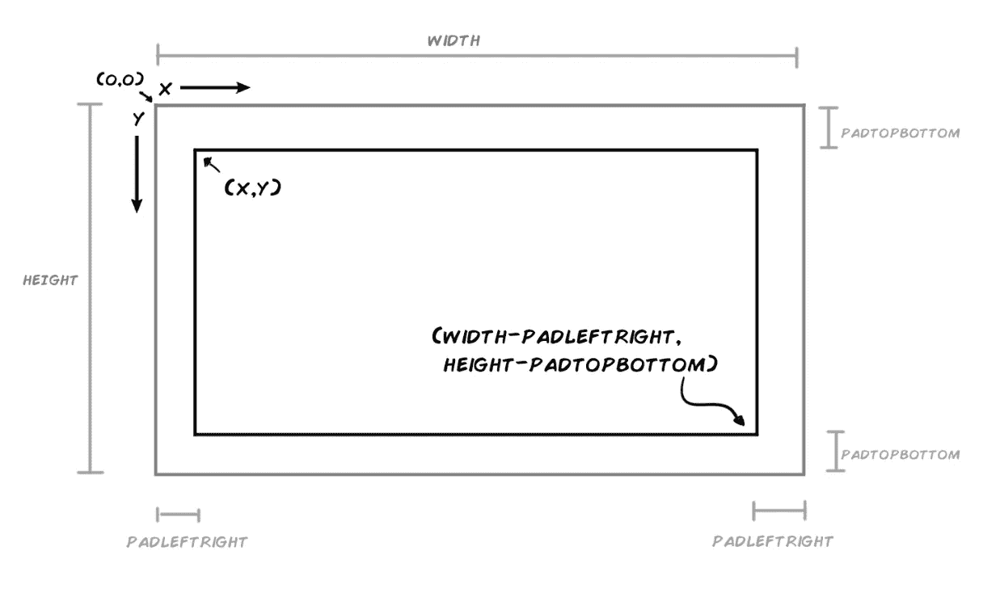

作者照片。

在代码中，它看起来像这样:

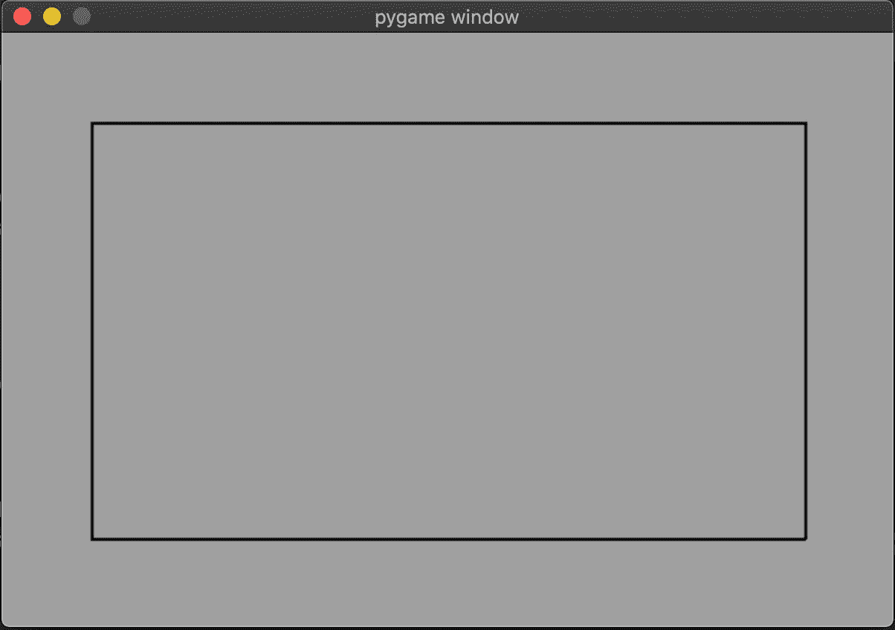

*注意:不要担心前面和后面例子的长度和冗长。它们旨在帮助您理解坐标系(这可能很棘手)。*

# 一个 3X3 的网格

对于我们的第一个适当的网格，我们可以简单地将矩形分成垂直和水平的单元格，并通过一个`for`循环添加线条:

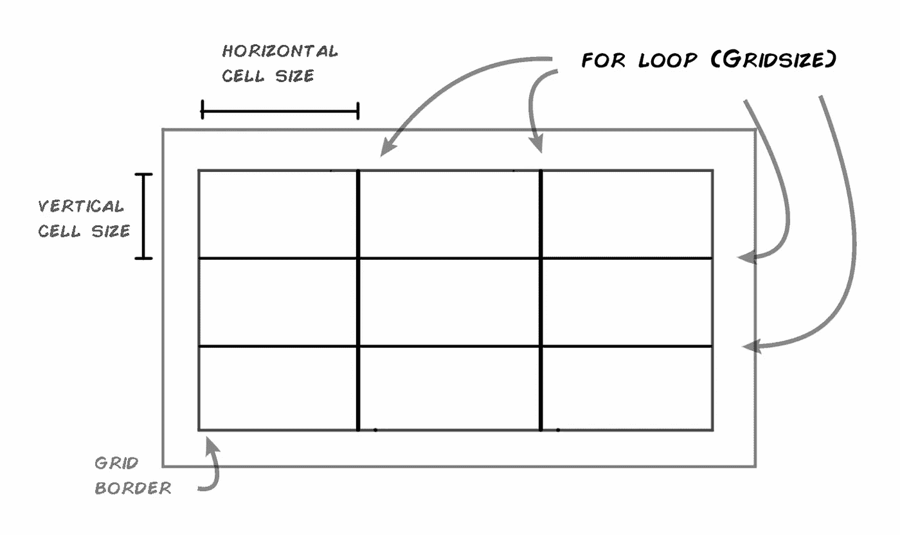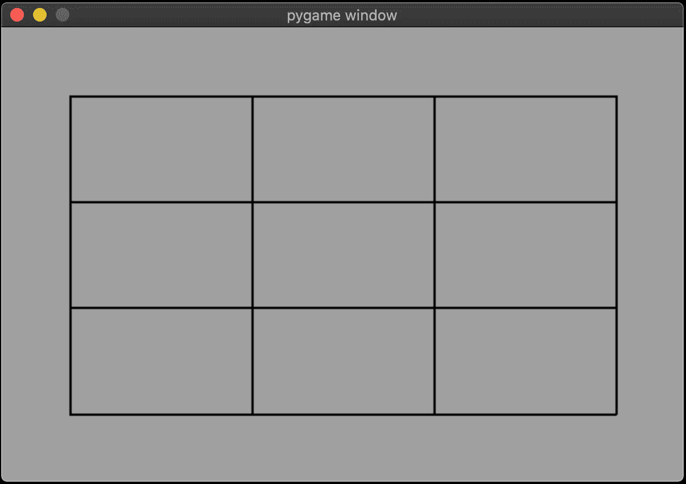

在这一点上，我们有一个适当的网格。您还可以增加分割数、填充数和屏幕大小。

# 方形网格

你可能想要一个有正方形单元格的正方形网格。一般方法是一样的。你只需将你的尺寸添加到网格的容器中，使其成为正方形。另一个选择是绘制单独的矩形，并把它们放在我们一直在使用的点上(相关问题见下一节)。还有一种方法是预先算出所有的网格坐标(我们将在本文后面讨论)。

现在，让我们只使用一个容器和坐标来定位它:

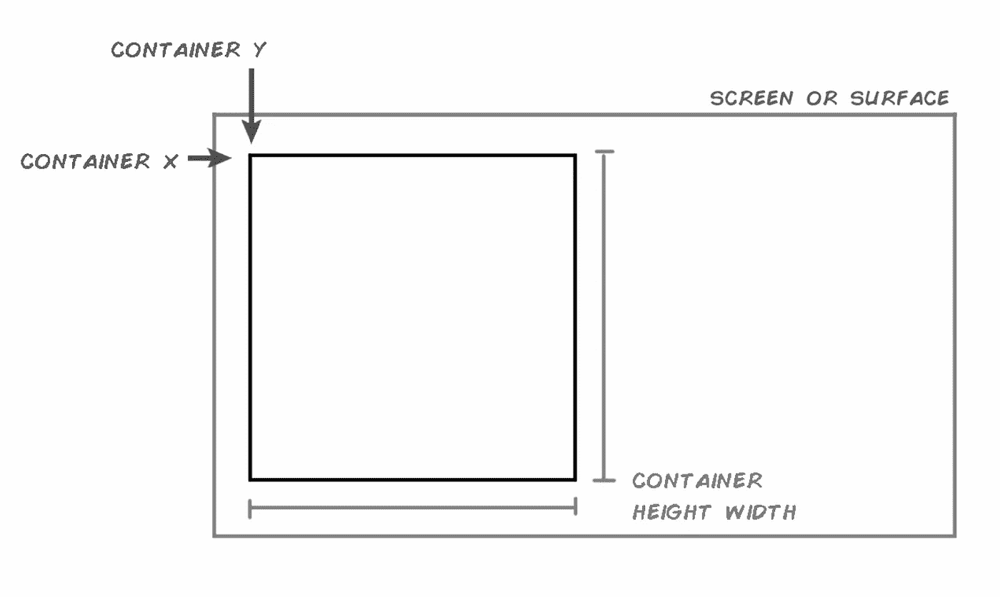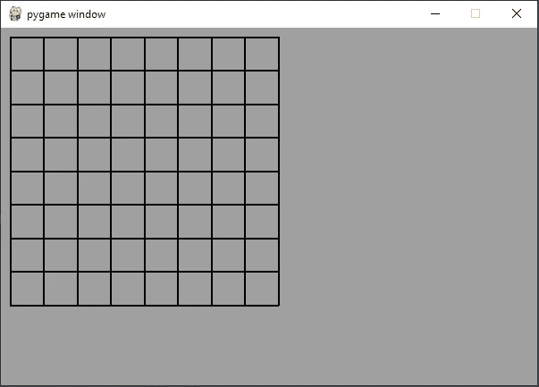

*提示:* *笔和纸是你最好的朋友。如果你不能理解这些坐标，就像我们一直使用的图表一样画出它们之间的关系。*

## 你想要你的格子里有瓷砖吗？

网格中的瓦片或填充单元并没有什么特别难的，但是我们突然进入了一个地方，在这里我们将卑微的网格提升到了一个数据容器——因此网格和它的数据之间的关系需要得到承认。让我们简单地从在网格中放置一个单元格开始:

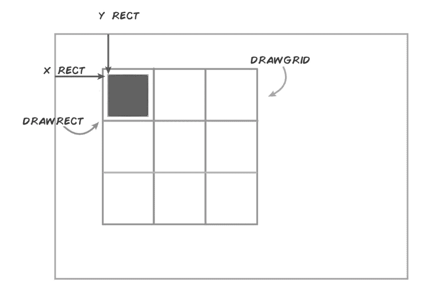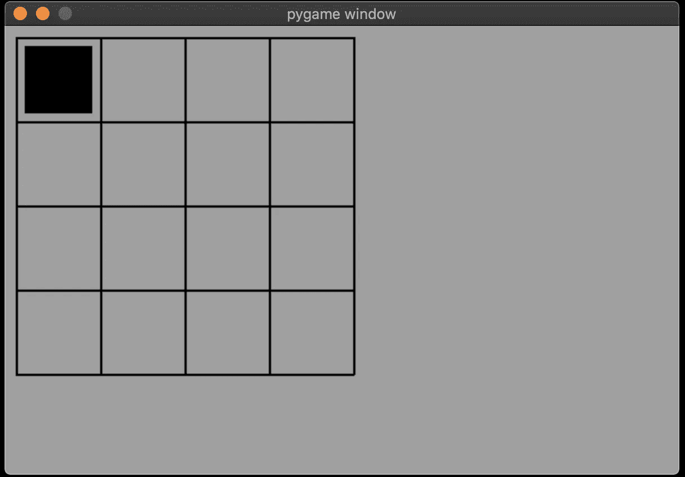

让我们稍微清理一下代码。作为最后一个简单的例子，让我们用瓷砖填充网格——这通常是用双`for`循环完成的:

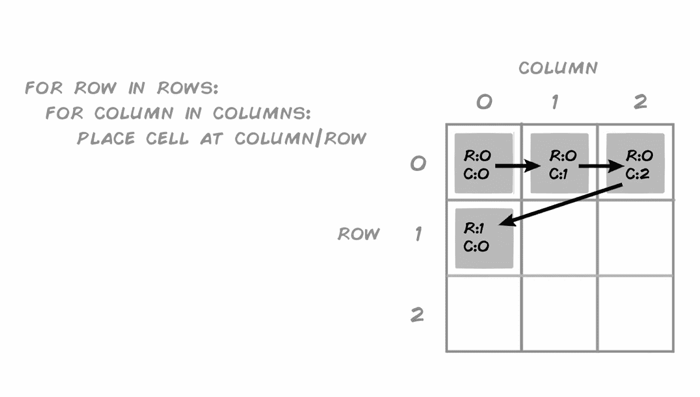

您也可以将 for 循环中的顺序颠倒为 column/row，它会以相同的顺序填充网格——只是顺序不同。

由于需要的变量和特殊情况的数量，向图块添加填充有时很棘手。例如，在这里，当网格太大或网格线太粗时，整个东西都会断裂。同样，纸和笔可以帮助您找到边缘案例并相应地编写代码。

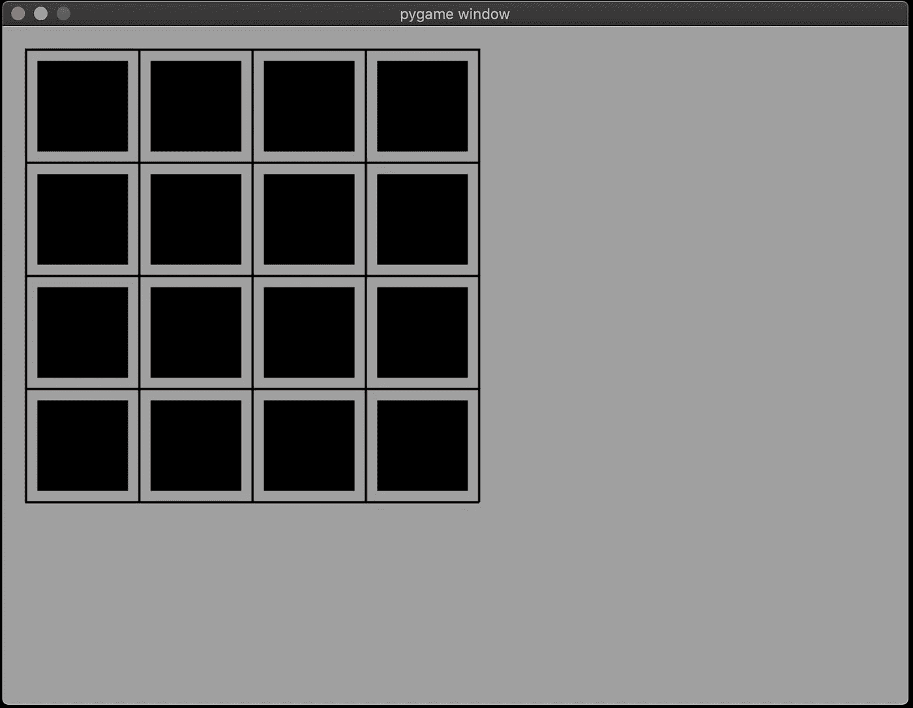

# 中级网格学

现在，您应该对如何从头开始编写网格代码有了大致的了解。此时，您可能希望添加一个网格引用或对象，以便更好地管理网格和单元格之间的关系。我们可以像前面的例子一样用独立的常数来计算这两者，但是可能很难跟踪它们。因此，添加一些数据容器很有帮助。换句话说，我们希望在某个地方存储网格、坐标和单元格之间的关系。地图是一个受欢迎的选择…

## 地图

地图通常作为网格参考，并为您提供一个构建网格的蓝图和一个数据结构中的网格内容(在迷宫/代码访问、瓷砖游戏和计算机视觉/人工智能中很流行)。我们需要的第一件事是定义网格的数据结构(列表的列表或数组的数组也可以)。虽然我们当然可以使用`for`循环来构建我们的数据容器，但是 Python 有完美的库来处理这些类型的结构: [NumPy](https://numpy.org) 。

考虑下面的例子:

在第一个例子中，我们制作了一个可以代表一个空网格的零矩阵。在第二个例子中，我们有 0 和 1，现在可以表示网格的空白部分(0)和数据(1)。您可以根据需要推广到更高的领域(例如，为不同类型的单幅图块添加另一个数字)。

我们现在需要修改现有代码，以接受我们刚刚创建的数据结构:

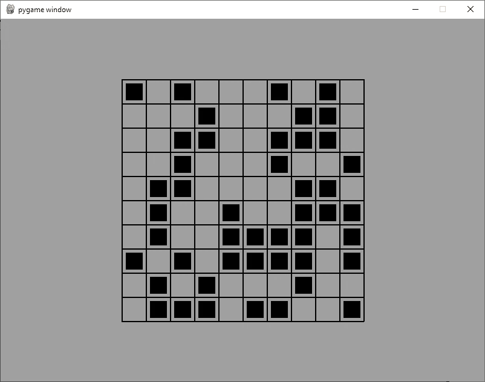

最终结果是，我们现在可以阅读网格地图！

# 现在去哪里？

前面的例子当然可以改进。我们还可以使用不同的更精确的坐标系([x，y 坐标矩阵或点云很复杂，但功能强大](https://stackoverflow.com/questions/36013063/what-is-the-purpose-of-meshgrid-in-python-numpy))并添加细胞行为——从为视频游戏制作动画和/或移动细胞到制作图表等更普通的东西。你的项目应该告诉你下一步去哪里。

我希望你可以自己制作网格，或者至少从这篇文章中获得一些对你的项目有用的信息。

感谢阅读！