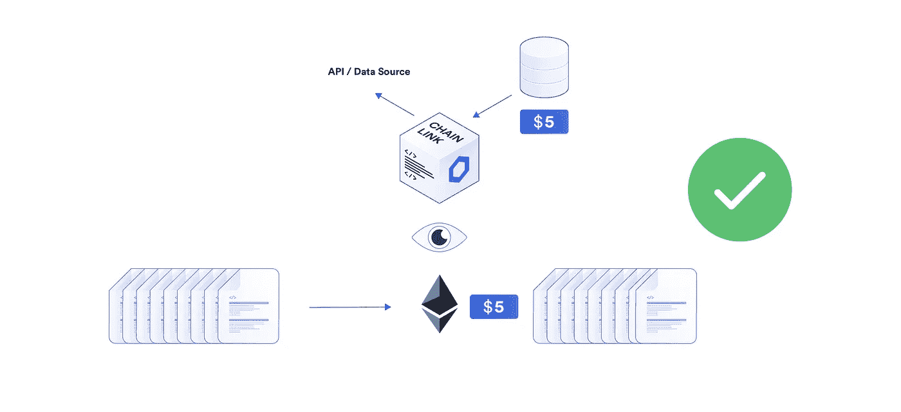
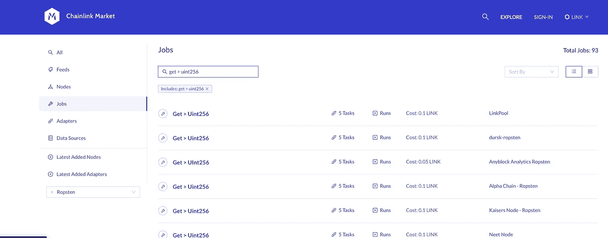
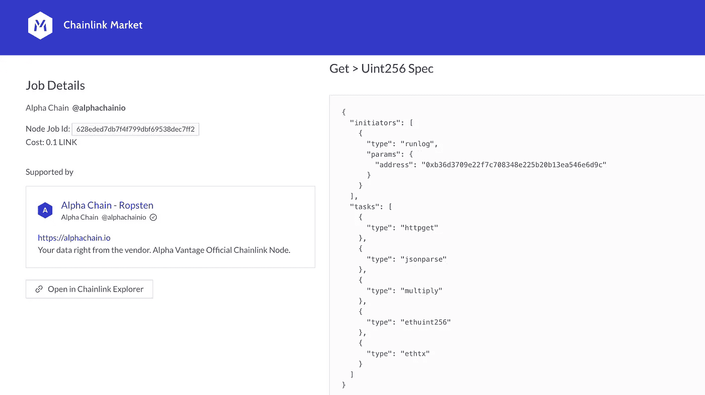

# 在 Solidity 中发出 HTTP 请求

> 原文：<https://betterprogramming.pub/making-http-requests-in-solidity-b472c2b5e5f1>

## HTTP 请求在以太坊上工作，并与所谓的神谕保持一致


通过[Canva.com](http://canva.com/)从佩什科夫获得的原始背景图像

[使用 Chainlink 在 Solidity](https://blog.chain.link/apis-smart-contracts-and-how-to-connect-them/) 中发出 HTTP 请求很简单。如果你想了解更多关于最佳实践的见解，那么在阅读完这篇文章后，请务必阅读区块链上的[运行日志启动器](https://towardsdatascience.com/api-calls-on-blockchain-best-practice-for-data-collection-11f1fc86a2be#runlog)

*   这个特定的适配器/任务列表:httpget、jsonparse、multiply、ethuint256 和 ethTx 适配器。

运行日志启动器是最常用的启动器之一。它定义了 chainlink 节点将监视包含该作业 ID 的任何日志事件的区块链。一旦发现一个事件，它将执行适配器，并将数据发送到链上。我们将很快讨论这些适配器的功能。

您的智能合约将不得不等待 Chainlink 节点返回您的数据，但是一旦它返回，您的智能合约将从该事务中提取数据。



图片来自 [chain.link](https://chain.link/)

# 这在 Solidity 里是什么样子的？

为了展示这在代码中是什么样子，让我们看一下获取 ETH 的数字价格。您可以使用这个 [Remix 链接](https://remix.ethereum.org/#version=soljson-v0.6.2+commit.bacdbe57.js&optimize=false&gist=9507bdea4570e56067a0ab0ecb351b67)来跟进，但是这里是合同代码的一个子集。

```
// Creates a Chainlink request with the uint256 multiplier job
  // Ideally, you'd want to pass the oracle payment, address, and jobID as 
  function requestEthereumPrice() 
    public
    onlyOwner
  {
    // newRequest takes a JobID, a callback address, and callback function as input
    Chainlink.Request memory req = buildChainlinkRequest(JOBID, address(this), this.fulfill.selector);
    req.add("get", "[https://min-api.cryptocompare.com/data/price?fsym=ETH&tsyms=USD](https://min-api.cryptocompare.com/data/price?fsym=ETH&tsyms=USD)");
    req.add("path", "USD");
    req.addInt("times", 100);
    sendChainlinkRequestTo(ORACLE_ADDRESS, req, ORACLE_PAYMENT);
  }// fulfill receives a uint256 data type
  function fulfill(bytes32 _requestId, uint256 _price)
    public
    // Use recordChainlinkFulfillment to ensure only the requesting oracle can fulfill
    recordChainlinkFulfillment(_requestId)
  {
    currentPrice = _price;
  }
```

为了开始向 chainlink 节点发出请求，我们调用从`ChainlinkClient.sol`导入的`buildChainlinkRequest`函数，该函数返回一个`Chainlink.Request`结构。在这个函数中，当我们开始构建它时，我们传递 jobID、返回地址和实现函数。

我们可以通过前往一个节点列表服务，如 [market.link](https://market.link/) ，并搜索我们想要的，来找到一个独立的 Chainlink 节点的 jobID。节点列表服务是独立节点发布关于如何连接到其链接节点的信息的地方。您可以使用它们来构建您的分散式神谕网络。确保你在正确的网络上(ropsten，mainnet，kovan 等)。

为此，我们需要一个可以发出`httpget`调用并返回`uint256`的作业，所以让我们尝试在 ropsten 网络上搜索该作业。



在[市场上找工作。链接](https://market.link/)

让我们选择一份工作，并确保`jobspec`就是我们要找的。我们可以前往`jobspec`选项卡，看看启动器和适配器是什么。



图片来自 [market.link](https://market.link/)

为了确保这个作业有正确的适配器，我们可以查看他们的任务/适配器列表。上图显示，这个作业正好有我们想要的启动器和适配器/任务。

一旦我们验证了作业具有我们想要的适配器，我们就可以复制作业 ID 以在代码中使用。您可以看到有类似工作的其他节点，当您将合同分散时，您将需要此列表，但同样对于测试和开发，我们可以只从单个节点中提取。确保您还获取了 oracle 地址，因为您稍后会需要它。

```
Chainlink.Request memory req = buildChainlinkRequest(JOBID, address(this), this.fulfill.selector);
```

然后，我们将 JOBID 放在我们的`buildChainlinkReqeust`的第一个参数中。第二个参数是契约返回数据的地址，也称为`callbackaddress`。最后一个参数是处理收集到的数据的函数，即`callbackFunctionSignature`。我们想将数据返回到这个契约，所以我们放入`address(this)`，我们处理数据的函数将是`fulfill`。我们在这个函数下面定义了实现函数。

```
function fulfill(bytes32 _requestId, uint256 _price)
    public
    // Use recordChainlinkFulfillment to ensure only the requesting oracle can fulfill
    recordChainlinkFulfillment(_requestId)
  {
    currentPrice = _price;
  }
```

`uint256 _price`参数是 Chainlink 节点输入从 http get 请求中收集的价格的地方。在上面的例子中，我们只是将节点的返回值设置为我们的`currentPrice` 变量。

回到`requestEthereumPrice`函数，我们可以向我们的适配器/任务添加参数。让我们回顾一下每个适配器的功能:

## httpget

Chainlink 节点将发出 HTTP GET 请求；通常，这是一个简单的 API 调用。

我们希望在传递给`req`变量的参数中发出的 HTTP GET 请求。

```
req.add("get", "[https://min-api.cryptocompare.com/data/price?fsym=ETH&tsyms=USD](https://min-api.cryptocompare.com/data/price?fsym=ETH&tsyms=USD)");
```

在撰写本文时，这个 HTTP GET 请求的返回值是:

```
{"USD":391.41}
```

## jsonparse

一旦节点发出 HTTP GET 请求，它将遍历 json 并只找到我们想要的值。存储 HTTP GET 请求的全部返回将会非常昂贵，因为你在以太坊链上存储的越多，你需要支付的 ETH 气就越多。所以，我们想尽量少退货。

```
req.add("path", "USD");
```

这将把 HTTP GET 请求的返回压缩为值
`391.41`。它向下遍历`{“USD”:391.41}`返回值的 json。对于更长的 json 返回，您也可以添加列表索引。例如，如果你有一个像这样的对象:

```
{"USD": [ "price": {"ETH": 391.41}]}
```

我们可以通过以下方式实现这一价值:

```
req.add("path", "USD.0.ETH");
```

## 乘/倍

一旦我们得到了`391.41`值，我们必须把它变成一个整数。小数在 solidity 中不起作用，我们需要[用定点数学来表示小数。](https://ethereum.stackexchange.com/questions/2987/how-can-i-represent-decimal-values-in-solidity/2990#2990)

```
req.addInt("times", 100);
```

这将再次调整我们的结果为`39141`(因为我们通过乘以 100 将小数位移动了两次)。

## 以太网 256

您会注意到，在我们上面的代码中，我们不向这个适配器传递任何参数；那是因为我们不需要。这个适配器只是将我们的答案`39141`转换成了可靠的可理解的格式。

## ethtx

这个也不需要任何参数。这是实际将数据发送回链上的适配器。

现在我们使用`sendChainlinkRequestTo`方法，使用从 market.link 获得的 oracle 地址、请求本身和 oracle_payment。

```
sendChainlinkRequestTo(ORACLE_ADDRESS, req, ORACLE_PAYMENT);
```

我们从 [market.link](https://market.link/) 中获得`ORACLE_ADDRESS`和`ORACLE_PAYMENT`。甲骨文付款是多少环节甲骨文天然气，我们要发送甲骨文，每个工作有自己的最低成本发送。

# 发送它

现在，让我们再运行一次！让我们部署合同，用 link 提供资金，然后请求 ETH 的价格。如果你不知道如何做，你可以浏览[示例演练](https://docs.chain.link/docs/example-walkthrough)。或者更详细的 YouTube 视频:

介绍可靠性和再混合，并部署您的第一个智能合同

Chainlink 节点将通过从区块链中读取请求来获取该请求。同样，它可以从区块链读取它，因为它正在使用运行日志发起程序。一旦它选择了作业，它就通过适配器运行，并将作业发送回链上，供您的智能契约使用！

Oracles 也可以在它们的作业定义中定义参数(称为`jobspec`)，您可以直接调用作业，而根本不需要输入任何参数。

这是一个关于如何使用 Chainlink 节点的非常深入的研究，但是有了这个，你现在有了很多基本的工具来在区块链生态系统中构建一些令人惊叹的项目。

如你所见，使用 chainlink 在以太坊和任何区块链中获取[链外数据是简单、安全和可靠的。让我们看看一些建筑吧！](https://dev.to/patrickalphac/off-chain-data-in-ethereum-how-to-access-4395)