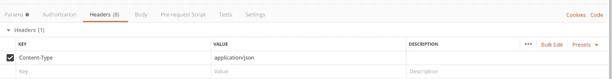
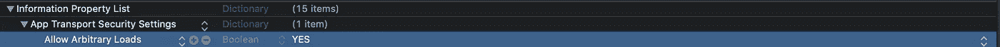
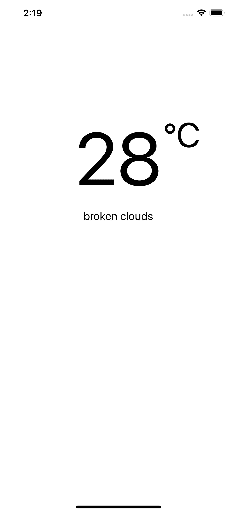

# 用 Swift 5 代码和泛型使 iOS REST 集成变得更好

> 原文：<https://betterprogramming.pub/making-ios-rest-integration-sweet-with-swift-5-codables-and-generics-a4863e089a2>

## 让我们一起创建一个天气应用程序


[安贾娜·梅农](https://unsplash.com/@anjimenon?utm_source=unsplash&utm_medium=referral&utm_content=creditCopyText)在 [Unsplash](https://unsplash.com/s/photos/rain?utm_source=unsplash&utm_medium=referral&utm_content=creditCopyText) 上的照片

开发一个带有几个 REST 集成点的 iOS 应用程序可能会变得非常单调、乏味和令人厌倦。

在本文中，我将展示如何通过开发一个简单的天气应用程序来使 REST 集成变得有趣，这个天气应用程序带有一个名为 [OpenWeather](https://openweathermap.org/) 的开放天气 API。

# 让我们把手弄脏吧

对于本教程，如果您想继续学习，您需要:

*   Xcode 11.2.1+
*   OpenWeather 免费账号:[https://openweathermap.org](https://openweathermap.org/)。

为了进行演示，我们将通过以编程方式构建用户界面来构建应用程序，如果您想使用它，我已经在 GitHub 上添加了一个启动项目[，但是如果您更喜欢故事板方法，您可以在我们进行的过程中自由地这样做。](https://github.com/AfroCyberGuy/StarterTemplate)

首先，我们想看看我们将要使用的天气 API，现在你应该已经注册并获得了一个密钥。

我们希望根据我们提供给 API 端点的位置坐标获得当前天气的详细信息和预报。

# 测试 API

找一个你觉得舒服的 REST 测试应用，我更喜欢用 [Postman](https://www.getpostman.com/) 来测试我的 REST 请求和响应。

*   [当前天气](http://api.openweathermap.org/data/2.5/weather?lat=-17.745746&lon=31.068936&units=metric&appid=YOURWEATHER_API_KEY)。
*   [五天天气预报](http://api.openweathermap.org/data/2.5/forecast?lat=-17.745690&lon=31.070690&units=metric&appid=YOURWEATHER_API_KEY)。

使用上面的端点和 API 键，不要忘记在头中将 content-type 设置为 JSON。



邮递员

# 创建模型

当前天气.雨燕

天气预报

# 可解码的解释

让我们简单看一下`CurrentWeather.swift`结构，你可以看到它扩展了`Decodable`类。

这使得它能够将来自 API 的 JSON 响应数据映射到`Object`类型，并且只需编写几行代码就可以轻松地访问 JSON 结构中的任何数据。

因此，简而言之，`Decodable`类是一种可以从外部表示(如 JSON)中解码自身的类型。当我们解码 JSON 数据以确认我们的`CurrentWeather`可解码结构时，每个结构中的私有枚举有助于获得 JSON 键名。

因此，如果我们仔细看看之前从 REST 客户端获得的 JSON 响应和`CurrentWeather` struct 结构，我们可以看到当前的天气结构有嵌套的结构，JSON 响应也有嵌套的 JSON 数据，所以每个结构代表一个 JSON 对象。

# 创建通用的 REST 处理函数

完美！既然我们已经准备好使用我们的天气 JSON 响应的`Decodable`类，那么是时候创建一个方法来调用天气 API，而不需要在我们想要调用 REST 请求时重写或粘贴它。

这允许我们不重复自己，也允许我们写干净和精益的代码。这就是我喜欢使用 Swift 泛型的原因，你马上就会看到。

在您的项目结构中创建另一个名为`Helpers`的组，创建一个空的 Swift 文件，并粘贴下面的代码。

SmartRESTHelper.swift

我们的`getWeatherData`泛型函数符合`Decodable`的泛型类型，因为我们想要使用任何符合`Decodable`类型的类，在我们的例子中是`CurrentWeather`和`ForecastWeather`结构。

它接受一个 URL 字符串参数和一个完成处理程序，该处理程序返回一个泛型类型和`NSError`。然后，它使用内置的`NSUrlSession`方法发出网络请求。

在收到请求后，如果没有错误，我们将数据转换成通用的可解码类型，如下所示。

```
let obj = try JSONDecoder().decode(T.self, from: data)
```

然后，在将 JSON 数据传递为可解码类型之后，我们将它添加到我们的完成处理程序中，我们将在视图控制器中使用该处理程序，以便于处理。

# 常数

创建另一个名为`Utils`的组，并将代码添加到下面的`Constants.swift`和`Controls.swift`中。我们现在需要它们，因为我们正前往视图控制器开始测试我们的代码。

Constants.swift

Controls.swift

# 测试泛型函数和可解码结构

转到视图控制器，粘贴下面的代码。

HomeViewController.swift

在运行您的代码之前，确保您已经设置了您的*应用传输安全*设置。



信息列表

在 Xcode 模拟器或 iOS 设备上运行应用程序。如果一切顺利，您应该会在 Xcode 输出文件中看到 JSON 响应，如果结果很好，那就太棒了，干得好。

我们已经设法处理我们当前的天气 JSON 响应。

假设我们想在标签中显示当前的天气温度和描述，如下所示。



用下面的代码更新您的视图控制器。当我们更新视图控制器代码时，我们的应用程序应该如上所示。

HomeViewController.swift

运行您的代码。如果一切顺利，您的温度和天气描述标签应该用来自 OpenWeather API 的数据进行更新。

# 下一步是什么

因此，我们已经设法使用我们的通用函数和可解码函数来显示当前的天气。

接下来，你可以使用我们创建的通用函数和`WeatherForecast`结构在你的`UITableView`或`UICollectionView`中显示数据。您甚至可以增强您的天气应用程序 UI，添加更多细节，并将其放入应用程序商店或添加到您的投资组合中。

也可以访问苹果官方和 OpenWeather API 文档页面来获得更多信息。

祝你未来的项目一切顺利，干杯。

[](https://github.com/AfroCyberGuy/GenericWeather) [## AfroCyberGuy/GenericWeather

### 此时您不能执行该操作。您已使用另一个标签页或窗口登录。您已在另一个选项卡中注销，或者…

github.com](https://github.com/AfroCyberGuy/GenericWeather)