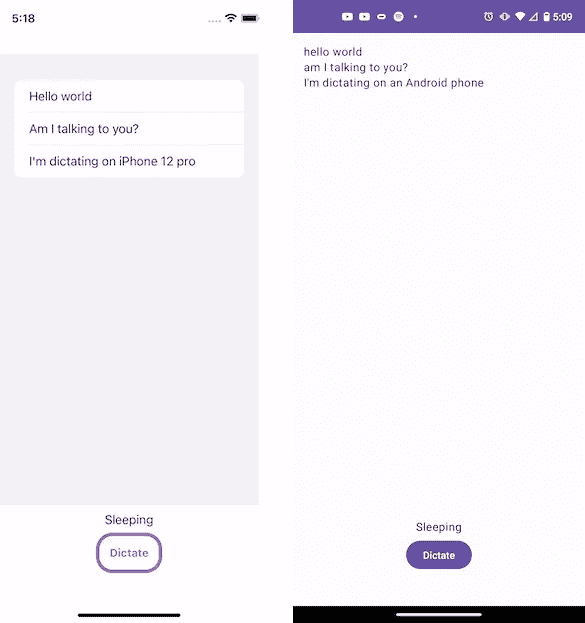
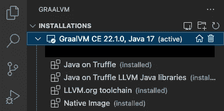
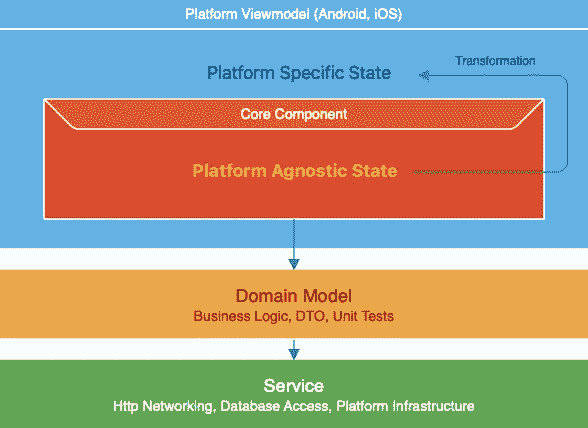
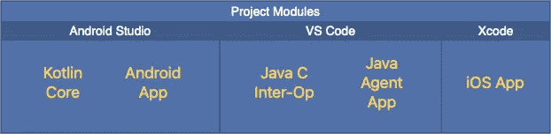
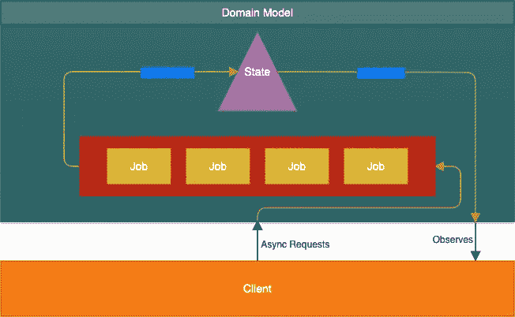

# 使用 GraalVM 本机映像构建多平台移动应用

> 原文：<https://betterprogramming.pub/making-multiplatform-mobile-apps-with-graalvm-native-image-7e9131fb185f>

## 构建语音听写应用程序的深入分步指南


由[大卫·什维霍维奇](https://unsplash.com/@iamdavid_10?utm_source=medium&utm_medium=referral)在 [Unsplash](https://unsplash.com?utm_source=medium&utm_medium=referral) 拍摄的照片

在这篇后续文章中，我们将探索用 Kotlin/Java 编写的共享核心的 iOS 和 Android 中的演示应用程序。入门篇这里是[这里是](https://medium.com/@philip.han_66842/graalvm-native-image-for-mobile-development-49eb87a00eee)。

是一个简单的语音听写 app。本演示的要点是将平台服务与域模型相结合。我们将首先从 iOS 获取语音识别文本，并查询自然语言处理(NLP)服务器来确定捕获的句子是否是一个问题。并且产生的域模型数据将被交付给`ViewModel`用于进一步的转换。



iOS 和 Android 示例应用

iOS 应用程序将演示如何与核心组件的 C 接口进行交互。这包括使用核心组件发布的流/通道，并通过 C 函数指针导出平台服务。

制作一个 C 接口主要是用 Java 完成的，用 [GraalVM 原生映像 C API](https://www.graalvm.org/22.0/reference-manual/native-image/C-API/) 和一些 C 头文件来声明函数和结构。

这个演示应用程序是用 GraalVM 社区版(CE)制作的。GraalVM Enterprise Edition (EE)是有成本的，但不是必须的。如果您选择使用 EE 而不是 CE，您将获得更丰富的特性集，尤其是更好的 GC 算法。

# 工具作业

请先安装[GraalVM Tools for Java—Visual Studio market place](https://marketplace.visualstudio.com/items?itemName=oracle-labs-graalvm.graalvm)。一旦安装了扩展，您将需要以下模块。您也可以使用这个扩展下载并安装 GraalVM。



这是在 GraalVM 版本 22.1.0 或更低版本上测试的。由于模块导入不正确，较高版本目前不工作。一旦成功，我会尽快通知你。

# 体系结构

这里的建筑是 MVVM 风格，略有调整。特别值得注意的是，ViewModel 在主机平台和平台不可知的 ViewModel 之间是分开的。这样做是为了共享非特定于平台的视图模型逻辑。

领域模型处理所有的业务逻辑，是事实的来源。它处理大量的并发性，以保持观测数据的一致性。它是以 actor 范式设计的，所以它的更新是以有序的方式发布的。

所有的业务逻辑都表示为纯函数，因此很容易测试。



让我们看一个这种类型转换的例子。这里我们有一个`StateFlow`用于监听语音识别器的状态。

```
val speechRecognizerState: StateFlow<Boolean> =
  model.speechRecognitionState
```

然后我们为 Android `ViewModel`转换这种状态。

```
val speechRecognizerState = speechCore.speechRecognizerState.*map*(*viewModelScope*) { listening ->
    if (listening) Pair(R.string.*listening*, Color.Red)
    else Pair(R.string.*sleeping*, Color.Black)
}
```

和 Swift 上相应的视图模型。

```
func convertRecognizerState(listening: Bool) -> (String, Color) {
  listening ? ("LISTENING", Color.red) : ("Sleeping", Color.black)
}
```

嗯，你可能想知道一个 Kotlin `StateFlow`是如何被观测到并传递给 Swift 中的 mapper 函数的。可以肯定的是，在这两者之间还有相当多的工作要做，所以让我们更深入地了解一下。

# 孤立的

Isolate 是 Java 运行时的一个迷你容器。它维护编译到目标平台的 Java/Kotlin 代码的执行堆栈和堆。

这里有一篇关于 Isolate 的详细文章:[Isolates and Compressed References:通过 GraalVM 实现更灵活高效的内存管理|作者:Christian Wimmer | GraalVM | Medium](https://medium.com/graalvm/isolates-and-compressed-references-more-flexible-and-efficient-memory-management-for-graalvm-a044cc50b67e)

必须首先创建一个隔离，然后在所有本机方法调用中使用。隔离在创建时绑定到指定的线程，并且本机调用必须包括线程引用。如果本机调用需要在不同的线程上运行，则必须在调用之前分离隔离，然后重新附加到目标线程。

隔离必须手动销毁，不会被主机操作系统自动回收

分离 C API:

*   `graal_create_isolate`
*   `graal_attach_thread`
*   `graal_detach_thread`
*   `graal_tear_down_isolate`
*   `graal_detach_all_threads_and_tear_down_isolate`

隔离 C API 可以直接在 Swift 中使用。

在演示应用程序中，我们将创建一个专用的 Swift 线程，并在屏幕持续期间附加一个隔离，而不是创建并销毁每个函数调用。

# GraalVM 本机映像 C API

首先需要为声明创建一个 C 头文件。然后将头文件导入 Java。

我们希望作为 C 函数公开的所有方法必须是静态的，并且在由`@CContext`注释的类中由`@CEntryPoint`注释。`@CContext`类似于 c 语言中的`import <header>`指令。

最后，您必须接受`IsolateThread`作为`@CEntryPoint`函数中的参数。

像结构这样更复杂的数据类型作为指针传递和返回。`PointerBase`相当于 c 中的指针。

```
@CStruct("CError")
public interface CError extends PointerBase {
    @CField("code") void setCode(int code);
    @CField("code") int getCode();
    @CField("message") void setMessage(CCharPointer message);
    @CField("message") CCharPointer getMessage();
}
```

上述结构首先在 C 头文件中定义，然后导入到 Java 中。这是 C 头文件中的声明，如下所示:

```
typedef struct CError {
    int code;
    char* message;
} CError;
```

我们只能处理头文件中定义的类型，而不是原语。布尔运算需要一个标准头文件`stdbool.h`。字符串不是 c 语言中的标准类型。它是一个指向`char`的指针，以`null`终止。这也意味着根本没有泛型。

注意，在 C 语言中，求值是自顶向下的。因此，你不能向后引用事物。记住在 c 语言中声明的顺序很重要。

我们也可以导入/导出 C 函数指针。对于 C 头文件中的函数指针声明:

```
typedef void (*ErrorDispatcher)(void*, char*);
```

在 Java 中，如上所示导入:

```
public interface ErrorDispatcher extends CFunctionPointer {@InvokeCFunctionPointer
    void invoke(PointerBase ctx, CCharPointer errorMessage);}
```

`UnmanagedMemory`包提供了 C 类型的堆分配和释放。

分配的内存用`free`释放，就像 c 中一样

```
import org.graalvm.nativeimage.UnmanagedMemory;CSpeechBusinessData data = allocData();
UnmanagedMemory.free(data);
```

注意:本机映像 C API 很可能会被弃用，并被 Project Panama 外部函数和内存 API 所取代。巴拿马计划在 Java 19 中作为第三个预览版。

# Swift C 互操作

[Swift C 互操作](https://developer.apple.com/documentation/swift/c-interoperability)类似于 GraalVM C API。他们只是名字不同。`OpaquePointer`相当于 Swift`UnsafeMutableRawPointer``CCharPointer`相当于`UnsafeMutablePointer<CChar>.`它们分别是 C 中的`void*`和`char*`。

此外，Swift 可以使用`@convention(c)`注释将闭包表示为 C 函数。

```
let httpPostFunc: @convention(c) (
    _ uri: UnsafeMutablePointer<CChar>,
    _ speech: UnsafeMutablePointer<CChar>
) -> UnsafeMutablePointer<Either>?
```

上述声明可以初始化为:

```
httpPostFunc = { uri, speech in 
    // return http post operation in swift
}
```

或者，我们可以分配一个具有匹配签名的函数:

```
httpPostFunc = httpPostRealfunc httpPostReal(
    uri: UnsafeMutablePointer<CChar>,
    speech: UnsafeMutablePointer<CChar>
) -> UnsafeMutablePointer<Either>? {
    // implementation
}
```

我们可以将这些函数指针实例传递给 GraalVM C 接口，比如上一节的`CError`例子。

# C/Swift 中的反应流

首先，我们需要将`collect`转换成 Kotlin/Java 中的观察者模式。

然后，在 Java 互操作层，我们连接 C 回调对象。

```
// recognizerStateDispatcher is C callback provided by the host.
// passed as speechRecognizerStateCallback above.(Boolean state) -> {
    if (recognizerStateDispatcher.isNonNull())
      recognizerStateDispatcher.invoke(ctx, state);
}
```

下面是 Swift C 互操作回调的定义:

# 项目结构

在这个演示应用程序中，我们有三个项目和五个模块。



Kotlin 核心模块是纯 Kotlin/Java 模块，因为 Java C Interop 引用了它。

Java C Interop 模块公开了 Kotlin 的核心功能，并将数据结构从 Kotlin/Java 映射到 C。

iOS app 模块再消费 C 函数和数据结构，以及向 C 接口提供基础设施服务。在这个演示应用中，iOS 语音识别是通过函数指针导出的。

Java 代理应用程序模块是可选的。它负责执行带有反射的代码部分，并生成将在 AOT 编译期间使用的反射配置。在这种情况下，Moshi `KotlinJsonAdapterFactory`需要它来进行反射 Json 反序列化。您也可以手动编写这个配置，或者使用 codegen 版本来完全消除反射。

# 领域模型

领域模型是应用程序的真实来源。它由数据和行为组成。d to 用于构建领域模型的数据模型部分。行为是非常容易测试的纯业务功能。

这一层完全与平台和客户端无关。它可以重复使用，为任何客户端提供服务，无论是移动客户端还是桌面客户端。

它处理并发性以保持其状态始终一致。它遵循 actor 模型以及 Kotlin 协同程序的结构化并发性。



# 模型

模型层编排域模型和服务，然后将可观察的状态(平台不可知的视图模型)导出到客户端。

# 异常处理

C 接口上的异常传播是通过 C 中的`Either` monad 完成的。

此外，我们可以启用`build.gradle`中的`-H:+ReportExceptionStackTraces`和`-H:+GenerateDebugInfo=1`，以获得更详细的崩溃输出。

如果 Xcode 崩溃，使您进入汇编中的断点，很可能是 Java C 接口代码中的指针或内存分配问题。根据我的经验，在这些情况下，除了“做出直觉，然后证明/否定它”的循环，我们别无选择。

# 外部组件

## Ktor

使用资源目录中提供的反射配置文件来处理 AOT。它有更大的运行时内存占用，所以在这个应用程序中，我们使用 iOS `URLSession`来代替。

## 科特林序列化

与 Ktor 一起用于 Json 反序列化。对于 AOT，它应该与代理一起使用，以生成反射配置。

## Swift URLSession

URLSession 需要一个扩展函数来使它同步运行，因为它已经在协程 IO 调度程序中运行。选择使用 iOS HTTP 客户端是因为与 AOT 编译的 Ktor 相比，内存占用显著减少。

## 魔石

使用了 Moshi Json mapper，除了需要一个配置文件用于反射 DTO 实例化之外，它工作得很好。

## 柯因

Koin 没有任何问题。

## 协同程序/流程/通道

这里唯一需要注意的是没有`Dispatchers.main`，它只在有主事件循环的环境中可用，比如 Android 或 Swing。您必须通过 C 接口使用一个`callback`处理程序，它将闭包提交给 iOS 主调度程序。这方面的例子在上面的“C/Swift 中的反应流”部分。

# 代理人

运行反射配置生成代理的最简单方法是使用 VS 代码的 GraalVM 本机映像插件。它将提供梯度任务附加代理。你可以使用这个梯度任务命令:`./gradlew app:run -P agent.`之后，你必须指向生成文件所在的目录，例如`app/build/native/agent-output/run`

# NLP 服务器

需要 Stanford CoreNLP 服务器来解析语音识别器提供的文本。您可以在此下载:

[下载—CoreNLP(stanfordnlp . github . io)](https://stanfordnlp.github.io/CoreNLP/download.html)

只需从提取命令的位置提取并运行该命令即可:

```
#/bin/shjava -mx3g -cp stanford-corenlp-4.5.1.jar:stanford-corenlp-4.5.1-models.jar:joda-time.jar:jollyday.jar:protobuf-java-3.19.2.jar:xom.jar:ejml-core-0.39.jar:ejml-simple-0.39.jar:ejml-ddense-0.39.jar:jaxb-api-2.4.0-b180830.0359.jar:jaxb-impl-2.4.0-b180830.0438.jar edu.stanford.nlp.pipeline.StanfordCoreNLPServer -preload tokenize,pos,parse,sentiment,ssplit
```

然后在`speechcore/src/main/resources/`下创建文件`nlpserver.properties`

```
nlp.host=<your server ip>
nlp.port=9000
```

更改此文件后需要重建。

# 资源

GitHub 上提供了源代码:

[安卓应用库](https://github.com/philip-han/Great-Dictator-Android)
[共享库库](https://github.com/philip-han/dictator_graal)
[iOS 应用库](https://github.com/philip-han/Great-Dictator-iOS)