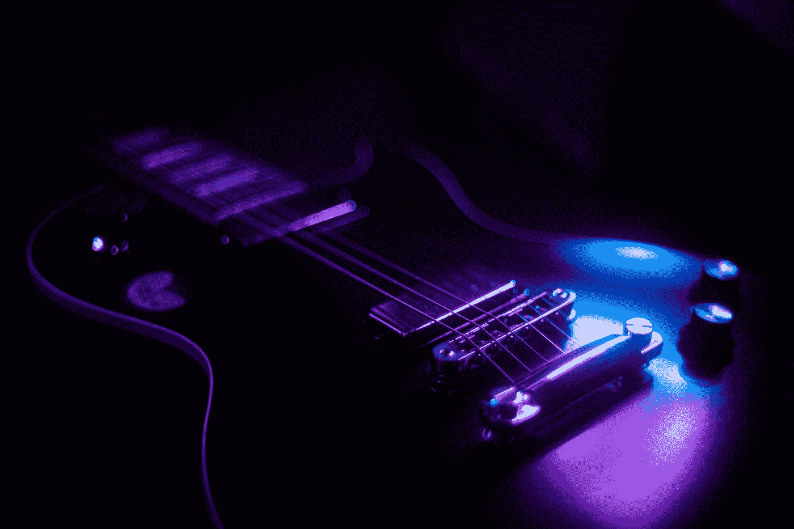
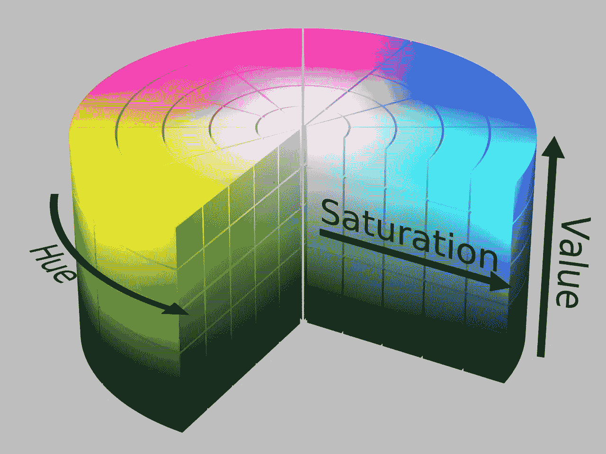
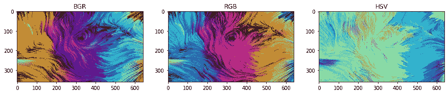
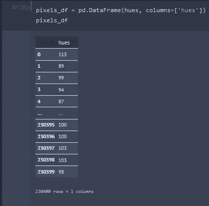
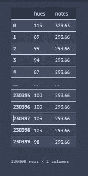
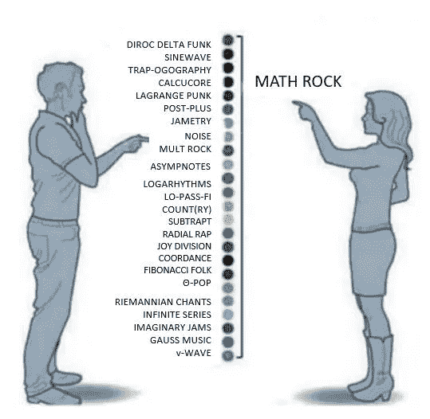
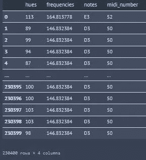

# 用 Python 制作图像音乐

> 原文：<https://betterprogramming.pub/making-music-from-images-with-python-81db627fd549>

## 迷因随着音乐的声音而活跃

[谢李普](https://unsplash.com/ja/@sanarara?utm_source=medium&utm_medium=referral)在 [Unsplash](https://unsplash.com?utm_source=medium&utm_medium=referral) 上拍照

说音乐是我生活中不可或缺的一部分是一种轻描淡写。我做了 20 多年的吉他手，没有一天我不听它。事实上，在开始我作为一名物理化学家的学术旅程之前的 12 年里，我几乎要追求音乐生涯了。

虽然我不能走这条路，但我仍然可以享受音乐，用音乐做一些很酷的事情。例如，在这个项目中，我认为制作一个可以从图像中制作音乐的程序会很酷。过去有一些非常巧妙的尝试来产生这样的东西，然而，结果并不十分…美妙。

在本文的剩余部分，我将展示我从图像中创作歌曲的尝试，这些图像(依我拙见)听起来相当酷。这篇文章将主要详细介绍主要结果，并展示该计划的一些整洁的例子。如果你想看完整的代码，你可以在我的网站[这里](https://victormurcia.github.io/Making-Music-From-Images-in-Python/)和/或 GitHub 仓库[这里](https://github.com/victormurcia/Making-Music-From-Images)找到。我用 Streamlit 做了一个应用程序，你可以在这里用[玩](https://victormurcia-making-music-from-images-music-to-images-ce4ydi.streamlitapp.com/)。

# 基本思想

我实现这一目标的策略和思考过程如下:

*   图像是由像素组成的
*   像素由指定颜色的数字数组组成
*   颜色是通过颜色空间如 RGB、BGR 或 HSV 来描述的
*   色彩空间可以被划分成多个部分
*   音阶通过音程被细分成音符
*   声音是振动，因此每个音符都与一个频率相关联
*   因此，颜色空间的细分可以映射到音阶中的特定音符。这个音符会有一个与之相关的频率。

让我们试一试！

# 使用 HSV 颜色空间

HSV 是由三个值控制的颜色空间。这三个值是色调、饱和度和亮度。

HSV cylinder By HSV _ color _ solid _ cylinder . png:SharkD 衍生作品:SharkD Talk—HSV _ color _ solid _ cylinder . png，CC BY-SA 3.0，[https://commons.wikimedia.org/w/index.php?curid=9801673](https://commons.wikimedia.org/w/index.php?curid=9801673)

色调被定义为“刺激与被描述为红色、橙色、黄色、绿色、蓝色、紫色的刺激相似或不同的程度。”换句话说，色调代表颜色。

饱和度被定义为“一个区域的色彩与其亮度成比例”换句话说，饱和度表示颜色与白色混合的程度。

亮度被定义为“由视觉目标的亮度引起的感知”。换句话说，饱和度表示颜色与黑色混合的程度。

基本颜色的色调值:

*   橙色 0–44
*   黄色 44- 76
*   绿色 76–150
*   蓝色 150–260
*   紫罗兰色 260–320
*   红色 320–360

我将在 HSV 颜色空间中工作，因为它已经被自然地细分了，所以它使随后的频率映射更加直观。类似地，色调通道(在这个空间中主要负责颜色)从其他两个通道中分离出来，这简化了事情。

下面是一个图像的色彩空间与生成它们的代码之间的比较示例:

色彩空间。由 [agsandrew](https://stock.adobe.com/contributor/201652684/agsandrew?load_type=author&prev_url=detail) 制作的原始 RGB 图像。作者对 BGR 和 HSV 的描述。

# 提取色调通道

现在我们有了 HSV 格式的图像，让我们从每个像素中提取色调(H)值。这可以通过在图像的高度和宽度上嵌套 for 循环来完成。

现在我有了一个包含每个像素的`H`值的数组，我将把结果放入 pandas 数据帧中。数据帧中的每一行是一个像素，因此，每一列将包含关于该像素的信息。我将这个数据帧称为`pixels_df`，你可以在下面看到它:

从图像的 H 值制作 pixels_df。图片作者。

dataframe 目前由一个名为“hues”的列组成，其中每行代表我加载的图像上每个像素的 H 通道。

# 将色调转换为频率

我最初的想法是将一个色调值转换成一个频率，这涉及到一组预先设定的频率到`H`值之间的映射。映射函数如下所示:

该函数将`H`值和一个包含要将 H 映射到的频率的数组作为输入。这个例子使用一个名为`scale_freqs`的数组来定义频率。`scale_freqs`中使用的频率对应于 A 谐波小音阶。

然后，定义 H 的阈值数组(称为`thresholds`)。然后，该阈值阵列可用于使用 lambda 函数将`H`转换为来自`scale_freqs`的频率。

pixels_df 带有映射到每个色调值的频率。作者图片

# 将 NumPy 数组转换为可播放的音频

酷！现在，我有了一个频率数组，我将把`notes`列转换成一个名为`frequencies`的 numpy 数组，因为我可以用它来制作一个可播放的音频文件:】为此，我可以使用 scipy 中内置的`wavfile.write`函数，并确保我使用了适当的数据类型转换(对于 1D 数组，它是`np.float32`)。

你可以听到我用下图的前 60 个像素制作的歌曲(我可以尝试使用组成该图像的所有 230，400 个像素，但这首歌最终会有几个小时长)。

歌曲 1-也称为 1997 年歌曲 2 中侠影热门歌曲之前的歌曲。按作者。

这真是太棒了！但是让我再玩一会儿。

# 包括八度音阶

我决定将八度音阶的效果(也就是说，让音符听起来更高或更低)纳入我的“创作歌曲”程序。给定音符使用的八度音程将从数组中随机选择。

让我们听听吧！

八度音阶之歌(风暴之歌不太为人所知的表亲)

厉害！现在我们有了一些变化。然而，我们确实有所有这些像素，我们通过从随机像素中选取频率来使用它们怎么样？

按作者计算

太棒了。我们现在基本上有了一个歌曲生成器，我们可以随心所欲地玩它！

我知道这有点像迷因，但是“这是数学岩石吗？”

我认为这有资格成为数学摇滚。在 [Reddit](https://www.reddit.com/r/mathrock/comments/lyvnfo/when_someone_says_they_like_math_rock_what_do/) 上找到的图片

# 生成其他比例

到目前为止，我已经展示了如何使用 A-harmonic 小调音阶从图像中生成音乐。尽管这个音阶很酷，但如果我们的音阶的起始音(主音)和其他音程能有更多的变化，除了那些由和声小调音阶结构定义的音程，那就更好了。这将允许我们的程序给生成的歌曲添加更多的味道和种类。

为了做到这一点，我首先需要一种方法来为我们希望使用的主音产生频率。Katie He 有一篇精彩的文章[在这里](https://towardsdatascience.com/music-in-python-2f054deb41f4)找到了，这篇文章对 Python 和音乐进行了很好的探索。我在作品中运用了她的一个功能，将钢琴音符映射到如下所示的频率:

上面的函数将作为我的歌曲/音阶生成例程的起点，它可用于生成一个字典，该字典将对应于标准钢琴中 88 个键的音符映射到以 Hz 为单位的频率，如下所示:

然后我们需要根据音调来定义音阶音程，这样我们就可以索引我们的音符。

有了这个，我们现在可以在之前的音调列表中找到我们音阶的索引。这是必要的，因为我将重新索引列表，以便它从我们想要的主音开始。

在此之后，我可以定义一组不同的小数位数数组，其中每个元素对应于上一步中创建的 reindex 数组中的一个索引。

差不多准备好了！我还将定义在这里使用的音程，以防我想为我们制作的歌曲制作和声。

而现在，我可以把前面步骤的结果拿来做一首歌了！

厉害！我现在有相当多的参数可以用来做歌曲。我可以设置音阶，调，八度，和声，像素数，像素是否随机选择，每个音符的持续时间。

让我们在几张图片上测试一下吧！除非另有说明，所有图像的采样率均为 22050Hz。

如果你在手机上阅读下一部分，强烈推荐使用耳机，因为一些较低的频率似乎不能很好地从标准的手机音频中出来。

# 像素艺术实验

我认为一个自然的实验场所是通过像素艺术。这里是许多歌曲中的一首，这些歌曲是使用由

[新西兰峡湾国家公园的水反射着天空。](https://medium.com/@retronator#和声小调，第二个八度音域和一个小调第三和声创作的。
<figure class=)[图片版权标记灰色](https://www.markgray.com.au)

# 使用 Spotify 的 Pedalboard 库为我们的歌曲添加效果

太好了！但是我们可以做得更多！我要加载。wav 文件，并使用 Spotify 的 pedalboard 模块对其进行一些额外的操作。太棒了，我强烈推荐你去看看。你可以在这里和这里阅读更多关于 pedalboard 库[的内容。](https://github.com/spotify/pedalboard)

我将首先使用由压缩器、增益、合唱、相位器、混响和梯形滤波器组成的踏板重新处理我之前展示的水之歌。结果如下所示:

超级爽！这听起来很棒！想象这是用鼓轨道或现场乐器演奏的。

现在，我将使用阶梯滤波器、延迟、混响和音高移位重新处理我之前展示的 Catterina 歌曲。结果如下所示:

啊，听起来不错！

作为最后一个例子，我将使用阶梯滤波器、延迟、混响、合唱、音高移位和相位器重新处理由我之前展示的自然图片制作的和声歌曲。结果如下所示:

# 使用 Librosa 映射其他音乐量

Librosa 是一个很棒的软件包，可以对声音数据进行各种操作。这是另一个我强烈推荐你去看看的包！在这里，我用它来轻松地将频率转换成“音符”和“Midi 数字”

乐器数字接口(MIDI)文件用作一种文件格式，可以连接到各种电子乐器、电脑和其他音频设备。因此，能够以这种格式保存我们的歌曲将使其他感兴趣的音乐人或程序员能够拿着这首歌进行试验。

下面，我展示了一些函数，这些函数可以用来映射我从例程中生成的频率，以获得我们的歌曲的相关音符和`midi_numbers`！

最终数据框架为宋使用 librosa 和熊猫。作者图片

# 用我们的歌制作 MIDI

现在我已经生成了一个包含频率、音符和 midi 数字的数据帧，我可以用它制作一个 midi 文件了！然后我可以使用这个 MIDI 文件为我们的歌曲生成乐谱:】。

为了制作一个 MIDI 文件，我将使用`midiutil`包。这个包允许我们从一组 MIDI 数字中构建 MIDI 文件。您可以通过设置音量、节奏和轨道来以多种方式配置文件。现在，我只做一个单声道的 midi 文件。

# 结论

我展示了如何从图像制作音乐，以及如何将我们的歌曲输出到。wav 文件进行后续处理。我展示了如何使用这种方法来构建和声，并且由此可以构建更复杂、丰富和/或怪异的和声。我还想在这个方法中加入一些其他的东西，但是我会留到以后再说。有大量的实验可以用这个来做！

如果你是一名音乐家，发现自己陷入困境，缺乏创作新音乐的灵感，也许可以在我的应用程序中添加一张图片，也许你会得到一个可以借鉴的好主意。你永远不知道灵感会从哪里来！

我享受了制作这个项目的乐趣，我希望你在使用它和在它的基础上有乐趣！

我在这里添加了 GitHub 库[的链接，在这里](https://github.com/victormurcia/Making-Music-From-Images)添加了我为这个[制作的 Streamlit 应用的链接。](https://victormurcia-making-music-from-images-music-to-images-ce4ydi.streamlitapp.com/)

玩得开心，感谢阅读！

如果你愿意支持我的编码工作，请考虑通过我的推荐链接加入 Medium:[https://victormurcia-53351.medium.com/membership](https://victormurcia-53351.medium.com/membership)