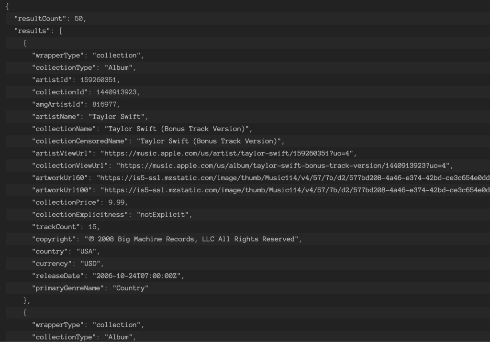
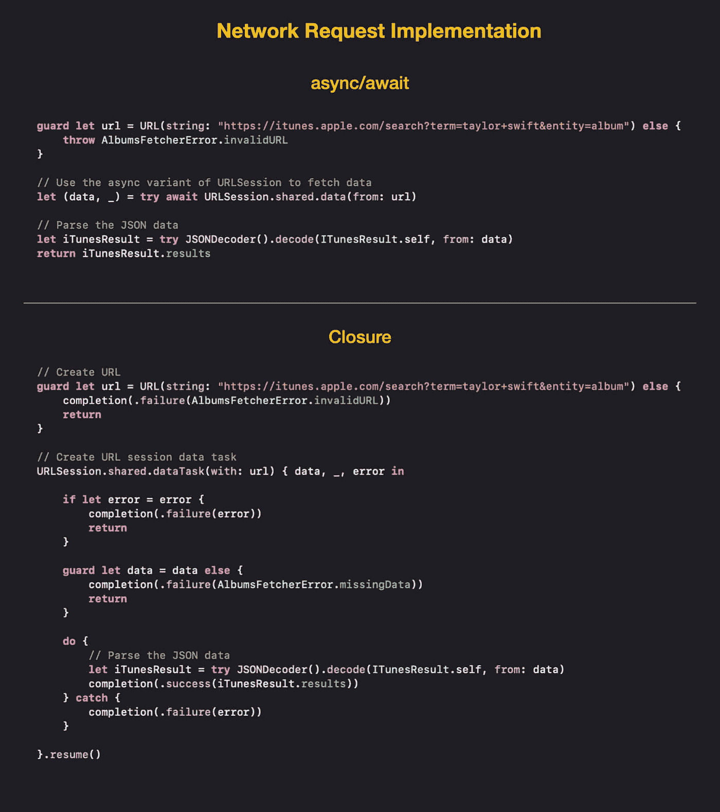
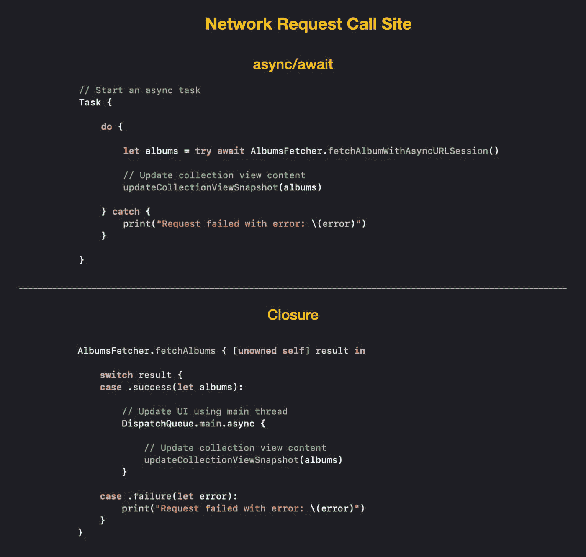

# 在 Swift 中使用 Async/Await 发出网络请求

> 原文：<https://betterprogramming.pub/making-network-requests-with-async-await-in-swift-6b5880c9df6a>

## 借助快速并发为您的 iOS 应用提供动力


照片由[费德里科·贝卡里](https://unsplash.com/@federize?utm_source=medium&utm_medium=referral)在 [Unsplash](https://unsplash.com?utm_source=medium&utm_medium=referral) 拍摄

传统上，当我们想要发出网络请求时，我们必须使用基于闭包的`URLSession`API 来异步执行请求，这样我们的应用程序就可以在等待请求完成时做出响应。随着 Swift 5.5 的发布，这种情况不再存在，我们现在有了另一种选择，即使用 async/await。

在本文中，我将向您展示如何使用 async/await 关键字发出网络请求。除此之外，我还将对 async/await 和基于闭包的 API 进行一个快速的比较，以便您能够更好地理解使用 async/await 的好处。

本文要求您对 async/await 有一个基本的了解。因此，如果您不熟悉 Swift 并发，我强烈建议您首先阅读我的博客文章“[Swift 并发入门](https://swiftsenpai.com/swift/swift-concurrency-get-started/)”

说了这么多，让我们开始吧！

# 先决条件

在整篇文章中，我们将使用 Apple iTunes API 从 Taylor Swift 获取一系列专辑。以下是 API 的 URL:

```
[https://itunes.apple.com/search?term=taylor+swift&entity=album](https://itunes.apple.com/search?term=taylor+swift&entity=album)
```

这个 API 端点将为我们提供以下 JSON 响应:



来自苹果 iTunes API 的 JSON 响应

出于演示目的，我们将获取专辑的名称和价格，并[在收藏视图列表](https://swiftsenpai.com/development/uicollectionview-list-basic/)中显示它们。以下是我们进行 JSON 解码所需的模型对象:

请注意，我们将`Album`结构与`Hashable`协议相一致，这样我们就可以将它用作集合视图差异数据源的项目标识符类型。

说完这些，让我们进入网络请求代码。

# 传统的方式

在 Swift 5.5 之前，为了发出网络请求，我们必须使用基于闭包的`URLSession`的`dataTask(with:completionHandler:)`方法来触发后台异步运行的请求。一旦网络请求完成，完成处理程序将把网络请求的结果返回给我们。

为了简单起见，让我们为此定义一个`AlbumsFetcher`结构:

如果您以前处理过发出网络请求的代码，那么您应该对上面的`fetchAlbums(completion:)`函数很熟悉。我们首先启动一个数据任务来发出网络请求。一旦请求完成，我们检查错误并解析响应 JSON。

调用`fetchAlbums(completion:)`函数也非常简单:

需要注意的一点是，`updateCollectionViewSnapshot(_:)`函数是一个助手函数，它基于`albums`数组更新我们的列表。因此，我们需要在调用它之前调度回主线程。

传统的方法已经过时，在下一节中，让我们看看如何使用新的 async/await 关键字实现同样的事情。

# 快速并发方式

为了将基于闭包的`fetchAlbums(completion:)`函数转换成新的 async/await 风格，我们可以采用两种完全不同的方法。

第一种方法是使用`CheckedContinuation`(在 Swift 5.5 中引入)将`fetchAlbums(completion:)`函数与异步上下文联系起来，而第二种方法是用`URLSession`的异步变体替换基于闭包的`URLSession`。

现在，让我们首先关注一下`CheckedContinuation`方法。

## 检查延续

`CheckedContinuation`是 Swift 5.5 中的新机制，帮助开发人员在同步和异步代码之间架起桥梁。我们可以使用`withCheckedThrowingContinuation(function:_:)`或`withCheckedContinuation(function:_:)`方法创建一个`CheckedContinuation`。

在我们的例子中，由于`fetchAlbums(completion:)`函数的完成处理程序将返回一个错误，我们将使用该方法的“ *throwing* ”变体来创建一个延续。下面是如何做到这一点:

正如您所看到的，`withCheckedThrowingContinuation(function:_:)`方法接受一个带有延续参数的闭包。它创建一个异步任务，执行`fetchAlbums(completion:)`函数来异步触发网络请求。

在上面的代码中，有几个重要的方面您应该知道:

1.  `withCheckedThrowingContinuation(function:_:)`方法被标记为`async`，因此我们必须使用`await`关键字来调用它。最重要的是，因为我们使用了它的“throwing”变体，所以我们也需要使用`try`关键字(就像调用一个普通的抛出函数一样)。
2.  在整个异步任务中，我们必须在每个执行路径上调用一次 resume 方法。多次从延续中恢复是未定义的行为。鉴于从不继续会使异步任务无限期地处于挂起状态，我们称这种继续泄漏。
3.  `withCheckedThrowingContinuation(function:_:)`方法的返回类型必须与`resume(returning:)`方法的参数数据类型相匹配，参数数据类型为`[Album]`。

现在，让我们把注意力转移到呼叫站点。假设我们正在视图控制器中调用`fetchAlbumWithContinuation()`函数，我们可以这样调用它:

像往常一样，我们必须创建一个异步任务，这样我们就可以在异步上下文中等待并执行`fetchAlbumWithContinuation()`函数。由于我们不再使用完成处理程序，我们现在可以使用`do`–`catch`语句来处理函数抛出的错误。

另外，请注意，在调用`updateCollectionViewSnapshot()`之前分派到主线程不再是必要的，因为我们正在视图控制器中调用`fetchAlbumWithContinuation()`函数，它是一个`MainActor`。

## 异步 URLSession

在 Swift 5.5 中，除了发布`async`和`await`关键词，苹果还更新了很多自己的 SDK 来支持这两个关键词，其中一个就是`URLSession`。

苹果给`URLSession`增加了一个新的`data(url:)`方法，相当于我们之前用的`dataTask(with:completionHandler:)`方法。它是一个抛出的异步方法，返回一个由`Data`和`URLRespons`组成的元组。下面是如何使用它来发出网络请求:

上面的代码是不言自明的，但是，请注意`URLSession.data(from:)`方法是一个异步方法，因此代码在等待返回时可能会挂起。这也是为什么我们需要使用关键字`await`来调用它。

以下是`fetchAlbumWithAsyncURLSession()`的调用地点，与调用`fetchAlbumWithContinuation()`基本相同:

在这个阶段，你可能会问:如果`URLSession`的 API 已经支持 async/await，那么使用`CheckedContinuation`还有什么意义？嗯，你完全正确！如果可以的话，我们肯定应该使用任何 API 的 async/await 变体。

`CheckedContinuation`主要用于桥接任何尚不支持 async/await 语法的异步 API。比方说，如果您正在使用不支持 async/await 语法的第三方网络库(比如 Alamofire ),那么您可以使用`CheckedContinuation`逐步迁移您的现有代码以支持 async/await，同时等待第三方库更新。

# 异步/等待与关闭

自从苹果在 WWDC21 中引入 async/await 以来，一些初级开发人员问我:为什么每个人都如此热衷于 async/await，而我们已经可以通过使用闭包和调度队列做完全相同的事情了？

在本节中，让我们通过快速浏览使用 async/await 的一些好处来尝试回答这个问题:

1.  当使用闭包时，我们可能会忘记调用完成处理程序，并且没有办法防止这种情况发生。当使用 async/await 时，如果我们没有从 async 函数返回，我们将得到一个编译错误。
2.  在使用闭包时，不可能使用`do`–`catch`语句来处理错误，因为闭包不支持这样做。另一方面，我们可以使用`do`–`catch`语句处理异步函数抛出的错误，就像处理普通函数抛出的错误一样。
3.  通过使用 async/await，我们不再需要担心忘记分派回主线程，因为它已经被`MainActor`处理了。
4.  Async/await 在提高代码性能的同时，为线程爆炸提供了更高的安全性。你可以查看[这段](https://developer.apple.com/videos/play/wwdc2021/10254/) WWDC 的视频，了解更多信息。
5.  使用 async/await 语法编写的异步代码都是直线代码。需要按顺序执行的操作都一个接一个地列出来了。这使得我们的代码(实现和调用站点)更短、更清晰、更容易推理。您可以使用以下图片进行快速比较:



网络请求实现比较



网络请求调用站点比较

# 包扎

你有它！使用 async/await 发出网络请求非常简单，我们只需简单地使用它就能获得大量好处。不过值得注意的是 **async/await 只有 iOS 15 及以上**才有。因此，如果您的项目仍然需要支持旧版本的 iOS，您可能需要等待一段时间，然后更新现有的异步代码以使用 async/await。

如果你想亲自尝试一下，这里是[的完整示例代码](https://github.com/LeeKahSeng/SwiftSenpai-Swift-Concurrency)。

如果你喜欢这篇文章，并希望在新文章发布时得到通知，请随时在 [Twitter](https://twitter.com/Lee_Kah_Seng) 上关注我。

感谢阅读。