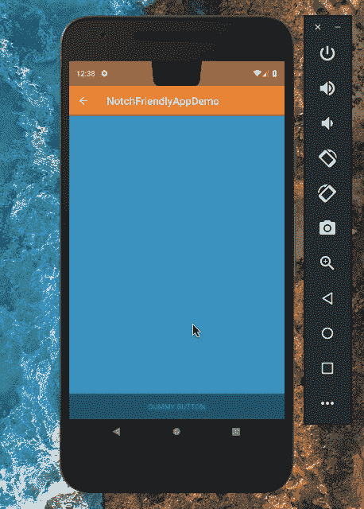
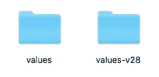
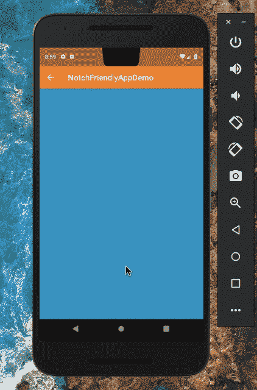
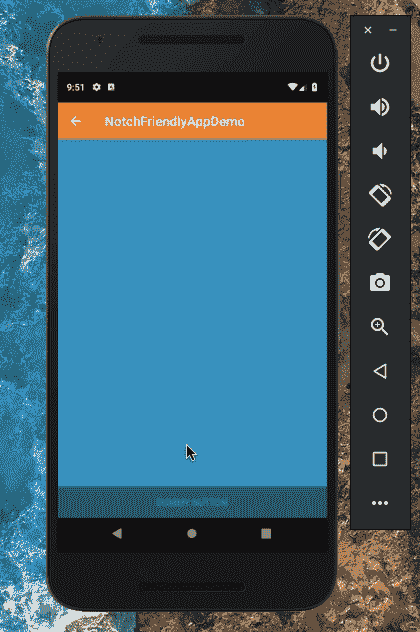

# 为 Android 开发友好的应用程序

> 原文：<https://betterprogramming.pub/making-notch-friendly-apps-for-android-75776272be5c>

## 如何让你的应用支持带凹槽的边对边屏幕


[*开槽手机:Essential PH-1(左)和华为 P20(右)*](https://android-developers.googleblog.com/2018/07/supporting-display-cutouts-on-edge-to.html)

众所周知，随着 iPhone X 的发布，许多 Android 手机也纷纷效仿，采用边到边的设计，并在顶部留出摄像头和其他传感器。

截至 2018 年 8 月，共有 16 款设备具有剪切显示屏，今年晚些时候还会有更多。

这导致设备具有:

*   较小的挡板。
*   更大的长宽比。
*   更加身临其境的体验。

这可以让游戏、视频播放、照片/图库应用程序以及更多应用程序变得更加有趣！

但是有缺口的手机有一个问题:

凹口占据了显示器顶部的很大高度，因此遮挡了其两侧的区域，使得屏幕的这些部分不可用。

令人欣慰的是， [Android Pie](https://www.android.com/versions/pie-9-0/) 拥有 API，让开发者管理如何让他们的应用程序显示窗口内容，以利用凹槽两侧的屏幕空间。

您甚至可以检查缺口的位置，因此可以相应地渲染视图。

# 问题是

让我们借助一台运行 Android Pie 9.0 的 Nexus 5X(配有模拟槽口)来深入研究这个问题。

就本文的目的而言，该应用程序目前所做的只是显示一个全屏活动，当你点击中心的文本时，它就会变得身临其境，正如你在下面的演示中看到的那样；并且当你再次点击它时来回切换。

这个演示应用程序的源代码可以在这里找到:

[](https://github.com/bapspatil/NotchFriendlyAppDemo) [## bapspatil/NotchFriendlyAppDemo

### 一个演示应用程序，展示如何让您的应用程序支持带凹槽的窄边框屏幕。—bapspatil/NotchFriendlyAppDemo

github.com](https://github.com/bapspatil/NotchFriendlyAppDemo) 

让我们来看看我们的应用程序的默认行为:



模拟缺口 Nexus 5X(肖像)

由于手机显示屏顶部中心的凹口，状态栏的尺寸会变得更大。因此，凹槽任何一部分的区域都没有被应用程序的窗口使用，使应用程序感觉不那么身临其境。

此外，当我们将应用程序全屏显示时，凹槽两侧的区域会变黑，并再次闲置。这叫*信箱*，很浪费屏幕面积。

这是默认行为，对开发人员和用户来说都是不可取的。

# 解决方案

幸运的是，Android Pie 9.0 中的 API 提供了一个简单的修复方法。

## 第一步

在你的`res`目录下创建一个新的`values-v28`文件夹，并将默认的`styles.xml`文件复制到其中。



将 styles.xml 从值复制到值-v28

## 第二步

在`styles.xml`文件的`values-v28`变体中，转到您的活动主题，或者创建一个新的主题(如果您一直在使用默认的主题),并设置该属性:

```
<style name="ActivityTheme">
  <item name="android:windowLayoutInDisplayCutoutMode">
    shortEdges
  </item>
</style>
```

然后，瞧！这就是你要在你的应用程序中获得更身临其境的体验，并通过让应用程序的窗口呈现在凹槽的侧边区域来避免信箱区的所有工作。

结果如下:



# 关于显示器剪切行为的更多信息

注意，`windowLayoutInDisplayCutoutMode`可以有三个可能的值:

*   `default`(或`LAYOUT_IN_DISPLAY_CUTOUT_MODE_DEFAULT`)
*   `shortEdges`(或`LAYOUT_IN_DISPLAY_CUTOUT_MODE_SHORT_EDGES`)
*   `never`(或`LAYOUT_IN_DISPLAY_CUTOUT_MODE_NEVER`)

`default`值是默认选择的(很明显),我们已经看到了上面的演示。它:

*   使状态栏调整到槽口的高度。
*   在纵向和横向模式下都产生信箱模式。


默认模式

`shortEdges`值使你的应用程序的窗口绘制在凹口的任一侧，使应用程序在全屏下更加身临其境。

它忽略了无法使用的凹口区域。不浪费屏幕空间！这在横向和纵向上都很完美。


短边模式

`never`值确保应用程序的窗口总是绘制在凹口下方，无论是在横向还是纵向模式下，都会受到信箱效应的影响，并完全遮住凹口两侧的区域。



永不模式

如果您想在剪切区域中绘制元素，您可以使用由`[WindowInsets](https://developer.android.com/reference/android/view/WindowInsets)`类提供的`[getDisplayCutout()](https://developer.android.com/reference/android/view/WindowInsets#getDisplayCutout())`。这让您可以检查应用程序窗口内的内容是否与显示器上的凹口重叠，如果重叠，您可以根据需要重新定位元素。

# 如果我的设备没有凹槽，我该如何测试？

你只能在运行 Android Pie 9.0 的设备上测试你的 notch 友好应用。因此，如果你没有使用 Pixel 系列的手机，我建议你使用 Android 模拟器。

启用手机上的*开发者选项*并点击*模拟一个带有剪切块的显示器*从四个选项中进行选择:

*   没有。
*   角落显示剪切块—模拟屏幕右上角的剪切块。
*   双显示剪切-这模拟两个剪切；一个在屏幕的顶部中心，另一个在屏幕的底部中心。
*   高显示剪切块—模拟屏幕顶部中央的剪切块。

我鼓励你利用 Android Pie 支持的友好的 API，开始让你的应用程序更加友好。这就是这篇文章，感谢阅读！