# 制作培育，一个 Chrome 扩展

> 原文：<https://betterprogramming.pub/making-nurture-a-chrome-extension-6008bac3d65>

## 有意培养你的好恶

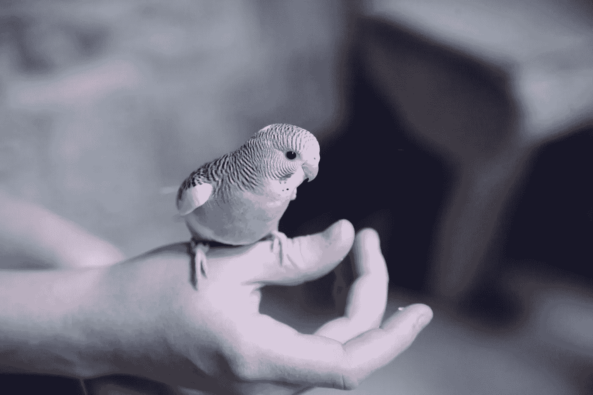

莎伦·麦卡琴在 [Unsplash](https://unsplash.com/search/photos/interactive?utm_source=unsplash&utm_medium=referral&utm_content=creditCopyText) 上的照片

在完成交互设计学士的最后一堂课几周后，我发现自己坐在沙发上有很多事情要做——但是什么都没做。在学校或工作场所的结构之外，保持高效率是非常棘手的。很难有上进心。

我决定取消当天的所有计划(反正我也没打算做)，把剩下的时间用来开发一个 chrome 扩展来帮助自己提高效率。事情是这样的。

# **下午 3 点:开始**

我带着一些内省的想法开始了这个项目，并意识到对我的生产力问题的最好解决方案是让它自然发生。热爱高效，讨厌低效。

如果你的感觉和你的目标一致，那么就没有必要试图欺骗自己去努力工作。我不需要依赖别人提供的结构，我可以有效率，因为我只是*希望*有效率。

换句话说，我需要培养对我好的东西的爱和对我不好的东西的恨。如果我喜欢做，做项目并不难。如果我讨厌分心的感觉，对分心说不就不难了。如果我爱吃健康的食物，吃健康的食物会很容易。如果我讨厌吃垃圾食品，就很容易避免吃垃圾食品。

诚然，还是需要自律的。我认为，如果你喜欢做“好”的事情，你会自然而然地去做。但是在你到达那里之前，将注意力集中在好的方面需要一些意志力。

这基于一个重要的前提——有可能有意改变你的好恶。虽然我的证据是轶事，但我认为这是可能的。不知何故，我发现，在某种程度上，我自己已经做出了改变。

以健身为例。我真的不这么做。但是我确实有一个包括俯卧撑的晨间惯例。我以前讨厌做这些，所以我会跳过它。但最终我对健康的渴望战胜了我对懒惰的渴望，现在我真的做到了——并且乐在其中。

我在其中找到了一种感觉(那种感觉随后在你的臂弯中燃烧？感觉很好，好像我在进步)，并把它培育到期待俯卧撑的地步，不期待的时候又怀念。

在詹姆斯·克利尔的《原子习惯》一书中，他描述道，“让习惯变得更容易的方法之一是提高习惯带来的回报。”奖励越多，你的大脑就越有可能认为这是值得重复的。我早上就是这么做的。我把注意力集中在奖励(进步的感觉)上，并给它打气，所以这就是我所想的。

我在生活的其他方面也这样做过。我少吃垃圾食品，因为我想到它对我的影响，这让我不喜欢它，只是一点点。我小时候讨厌洗碗——现在我甚至不介意了。我有时几乎乐在其中。把那些盘子重新弄干净，感觉几乎是一种治疗。

所以很明显，在一个基于身份的层面上改变你的好恶是可能的。它似乎包括专注于行动中的一种感觉(垃圾食品感觉不健康，洗碗感觉有治疗作用)，并培养这种感觉足以改变我对它的整体看法。

所以让我用某种方式应用这些知识。

# **下午 3:30:设计—第一次迭代**

我计划这项工作是迭代的——我只是从做一些东西开始，看看哪里出错了，做一些更好的东西，然后重复。

如果我想第一次就做得完美，那就太容易因为犹豫不决而瘫痪。最好是“向前失败”,在我前进的过程中搞砸。在第一次迭代中，我简单地写下了所有我认为需要的组件。

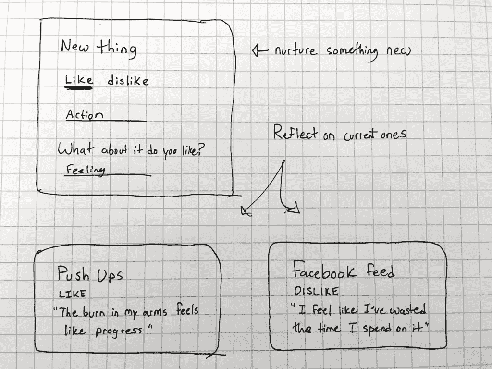

马上，我看到的第一个问题就是交互。用户*到底在做什么*？就看一分钟的好恶，然后关闭 app？

# **下午 3:50:设计—第二次迭代**

前面我提到过，*如果你喜欢做‘好’的事情，你会自然而然地去做*，这似乎是核心问题。**

**随着时间的推移，你可以跟踪你对行动的感觉——它提供了你的目标的可视化。根据第一篇，也是唯一的一篇心理学论文，我开始研究这个问题:**

> ***“[人们]认为容易想象的目标比难以想象的目标更接近，这反过来增加了努力和承诺”(吉玛&巴奇，2011)* 。**

**听起来很合理，我同意。**

**我的第二次迭代包括了典型的五个笑脸，以形象化一系列喜欢或不喜欢。下面的点表示每个人被选中的次数。**

**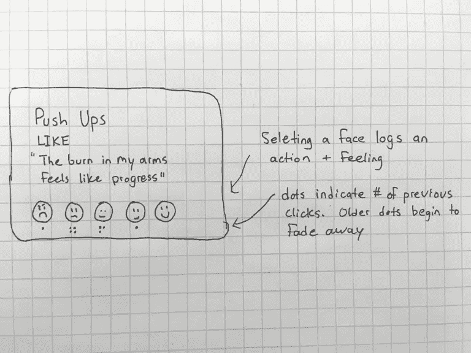**

**我认为显示进步的一个相当聪明的方法是让旧的点消失。因此，当这些点(理想情况下)也向您想要的范围移动时，您可以看到进展。**

**这样，你也创造了一个你能看到的新身份，因为你所有的厌恶都变成了喜欢。你不会停留在过去——如果你现在喜欢花椰菜，你就不会永远被几个月前你说你绝对讨厌它的那五次困扰。**

# ****下午 4:20:设计—第三次迭代****

**我认为之前的版本已经足够步入正轨，可以转向更高的保真度。此外，如果我今天晚些时候真的能够编码，我需要让这个应用程序尽可能简单。**

**多亏了 Noun 项目的会员资格，我在大约 50 秒内找到了几乎所有我需要的面孔。剩下的设计很快就完成了。**

**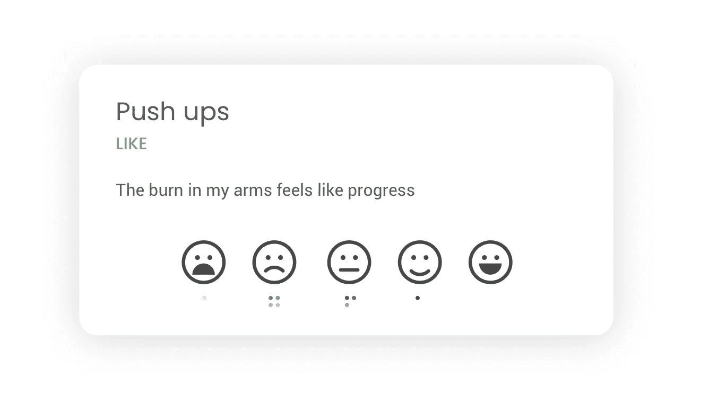**

# ****下午 4:30:设计—续****

**没有任何人在用户周围测试这个想法(我对内容的复制和流动感到不确定)，我会继续进行设计的其余部分。我添加了一个主页和“添加新内容”页面。**

**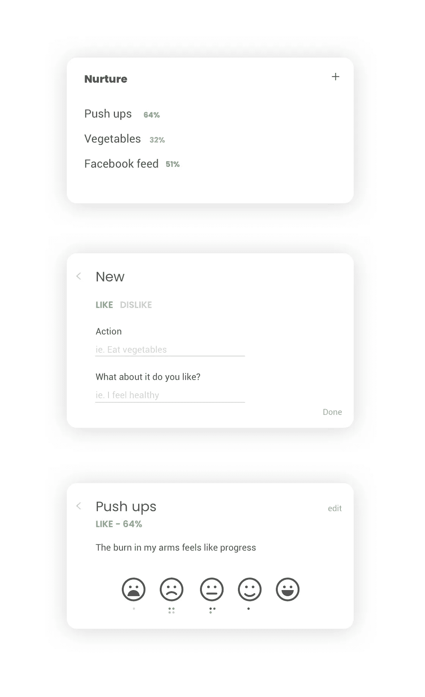**

**在这个过程中，我增加了百分之。所以对于俯卧撑，我的目标是 100%喜欢。根据之前的点击率，我是 64%。这提供了一种进步和掌握的感觉；在这个过程中加入游戏化的元素。**

## ****下午 5:00-6:00:休息一会儿，打个电话，吃点东西****

# ****下午 6:00:开发****

**我以前从未构建过 chrome 扩展。**

**我是从 Chrome 的“[入门教程](https://developer.chrome.com/extensions/getstarted)开始的。就像学习任何新东西一样，有相当一部分我不明白。但足以让我理解。**

**我在以前的项目中开始做的事情，是在我的设计上进行伪编码，通过架构思考并识别潜在的问题。**

**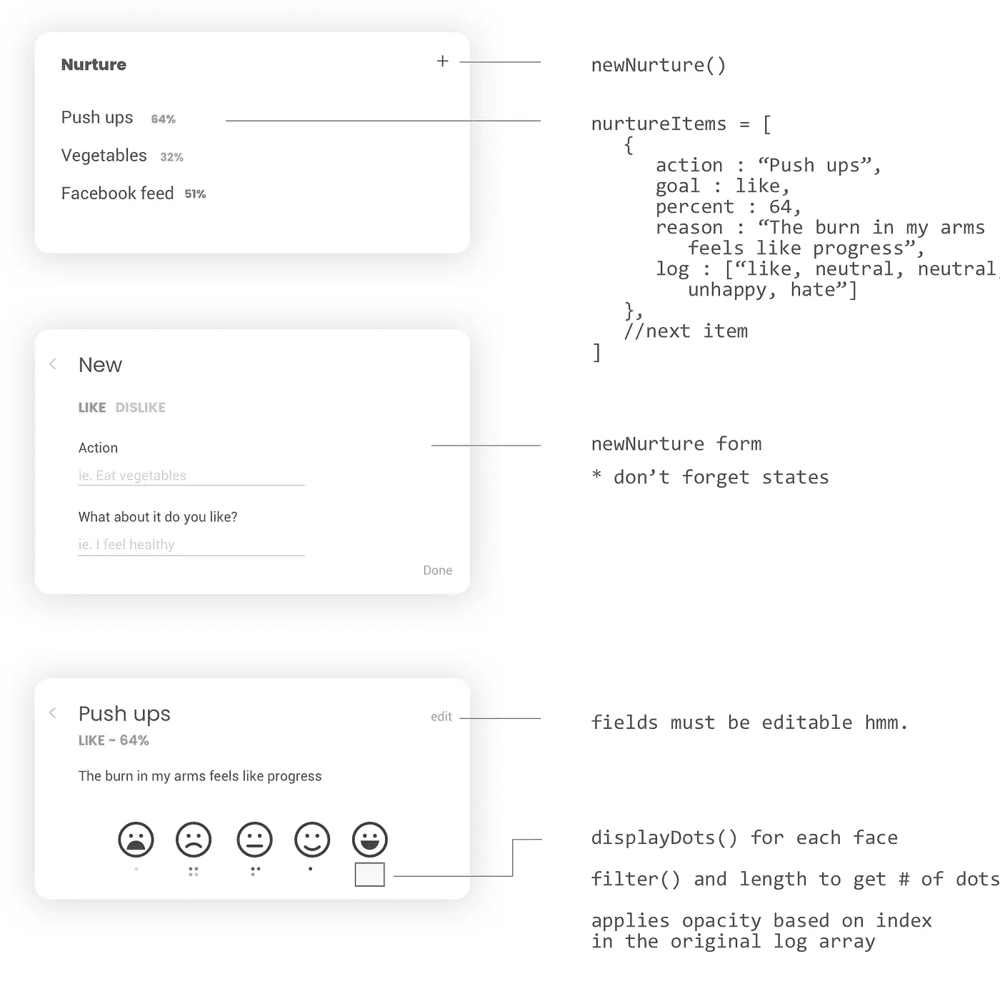**

**前两次添加这张图片时，我立即注意到一个问题。所以它确实有帮助。**

**使用 Chrome 的示例文件，我删除了我不需要的内容，并开始添加我需要的内容。开始时，它主要是玩玩，看看什么影响什么，如何打破。**

**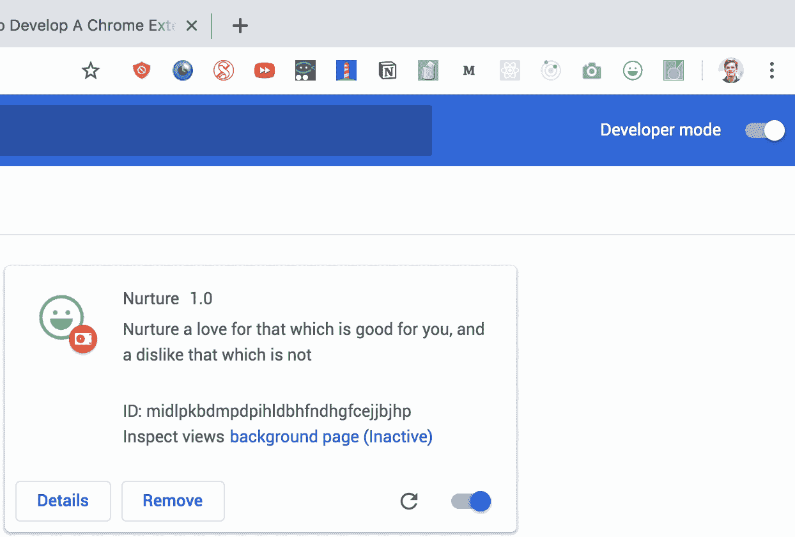**

# ****下午 7:00:设计—更新****

**当我开始开发时，我发现我的设计中有一些漏洞。我忘记了一个“关闭窗口”按钮(相当重要)，而且我无法控制窗口的边框半径或阴影等。**

**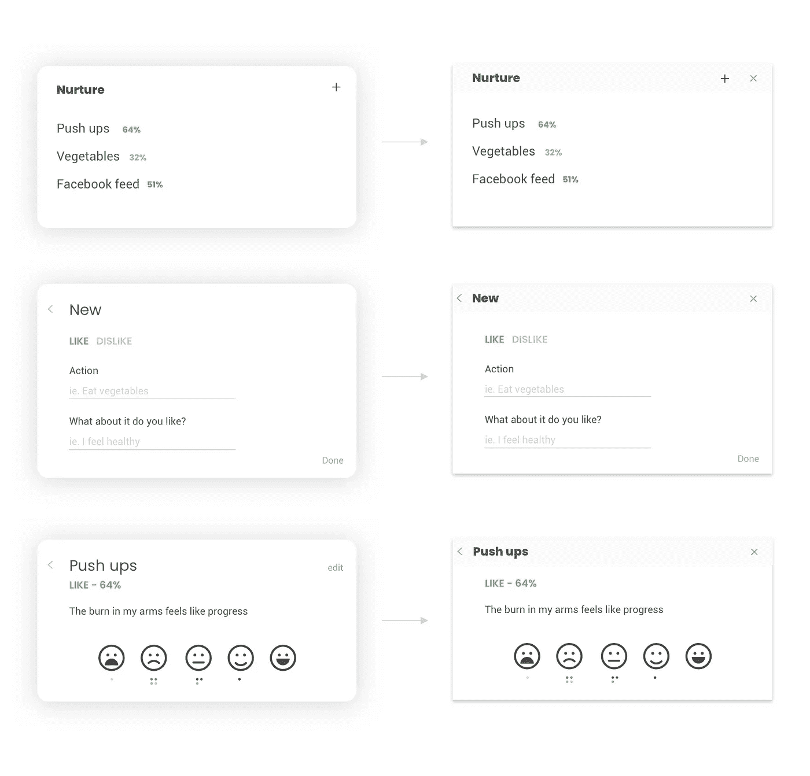**

**我决定用普通的 JS 来构建这个项目。**

**在我的编码历史中，我有点从 [jQuery](https://jquery.com/) 跳到了 [React](https://reactjs.org/) ，所以回过头来做一个合适的普通项目，练习直接操作 DOM 是很好的。**

**我开始研究部件。第一个挑战是将对象数组转换成 HTML 列表。我做了一个函数来帮我做这件事，瞧，主页:**

**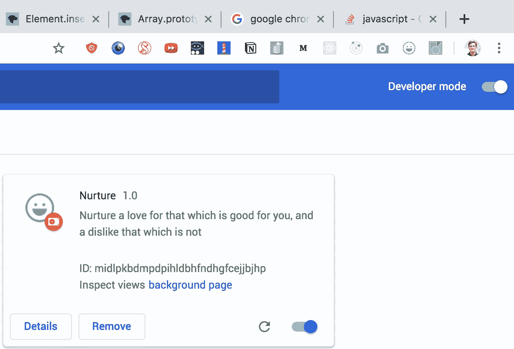**

**接下来，我将重点放在制作单个商品页面上。原来 Chrome 扩展拒绝内联 JavaScript，比如我在 React 中已经习惯的`onClick`。**

**为了注册一次点击，我需要将`EventListeners`添加到一个动态变化的列表中。这是一个了解活动[代表团](https://stackoverflow.com/questions/1687296/what-is-dom-event-delegation)如何运作的好机会。我没有在每个条目上添加`EventListeners`，而是简单地在父条目上添加一个，并使用*事件目标 id* 来标识哪个条目被点击了。**

**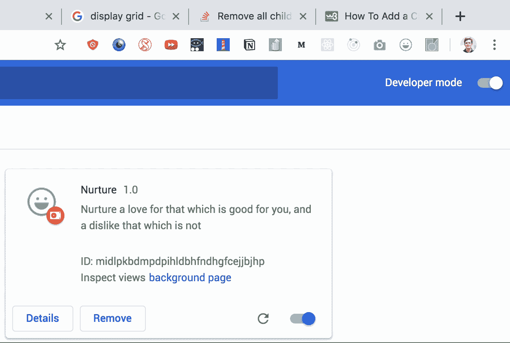**

**当我试图操纵点上的不透明度时，我发现了 JavaScript 使用浮点数的怪异之处。**

**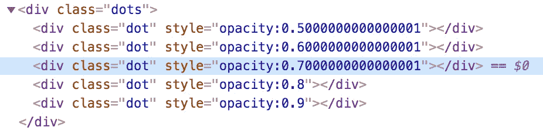**

**为了避免在代码中出现这种情况，我将不透明度设为 100(而不是 0-1)，并在所有 JS 计算完成后计算 CSS 值。**

# ****晚上 9:30:更多开发****

**我构建了第三个模块；添加项。一个很好的 UX 风格是让输入占位符根据用户的喜好而变化。**

**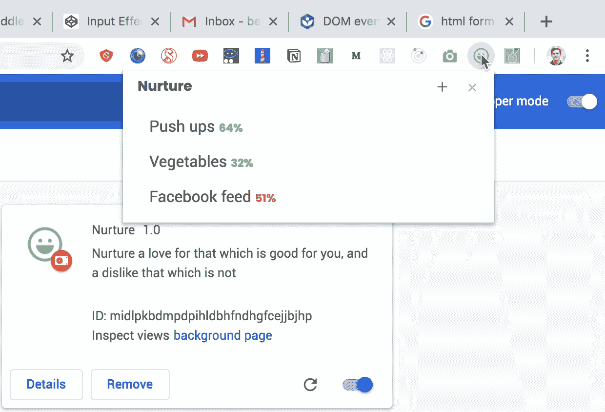**

# ****凌晨 1 点 40 分:床****

**在我开始工作将近 11 个小时后，我结束了这一天的工作。该应用程序仍然可以使用一些重要的样式更新，单个项目页面有静态点，用户还不能点击。在接下来的一周里，我会尽我所能在各处投入时间来完成它。**

# ****下一周****

**有趣的是，当我工作时，我尝到了我想要完成的东西。感觉没有动力，我开始浪费时间。但是我控制住自己说，“我讨厌分心。”它实际上是有效的。**

**这一时刻凸显了自我认同的重要性，即你想要成为什么样的人。回头看看这个应用程序，我意识到我可以做一些改变来更好地实现这一点。**

**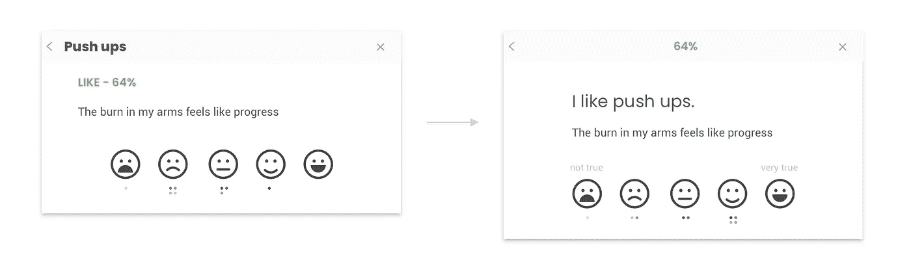**

**我把这个动作变成了用户想要认同的句子——“是的，我确实喜欢俯卧撑”。更新后的版本需要用户更少的认知负荷来整合页面的目的。不是在精神上把这些元素拼凑在一起(俯卧撑，比如，64%的进步，为什么)，它们已经在自然的流动中放在一起了。**

**这也弄清楚了这些面孔到底意味着什么。一张快乐的脸意味着我真的喜欢这个动作吗？或者我真的认同这个目标？(这在建立厌恶感时意义重大)。**

**在开发方面，我研究了应该如何存储用户信息。对于这个项目，我选择了 Chrome 的 chrome.storage。它是异步的这一事实有点棘手，因为有时我会试图在数据被带回之前获取数据。对于我所需要的，可以简单地通过一些重构来解决，尽管一个更好的长期解决方案是研究[承诺](https://developer.mozilla.org/en-US/docs/Web/JavaScript/Reference/Global_Objects/Promise)。**

**迭代变得越来越小，但仍然很重要。我更新了文案，使其更加通俗易懂。**

**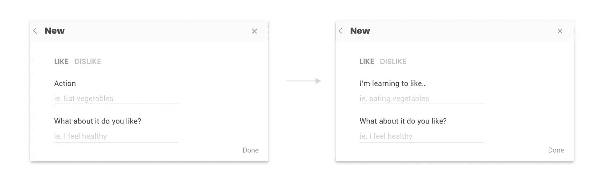**

**为了使它更加完美，还需要做一些最后的修改。我添加了一个闪屏页面、删除条目的功能和一个关于页面。**

**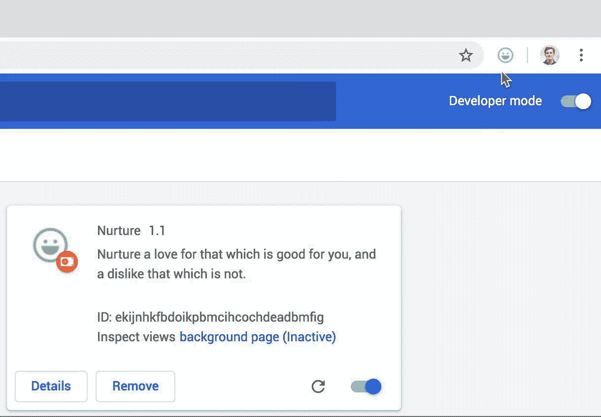**

**这是养育的第一个版本。你可以在 Chrome 网上商店[这里](https://chrome.google.com/webstore/detail/nurture/llpkoklagnnpahhbokmimohbmjkhhcjc)找到。**

# **一周后**

**一周后的一个晚上，一个朋友提到了“注意饮食”的想法。你不再不假思索地消耗食物，而是慢下来，思考并享受你的食物。你注意了。她说这有助于控制份量和少吃垃圾食品。这是一种食物冥想。**

**从某种意义上说，这很像后天培养。你反思你的食物。你建立了对美食的欣赏。你不喜欢不健康的食物。通过反思，你有意识地培养自己的好恶。**

**这样你就不需要强迫自己在接下来的生活中吃得健康——最终它会成为你喜欢并自然而然做的事情。**

# **最后润色**

**当我对这个项目做最后的润色时，我看到了这句话。**

> **”T 这引出了一个永恒的问题的最简单也是最明显的答案:为什么我们不做我们知道应该做的事情？因为我们不喜欢。每个自我控制的问题都不是信息、纪律或理性的问题，而是情绪的问题。自制力是情绪问题；懒惰是情绪问题；拖延症是一个情绪问题……(而且)情绪问题只能有情绪解决方案。”—马克·曼森**

**从某种意义上说，这个项目是一个情感的解决方案。它不会试图说服你吃蔬菜，因为它们对你有好处——而是因为它们感觉对你有好处，而且你喜欢这种感觉。它并不是告诉你远离社交媒体，因为你没有效率——而是因为你感觉没有效率，并且你讨厌这种感觉。**

**它要求你承认你的情绪，并把它们培养成你喜欢的身份。**

**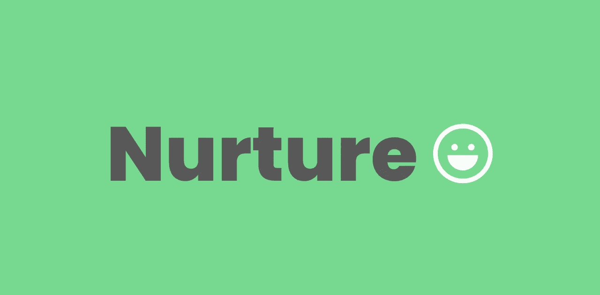**

# *****参考文献*****

**吉玛&巴奇，2011 年。[https://psycnet.apa.org/record/2011-04914-007](https://psycnet.apa.org/record/2011-04914-007)**