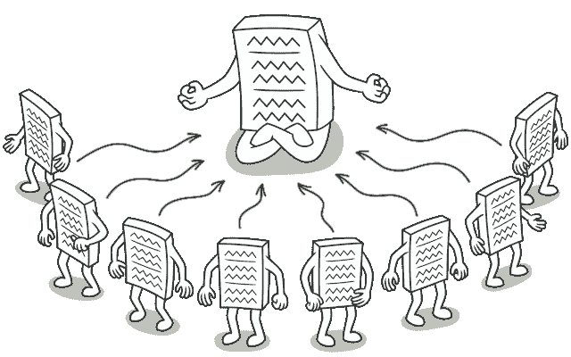
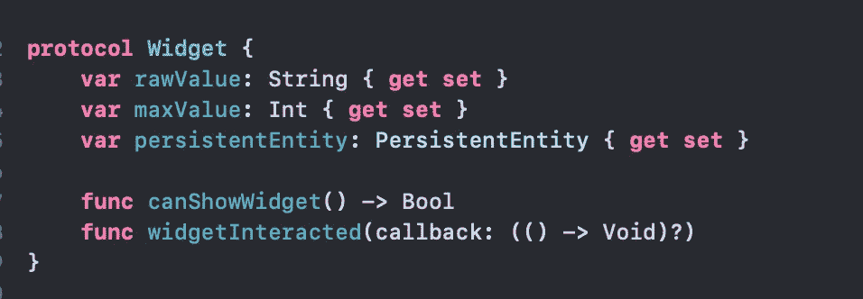
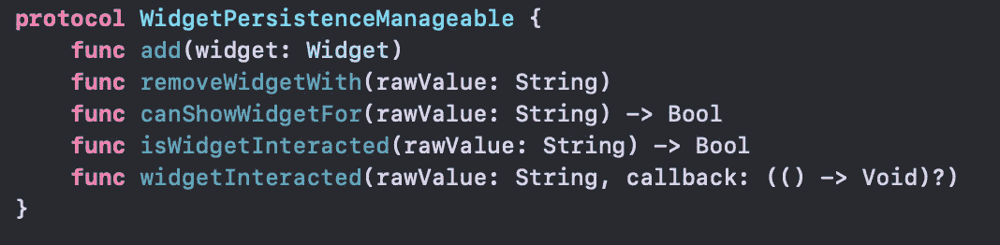
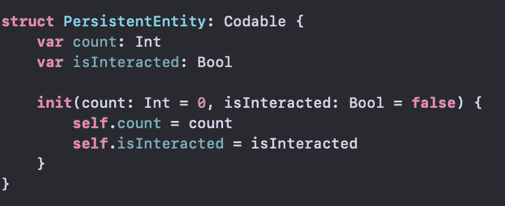
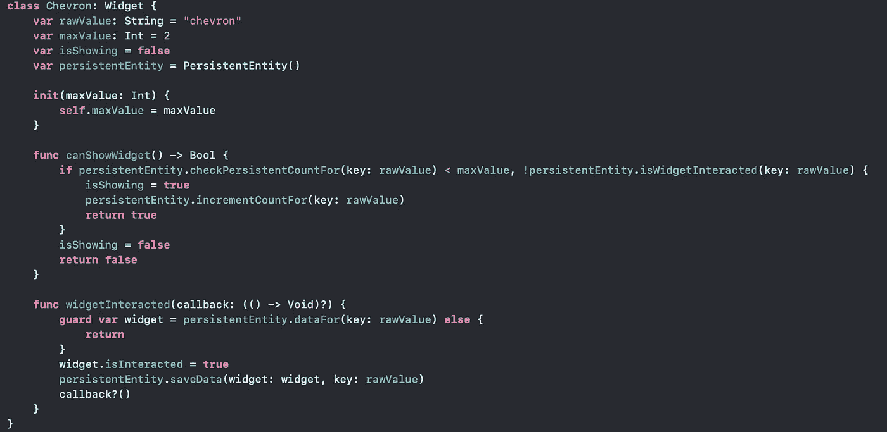
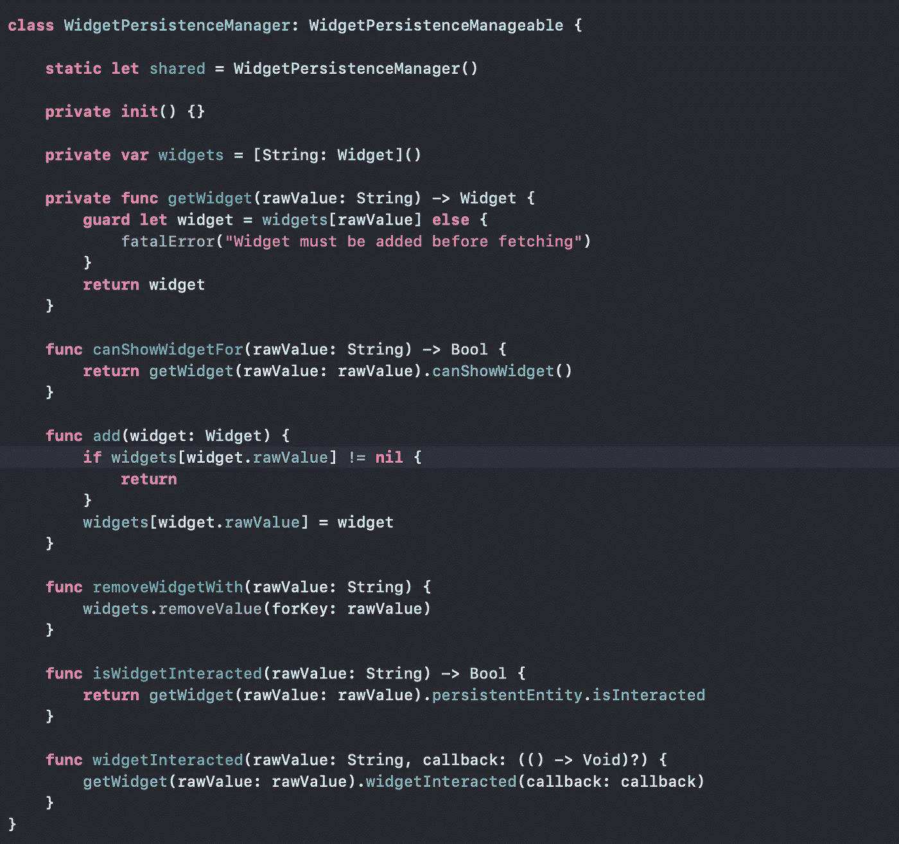

# 如何使单例可测试

> 原文：<https://betterprogramming.pub/making-singletons-testable-b3d2176cf165>

## 可测试代码是更好的代码

图片出自[重构大师](https://refactoring.guru/)

因此，单例模式是一种广为人知的模式，但是当涉及到测试它时，我们真的很讨厌它，对吗？

我在上一篇文章中试图减少这种仇恨:

 [## 我们真的应该讨厌单身族吗？

### 单身者受到很多讨厌，但这是合理的吗？

medium.com](https://medium.com/better-programming/should-we-really-hate-singletons-c75d1fe07111) 

# 概述

为了向您简要介绍用例以及我在上一篇文章中所做的事情，让我们倒回去一点(看，现在的作家都有时间机器)。

所以我们创建了一个名为`WidgetPersistenceManager`的类来跟踪所有的 onboarding 小部件。它也给了我们一些功能来跟踪它上面的交互——以及告诉我们它是否可以显示的功能。很简单。

我们使用了*抽象*和*依赖注入(DI)* 的概念来使我们的代码松散耦合和可注入，因此当测试时间到来时，我们已经做好了准备。

我强烈建议你浏览一遍上面的[文章](https://medium.com/better-programming/should-we-really-hate-singletons-c75d1fe07111)，但是为了方便起见，我把代码的快照放在这里。

1.  `**Widget**`:这是一个定义了 widget 需求的协议。

2.`**WidgetPersistenceManageable**`:规定了对管理者的要求。

3.`**PersistentEntity**`:持久化小部件的计数和交互的实体。

4.**具体化**:以上的具体实现。

# 测试:

如果我们敏锐地看到，我们的经理需要小部件来执行某些事情，而某些事情的逻辑也绑定到小部件本身。

因此，如果我们需要测试它，我们需要在我们的世界中有一个模拟部件。所以让我们创建一个。

所以我们的模拟小部件只是嵌入了一些`maxValue`和一些逻辑，就像真正的小部件一样。

下面是我们在实际代码中如何使用小部件:我们初始化了小部件管理器，并在其中实例化了一个`Chevron`小部件。简单。

现在我们在测试中会做什么？我们只需将`Chevron` 小部件改为我们的`MockWidget` (记住:抽象的力量)。

还有哒哒！我们测试了我们的独生子。但你会说，“所有的辛苦工作就为了这个？”但是没有…我们还有我们的节目主持人。继续前进！

谈到测试，有两件事很重要:

*   我们的主题应该是可测试的。
*   我们的主题应该是可以模仿的。

你已经很好地理解了第一点，因为这就是我们在本教程中所做的，但是说实话，第二点更有价值。为什么？

这是因为测试不仅仅是让一个类或一个主题可测试，而是让整个代码可测试。我们的类只有在被其他学科使用时才有用，对吗？因此，即使我们的类是可测试的，我们也需要确保我们可以创建一个它的模拟，这样它就可以在测试一个更大的主题时使用。

例如，我们制作了这个`WidgetPersistenceManager`，，但是它并不重要，除非其他实体——比如我们的例子中的`Presenter`——使用它来显示和管理小部件。

为经理创建模拟的时间:

这里我们有所有的函数，里面有一些模拟代码。就像当我们调用`canShowWidgetFor(rawValue: String)`时，我们简单地创建一个模拟部件并将`invokedCanShowWidgetFor`设置为`true`。这会告诉我们我们的函数被调用了。

最后，小部件调用它的逻辑`canShowWidget()`，它再次调用模拟小部件的功能。所以我们实现了完全的抽象。我们没有触及`WidgetPersistenceManager`的任何功能，但仍然能够通过模拟实现相同的功能。因此，我们可以用这个来分别测试我们的主对象(`Presenter`)。

如果你还记得，在上一篇文章中，我想制作`Chevron`的动画。这是它的测试类。在这个用于测试`Presenter`的类中，我们基本上注入了一个模拟小部件管理器作为`Presenter`的依赖项。我们能够在模拟小部件管理器的帮助下测试`Presenter`的功能。

这就是我们如何使我们的代码完全可测试的，即使是在使用单例的时候。

# 结论

所以这里我们到达文章的结尾。我们学习了如何测试我们的单例，更重要的是，如何模拟它们，以实现使用我们的单例的更大类的完全可测试性。

这篇文章是我之前写的[文章](https://medium.com/better-programming/should-we-really-hate-singletons-c75d1fe07111)的延续，以一种同样可以测试的方式帮助设计一个单例。我真的希望你能从这篇文章中学到一些新东西。我想引用阿尔伯特·爱因斯坦先生的一句名言来结束我的发言:

> “我学得越多，就越意识到自己有多少不知道。”