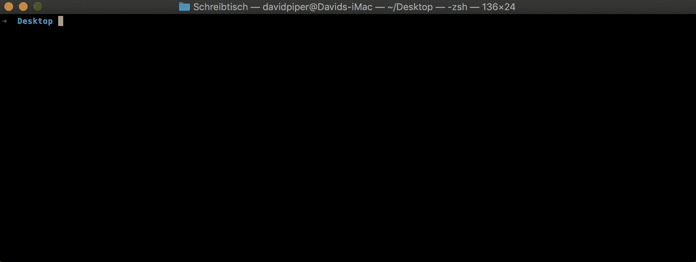

# 让 Swift 游乐场更好玩

> 原文：<https://betterprogramming.pub/making-swift-playgrounds-more-playful-6fd6d9f5ba54>

## 自动化您的开发工作流程


[亨尼斯坦德](https://unsplash.com/@henniestander?utm_source=unsplash&utm_medium=referral&utm_content=creditCopyText)在 [Unsplash](https://unsplash.com/s/photos/play?utm_source=unsplash&utm_medium=referral&utm_content=creditCopyText) 上的照片

Swift Playgrounds 使得尝试新的框架变得非常简单，但是到达一切都已经设置好的地步可能会非常尴尬。

如果您使用 [CocoaPods](https://cocoapods.org/) 来管理依赖项，您首先必须启动一个新的 Xcode 项目，执行`pod init`，创建一个包含所有需要的依赖项的新的`Podfile`，执行`pod install`，等待，打开生成的工作区，创建一个新的游乐场，并将该游乐场拖到工作区中。Uff！

我想找到一种方法来自动完成这个设置过程，于是我找到了 nef。这是一个命令行工具，具有多种特性，其中之一是创建已经集成了 CocoaPods 的操场。

你可以像这样通过[自制软件](https://brew.sh)安装它:

```
brew tap bow-swift/nef
brew install nef
```

安装后，您可以使用它的 Playground 子命令。通过传递项目的名称和 Podfile 的路径，nef 将做上面列出的所有事情，在集成了所有依赖项的工作区内建立一个新的运动场。

这几乎正是我要找的，但不像我希望的那样方便。

因此，我围绕 nef 编写了一个小的 Python 脚本来自动生成初始 Podfile，使用所需的参数执行 nef，并打开创建的工作区。

play.py 创建有趣的游乐场

让我们看看这个脚本做了什么:

`#1` —首先我们需要导入一些库:

*   `argparse`用于处理通过命令行传递给脚本的参数。
*   `os`执行需要的命令。
*   `tempfile`创建初始临时 Podfile。

`#2` —下一步是设置用于处理参数的解析器。该脚本应该可以通过以下方式执行:

`python play.py name --list dependency1 dependency2 ...`

因此，我们需要两个参数，项目的名称，以及一个 pod 名称列表。第一个只是一个位置参数，第二个将所有的名字作为字符串存储在一个名为`dependencies`的列表中。

给定依赖关系，我们可以将它们嵌入到 Podfile 中。我们只是循环遍历所需 pod 的名称，并将它们列在 Podfile 中。

`#4` —现在我们可以创建一个临时文件，并将之前生成的 Podfile 内容写入其中。该文件将在下一步传递给 nef。

`#5` —至此，nef 的一切都已准备就绪。我们可以调用命令并传递工作区的名称和初始的 Podfile。

`#6` —最后，我们用`xed`命令打开新的工作区。

这里您可以看到运行中的脚本:



使用 play.py 创建带有 pod [Dip](https://github.com/AliSoftware/Dip) 的新操场的示例。

就是这样！有了这个脚本，用操场挖掘新框架就变得非常简单了。希望你觉得有趣，有帮助！

# 资源

 [## 船形容器

### 简称娜芙蒂蒂，母亲安赫塞娜蒙，是一个命令行工具，以方便创建文件的形式…

nef.bow-swift.io](https://nef.bow-swift.io/docs/) [](https://brew.sh) [## 公司自产自用

### macOS(或 Linux)缺失的软件包管理器。

brew.sh](https://brew.sh)