# 让 SwiftUI 预览为您服务

> 原文：<https://betterprogramming.pub/making-swiftui-previews-work-for-you-6e54f46afbf>

## 如何充分利用 SwiftUI 预览——即使是依赖于数据库中保存的数据(如 Realm 或 Core Data)的视图

格伦·卡斯滕斯-彼得斯在 [Unsplash](https://unsplash.com?utm_source=medium&utm_medium=referral) 拍摄的照片

# 介绍

画布预览是 SwiftUI 的一项重要功能。当您创建一个新视图时，一半的样板代码是用于预览的。预览会占用您 Xcode 空间的三分之一。

尽管这个特性很突出，但许多开发人员只是从他们的视图中删除预览代码，并依赖模拟器。

在 Xcode 过去的版本中(包括 Xcode 13 测试版)，不愿意使用预览是可以理解的。它们会莫名其妙地失败，错误消息也难以理解。

我从一开始就坚持预览，但有时，他们觉得比他们值得更多的努力。但是，对于 Xcode 13，我认为我们应该在所有视图中使用它们。我特别注意到:

*   他们更可靠。
*   错误消息终于有了意义。
*   支持横向模式。

作者图片

我认为预览有点像你的视图的 UI 单元测试。像单元测试一样，需要一些额外的前期工作，但是在生产率和质量方面你会得到很大的回报。

在本文中，我将介绍:

*   您可以在预览中检查的内容(考虑亮/暗模式、不同的设备、风景模式等。)以及如何去做。
*   减少预览中需要的样板代码的数量。
*   为有状态应用程序编写预览。(我将使用[领域](https://realm.io/)，但是同样的方法也可以用于核心数据。)
*   排除预览故障。

我不会讨论的一个特性是使用预览作为编辑视图的图形化方式。SwiftUI 最大的吸引力之一是用代码编写一切，而不需要故事板和 XML 文件。为 SwiftUI 使用拖放式视图构建器对我没有吸引力。

我在本文中使用的 95%的例子都是基于一个 21 点培训应用程序。你可以在[回购](https://github.com/mongodb-developer/BlackJackTrainer)中找到最终版本。

# 先决条件

*   Xcode 13+
*   iOS 15+版本
*   可可王国 10.17.0 以上

注意:

*   我使用过 Xcode 13 和 iOS 15，但本文中的大多数示例都适用于旧版本。
*   在横向模式下预览是 Xcode 13 中的新功能。
*   `buttonStyle`修改器只有 iOS 15 才有。
*   我用的是 Realm-Cocoa 10.17.0，但是更早的 10。x 版本很可能行得通。

# 使用预览

预览可让您查看视图的外观，而无需在模拟器或物理设备中运行。当您编辑视图的代码时，它的预览会实时更新。

本节展示了您可以预览的方面，以及如何进行预览。

## 超级简单的预览

当您创建新的 Xcode 项目或 SwiftUI 视图时，Xcode 会自动添加预览代码。你只需要按下“继续”按钮(或 CMD-Alt-P):

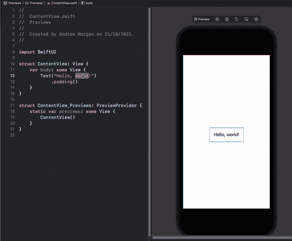

作者图片

预览代码总是具有相同的结构，需要预览的`View`(本例中为`ContentView`)在`previews` `View`内:

## 需要参数的视图

大多数视图都需要封闭视图传入参数。您的预览也必须这样做——如果您忘记了，您将得到一个构建错误。

我的`[ResetButton](https://github.com/mongodb-developer/BlackJackTrainer/blob/main/Black%20Jack%20Trainer/Black%20Jack%20Trainer/Views/Decision%20Matrix/ResetButton.swift)`视图要求调用者提供两个值- `label`和`resetType`:

预览代码需要传入这些值，就像任何嵌入视图一样:

## 需要`Binding` s 的视图

在一个聊天应用程序中，我有一个`[LoginView](https://github.com/mongodb-developer/LiveTutorial2021/blob/main/iOS/LiveChat/LiveChat/Views/LoginView.swift)`，它从封闭视图中更新过去的`username`绑定:

在预览中创建绑定的最简单方法是使用`constant`函数:

## 导航视图

在您的视图层次结构中，您只在单个级别添加了一个`NavigationView`。然后`NavigationView`包装所有子视图。

当预览这些子视图时，您可能关心也可能不关心`NavigationView`功能。例如，如果您的预览在`NavigationView`中包裹视图，您将只能在顶部导航栏中看到标题和按钮。

如果我预览我的`[PracticeView](https://github.com/mongodb-developer/BlackJackTrainer/blob/main/Black%20Jack%20Trainer/Black%20Jack%20Trainer/Views/PracticeView.swift)`而没有添加一个`NavigationView`，那么我看不到标题:

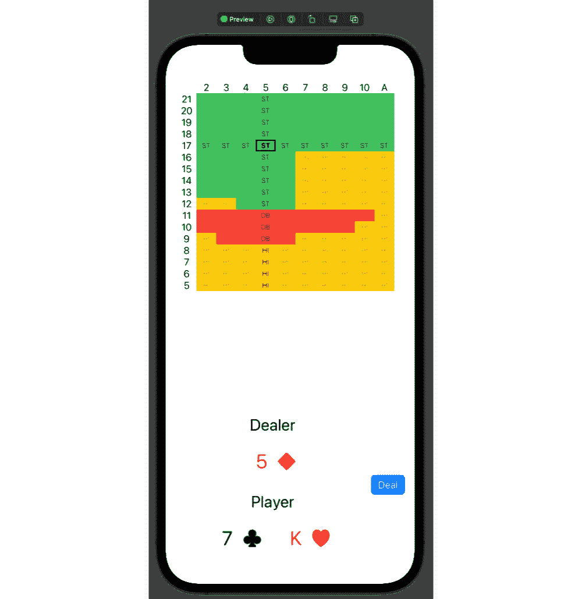

为了预览标题，我的预览代码需要将`PracticeView`包装在`NavigationView`中:

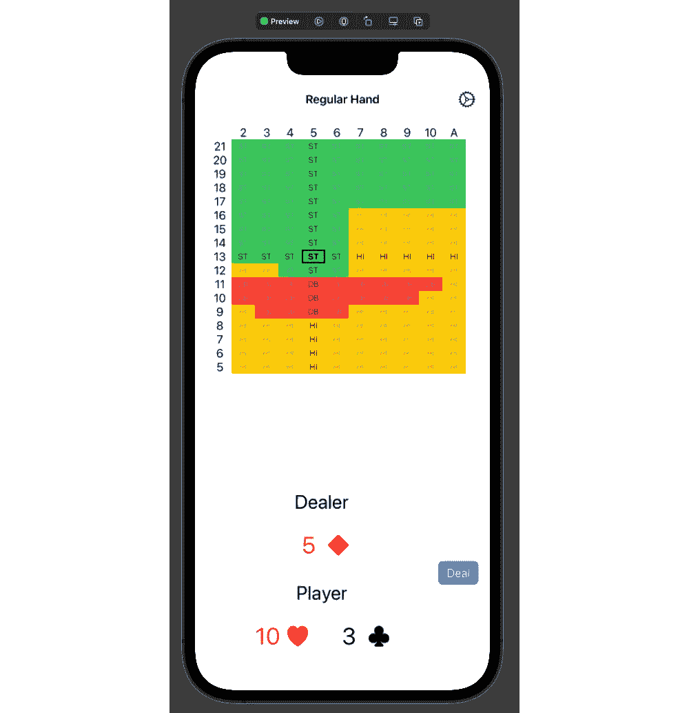

## 较小的视图

有时，您不需要在整个设备屏幕的背景下预览视图。我的显示一张扑克牌。在整个设备屏幕上预览只会浪费桌面空间:

我们可以添加`previewLayout`修饰符来表示我们只想预览一个足够大的视图区域。添加一些`padding`通常也是有意义的:

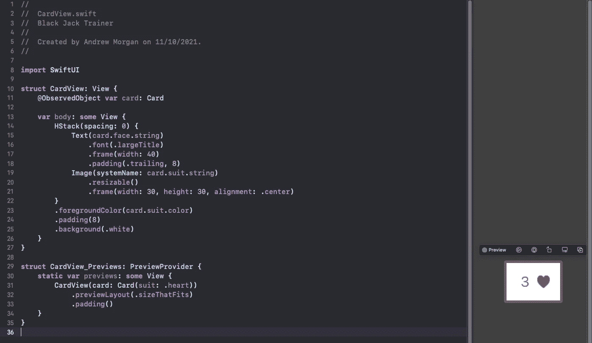

## 亮暗模式

当你最终在黑暗模式下测试你的应用程序时，你可能会大吃一惊。如果在实现每个视图时没有考虑亮/暗模式，那么结果可能会很难看，甚至无法使用。

救援预演！

回到`[CardView](https://github.com/mongodb-developer/BlackJackTrainer/blob/main/Black%20Jack%20Trainer/Black%20Jack%20Trainer/Views/CardView.swift)`，我可以使用`preferredColorScheme`视图修改器在黑暗模式下预览一张卡片:

这看起来不错，但是如果我预览一把铁锹呢？

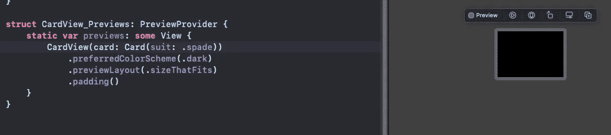

这可能是个问题。

在视图中添加白色背景可以解决这个问题:

## 预览多个视图实例

有时，预览视图的单个实例并不能描绘全貌。看看我在卡片视图中启用黑暗模式时得到的惊喜吧。在黑暗和光明模式下同时预览红桃和黑桃不是更好吗？

您可以使用`Group`视图为同一个视图创建多个预览:

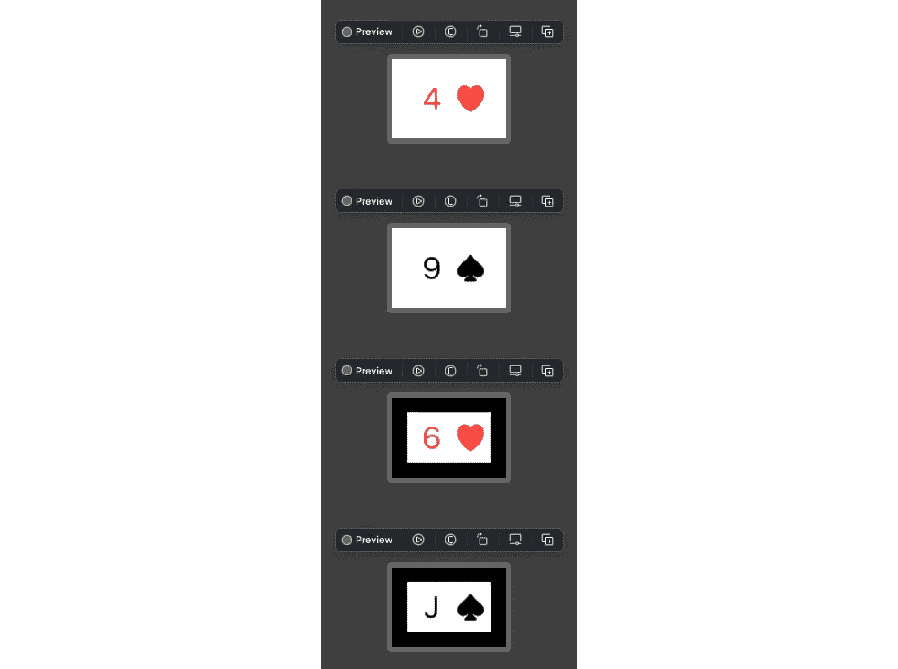

## 在预览中合成视图

孤立地预览单个视图可能看起来不错，但在更广泛的背景下会是什么样子呢？

预览单个`[DecisionCell](https://github.com/mongodb-developer/BlackJackTrainer/blob/main/Black%20Jack%20Trainer/Black%20Jack%20Trainer/Views/Decision%20Matrix/DecisionCell.swift)`视图看起来很棒:

但是，应用程序永远不会显示一个`DecisionCell`。他们会一直在一个格子里。此外，文本、背景颜色和边框因州而异。为了创建更真实的预览，我在视图中创建了一些样本数据，然后使用垂直和水平堆栈合成了多个`DecisionCell`:

然后我可以看到黑色边框在黑暗模式下不太好用:

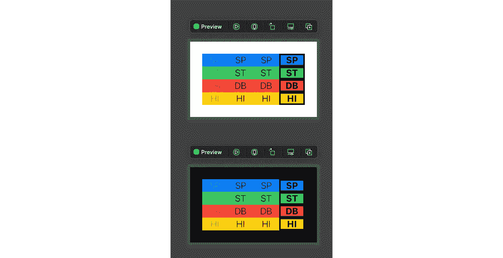

将边框颜色从`black`切换到`primary`很快解决了这个问题:

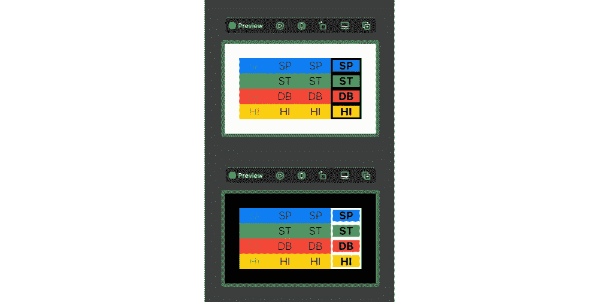

## 横向模式

预览默认为纵向模式。使用`previewInterfaceOrientation`修改器以横向模式预览:

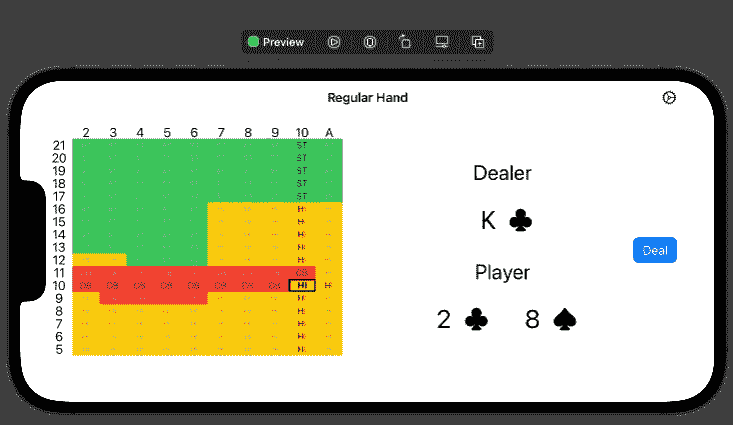

## 设备类型

预览默认为您在 Xcode 中选择的模拟器设备。你可能希望你的应用能在多种设备上运行良好。通常，我发现要让我为 iPhone 设计的应用程序在 iPad 上运行良好，还需要做额外的工作。

`previewDevice`修饰符让我们指定在预览中使用的设备类型:

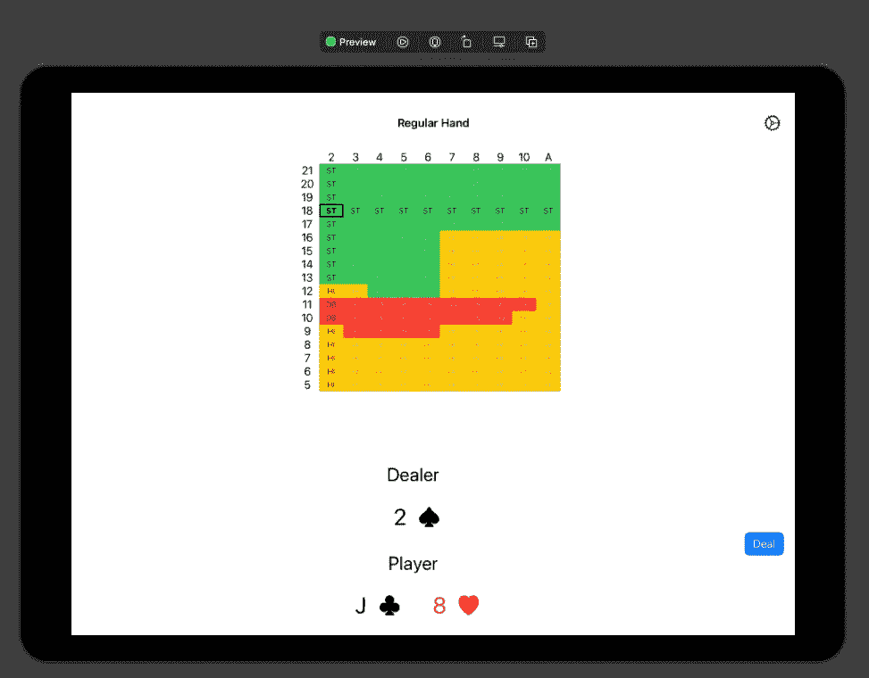

您可以从 Xcode 的模拟器菜单中找到可用设备的名称，或者使用`xcrun simctl list devices`从终端中找到。

## 锁定视图

在预览区域的左下角，有一个大头针按钮。按下此按钮会“锁定”当前预览，这样当您浏览其他视图的代码时，它仍会显示:

当您编辑子视图的代码时，这有助于观察父视图是如何变化的:

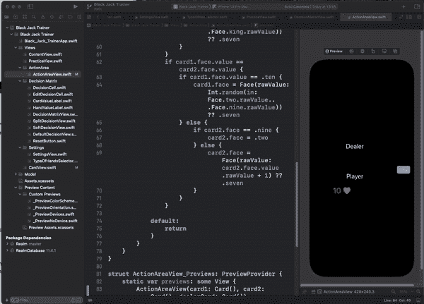

## 实时预览

在本文的开始，我对预览和单元测试进行了比较。实时预览意味着你真的可以孤立地测试你的视图(准确地说，你测试的视图加上它嵌入或链接的所有视图)。

按预览上方的播放按钮进入实时模式:

现在，您可以与您的视图进行交互:

# 去除多余的样板预览代码

你可能已经注意到了，我的一些预览现在比实际视图有更多的代码。这不一定是个问题，但是有很多重复的样板代码被多个视图使用。不仅如此，您还将在其他项目的预览中嵌入相同的样板代码。

为了简化我的预览代码，我创建了几个视图生成器。它们都遵循相同的模式——接收一个`View`，并返回一个从那个`View`构建的新的`View`。

我以`_Preview`开始每个视图构建器的名称，以便于利用 Xcode 的代码完成特性。

## 亮/暗模式

`[_PreviewColorScheme](https://github.com/mongodb-developer/BlackJackTrainer/blob/main/Black%20Jack%20Trainer/Black%20Jack%20Trainer/Preview%20Content/Custom%20Previews/_PreviewColorScheme.swift)`返回视图副本的`Group`。一个是亮模式，另一个是暗模式:

要在预览中使用这个视图生成器，只需传入您正在预览的`View`:

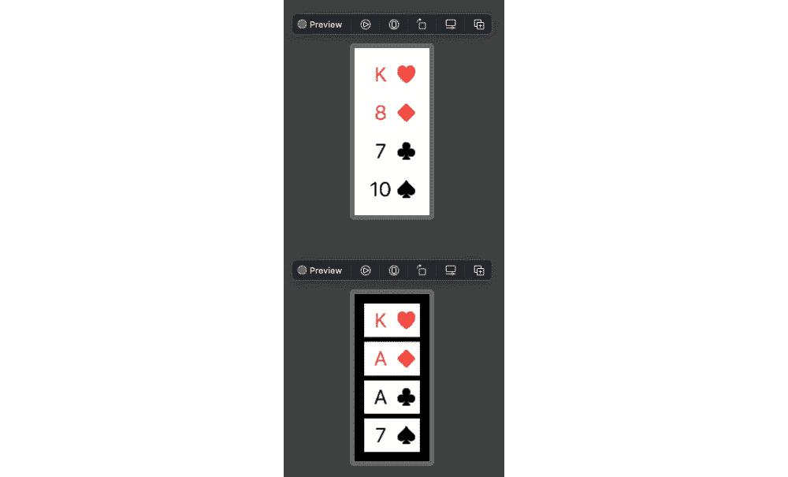

# 方向

`[_PreviewOrientation](https://github.com/mongodb-developer/BlackJackTrainer/blob/main/Black%20Jack%20Trainer/Black%20Jack%20Trainer/Preview%20Content/Custom%20Previews/_PreviewOrientation.swift)`返回一个包含纵向和横向模式下原始`View`的`Group`:

要在预览中使用这个视图生成器，只需传入您正在预览的`View`:

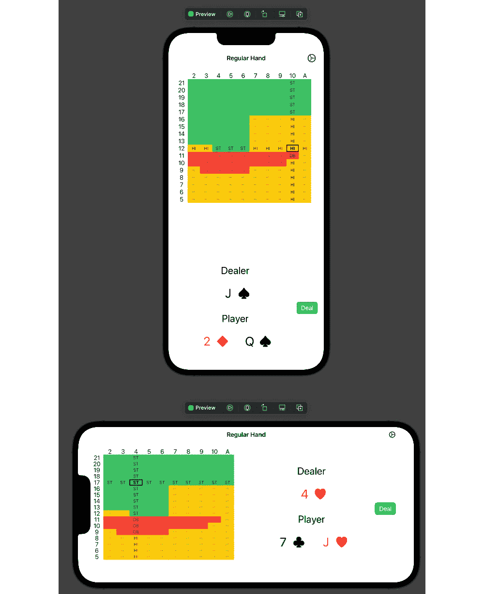

## 没有设备

`[_PreviewNoDevice](https://github.com/mongodb-developer/BlackJackTrainer/blob/main/Black%20Jack%20Trainer/Black%20Jack%20Trainer/Preview%20Content/Custom%20Previews/_PreviewNoDevice.swift)`返回通过添加`previewLayout`修饰符和添加“填充”到输入视图构建的视图:

要在预览中使用这个视图构建器，只需传入您正在预览的`View`:

## 多个设备

`[_PreviewDevices](https://github.com/mongodb-developer/BlackJackTrainer/blob/main/Black%20Jack%20Trainer/Black%20Jack%20Trainer/Preview%20Content/Custom%20Previews/_PreviewDevices.swift)`返回一个`Group`，包含每种设备类型的`View`的副本。您可以修改代码中的`devices`,以包含您想要查看预览的设备:

我对添加太多设备持谨慎态度，因为这会使任何使用此视图生成器的预览变慢并消耗资源。

要在预览中使用这个视图生成器，只需传入您正在预览的`View`:

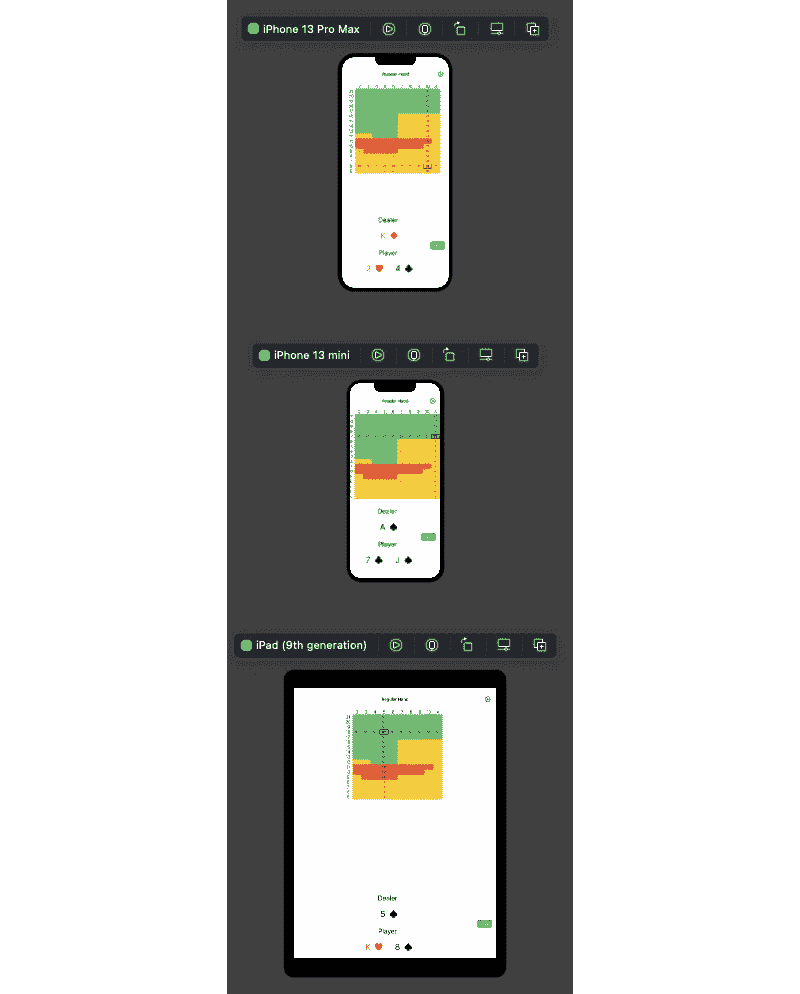

## 组合多个视图构建器

每个视图构建器接收一个视图并返回一个新视图。这意味着您可以通过将一个视图构建器的结果传递给另一个视图构建器来组合函数。在极端情况下，您可以在同一个视图预览中使用最多三个:

这产生了 12 个视图，涵盖了方向、外观和设备的所有排列。

对于每个视图，您应该考虑哪些修饰符增加了价值。对于`CardView`，使用`_PreviewNoDevice`和`_PreviewColorSchem` e 是有意义的，但是在不同的设备和方向上预览不会增加任何价值。

# 预览状态视图(领域)

通常，SwiftUI 视图会从数据库中获取状态，比如领域或核心数据。要做到这一点，数据库中需要有数据。

预览可以在嵌入式 iOS 模拟器上有效运行。这有助于解释为什么它们比“预览”功能更慢、更强大。这也意味着每个预览还包含一个领域数据库(假设您使用的是 [Realm-Cocoa SDK](https://github.com/realm/realm-cocoa) )。预览可以将数据存储在数据库中，而查看者可以访问该数据。

在 BlackJack training 应用程序中，每个玩家/庄家的手牌组合要采取的行动存储在 Realm 中。例如，`[DefaultDecisionView](https://github.com/mongodb-developer/BlackJackTrainer/blob/main/Black%20Jack%20Trainer/Black%20Jack%20Trainer/Views/Decision%20Matrix/DefaultDecisionView.swift)`使用`@ObservedResults`从领域中访问数据:

为了确保预览视图可以找到数据，预览会检查领域数据库是否已经包含数据(`Decisions.areDecisionsPopulated`)。如果没有，则添加所需数据(`Decisions.bootstrapDecisions()`):

`DefaultDecisionView`嵌入在`[DecisionMatrixView](https://github.com/mongodb-developer/BlackJackTrainer/blob/main/Black%20Jack%20Trainer/Black%20Jack%20Trainer/Views/Decision%20Matrix/DecisionMatrixView.swift)`中，因此`DecisionMatrixView`的预览也必须有条件地填充领域数据。反过来，`DecisionMatrixView`被嵌入到`[PracticeView](https://github.com/mongodb-developer/BlackJackTrainer/blob/main/Black%20Jack%20Trainer/Black%20Jack%20Trainer/Views/PracticeView.swift)`中，而`PracticeView`被嵌入到`[ContentView](https://github.com/mongodb-developer/BlackJackTrainer/blob/main/Black%20Jack%20Trainer/Black%20Jack%20Trainer/Views/ContentView.swift)`中——因此，他们也需要引导领域数据，以便它可以在视图层次结构中进一步使用。

这是引导函数的实现:

## 分区、同步的领域

21 点训练应用程序使用独立的领域数据库。但是如果应用程序正在使用[领域同步](https://docs.mongodb.com/realm/sync/)会发生什么？

一种选择是让 SwiftUI preview 与您的后端领域服务同步数据。我认为这有点太复杂了，它打破了我将预览视为视图单元测试的范式。

我发现最简单的解决方案是让视图知道它是由预览还是由正在运行的应用程序创建的。我将解释它是如何工作的。

`[AuthorView](https://github.com/realm/RChat/blob/main/RChat-iOS/RChat/Views/Chat%20Messages/AuthorView.swift)`从 [RChat](https://github.com/realm/RChat/) 应用程序从领域获取数据:

它的预览代码引导嵌入式领域:

该应用程序添加了 bootstrap 作为 Realm 的扩展:

复杂的是，`AuthorView`嵌入了`[ChatBubbleView](https://github.com/realm/RChat/tree/main/RChat-iOS/RChat/Views/Chat%20Messages)`。为了让应用程序工作，`ChatBubbleView`必须将同步的领域配置传递给`AuthorView`:

**但是**在预览`ChatBubbleView`的时候，我们希望`AuthorView`使用预览的本地、嵌入式领域(不依赖于一个领域后端 app)。这意味着`ChatBubbleView`必须检查它是否作为预览的一部分运行:

预览然后负责引导本地领域，并标记给`ChatBubbleView`它是一个预览:

# 预览疑难解答

正如本文开头提到的，预览失败的错误信息在 Xcode 13 中实际上很有用。

这是好消息。

坏消息是你仍然不能使用断点或者打印到控制台。

一个缓解是您预览中的`previews`静态 var 是一个`View`。这意味着您可以用您的`previews`代码替换您的`ContentView`的`body`。然后，您可以在模拟器中运行应用程序，并添加断点或打印到控制台。使用这种方法感觉很奇怪，但我还没有找到更好的选择。

# 结论

我对 SwiftUI 预览有着复杂的关系。

当它们工作时，它们是一个很好的工具，让你更快地写出你的观点。预览允许您对视图进行单元测试。预览可帮助您避免应用程序在黑暗或风景模式下运行或在不同设备上运行时出现的问题。

但是，它们需要努力构建。在 Xcode 13 之前，由于可靠性问题，很难证明这种努力是正确的。

我相信 Xcode 13 是一个转折点，在那里效率和质量的提高远远超过了编写预览代码的努力。这就是我现在写这篇文章的原因。

在本文中，您看到了许多让预览尽可能有用的技巧。我提供了四个视图构建器，您可以将其直接复制到 SwiftUI 项目中，让您用最少的代码构建最好的预览。最后，您看到了如何为视图编写预览，这些视图使用数据库中的数据，如 Realm 或 Core 数据。

请在[领域社区论坛](https://www.mongodb.com/community/forums/c/realm-sdks/58)中提供反馈并提出任何问题。

*最初发表于*[T5【https://www.mongodb.com】](https://www.mongodb.com/developer/how-to/swiftui-previews)*。*