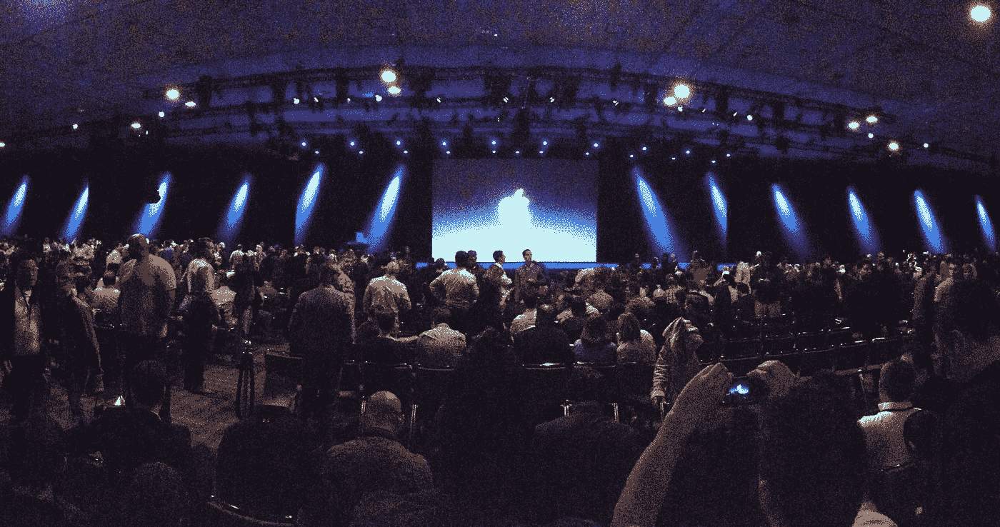
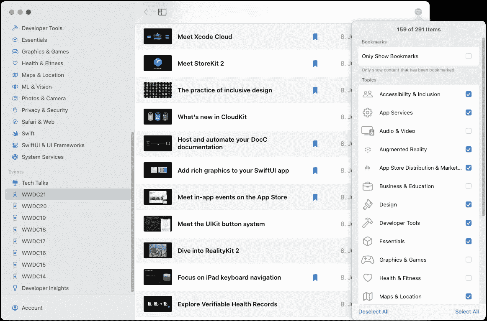
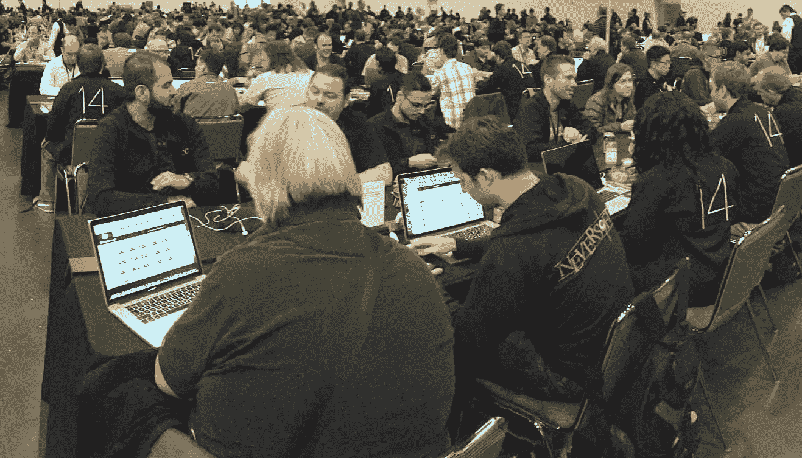
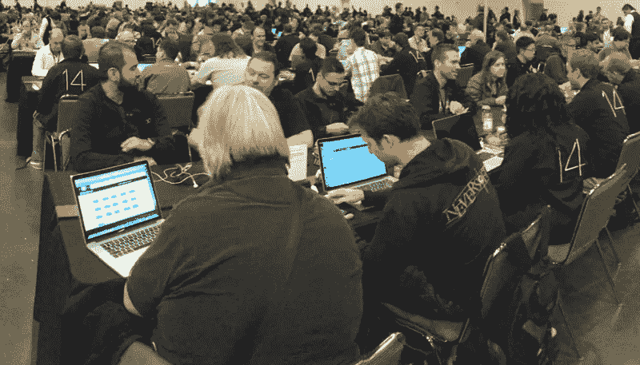

# 充分利用 WWDC 2022

> 原文：<https://betterprogramming.pub/making-the-most-of-wwdc-2022-6b7fff09f65e>

## 如何享受与其他开发人员(远程)的主题演讲，以及如何最大化您一周的学习成果。如果你能投入时间



早在 1983 年，苹果每年都会举办一次开发者大会(因此，从技术上讲，明年将是 40 周年纪念日！)，即使它正式举办的名称是“全球开发者大会”，或者简称“WWDC”也只是从 1990 年开始的[。有趣的事实:1983 年的第一次会议是在蒙特利市举行的](https://apple.fandom.com/wiki/Worldwide_Developers_Conference#History)，这是当前 macOS 版本[的名字。](https://www.apple.com/macos/monterey/)

虽然第一次“Dub Dub”——大多数亲自参加过活动的人都喜欢这样称呼它——实际上是一次需要签署 NDA 的封闭活动，因为他们提前向开发者展示了新产品，但它在第二年开放，并从那以后一直开放给开发者参加。至少对于那些能够支付 1600 美元左右的费用，能够负担一周的加州之旅，并且由于门票有限而幸运地赢得彩票的人来说是如此。

但是由于新冠肺炎疫情[的召开，这样的大型会议在 2020 年是不可想象的，苹果不得不做一些不同的事情，从那时起，WWDC 真正做到了名副其实，实际上全世界的开发者都可以免费参加！虽然这是事情积极的一面，但是参加在线会议和面对面的会议当然是不同的体验。所以今年，他们尝试了一种混合的方式，在苹果公园为少数幸运者举办了一场特殊的活动，但是会议本身仍然向世界各地的所有人开放。](https://en.wikipedia.org/wiki/COVID-19_pandemic)

随着这些变化的出现，年度会议可能会保持这种在线形式，让我们来看看会议的三个关键方面，以及如果我们能够提供时间，我们如何充分利用每个方面:

*   **了解最新的苹果技术**
*   **联系**其他开发者&玩得开心
*   **讨论**新技术的影响，特色&产品

# 学问


## 苹果

苹果官方在一周内提供了哪些学习机会。

**主题演讲&平台国情咨文** [WWDC 主题演讲](https://www.youtube.com/watch?v=0TD96VTf0Xs)是苹果向公众展示最新软件和产品更新的地方。它不是专门针对开发人员的，但它确实包括一个[简短的开发人员部分](https://www.youtube.com/watch?v=0TD96VTf0Xs&t=5598s)，以及像 2014 年的[Swift](https://www.youtube.com/watch?v=w87fOAG8fjk&t=6232s)或 2019 年的[Swift ui](https://www.youtube.com/watch?v=psL_5RIBqnY&t=7591s)这样的重大宣布都在这里亮相(观看链接部分&倾听人群对今年的主题演讲感到兴奋！).

[平台联盟状态](https://developer.apple.com/videos/play/wwdc2021/102/)也被称为“开发者主题演讲”是有原因的。它基本上是揭示和演示所有新的令人惊叹的 API，就像 keynote 是揭示和演示所有新产品&服务一样。它是专门针对开发者的，所以他们可以进入更多的细节，如果有一个视频你有时间观看整个 WWDC，这是我推荐的一个，因为它就像是一周剩余时间的总结。这也是找到你感兴趣的话题的好方法。这里提到的所有技术在一周中都有专门的会议。

**专题讲座** [200 多个专题讲座视频](https://developer.apple.com/videos/wwdc2021/)构成了 WWDC 的核心，是更详细了解最新技术的最佳场所。观看他们的一个好地方是专用的[开发者应用](https://apps.apple.com/us/app/apple-developer/id640199958)，它最近也获得了对 [SharePlay](https://developer.apple.com/shareplay/) 的支持，所以你甚至可以远程与某人一起观看会议，并立即进行讨论。苹果按主题对视频进行分组，这样你就可以轻松过滤应用程序中的视频。您也可以**标记**时段，稍后观看。这是我在开发者大会后做的事情。



如果你被大量的会议弄得不知所措，一个好的开始是留意所有标题为“最新动态”或“会议”的会议，因为这些是特定主题或框架的总结会议。然后，在这些会议中，如果需要，他们会提到其他会议，以便更深入地了解某些细节。

为了最大限度地利用会议，我喜欢记笔记，这样我就可以很容易地找到我后来感兴趣的东西，这也有助于保持我的注意力。以下是我在 2021 年 WWDC 奥运会和 2020 年 WWDC 奥运会期间做的笔记。我建议你也这样做，如果你这样做了，考虑把你的笔记贡献给 [WWDC 笔记](https://www.wwdcnotes.com)社区项目，以便将来帮助其他开发者。

**实验室** 如果你在一些苹果技术上有问题，比如与系统或 Xcode 的集成，或者如果你只是因为缺乏用例文档而不明白如何使用框架来实现特定功能，那么[实验室](https://developer.apple.com/wwdc22/labs/)是一个与苹果工程师交谈并从实现这些东西的人那里获得直接反馈并了解所有细节的绝佳机会。还有一个实验室可以获得应用审查的帮助，还有一个实验室可以获得应用设计的反馈。

如果你使用付费苹果开发者计划的 Apple ID 登录，或者如果你是今年学生挑战赛的获胜者，你将能够在开发者应用程序中请求预约。尽早申请，并注意:

> 由于时间有限，我们会审核您的请求，您将在实验前一天晚上 10:00(太平洋时间)收到一封电子邮件，告知您的状态。

**挑战** 苹果在 WWDC 2021 上尝试了一些新的东西，提供了 25 个“挑战”，在 WWDC22 官方页面上他们提到了“日常编码和设计挑战”，所以他们会看到回报。大多数开发人员似乎在去年错过了它们(不，我不是在说 Swift 学生挑战赛！).

苹果让它们变得不必要的难以探索，我无法在网上找到我可以链接到的关于它们的很好的概述，我只能找到那些带有示例项目的[的链接，因为下载页面会链接到一篇](https://developer.apple.com/documentation/realitykit/wwdc21_challenge_framework_freestyle)[新闻文章](https://developer.apple.com/news/?id=zpb2xcfr)。对我来说，找到它们最简单的方法就是在开发者应用中搜索“挑战”:


我不确定是否有很多人参与了这些挑战，开发者论坛只有去年的 [8 个贴有官方标签](https://developer.apple.com/forums/tags/wwdc21-challenges)的帖子。但是如果你有足够的时间，并且是那种“边做边学”的人，那就看看今年的挑战吧！

## 社区

社区中的其他人在一周内提供了哪些学习机会。

**WWDC 笔记** [由](https://www.wwdcnotes.com)[费德里科·扎内泰洛](https://www.twitter.com/zntfdr)组织的这个令人惊叹的社区项目是一个很好的资源，可以在不必观看所有会议的情况下了解不同会议的内容。如上所述，虽然不是所有的会议都包括在内，但如果我们都把笔记放在一起，今年我们可以很容易地改变这种情况。它还可以作为 WWDC 内容的存档，最早可以追溯到 2010 年的 WWDC。苹果目前只提供 2014 年 WWDC 的视频，但他们每年都会悄悄地删除一些旧视频，而且到目前为止，并不是所有 2014 年的内容都可用。

**文章、播客&更多** 当然，所有的 iOS Dev 内容创作者不仅仅是*消费*苹果的内容，他们还会撰写、谈论或流传输相关内容。实际上，我计划在观看我感兴趣的会议的同时自己进行一整周的直播&做笔记——欢迎[在 Twitch](https://www.twitch.tv/Jeehut) 上与我一起讨论新的 API！

约翰·桑德尔通常报道 WWDC 的内容，无论是在他的[播客](https://swiftbysundell.com/podcast/) & [博客](https://swiftbysundell.com/articles/)。保罗·哈德森在他的博客中写了整整一周[的精彩摘要。在过去的两年里，他还在这个库](https://www.hackingwithswift.com/articles)[里整理了一份关于 WWDC 的内容的概览，也许今年他还会这样做？如果没有，看看这个由](https://github.com/twostraws/wwdc)[和](https://twitter.com/ay8s)[Dave ver wer](https://iosdevdirectory.com)为所有 iOS 开发内容维护的 [iOS 开发目录](https://iosdevdirectory.com)的[iOS 开发提要聚合器](https://iosdevblogs.com)，我敢肯定他们中的许多人会在一周内覆盖 WWDC 的内容。

**Dub Dub 系列** 与上面提到的来自苹果的“挑战”类似， [Jordi Bruin](https://twitter.com/jordibruin) 最近组织了一组名为 [SwiftUI 系列](https://www.swiftuiseries.com)的编码挑战。与苹果挑战赛不同，这些社区驱动的挑战每个主题有 3 名评委，他们观看项目并在直播视频中给出反馈。乔迪计划在 6 月 10 日组织同样的活动，就在 WWDC 结束配音系列之后。细节还没有公布，但如果它会像 SwiftUI 系列一样，它会很酷，这次会专注于*新的*API。

# 连接



## 苹果

**苹果公园
的特别活动**如上所述，苹果公司[在苹果公园 WWDC 周的第一天举办了一场特别活动](https://developer.apple.com/wwdc22/special-day/)。提交已经结束了，所以如果你还没有加入，你就不走运了。但是对于那些少数幸运者来说，他们将能够亲自与其他开发者见面，并一起享受主题演讲，[苹果提供了许多机会](https://twitter.com/twostraws/status/1529467321420349441?s=20&t=Nf85FLBFL-iL-pyXjDAA1g)全天都可以这样做，包括早餐、午餐，甚至在苹果公园内的导游。

## 社区

**WWDC22 Discord** 社区中的活跃成员，如[蜜琪拉·卡隆](https://twitter.com/mikaela__caron)，已经在 [Discord](https://discord.com) 中创建了一个“WWDC22”空间，您可以使用[这个邀请链接](https://discord.com/invite/6XWE2SGZ)加入其中，在 WWDC 周期间组织海湾地区的聚会，例如[Jordi Bruin](https://twitter.com/jordibruin/status/1526953936409833472)组织的周日晚餐。如果你不知道 Discord，它几乎和 Slack 一样，但是有更多游戏的音频通话历史。这就是为什么不和谐空间也可以很好地用于讨论！考虑检查 WWDC 期间的不和谐，以满足开发人员&讨论新的 API！在撰写本文时，Discord 空间有大约 300 名成员。

**iOS 开发者 Slack** 早在一段时间前，社区就已经开始了一个 [Slack](https://slack.com) 空间，供 iOS 开发者彼此保持联系，你可以通过[这个网站](https://ios-developers.io)加入。拥有超过 22k 的会员，我相信在专用的`#wwdc`频道中会有很多人在这一周讨论最新的 API。

**WWDC 社区周** [这个专门的网站](https://wwdc.community)试图在 WWDC 周期间通过组织和列出[主题演讲派对](https://wwdcwatch.party)和其他活动，如 Twitter“空间”(现场互动音频讨论)，如 WWDC 之前的 [Mega-Pre-WWDC Twitter 空间](https://twitter.com/stefanjblos/status/1529475899736965128)或周期间的 [iOS Dev Happy Hour](https://twitter.com/iosdevhappyhour/status/1529920449500434432) 来聚集社区。他们还组织聚会(面对面和在线)、社区黑客马拉松，并在壁画上收集社区中值得纪念的时刻。他们也刚刚推出了他们自己的 Discord 服务器，你可以[在这里](https://discord.com/invite/3P94atxcV5)加入。

# 论述



## 苹果

**数字休息室** 像去年的一样，苹果今年将再次提供[数字休息室](https://developer.apple.com/wwdc22/digital-lounges/)，这基本上是受控的松弛频道，只在特定时间开放，你需要提前注册——注册于 5 月 31 日开始，需要苹果开发者会员/学生挑战赛获胜者。

**论坛** [苹果开发者论坛](https://developers.apple.com/forums/)也将获得 [4 个专用标签](https://developer.apple.com/wwdc22/forums/)来讨论新的 API，并有机会直接得到苹果工程师的回答。虽然我更喜欢苹果在 Swift Forums 上使用的论坛技术，但一些更棘手的问题只能在这里得到答案，所以它有时可以救命！

## 社区

当然，你可以在其中一个 Discord 服务器或者上面提到的 Slack 服务器中讨论新的 API 来进行“连接”。以下是更多选项:

**一起配音** [这个由](https://wwdctogether.com) [Khoa](https://twitter.com/onmyway133) 创建的网站是一个你可以在一个屏幕上观看主题演讲并与其他开发者实时聊天的地方。虽然理论上你也可以在 YouTube 上观看第一个 keynote 并在那里聊天，但你不能在开发者 keynote 上这样做，你也会发现许多非开发者也在聊天。所以绝对值得考虑！

一些知名的开发者网站，如 RayWenderlich 将会对活动进行直播，并在 API 出现时进行讨论。我已经提到过我也将进行流传输，你可能会发现其他[Twitch streamer](https://iosdevdirectory.com/#twitch-en)也在做同样的事情，我甚至联系了一些人一起讨论我们流中的 API。请注意，苹果不允许重新发布主题演讲或会议，所以你必须在第二个设备上打开苹果的内容才能跟随，只是提醒一下。

我希望这些信息能帮助你度过一个精彩的 WWDC 2022。让我们希望我们所有的愿望都能实现！

```
**Want to Connect?**You can also find me on 👾 [Twitch](https://www.twitch.tv/Jeehut), 🎬 [YouTube](https://www.youtube.com/channel/UCtg6Ck7oYa_9k1oSTmFGNRw), and 🐦 [Twitter](https://twitter.com/Jeehut).
```