# 如何使用金属着色器创建第一个圆

> 原文：<https://betterprogramming.pub/making-your-first-circle-using-metal-shaders-1e5049ec8505>

## 苹果 Metal 简介

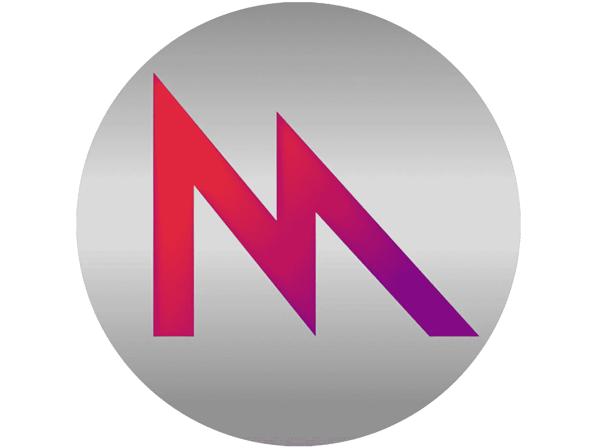

金属着色器？渲染管道？顶点着色器？碎片着色器？如果你像我一样，这些单词和短语是没有意义或令人困惑的。本教程旨在帮助您轻松了解它是如何工作的，并允许您从那里开始构建。

# 设置

我们将从一个 macOS 应用程序开始。这样做的原因是为了让我们可以在模拟器中使用 Mac 的 GPU。如果你想为一个 iOS 应用程序这样做，你必须在一个物理设备上运行它，因为 iOS 模拟器不支持 Metal。


我们现在将添加名为“MetalCircleView”的 NSView 子类(本质上是 Mac 版 UIView)。这就是我们要做的重活。应用程序的根视图控制器(称为 view controller)将只显示这个 NSView。

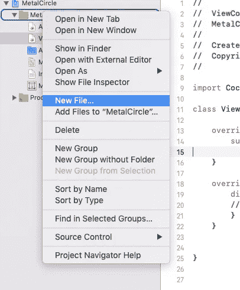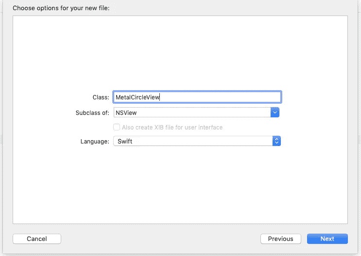

我们要做的第一件事是设置我们的 init 函数。我们将忽略这个类初始化时使用的 draw 函数，而是使用我们自己的函数。

现在，我们将使用自动布局约束将视图从 ViewController 显示到窗口中。

现在，如果我们运行它，我们应该得到一个空窗口！

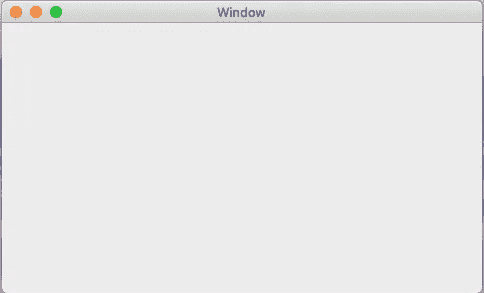

# 设置我们的 MetalKit 视图

1.  将 MetalKit 导入 MetalCircleView 文件。
2.  将我们的 MTKView (Metal-Kit-View)声明为一个类实例变量。
3.  把它限制在我们的视野之内。
4.  将我们自己设置为符合 MTKViewDelegate 的委托。

我们现在为 MetalView 设置了可选字段，在文档中的[这里](https://developer.apple.com/documentation/metalkit/mtkview)讨论了这些字段。

## **告诉 MTKView 如何/何时“更新”**

我们需要告诉我们的视图应该如何以及何时重绘它自己。我们有三个选择:

1.  我们让它根据它的内部计时器(连续的)重画自己
2.  我们使用一个 setter 来告诉它什么时候重画自己，这将基于它的内部定时器(由我们发起)发生
3.  我们直接告诉它画忽略其内部计时器(由我们发起)

我们将使用第二种方法，因为我们只绘制一次，并且将依赖于使用视图的 currentRenderPassDescriptor(稍后将详细介绍)。根据文档，我们需要使用`metalView.isPaused = true`暂停它，并使用`metalView.enableSetNeedsDisplay = true`启用它的设置需求显示。这告诉它应该暂停，应该等待我们告诉它什么时候需要显示什么。

## **将其连接到设备的 GPU**

我们的 MTKView 需要连接到一个设备，它的类型是 [MTLDevice](https://developer.apple.com/documentation/metal/mtldevice) 。你可以把这个设备想象成 GPU 本身。

> `*MTLDevice*`协议定义了与 GPU 的**接口**

我们可以在 iOS 或 tvOS 以及 macOS 中使用`[MTLCreateSystemDefaultDevice()](https://developer.apple.com/documentation/metal/1433401-mtlcreatesystemdefaultdevice)`在运行时获取 GPU。还有另一个选项可用于获取特定的 GPU(如果您想将 Mac 的专用 GPU 或集成 GPU 作为目标，这很有用)，但这超出了本教程的范围。

我们希望这个金属设备在全球范围内可用，所以我们将其声明为一个类实例变量，在我们的`setupMetal()`函数中初始化它，并将其设置为我们的 metalView 的设备。

```
metalDevice = MTLCreateSystemDefaultDevice()metalView.device = metalDevice
```

我们的最终产品现在看起来像这样，我们准备好开始设置我们的渲染功能！

# 设置我们的渲染功能

## **创建命令队列**

我们需要做的第一件事是制作一个命令队列，一个`[MTLCommandQueue](https://developer.apple.com/documentation/metal/mtlcommandqueue)`。这个队列需要对我们的设备(我们的 GPU 接口)是唯一的；我们用它向 GPU 传达指令。这些指令由一个`[MTLCommandBuffer](https://developer.apple.com/documentation/metal/mtlcommandbuffer)`表示，是为命令队列执行而创建的。

在初始化时知道了这些信息，我们希望创建命令队列，并将对它的引用作为实例变量。然后每次我们想渲染什么的时候，就需要创建一个命令缓冲对象来保存我们的指令。

因为命令队列对于我们的设备是唯一的，所以我们使用我们的设备来创建它！我们希望将它添加为`setupMetal()`功能的一部分。

```
metalCommandQueue = metalDevice.makeCommandQueue()!
```

(在这一点上，你应该想知道为什么我要强制解包。确保你正确处理你的选择！)在设置了命令队列之后。我们的代码应该是这样的。

# 发出我们的第一个 GPU 命令！

现在我们已经有了发出第一个 GPU 命令的基本设置和知识，我们将为 MTKView 渲染一个 RGBA 颜色值。

我们在 draw 中要做的第一件事是创建我们的 commandBuffer。这将包含我们执行命令所需的指令！

## **创建管道**

我们的指挥缓冲区需要一条管道来输送。管道需要内部信息和接口信息。我们使用一个`[MTLRenderPassDescriptor](https://developer.apple.com/documentation/metal/mtlrenderpassdescriptor)`来配置接口信息。对于本教程，我们不需要创建自己的——我们可以使用`.currentRenderPassDescriptor`从 MTKView 获取默认的。

现在访问我们的渲染过程描述符的 colorAttachements 数组属性，我们可以在它的(第 0 个条目)设置一个值。clearColor，描述分配给视图当前可绘制性的纹理的颜色数据。更简单地说，这可以被认为是我们的金属视图的“背景色”。

接下来，我们需要一个`[MTLRenderCommandEncoder](https://gist.github.com/barbulescualex/666ae6959f2f00ed15e261c916ddbc49)`来配置管道的内部。它是使用 renderDescriptor 从我们的 commandBuffer 编译的。

从这里，我们可以开始输入要在 GPU 上绘制的顶点数据和绘制命令，或者更好地认为是 GPU 运行的“编码”命令。目前，我们还没有准备好编码任何真正的*绘图命令，所以我们将把它留到以后(我在标题:p 一节中骗了你)。我们希望在 MTKView 中看到美丽的蓝色背景！*

我们需要做四件事来结束编码并启动 commandBuffer，以便在 GPU 上执行并显示给我们的视图！

1.  结束编码。

`renderEncoder.endEncoding()`

2.告诉 GPU 将渲染结果发送到哪里。

`commandBuffer.present(view.currentDrawable!)`

我们可以使用 MTKView 的 currentDrawable，一个表示当前帧的 Drawable。`[MTLDrawable](https://developer.apple.com/documentation/metal/mtldrawable)`是一个“*可显示的资源，可以被渲染或写入。*

3.将指令添加到我们的 metalCommandQueue 中

`commandBuffer.commit()`

4.告诉我们的金属视图 draw 触发 draw 方法，我们将把它添加到我们的`setupMetal()`函数的末尾，但是你可以在任何你喜欢的地方调用它(当然，在你设置了金属组件之后)。

`metalView.needsDisplay = true`

我们的绘图函数现在应该是这样的。

如果你点击运行，你应该会看到一个蓝屏！

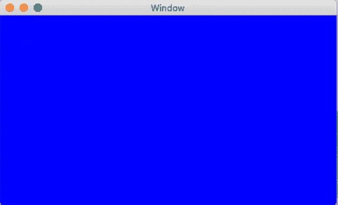

## **注:**

早些时候，当我们选择如何更新我们的 MTKView 时，我提到过我们使用视图的内部定时器来手动设置它，因为我们依赖于 currentRenderPassDescriptor。如果我们手动发出`draw()`命令，忽略它的计时器，我们将不得不调用它两次，因为视图第一次不会有 currentRenderDescriptor。

我们现在需要将命令编码到 renderEncoder 中，让它知道从传入的顶点绘制什么。我们还需要一种方法来表示这些信息，这样我们就可以在我们的视图中创建它，并且金属着色器也可以正确地使用它。但是首先，我们需要从高层次上了解 GPU 实际上是如何绘制东西的。

# 流水线阶段

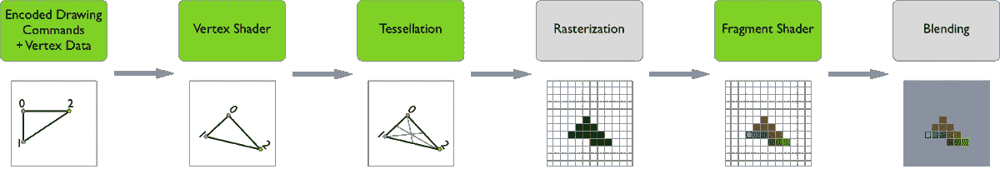

管道阶段部分的全部功劳归于唐纳德·平克尼([来源](https://donaldpinckney.com/metal/2018/07/05/metal-intro-1.html))。

> ***编码绘图命令/顶点数据:***GPU 接收到的，必须在流水线中处理的数据。
> 
> ***顶点着色器:*** 将 3D 顶点位置转换为 2D 屏幕坐标。它还通过管道向下传递顶点数据。
> 
> ***细分:*** 将三角形细分成更多的三角形，以提供更高质量的结果。
> 
> ***栅格化:*** 将 2D 几何数据离散成 2D 离散像素。这也将获取附加到每个顶点的数据，并将其插值到整个形状的每个栅格化像素上。
> 
> ***片段着色器:*** 给定来自光栅化器的插值像素数据，片段着色器确定每个像素的最终颜色。

# 着色器

Metal 支持三种类型的着色器函数:顶点、片段和计算(内核)。这些描述了渲染管道的一部分。


([来源](https://medium.com/@nithstong/2d-colored-triangle-in-elm-with-webgl-2a9b2734ce77))

**顶点着色器:**用于操纵多边形顶点的函数。它运行在我们传入的每个顶点上。在这里，我们可以操纵顶点的位置和其他属性，如颜色。

《出埃及记》在顶点着色器中，我可以操纵每个顶点的位置，所以如果我想的话，我可以传入点来制作一个圆，然后操纵它们成为一个正方形。我也可以为每个顶点传入一种颜色，然后在函数内部改变它。

**碎片着色器:**一个用于操纵顶点间像素外观的函数。它在一组顶点之间的每个像素上运行。这里我们可以返回每个像素的颜色信息。

**统一标量:**此时，您可能会想:传入标量呢？让我们说一个常量 Float 类型来表示我们对象的位置乘数；通过改变这个常数，我们可以使我们的多边形变大或变小。嗯，这被称为**统一**，因为它是一个统一应用于所有点的值，也就是说它不会改变。

# 基元

在最底层，GPU 被设计用来渲染三角形。三角形是最容易和最通用的对象，这也是今天的硬件专注于做的事情(StackOverflow 解释[这里](https://stackoverflow.com/questions/12495511/are-triangles-a-gpu-restriction-or-are-there-other-rendering-pathways))。这并不意味着我们只能告诉 GPU 画三角形。例如，如果你正在使用一个支持四边形(矩形)的框架，你可以给它传递四个点，告诉它画一个矩形。这对程序员来说更容易，但实际上，GPU 仍然将该指令分解为两个三角形指令。

把它想象成用高级语言写一行复杂的代码。当代码被编译成汇编时,“一条”指令被分解成一系列 CPU 可以实际执行的多条指令。

[**MTLPrimitiveType**](https://developer.apple.com/documentation/metal/mtlprimitivetype)**—**绘图命令的几何图元类型。

1.  **点** —在每个顶点光栅化一个点
2.  **线** —栅格化每对独立顶点之间的线(形成不相连的线)
3.  **lineStrip** —栅格化每对顶点之间的一条线(形成一系列相连的线)
4.  **三角形**-为每个独立的三个一组的点光栅化一个三角形
5.  **triangleStrip** —为每三个相邻的三元组点栅格化一个三角形

总结一下，我们需要三个高级步骤来形成一个圆。

1.  在 CPU 上创建顶点。
2.  将顶点发送到顶点着色器。
3.  在片段着色器中应用颜色。

# 建立我们的金属档案

有多种方法可以做到这一点。我们需要的是指定一个库供我们的渲染编码器使用。这个金属库是由。金属锉。在。金属文件，我们可以指定着色器功能。有趣的事实:您也可以在运行时从字符串构建库。

我们需要做的第一件事是在项目文件夹中创建我们的金属文件。这就像添加一个新文件，除了我们选择“金属”而不是“可可级”或“雨燕”。

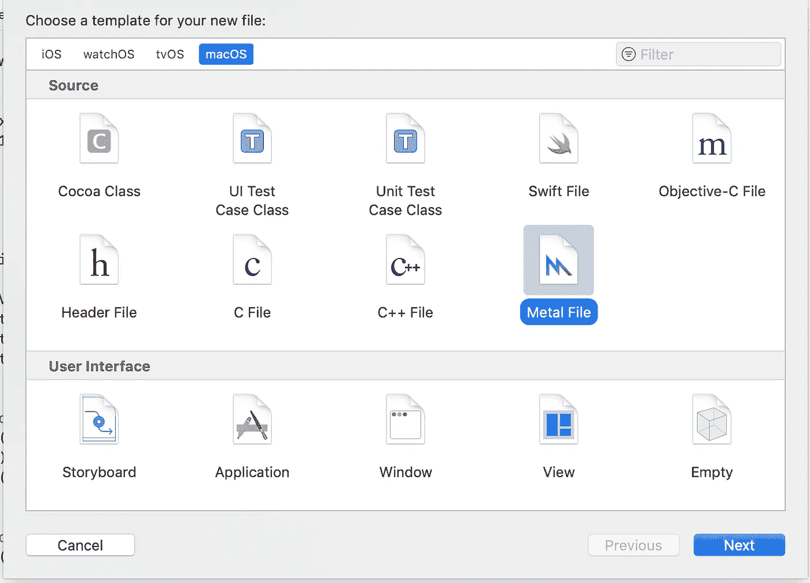

将它命名为 *CircleShader.metal.*

打开它，我们看到我们正在导入 metal 标准库并使用 Metal 名称空间。这里使用的语言叫做[金属规格语言](https://developer.apple.com/metal/Metal-Shading-Language-Specification.pdf)。如果你曾经使用过 C++，你会注意到它看起来已经很相似了；这是因为 MSL(金属着色语言)是基于 C++的。

## **创建一个数据结构，将我们的顶点传递给 GPU**

我们需要在顶点的 swift 文件和金属文件之间有一个共同的语言。我们需要能够在 swift (CPU 端)创建我们的顶点，然后在 Metal (GPU 端)读取它们。数据的容器类型需要一致。

首先，让我们看看我们需要什么来表示一个顶点:我们需要一个保存两个坐标的位置变量，我们需要一个保存该点颜色信息的颜色变量。

如果我们想为一个顶点携带两组信息，那么我们就用 struct。

```
struct VertexIn {
    position : vector_float2 //<x,y>
    color : vector_float4 //<R,G,B,A>
}var verticesForCircle = [VertexIn]() //array of VertexIn
```

如果我们只想携带一组信息，那么我们不需要结构。

```
var verticesForCircle = [vector_float2]() //array of <x,y>
```

假设我们希望我们的圆是纯色的。用顶点数据传递颜色是没有意义的，因为我们可以在着色器函数中硬编码它。出于这个原因，我们将只使用一个向量浮点，而不是一个结构。

您可能还注意到上面的例子包含了 vector_floats。在 Accelerate 框架下，苹果使用 SIMD 向量库。它是为 c++构建的，也可以在 Swift 中使用，因此我们将使用它来表示我们的价值观。

将 simd 导入我们的。金属和。swift 文件:

[**【SIMD c++**](http://ermig1979.github.io/Simd/index.html)**【金属】**

`#include <simd/simd.h>`

声明向量:

`vector_float2 varName;`

[SIMD Swift](https://developer.apple.com/documentation/accelerate/simd)

`import simd`

声明向量:

`let varName : simd_float2`

通过使用 SIMD 库，我们可以确保我们的数据在 CPU 和 GPU 的内存中保持一致。

# 为我们的圆创建顶点

我们现在可以为我们的圆创建顶点了！我们的第一步是考虑 GPU 如何绘制图元。我们渲染的三角形越多，圆就越平滑。

这里有两个选择。

1.

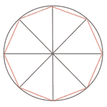

计算圆周上所有的点，并在每两点之间插入原点。当我们只有几个三角形时，你可以很容易地看到，我们真的只是试图制造足够的三角形来隐藏平坦的外部边缘。

2.

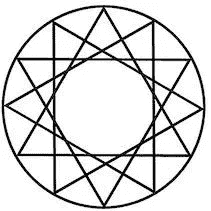

不要使用原点，而是让三角形的所有顶点都接触周长。

这里没有正确或错误的答案，所以我们将选择更简单的选项(选项 1)。

我们将创建一个名为`circleVertices`的实例变量和一个名为`createVertexPoints()`的函数。在`createVertexPoints()` 函数中，我们需要一个助手函数来计算弧度的度数，因为我们将使用 Swift 三角函数。

我们的 MetalCircleView 类现在应该如下所示:

由于圆中有 360 度，我们可以用(n*360)/2 个原点生成 n*360 个周长点(其中 n 代表非零正整数)。本质上，n 越大，我们渲染的三角形就越多，圆形就越平滑。幸运的是，n=2 对我们来说已经足够好了。

我会跳过三角函数课，但这是我们如何得到 720 个周长点。

实际上，是 721 个周界点。这是因为我们想做一个完整的圆(字面意思)。我们从 0*开始，我们希望确保在 360*结束。如果我们以 0… <720, we would have ended on 395.5*. This makes a noticeable difference as there would be a sliver of the circle unfilled if we left it this way. Now in between every two perimeter points, we need to form a triangle with the origin.

It’s worth noting that the points we’re creating are normalized to the screen. In Apple’s [Hello Triangle](https://developer.apple.com/documentation/metal/hello_triangle) 为例，它被定义为:

> vertex 函数将任意顶点坐标转换为标准化设备坐标，也称为*剪辑空间坐标*。剪辑空间是一个 2D 坐标系，它将视口区域沿 x 轴和 y 轴映射到[-1.0，1.0]范围。

这意味着我们可以渲染点的区域在 x 轴和 y 轴上都从-1.0 到 1.0，并且这个坐标系映射到一个视口区域。在我们的例子中，我们没有接触过视口区域，所以视口区域就是我们的整个 MTKView。

我们现在准备将这些数据发送到 GPU 并创建着色器函数:)

# 设置着色器函数

## **指针和内存**

在[金属着色语言规范第 4 章](https://developer.apple.com/metal/Metal-Shading-Language-Specification.pdf)

> 在程序中声明的作为指针的金属图形和内核函数的参数必须用金属设备、线程组、线程组 _ 图像块或常量地址空间属性来声明。

这些指定了数组应该存储在 GPU 中的哪个地址空间。`device`属性指定一个读写地址空间，`constant`指定一个只读地址空间。

## **程序范围函数常数**

> 用以下属性声明(或初始化)的程序范围变量是*函数常量*:[[function _ constant(index)]]

这些属性通常用在参数上，让 metal 知道在哪里传入特定的数据。

首先我会给你看模板，然后解释这是怎么回事。

**顶点功能**

`const constant vector_float2 *vertexArray [[buffer(0)]]`

第一个参数是我们接受将要传入的顶点数组。分解语法，我们看到我们有一个指向向量浮点数组的指针。您很快就会看到，顶点数据需要作为“缓冲数据”传入。`[[buffer(0)]]`指定我们希望第一个(也是唯一的)缓冲区数据被传递到这个参数中。`constant`属性告诉 metal 将顶点数据存储在只读内存空间中。

`unsigned int vid [[vertex_id]]`

第二个参数`vid`代表“向量 id”。这唯一地标识了我们当前所处的顶点；它将被用作我们的顶点数组的索引。正如在我们的 vertexArray 参数中我们需要让 metal 知道它需要传入一样，我们让 metal 知道使用`[[vertex_id]]`将我们的顶点 id 传入`vid`参数。

`VertexOut`

输出的类型是 VertexOut，它包含一个位置向量和一个颜色向量。输出首先经过镶嵌/光栅化，因此`[[position]]`属性告诉 metal 使用该结构的`position`字段作为标准化屏幕位置的。您现在可能已经注意到，这是一个 4D 字段，而不是我们为某个职位传递的 2D 字段。第三/第四坐标代表深度和同质空间——这是我们不必担心的。然后，这个 VertexOut 结构将被输入到我们的片段函数的输入中，我们将从该函数中使用`color`字段。

**片段功能**

`VertexOut interpolated [[stage_in]]`

这里我们只有一个名为`interpolated`的`VertexOut`类型的输入参数。`[[stage_in]]`属性告诉金属，变量应输入光栅化器的插值结果。

输出只是一个从 VertexOut 结构中获取的<r g="" b="" a="">颜色，该结构由 vertexShader 函数传递。</r>

# 填充着色器函数

1.  我们使用顶点 id 从缓冲区中获取当前顶点。
2.  我们初始化 VertexOut 类型的输出。
3.  我们将输出的 4D 位置信息设置为来自当前端点的 2D 位置。
4.  我们返回要光栅化的输出，然后传递给我们的片段着色器。
5.  在我们的片段着色器中，我们只返回颜色。

## **一些有趣的笔记:**

*   如果您没有在结构中包含[[position]]属性，那么您将得到一个编译错误，告诉您 VertexOut 是一个无效的返回类型。
*   如果你只是传递一个没有结构的 vector_float4，metal 会自动推断它是坐标。

## **此处的优化:**

您可能已经注意到，我们可以在 fragmentShader 本身中硬编码颜色的返回值，而不是传递颜色。这对我们来说是一个很好的优化(圆圈使用纯色)，但对于其他任何事情来说都不是一个可扩展的解决方案。

# 设置我们的渲染管道

这是我们的最后一步！万岁。现在我们有了制作圆形的顶点和渲染圆形的金属着色器，我们所要做的就是使用金属着色器作为管道的一部分，并将它作为缓冲数据输入顶点！

这是我们上次在`MetalCircelView`类的 draw 函数中停止的地方。

我们创建了一个命令缓冲区来添加到我们的 commandQueue 中，这是为我们的 GPU 接口创建的。我们设置了管道的输入和输出。现在剩下的就是将`renderEncoder`(或“我们的管道内部”)与我们的着色器函数联系起来，并将其作为缓冲数据传入我们的顶点！

## **将我们的金属函数绑定到我们的 renderEncoder**

第一步是创建一个`[MTLRenderPipelineState](https://developer.apple.com/documentation/metal/mtlrenderpipelinestate)`。

> 要使用`[*MTLRenderCommandEncoder*](https://developer.apple.com/documentation/metal/mtlrendercommandencoder)`为渲染过程编码命令，在发出任何绘制调用之前，指定一个定义**图形状态的`*MTLRenderPipelineState*`对象，包括顶点和片段着色器函数**。

为了创建管道状态，我们需要一个`[MTLRenderPipelineDescripto](https://developer.apple.com/documentation/metal/mtlrenderpipelinedescriptor)r`。

> 传递给设备以获取呈现管道状态对象的选项参数。

因此，我们将为 MTLRenderPipelineState 创建一个新的类实例变量，并创建一个函数来创建 MTLRenderPipelineState，我们将在绘制视图之前调用函数`setupMetal()`。

要创建管道状态，我们需要:

1.  创建管道描述符。
2.  使用 GPU 界面查找我们的金属文件。
3.  告诉管道描述符我们的顶点和片段函数叫什么。
4.  告诉管道描述符以什么格式存储像素数据。
5.  从管道描述符创建管道状态。

像往常一样，确保正确处理投掷和选项(照我说的做，不要照我做的做)。

现在，要将它连接到我们的渲染编码器，我们所要做的就是使用它的`setRenderPipelineState`函数。

我们现在准备从顶点开始绘制图元了！

## **将顶点转换成缓冲数据**

首先，我们需要创建类型为`[MTLBuffer](https://developer.apple.com/documentation/metal/mtlbuffer)`的缓冲数据。这方面的文档值得一读，以了解发生了什么。

> 一个`*MTLBuffer*`对象只能和创建它的`[*MTLDevice*](https://developer.apple.com/documentation/metal/mtldevice)`一起使用。不要自己实现这个协议；相反，使用下面的`[*MTLDevice*](https://developer.apple.com/documentation/metal/mtldevice)`方法来创建`*MTLBuffer*`对象:

1.  `[makeBuffer(length:options:)](https://developer.apple.com/documentation/metal/mtldevice/1433375-makebuffer)`

> 用新的存储分配创建一个`*MTLBuffer*`对象。

2.`[makeBuffer(bytes:length:options:)](https://developer.apple.com/documentation/metal/mtldevice/1433429-makebuffer)`

> 通过将数据从现有的存储分配复制到新的分配来创建一个`*MTLBuffer*`对象。

3.`[makeBuffer(bytesNoCopy:length:options:deallocator:)](https://developer.apple.com/documentation/metal/mtldevice/1433382-makebuffer)`

> 创建一个`*MTLBuffer*`对象，该对象重用现有的存储分配，并且不分配任何新的存储。

我们想选择第二种方法，因为我们已经在 circleVertexes 数组中存储了数据

我们在顶部将顶点缓冲区声明为实例变量:

`private var vertexBuffer : MTLBuffer!`

然后在我们的`setupMetal()`函数中填充它:

```
vertexBuffer = metalDevice.makeBuffer(bytes: circleVertices, length: circleVertices.count * MemoryLayout<simd_float2>.stride, options: [])!
```

`makeBuffer`函数从我们的 circleVertices 中取出“length”数量的字节，并将其存储到 GPU/CPU 可访问的内存中。对于长度，我们从数据类型(在我们的例子中是 simd_float2)的 [MemoryLayout](https://developer.apple.com/documentation/swift/memorylayout) 中获取步幅(当存储在连续内存或`Array<T>`中时，从一个`T`实例开始到下一个实例开始的字节数),并将其乘以数组中该类型的条目数。

综合起来，我们只剩下这个:

# 绘制我们的第一个图元(圆！)

我们快到了！我们已经做好了在渲染编码器上发布 draw 命令的一切准备。这就是`[MTLRenderCommandEncoder](https://developer.apple.com/documentation/metal/mtlrendercommandencoder)`的文档真正变得重要的地方。有两个值得注意的部分:

## **1。为顶点函数指定资源(缓冲数据)**

> `[*func setVertexBuffer(MTLBuffer?, offset: Int, index: Int)*](https://developer.apple.com/documentation/metal/mtlrendercommandencoder/1515829-setvertexbuffer)`
> 
> 为顶点函数设置缓冲区。

还记得我们如何在顶点着色器函数中使用[[buffer(some index)]]属性作为 vertexArray 参数吗？在我们的 draw 函数中，我们可以将 vertexBuffer 设置为一个特定的索引，这样 metal 就知道将它传递给哪个输入参数。

`renderEncoder.setVertexBuffer(vertexBuffer, offset: 0, index: 0)`

这里将索引设置为 0 对应于[[buffer(0)]]属性。偏移量指定了我们要分配给该索引的缓冲区数据的起始点。因为我们关心所有的顶点，所以我们将偏移量设置为 0。

## **2。绘制几何图元**

> `[*func drawPrimitives(type: MTLPrimitiveType, vertexStart: Int, vertexCount: Int)*](https://developer.apple.com/documentation/metal/mtlrendercommandencoder/1516326-drawprimitives)`
> 
> 对使用连续数组元素中的顶点数据呈现图元的一个实例的命令进行编码。

这就是触发我们的 vertexShader 函数运行的原因。我们所做的一切都是为了这一刻。我们告诉我们的渲染编码器绘制一个特定的图元(还记得我们讨论 MTLPrimitiveTypes 的时候)，从哪个顶点开始，以及顶点计数。

您可能想知道为什么我们需要指定 vertexStart point 和 vertexCount point。当您想要在同一个渲染过程中创建不同的基本体类型时，这是必需的。如果您的前 1000 个顶点是三角形，接下来的 1000 个是直线，您将需要指定下一个图元类型从哪个顶点开始。

`renderEncoder.drawPrimitives(type: .triangle, vertexStart: 0, vertexCount: 1081)`

我们有 1081 个顶点，我们想从第一个点开始渲染三角形。

最后，我们的绘图函数应该如下所示:

我们所需要做的就是按下 run，然后我们应该会看到我们的第一个圆圈！

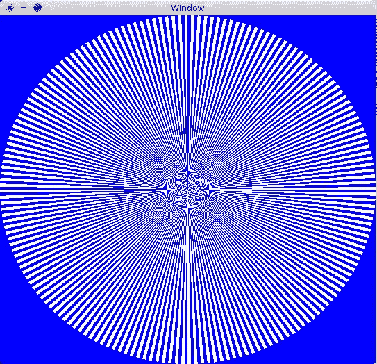

等一下…现在，这看起来不像一个完整的圆。我们可以从原点清楚地看到三角形之间的区别。更不用说渲染出来的这些诡异的神器了。看起来我们最初对三角形的想法没有意义。

让我们回头看看三角形图元选项，我们有两个选项:

1.  **三角形** —为每个独立的三个一组的点栅格化一个三角形
2.  **triangleStrip** —为每三个相邻的三连点光栅化一个三角形

如果我们把图元类型从三角形改成 **triangleStrip** 会怎么样？

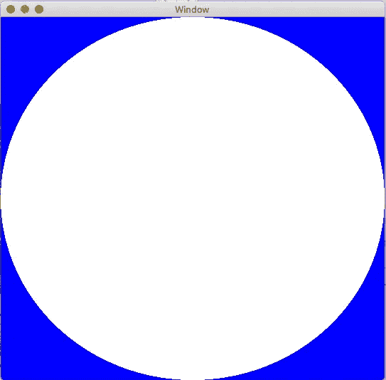

我们现在有一个完整的圆圈，万岁！我们已经用我们创建的点绘制了更多的三角形，基本上缩小了差距。

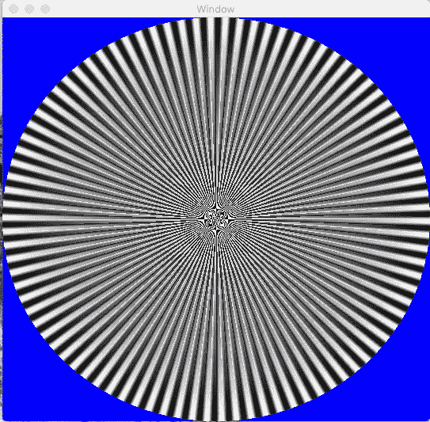

如何使用另一种颜色用更多三角形填充间隙的直观表示

为了将所有这些联系在一起，我们的 MetalCircleView 类应该如下所示:

我的 Github 上的完整源代码[在这里](https://github.com/barbulescualex/MetalCircle)。

# 剩下的问题:视窗

此时，您应该想知道为什么这个圆会随着窗口缩放和拉伸。请记住，我们已经将我们的金属视图限制在我们的窗口中，所以改变它会延伸我们的“标准化”2D 坐标空间。如果你还记得在“创建我们的顶点”部分，我们看到标准化的坐标空间被映射到我们的`[MTLViewPort](https://developer.apple.com/documentation/metal/mtlviewport)`。

有两种方法可以解决这个问题:

1.  约束 MTKView，使其 width == height(比率或硬编码值)。
2.  在 draw 函数中的 renderEncoder 上设置视口。

这就引出了本教程的最后一部分:)

# 从这里去哪里

我们刚刚创造了第一个金属圈！我们学习了如何使用金属的基础知识(设置我们的渲染管道)，使用着色语言(金属着色语言)，学习了 GPU 如何绘制，并绘制了我们的第一个图元来制作一个圆！

我建议的下一步是:

1.  在 metal 函数中向 vertexArray 传递更多的字段。回想一下我们选择只用一个字段来表示顶点的时候。尝试将顶点作为带有颜色字段的结构传入。
2.  将缓冲区数据传递给片段着色器函数。
3.  在一个渲染过程中绘制更多的形状。
4.  通过使视图重绘自身，在 MTKView 的 drawableSizeWillChange 委托方法上设置视区。

我希望你喜欢这个不那么简单的金属介绍:)。完整的项目可以在我的 GitHub 页面[这里](https://github.com/barbulescualex/MetalCircle)找到。

另外，请查看本系列的下一篇教程！

[](https://medium.com/@barbulescualex/audio-visualization-in-swift-using-metal-accelerate-part-1-390965c095d7) [## 使用 Metal & Accelerate 在 Swift 中实现音频可视化(第 1 部分)

### 我们都见过各种形式的音频可视化，但是我们如何在 Cocoa 应用程序中实现呢？

medium.com](https://medium.com/@barbulescualex/audio-visualization-in-swift-using-metal-accelerate-part-1-390965c095d7)