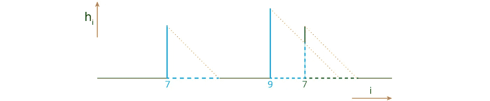

# 可视化管理器算法

> 原文：<https://betterprogramming.pub/manacher-algorithm-visualized-17a7df7feded>

## O(n)中最长的回文子串

计算机科学中最漂亮的算法之一，它展示了如何从缓慢的 O(n)到高速的[O(n)获得巨大的加速，只要从不同的角度看问题。](https://www.bigocheatsheet.com/)

任务是找到恰好是回文的最长子串。例如，“分数从不奇数或偶数”中最长的回文是“从不奇数或偶数”，(忽略字母大小写和空格)。在生物化学上有实际应用( *GAATTC* 和 *CTTAAG* 称为[回文序列](https://en.wikipedia.org/wiki/Palindromic_sequence))。是典型的[面试任务](https://leetcode.com/problems/longest-palindromic-substring/)。

最直接的方法(同时也是最慢的方法)是迭代所有的开始和长度，检查相应的子串是否是回文:

到目前为止，让我们专注于奇数大小的回文，稍后我们将推广到偶数大小的回文。

伪代码

`loop over substring start:
__loop over substring length:
____loop over letters in substring`

明确表示它是一个 O(n)方法(其中 n 是文本的长度)，这是一个快速增长的函数。

如果我们不是在开始循环，而是在中间循环，我们将能够重用前面步骤的结果。

例如，如果我们知道“eve”是一个回文，我们只需要再做一次比较就能知道“level”也是一个回文。在第一种方法中，我们必须从头开始重新运行整个检查。

`loop over substring middle
__loop over substring length`

这个是 O(n)。但是有⁴方法允许做得更快。

其中最优雅的是 Manacher algorithm⁵.它基于上述的 O(n)方法，但是它引入的启发式算法将时间复杂度降低到 O(n)。

当文本中的回文相距较远时，这里就没有什么可优化的了。已经是 O(n)了。当它们重叠时，问题就出现了，最坏的情况是一个文本由一个字母组成。

考虑以下情况。算法找到了较短的绿色回文，较长的蓝色回文，并在字母‘I’处停止:

底部的数字是中间在这个位置的回文的最大半长。

仔细观察图像可以发现，确实没有必要处理蓝色回文右半部分的偏移量。根据定义，它是左半边的镜像，所以我们从左半边收集的所有信息都可以“免费”反射到右半边:

案例 A

然而，这并不是唯一可能的重叠情况。在下图中，绿色回文跨越了蓝色回文的边界，因此其长度必须相应缩短:

案例 B

同样，没有必要仔细检查反射回文的长度:字母 b 和 x 必须不同，否则蓝色回文会变长。

最后，一个回文可以从内部触及另一个。在这种情况下，不能保证反射的回文不会进一步增长，所以我们只能得到其长度的一个下限:

案例 C

理想情况下，我们应该在进一步的处理中跳过零和严格的非零(=除了最后一种情况之外的所有情况)(下面的清单 1)。但是在实践中(如果可以在这样一个抽象的问题中谈论实践的话)，这里≥和=之间的差别是如此之小(只是一个额外的比较)，为了代码简洁和可读性，将所有非零值都视为≥是有意义的(清单 2)。

该算法的一个可能的 python 实现是:

清单 1。冗长的解决方案。

首先，它试图找到如上所述的相关反射。然后，如果必要的话，进行顺序搜索:就像在 O(n)算法中一样，但是将反射值作为起点。最后，如果新的回文比前一个最右边的回文更靠右，它将被选为新的最右边的回文。

这个函数只查找奇数大小的回文。为了使它同样适用于偶数大小的回文，一种常见的方法是:
–在原始文本的字母之间插入一个任意字符，例如`‘noon’ -> ‘|n|o|o|n|’`，
–在那里找到奇数大小的回文，最后，
–从结果中去掉这些字符。

字符“|”不需要从字符串中消失。任何角色都可以。

稍微模糊的版本(更难理解，稍微慢一点，但是更短)看起来像

清单 2。较短的解决方案。

从代码中可以看出，有两个嵌套循环。这里有一个直觉，为什么这个方法不需要 O(n)。在下图中，`h`数组是可视化的。

外环对应于水平运动，内环对应于垂直运动。每一步都是一次比较。实线代表计算步骤，虚线代表跳过步骤。

从图中可以明显看出，当回文不重叠时，向上的步数等于跳过的水平步数。对于重叠的回文，稍微做作一点，但是如果统计向上的总步数，又会和跳过的水平步总数重合。所以总的步骤数受到`2n`比较的限制。它不是`n`,因为与垂直步骤不同，要理解一个水平步骤被跳过，您仍然需要做一些工作(尽管可以进一步微调实现，以在恒定时间内跳过一批步骤)。因此，总时间为 O(n)。

Manacher 算法允许使用非常直观的方法在线性时间内找到字符串中最长的回文(事实上，不仅仅是最长的一个，而是每个可能中心的最长回文),最好用视觉描述。

## 参考

1.  [Big-O 小抄](https://www.bigocheatsheet.com/)，网站。
2.  [回文序列](https://en.wikipedia.org/wiki/Palindromic_sequence)，维基文章。
3.  [最长回文子串](https://leetcode.com/problems/longest-palindromic-substring/)，Leetcode 问题。
4.  [最长回文子串](https://en.wikipedia.org/wiki/Longest_palindromic_substring)，维基百科文章。
5.  Manacher，Glenn (1975)，“一种新的线性时间”在线“寻找一个字符串的最小初始回文的算法”，[*ACM 杂志*](https://en.wikipedia.org/wiki/Journal_of_the_ACM) *。*