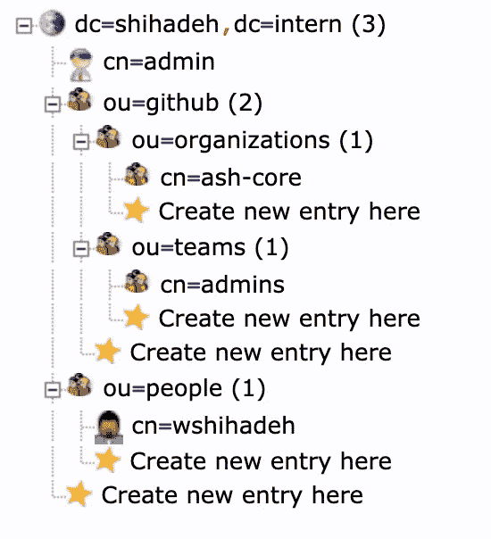

# 使用 LDAP 管理 GitHub 权限

> 原文：<https://betterprogramming.pub/manage-github-permissions-with-ldap-7aa80d2bace7>

## 将 LDAP 数据同步到 GitHub 帐户以管理用户访问权限


在 [Unsplash](https://unsplash.com?utm_source=medium&utm_medium=referral) 上由 [Brina Blum](https://unsplash.com/@brina_blum?utm_source=medium&utm_medium=referral) 拍摄的照片

Github 是一家使用 Git 进行软件开发和版本控制的互联网托管提供商。它使我们能够在云上托管 git 存储库，并管理这些存储库的访问控制。不幸的是，没有与 LDAP 服务器的本地集成作为授权数据的来源。

在这篇文章中，我将介绍一些可用的选项来同步 LDAP 数据和 GitHub 帐户。

# **第一种选择:使用现有工具**

幸运的是 Github 发布了一个[工具](https://github.com/github/github-team-sync)来管理 LDAP 数据同步。您可以在组织级别上将该工具安装为 Github 应用程序。下面简要介绍了配置应用程序以成功同步数据所需执行的步骤。

*   该工具必须在您的基础设施上托管和部署，并访问您的 LDAP 服务器。
*   您需要公开暴露工具 API，以允许 Github 调用 webhook URLs。
*   您需要创建一个 GitHub 应用程序。
*   用 Github app 设置(id 和私钥)配置工具。
*   最后，您应该在 GitHub 组织上安装创建的应用程序。

您可以在 GitHub 资源库中找到关于应用程序部署过程的更多信息。可以将该应用程序部署为 docker 容器或 Kubernetes pod。但是，您需要构建定制的 docker 映像来包含应用程序私钥或通过 Docker 卷映射它。

这个选项最大限度地减少了在 LDAP 和 GitHub 组织之间同步数据的工作量。然而，它有几个缺点:

*   工具的 API 需要公开。
*   该应用程序有一些限制。例如，它不发送用户邀请。

出于这些原因，我决定探索构建一个自定义脚本来将 LDAP 数据同步到 Github。

# **第二种选择:使用自制应用**

我想探索在这个阶段编写同步数据的脚本的复杂性。下面是对应用程序初始要求的简要描述。

*   该脚本应该向组织和团队发送用户邀请。
*   一旦用户在 LDAP 中不存在，该脚本将从组织中删除用户。
*   该脚本应该管理团队和团队成员。
*   在 LDAP 中，用户是使用组织单位来构建的，如下图所示**。**



## **第一步，部署 LDAP 服务器。**

团队和权限的真实来源是 LDAP 服务器。因此，我们需要部署一个具有预期结构的 LDAP 服务器。我们可以使用 docker 容器和 docker-compose 快速完成这项任务。您可以按照下面的说明在本地部署服务器。

这篇博文提供了关于构建 LDAP docker 映像的更多信息。

[](/ldap-docker-image-with-populated-users-3a5b4d090aa4) [## 构建一个由用户填充的 OpenLDAP Docker 映像

### 具有预定义对象资源的 Docker 图像

better 编程. pub](/ldap-docker-image-with-populated-users-3a5b4d090aa4) 

首先，将下面的代码片段保存在一个名为。`docker-compose.yaml`

然后，使用以下命令在本地部署 LDAP 服务器:

```
$> docker-compose up -d
```

部署服务后，LDAP 服务器将在以下 URL 上可用:`[http://127.0.0.1:389](http://127.0.0.1:389./)`。

此外，您将能够浏览 LDAP 服务器，查看其资源，并通过连接到以下 URL `[http://127.0.0.1:](http://127.0.0.1:389./)8090`来创建新的资源。

*   用户名:`cn=admin,dc=shihadeh,dc=intern`。
*   密码:`test1234`。

## **第二步，与 LDAP 服务器通信**

因为 LDAP 服务器是信息的来源，所以我们需要与服务器通信，并从中提取所需的数据。大多数编程语言都有 LDAP 客户端库，这使得开发人员更容易与 LDAP 通信。

我开始寻找用 Ruby 编写的 LDAP 客户端库(因为我计划用 Ruby 编写应用程序)，我发现了一些 Ruby 的精华:

*   `NET::LDAP`:LDAP 客户端访问 LDAP。它为 LDAP 服务器提供了一个低级接口。
*   `Activeldap`:面向对象 LDAP 接口的 ruby 库。它依靠`NET::LDAP` gem 为 LDAP 服务器提供面向对象的接口。

我决定使用`Activeldap`宝石，因为它更简单。

安装完这个库之后，我需要开始编写代码来使用这个库连接到 LDAP。我需要实现三个主要部分

*   包括该库所需的所有依赖项。在这种情况下，只有`NET::LDAP`和`Activeldap`。我包含了`NET::LDAP`库，因为它是`Activeldap`库的依赖项。
*   为了与 LDAP 服务器通信，我们需要创建一个模型用来查询 LDAP 数据的连接对象。您需要向`ActiveLdap::Base.setup_connection`方法提供 LDAP 配置，以便能够建立连接。
*   定义所需的 LDAP 数据模型。`Activeldap`库使我们能够定义数据模型，然后使用定义的模型以面向对象的方式查询 LDAP。

要定义数据模型，您需要从`ActiveLdap::Base`基类创建一个类。然后，您需要在模型类中指定以下项目。

*   `ldap_mapping`:这是您需要为每个模型类定义的唯一必需的方法。您可以使用此方法来指定模型类如何与关联的 LDAP 对象相关联。
*   `has_many`:您可以使用这个方法来定义模型类之间的关联，其中一个类有许多来自另一个类的对象。例如，一个团队类对象将有更多的用户对象。
*   `belongs_to` : 您可以使用此方法以相反的顺序定义模型类之间的关联。例如，一个用户属于一个或多个团队。

您可以在`Activeldap.`的[官方页面](https://activeldap.github.io/activeldap/en/file.tutorial.html)上找到更多关于如何定义数据模块的信息

下面是我为定义数据模型和与 LDAP 服务器通信而编写的完整脚本。

# **第三步，更新 GitHub 组织**

与 LDAP 一样， [Github API](https://docs.github.com/en/rest) 也有 ruby 客户端库，开发者可以使用它们与 API 进行交互。Octokit 库是最好的 Github API 客户端库之一。

很遗憾，此库不支持为组织发送邀请。然而，由于我使用的是 Ruby，所以很容易扩展现有的库。因此，我的第一个任务是通过支持创建组织邀请来扩展 [Octokit](https://github.com/octokit/octokit.rb) 库。幸运的是，Github API 提供了邀请用户加入组织的 POST 方法。我实现了下面的函数来扩展 [Octokit](https://github.com/octokit/octokit.rb) 库的功能并支持发送用户邀请。

接下来，我需要在 Github 帐户上创建一个个人令牌，并配置 [Octokit](https://github.com/octokit/octokit.rb) 库来使用该令牌与 Github 通信。下面的代码片段展示了如何用 Github 令牌配置 [Octokit](https://github.com/octokit/octokit.rb) 库并创建客户端对象。

在这个阶段，我设法定义了 LDAP 模型来创建 Github API 客户端，现在是时候开始实现 sync 应用程序的业务逻辑了。

我想实现的第一个特性是将所有组织上的用户从 LDAP 同步到 GitHub 帐户。我通过执行以下算法完成了这项任务。

*   遍历所有 LDAP 组织。
*   为每个组织获取 LDAP 中定义的所有用户和 GitHub 帐户中指定的所有用户。
*   比较 LDAP 用户和 GitHub 用户。
*   为还不是 GitHub 用户的 LDAP 用户发送组织邀请。
*   删除不再拥有 LDAP 帐户的 Github 用户。

下面的代码片段显示了用于实现同步算法的 ruby 代码。

下一个特性是同步 GitHub 团队及其成员。此任务比第一个任务更复杂，因为它需要执行以下操作:

*   在 Github 上为 LDAP 中定义的每个团队创建团队。
*   如果 Github 团队不再有关联的 LDAP 团队对象，则删除它们。
*   基于 LDAP 数据更新 Github 团队。

我写了下面的代码片段来实现所需的同步功能。代码按照下面的步骤同步 LDAP 和 GitHub。

*   遍历 LDAP 上定义的所有组织。
*   计算需要添加到 GitHub 的团队和需要移除的团队。
*   更新 GitHub 团队。
*   迭代所选组织的所有 Github 团队。
*   计算需要加入团队的成员和需要移除的成员。
*   更新 GitHub 团队成员。

# 结论

虽然 Github 不支持作为组织成员和团队来源的与 LDAP 服务器的原生集成，但是可以同步 LDAP 和 Github。

您可以使用市场上现有的应用程序之一，例如 G [itHub Team Sync](https://github.com/github/github-team-sync) ，或者使用 LDAP 和 GitHub 客户端库实现一个新的应用程序来同步数据。