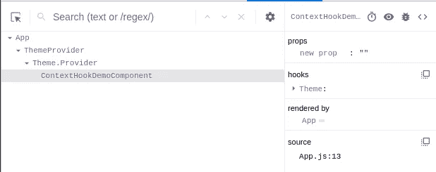
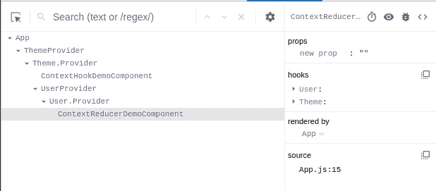

# 如何使用上下文挂钩管理 React 状态而不使用 Redux

> 原文：<https://betterprogramming.pub/manage-react-state-without-using-redux-and-using-context-hooks-8c4e7a2d7d1d>

## 如何从你的应用中删除 Redux

由[布鲁克·安德森](https://unsplash.com/@brookanderson?utm_source=medium&utm_medium=referral)在 [Unsplash](https://unsplash.com?utm_source=medium&utm_medium=referral) 拍摄的照片。

基本上，我们在应用程序中使用 [Redux](https://redux.js.org/) 进行状态管理。它帮助我们以更好的可视化来调试状态。但是，它会影响应用程序的性能，因为我们需要编写动作、reducers 等。它增加了组件的渲染器。redux 的主要缺点是它的文件大小，因为我们需要使用 Redux、react-redux、redux-thunk 等。

让我们从钩子部分开始。钩子是 React 上预定义的方法。它们速度快，重量轻，不需要使用额外的库。React 钩子是在 React 16.8 中引入的，但是很多开发者还是不熟悉。

注意:钩子只能在函数组件中使用。

# 反应挂钩示例

让我们创建一个状态挂钩，我们将在其中管理单个状态:

上面的例子是简单的状态管理。要了解关于钩子生命周期的更多信息，请参见下面的文档:

 [## 使用效果钩-反应

### 钩子是 React 16.8 中的新增功能。它们允许您使用状态和其他 React 特性，而无需编写类。的…

reactjs.org](https://reactjs.org/docs/hooks-effect.html) 

我们的例子不会解决在组件之间传递状态的问题。React 使用上下文来解决这个问题，但是对于钩子，上下文不同于类组件。上下文可以使用使用 props 的类组件。

# 带有状态挂钩的 React 上下文示例

让我们创建一个上下文，并在挂钩中使用它:

已经为主题创建了上下文和挂钩。现在我们将在组件中使用这些:

然后我们可以在子组件中使用钩子:

在这里，你可以看到开发工具中的主题挂钩。

# 带有 Reducer 挂钩的 React 上下文示例

在这个例子中，我们使用了使用 React 钩子的上下文。它非常简单并且易于维护，但是如果我们有大量的数据(例如，一个有许多键的对象)，将它存储在状态钩子中并不是一个好主意，因为如果你忘记一个键来设置状态，它可能会破坏你的应用程序。React 有 reducer 钩子来维护钩子中的大量数据。

注意:不能同时使用 state 和 reducer 挂钩。

让我们创建一个用户上下文来存储用户详细信息、登录状态、令牌等。

在上面的文件中，我们已经用一个 reducer 创建了用户上下文。让我们在组件中使用它。首先，我们需要在父组件中使用提供者:

现在我们可以在子组件中使用`useUser` 钩子:

现在，您可以在组件中看到用户和主题挂钩。

# 结论

我希望你理解这个例子。我在下面附上了 GitHub 回购链接。克隆它并在您的本地系统上运行它，这样您可以更好地理解它。

 [## Santa NUP/Manage-React-state-without-using-Redux-and-using-Context-hooks

### 这个项目是用 Create React App 引导的。在项目目录中，您可以运行:在…中运行应用程序

github.com](https://github.com/santanup/Manage-React-state-without-using-Redux-and-using-Context-hooks)