# 使用 Xcode 配置文件管理 iOS 应用程序中的机密

> 原文：<https://betterprogramming.pub/manage-secrets-in-your-ios-app-using-xcode-configuration-files-fbceb6e97f47>

## 保护您的 API 密钥和其他敏感数据

Dmitry Chernyshov 在 [Unsplash](https://unsplash.com?utm_source=medium&utm_medium=referral) 上拍摄的照片。

在本文中，我们将学习如何使用 Xcode 配置文件(`.xcconfig`)管理 iOS 应用中的 API 键等敏感数据。这是我们将在本教程中掌握的内容:

*   如何创建 Xcode 配置文件？
*   如何从 Swift 代码中的配置文件访问 API 密钥。
*   如何运行和管理不同的生成配置。

# 我们开始吧

考虑这个名为“ManagingSecrets”的空项目，它还不包含任何内容:

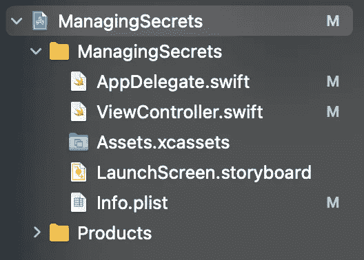

我们的目标是保护一个 API 密钥，并在一个`ViewController.swift`文件中访问它。首先，让我们创建一个配置设置文件。点击文件>新建，并在搜索字段中输入“配置”:

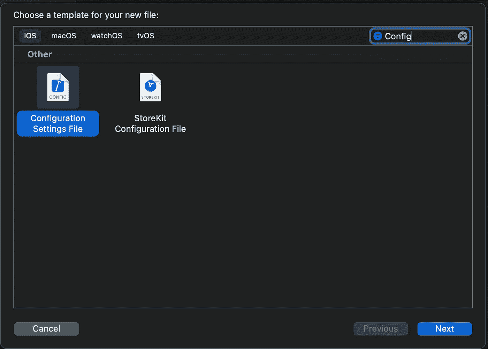

现在，选择“下一步”，并将文件命名为`Secrets.xcconfig`(不要将该文件附加到目标上):

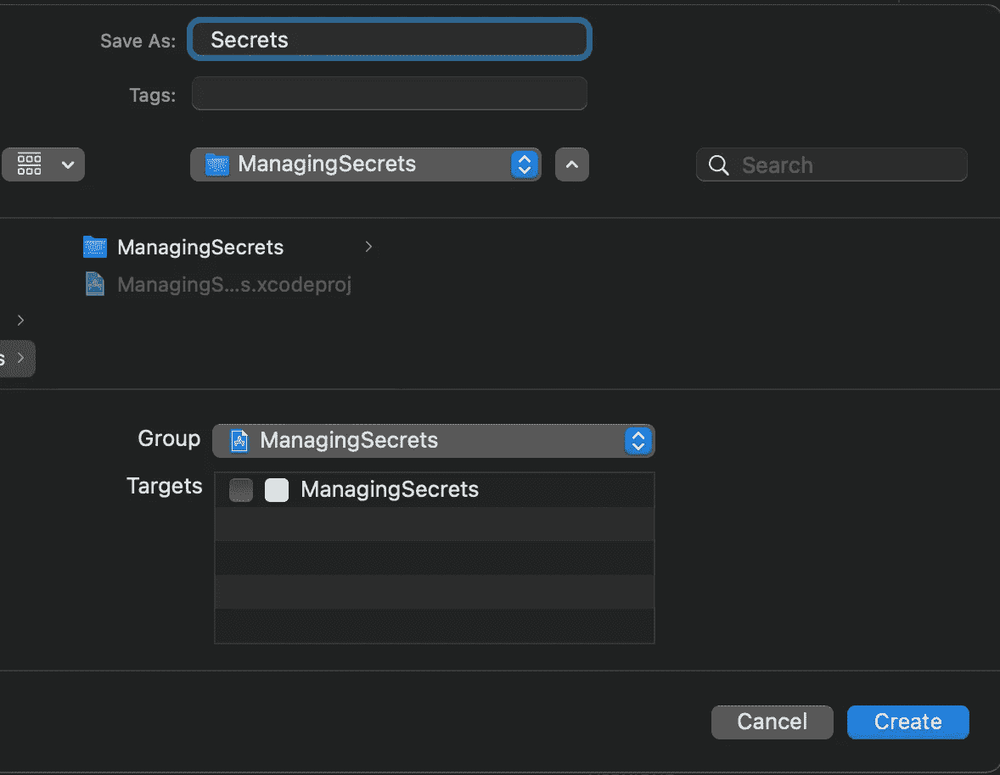

现在我们可以打开文件并添加我们的 API 密钥:

太好了！我们的 API 密钥已经添加。现在让我们点击项目，选择“信息”选项卡，并展开*调试*和*发布*配置:

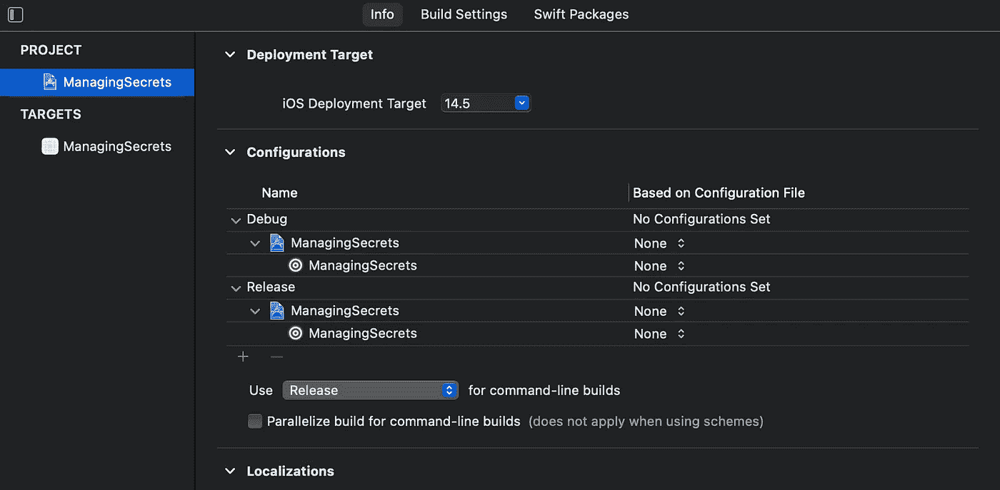

下一步是将`Secrets.xcconfig`文件附加到每个配置，如下所示:

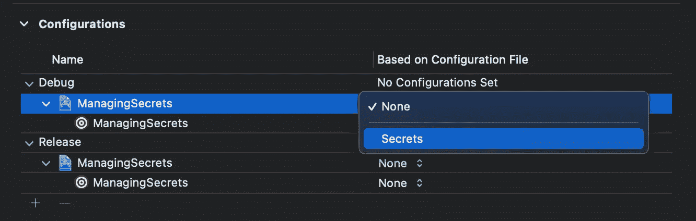

完成后，配置如下所示:

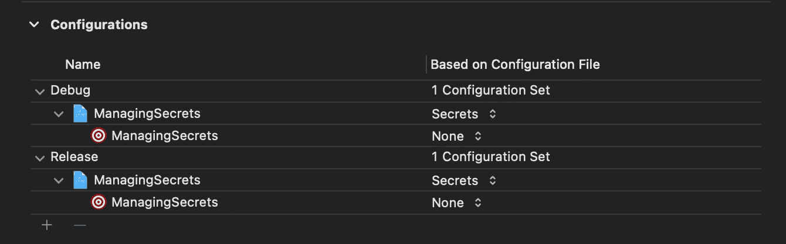

在实际访问代码中的 API 键之前，我们需要做的最后一步是用一个新的`API_KEY`字段更新我们的`Info.plist`:

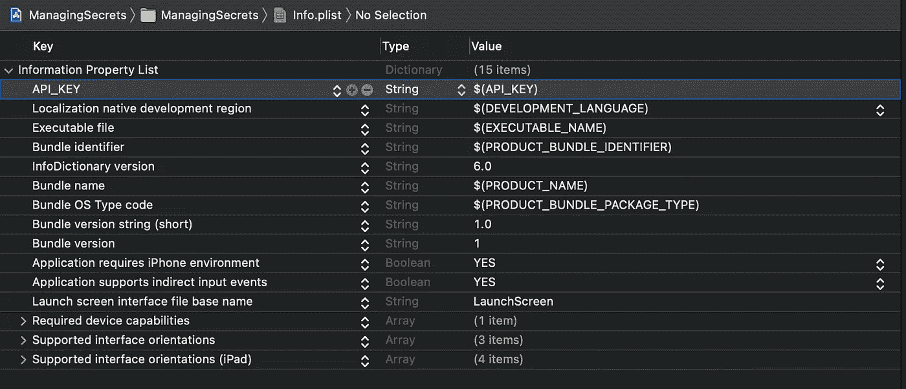

最后，我们准备在`ViewController.swift`文件中获取我们的 API 密钥。让我们按如下方式更新`viewDidLoad()`方法:

1.  我们在`Info.plist`文件中搜索`“API_KEY”`值。
2.  我们确保密钥不为空。
3.  如果是空的，我们就打印一条消息。
4.  否则，我们打印找到的 API 密钥。

如果我们构建并运行该应用程序，我们将会看到如预期的那样打印出 API 密钥:

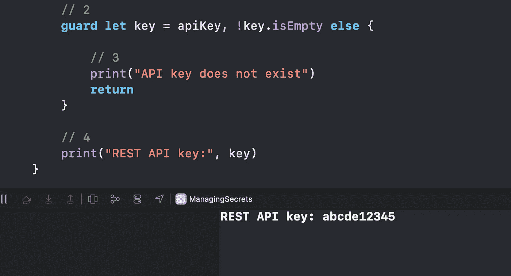

这很好，但是我们如何为`Debug`和`Release`配置创建不同的 API 键呢？事实证明这非常容易，您将能够忘记每次在调试和生产服务器 API 之间切换时手动更改硬编码的字符串。

# 管理不同的配置

我们只需要创建两个不同的`.xcconfig`文件，即`SecretsDebug.xcconfig`和`SecretsRelease.xcconfig`:

每个文件包含不同的`API_KEY`:

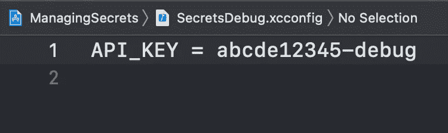

SecretsDebug.xcconfig

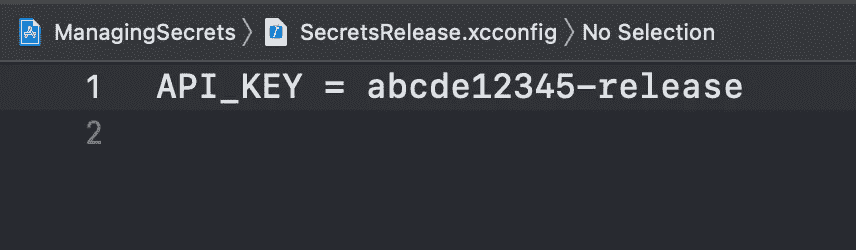

SecretsRelease.xcconfig

接下来，我们应该将`SecretsDebug.xcconfig`分配给`Debug`配置，将`SecretsRelease.xcconfig`分配给`Release`配置:

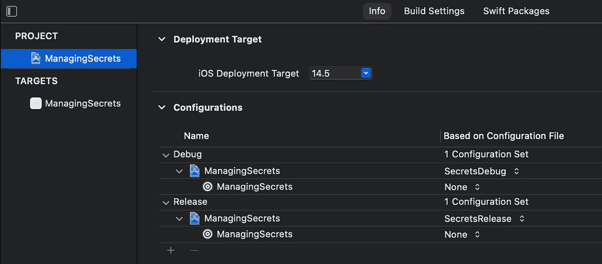

我们的`Info.plist`不变。它只是引用当前活动配置文件中的`API_KEY`值:

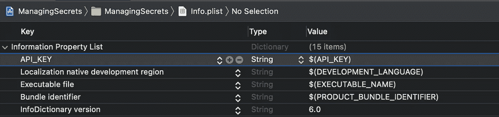

默认情况下，当我们在 Simulator 中运行应用程序时，会选择一个`Debug`配置:

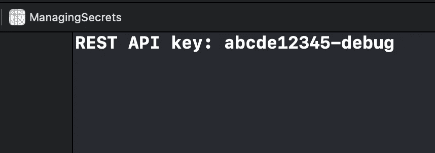

要切换到`Release`配置，我们需要做的就是改变我们应用的方案:

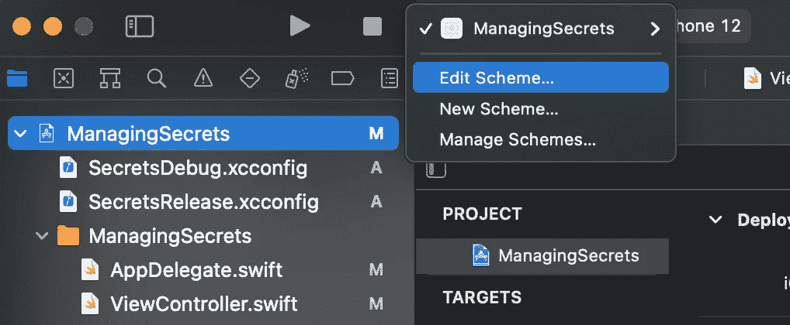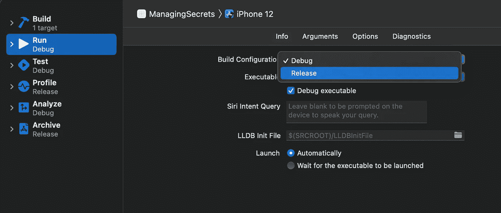

如果我们构建并运行应用程序，我们会看到使用了 API 密钥的发布版本:

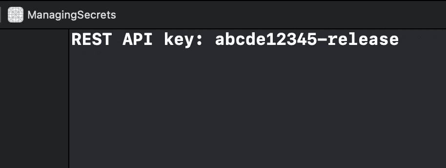

太好了！我们设法方便地使用不同的 API 键，而不改变我们代码库中的一个`String`。

*注意:一定要记住将这些* `*Secret.xcconfig*` *文件置于版本控制之外。只需将它们包含在您的* `*.gitignore*` *文件中，您就可以避免将您的敏感数据泄露给其他人。即使你在一个团队中工作，其他开发人员也会使用他们自己的本地* `*.xcconfig*` *文件来保存这些秘密。*

# 包扎

为了更深入地了解这种管理环境的方法和使用不同目标的方法之间的区别，我建议看一看[这篇由](/how-to-create-development-staging-and-production-configs-in-xcode-ec58b2cc1df4)[斯文·科塞特](https://medium.com/u/888a93a11b2d?source=post_page-----fbceb6e97f47--------------------------------)撰写的伟大文章。

我希望这个教程对你有用。感谢阅读！