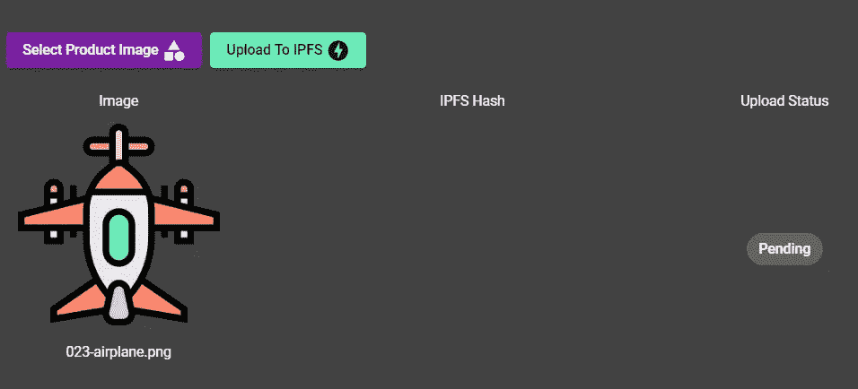
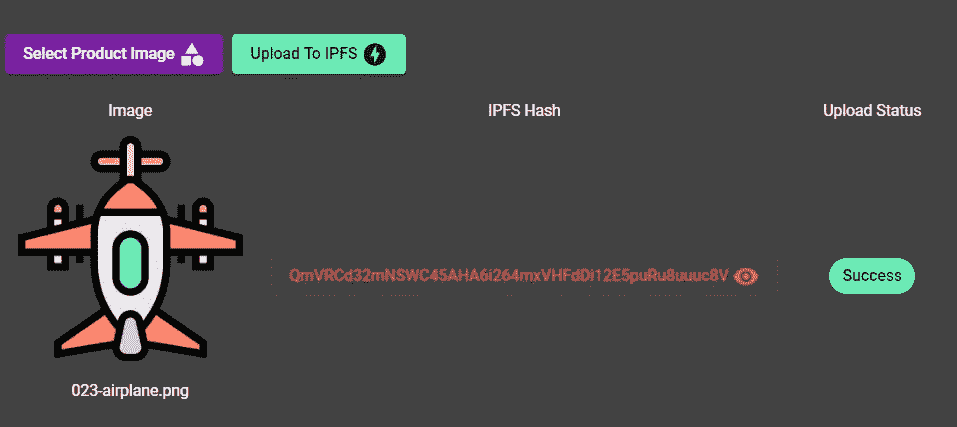
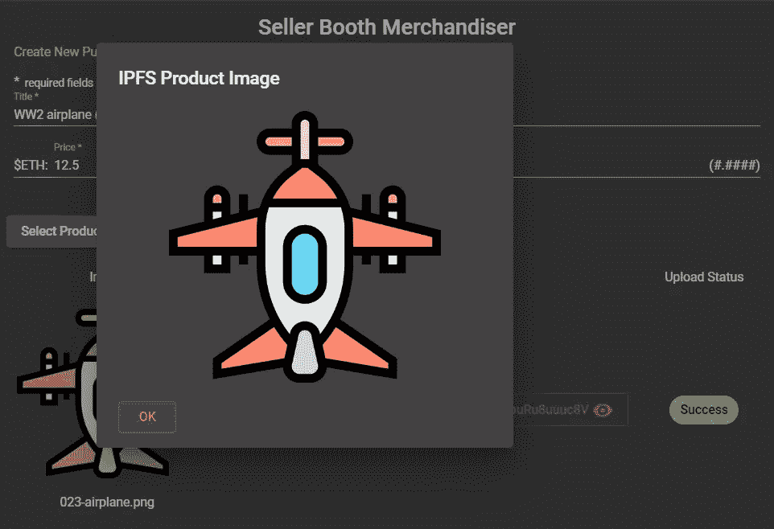

# 使用 Angular NgRx v8 管理 IPFS 图像上传

> 原文：<https://betterprogramming.pub/manage-the-ipfs-image-uploading-with-angular-ngrx-v8-61aaaf0be0d5>

## 本系列的第三部分展示了我们如何为 **FleaMarket** 智能合约构建 NgRx 供电的 DApp


图片来自 [Pixabay](https://pixabay.com/?utm_source=link-attribution&utm_medium=referral&utm_campaign=image&utm_content=2750995) 的[斯蒂芬·凯勒](https://pixabay.com/users/KELLEPICS-4893063/?utm_source=link-attribution&utm_medium=referral&utm_campaign=image&utm_content=2750995)

这篇文章是我们的博客系列第二部分的延续，在那里我们演示了如何将我们的 DApp 连接到运行在 Infura 上的 IPFS 节点。在本文中，我们将重点关注由 NgRx 支持的 IPFS 图像上传功能的编码。

# 更新到 8️版本

首先将我们的 FleaMarketDApp 项目升级到最新的 Angular 版本 v8。

`ng update @angular/cli @angular/core @angular/material`

我们希望确保使用 Node.js 版本 12 或更高版本，并安装必要的工具来编译本地节点模块。

我们还需要将 NgRx 库更新到它的最新版本 v8。

为了启用惰性路由的动态导入，我们必须在`tsconfig.json`文件中将`module`编译属性设置为值`esnext`:

```
"compilerOptions": {
  "baseUrl": "./",
  "outDir": "./dist/out-tsc",
  "sourceMap": true,
 ** "module": "esnext",**
   ....
```

这个版本中包含的一个很酷的[特性](https://next.ngrx.io/guide/migration/v8)是所有的特效在出错时会自动恢复。

# IPFS 属地

为了与 IPFS 网络交互，我们需要安装 [IPFS HTTP 客户端库](https://github.com/ipfs/js-ipfs-http-client):

```
npm install ipfs-http-client
```

我们需要创建一个定制的 Webpack 配置文件来告诉 Angular 在编译中包含加密的`node`模块。首先安装自定义 Webpack 生成器:

`npm install -save-dev @angular-builders/custom-webpack`

** * *注意:在 Angular v8 中我们不再需要安装* `*@angular-builders/dev-server*` *包⚠️****

然后，我们使用以下上下文向项目添加一个`extra-webpack.config.js`文件:

我们修改了`angular.js`文件以包含定制构建器:

# IPFS 文件上传服务

让我们创建一个服务`IpfsDaemonService`，它将处理从 IPFS Infura 网络上传和检索文件的逻辑:

在服务构造函数中，注入实例化全局对象`IpfsHttpClient`的`ipfsToken`，该全局对象负责连接到 Infura 运行的 IPFS 节点:

在服务的第一个方法中，我们向 IPFS 添加一个图像文件。它接受文件对象及其名称，并在成功执行后返回存储文件的散列。第二种方法是从 IPFS 读取图像文件。它接受散列参数并返回图像 blob 对象。

我们将原始缓冲流编码为 base64 编码的字符串。然后我们通过使用`HttpClient`和设置为“blob”的`responseType`选项来等待图像 blob 被返回。布莱恩·洛夫的这个[想法](https://brianflove.com/2017/11/02/angular-http-client-blob/)值得称赞。

# 播种功能模块

IPFS 文件上传逻辑负责存储和检索卖方的产品图像。图像文件的散列码存储在`SafeRemotePurchase` 智能契约的`ipfsHash`状态变量中。将该功能捆绑到功能模块`SellerBoothModule.`中是很自然的

在上面的代码中，我们使用新的`import()`语法来声明惰性加载路径。这个功能是 Angular v8 中引入的。

现在让我们把注意力转向在特征模块`SellerBoothModule`中注册的组件`PurchaseContractComponent`:

这是一个智能组件，除了其他功能之外，它还为以下各项提供用户界面:

*   图像预览
*   上传图像到 IPFS
*   基于散列码从 IPFS 检索图像文件

让我们进一步看看其中的每一项。

# 图像预览

该组件的模板包括按钮“*选择产品图片*”，让我们在上传到 IPFS 之前预览图片。为了连接预览逻辑，我们使用角度材料反应上传表单。图像文件存储在组件变量`fileBlob`中。



# 将图像文件上传到 IPFS

由我们的特征库管理的状态接口定义如下:

```
export interface State {
   status: FileUploadStatus;
   ipfsHash: string | null;
   imageBlob?: Blob;
}
```

要启动上传过程，用户需要点击标记为*“上传到 IPFS”*的按钮，在我们选择图像文件后，哪个会变为活动状态。这触发了存储动作类型`[IPFS/Image] Upload`，该类型在其有效负载中携带变量`fileBlob`的值。该动作将被分派到专用商店效果`uploadFile$`，该商店效果只监听这种类型的动作:

让我们仔细看看这个效果里面的逻辑。我们使用`exhaustMap` 操作符从动作负载中接收`File`对象。在这种情况下，使用这个映射操作符的优点是，它将忽略后续的文件上载请求，而当前的请求仍在进行中。然后，我们将该值传递给`IpfsDaemonService.`中的`addFile`方法。在成功执行该方法后，我们使用`map` 操作符将接收到的哈希值投射到`[IPFS/Image] Upload Success`动作。该操作将触发由我们的功能存储管理的以下事件链:

1.  携带 IPFS 映像散列有效载荷的动作被分派给相应的缩减器
2.  减速器将用新值更新状态属性`ipfsHash`和`status`
3.  观察这些状态变化的存储选择器将设法相应地更新组件模板



# 从 IPFS 检索图像

一旦产品图片上传到 IPFS 网络上，我们想确保我们可以使用它的散列来检索它。

我们的智能模板组件中有一个按钮，当`ipfsHash$`选择器发出一个哈希值时，该按钮变得可见。让我们看看当我们点击它时会发生什么:



点击按钮触发组件`ShowIpfsImageComponent`中定义的材料对话框:

在组件内部，我们声明了返回 blob observable 的方法`checkStore`。该方法检查状态属性`imageBlog`的`getImageBlob`选择器。如果该值尚未设置，该方法将分派`'[IPFS/Image] Load Image'`动作来将请求广播到效果`loadFile$`:

hash 属性的当前值从存储中取出，并作为参数传递给服务方法`getFile`。该方法使用从 IPFS 节点检索的`image: Blob`值进行解析。然后我们将它送回商店。减速器相应地更新状态属性`imageBlob` 。新值将立即被`getImageBlob` 选择器拾取，并首先使用`checkStore`方法，然后使用`tap`操作符通过管道向下传递:

```
this.image$ = this.checkStore().pipe(
   tap((blob) =>
this.image.nativeElement.src =          this.windowRef.URL.createObjectURL(blob)));
```

在操作符`tap`中，我们使用模板引用变量`#ipfsImage`将斑点图像连接到模板``本地元素中。

这种方法的最大好处是，我们现在可以控制从 IPFS 节点接收的图像二进制流。

# 结论

🐯谢谢大家！请继续关注本博客系列的其他作品。

# 参考

*   [建筑以太坊 DApp 用有角的、有角的材料和 NgRx](https://www.amazon.com/dp/B085B918LG) ，*可用*[*http://www.amazon.co.uk/kindlestore*](http://www.amazon.co.uk/kindlestore)*2020 年 3 月 5 日*)作者 [Alex Yevseyevich](https://medium.com/u/4f27e57aa12a?source=post_page-----61aaaf0be0d5--------------------------------)

我用于商品图片的那套图标是由[www.flaticon.com](https://www.flaticon.com/)的[桉树](https://www.flaticon.com/authors/eucalyp)制作的，由授权 [CC 3.0](http://creativecommons.org/licenses/by/3.0/)

👍特别感谢我的儿子丹尼尔·叶夫谢维奇审阅了这篇文章。