# 使用多普勒管理您的 AWS 秘密

> 原文：<https://betterprogramming.pub/manage-your-aws-secrets-with-doppler-c0675f1d591f>

## 创建一个 lambda 函数，将其与 API 网关集成，并存储生成的令牌


# 摘要

密码、密钥或标识是使用最广泛的工具，也是组织用来验证应用程序和用户的最重要的工具之一，为他们提供敏感的系统、信息和服务。因为机密必须安全地传输，所以机密管理必须考虑并减轻这些机密在传输中和静态时面临的风险。

# 目标

在本教程中，我们将创建一个简单的 lambda 函数，

我们还将创建一个注册表单屏幕，使用 AWS cognito 的登录屏幕，以及来自 AWS 的 API 网关。

这个应用程序将包含重要的信息，如 JWT 令牌，我们希望保持安全，所以我们可以学习如何管理多普勒令牌。

# 为什么是秘密管理

令牌、密码和密钥是最广泛使用的身份验证形式，用于在用户和其他异步应用程序可以访问应用程序上的任何其他服务或收集他们需要的任何敏感信息之前对其进行身份验证。

尽管如此，黑客仍在寻找他们可以不时利用的系统，并且为了帮助您或您工作的组织节省一些钱，与您的应用程序有关的所有秘密都必须安全地存储。

# 多普勒作为秘密管理解决方案

需要密码和其他机密来验证应用程序到应用程序(A2A)的通信和访问，以及验证数据库(A2B)的通信和访问。

大多数情况下，应用程序和物联网设备都是使用硬编码的凭据进行运输和部署的，黑客可以通过简单的字典方法攻击轻松破解这些凭据，但使用 Doppler，您不必再将这些密钥保存在这些脚本中，因为您可以安全地将它们保存在 Doppler 中。

在使用这个平台的短短时间内，多普勒提高了我的工作效率。Doppler 为用户提供了建立项目的简单方法，因为他们的文档简单易懂。

让我们深入本教程，看看多普勒如何使事情变得如此简单。

# 使用 AWS Cognito 创建用户

我们将在 AWS cognito 上创建用户，它有一个托管的 UI，用户可以使用它来注册和登录用户，如果您按照说明操作，这是一个非常简单的工作。下面是我创建的用户的图像。

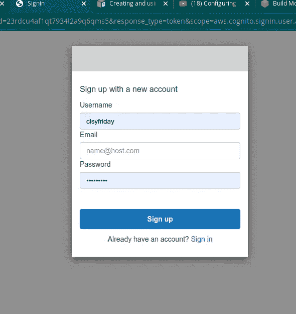

注册用户

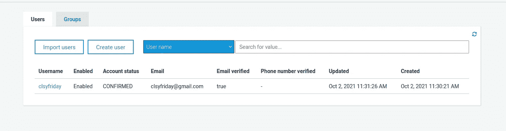

注册使用人

我们创建这个用户的目的是确保只有经过身份验证的用户才能登录使用我们的应用服务，我们将使用 AWS 网关来实现这一点，它将为我们提供一个 JWT 令牌，特定于每个用户，这是我们想要保护的令牌，因为我们不希望该令牌显示在前端，因为它可以被任何人访问，并用于对我们的应用造成严重破坏。

# 创建 lambda 函数

因此，让我们创建一个 lambda 函数，它将使用 API 网关来帮助我们获得一个 JWT 令牌来验证我们的用户。

我们不会得到更多关于创建 lambda 函数或添加 API 网关的细节，因为我们的主要焦点是将我们的 JWT 令牌添加到 Doppler。下面是我们创建的 lambda 函数的图像，稍后我们将把它与 API 网关集成。

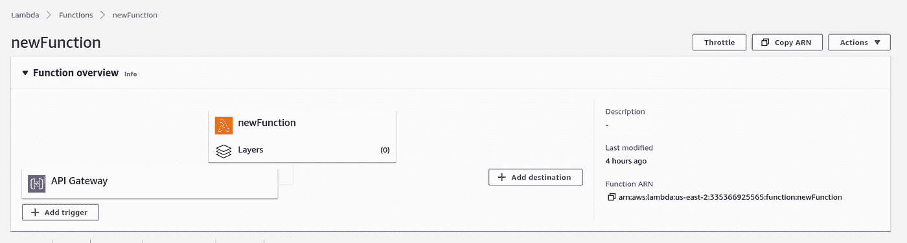

AWS 函数

# 添加 API 网关

Amazon API Gateway 是一个 AWS 服务，用于创建和保护任何规模的 REST、HTTP 和 WebSocket APIs。API 开发人员可以创建访问 AWS 或其他 web 服务的 API，以及存储在 AWS 云中的数据。
在这种情况下，我们将创建一个 HTTP 网关。

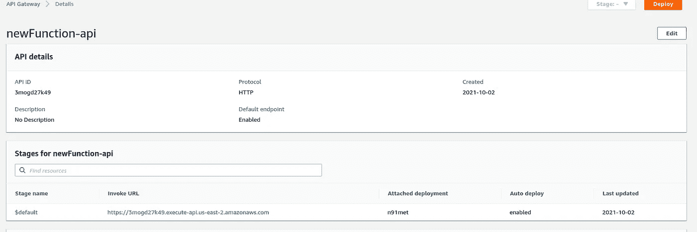

Api-Gate way

# 创建一个关于多普勒的项目

创建一个关于多普勒的项目非常简单明了，你只需要点击加号图标来创建一个新项目。
登录你的多普勒账户，创建一个新项目，有点像这样

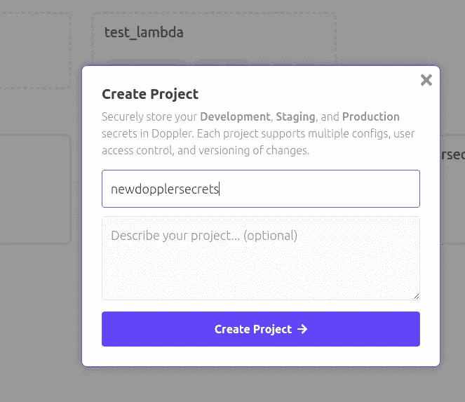

创建新的多普勒项目

创建新项目后，将创建三个阶段/环境，它们是

*   发展
*   脚手架
*   生产

这些环境是我们储存秘密的地方。

# 同步多普勒与自动气象站的秘密管理

在我们可以用多普勒同步我们的秘密之前，我们需要将 AWS secret manager 与多普勒集成，并将 AWS 与多普勒同步，让我们按照下面的步骤操作

创建项目后，单击 integrations

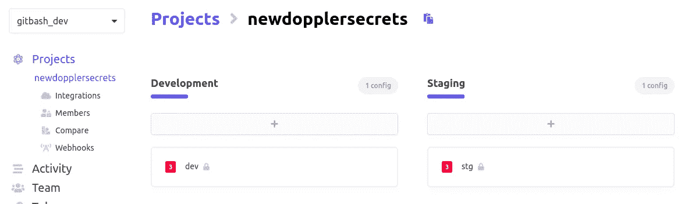

当您单击 integrations 时，它应该会将我们带到一个新的网页，在那里我们会看到一个不同服务的列表，我们可以将 Doppler 与这些服务集成，但在我们的情况下，我们将使用 Secrets Manager 进行集成。

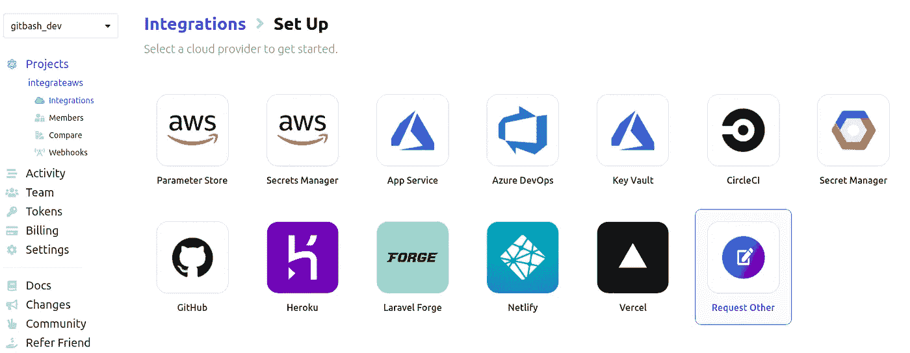

选择集成多普勒的服务

单击 Secrets Manager，我们将被定向到另一个页面，在该页面上，我们将被要求向 AWS secrets manager 提供密钥 ID 和访问密钥。如果您没有，您可以在点击创建用户按钮后创建新的 AWS Amplify 用户时获得它，但是如果您有，这是您访问它的方式。

```
Go to I AM management console > select users >  Select the current user
```

您应该会看到类似这样的内容

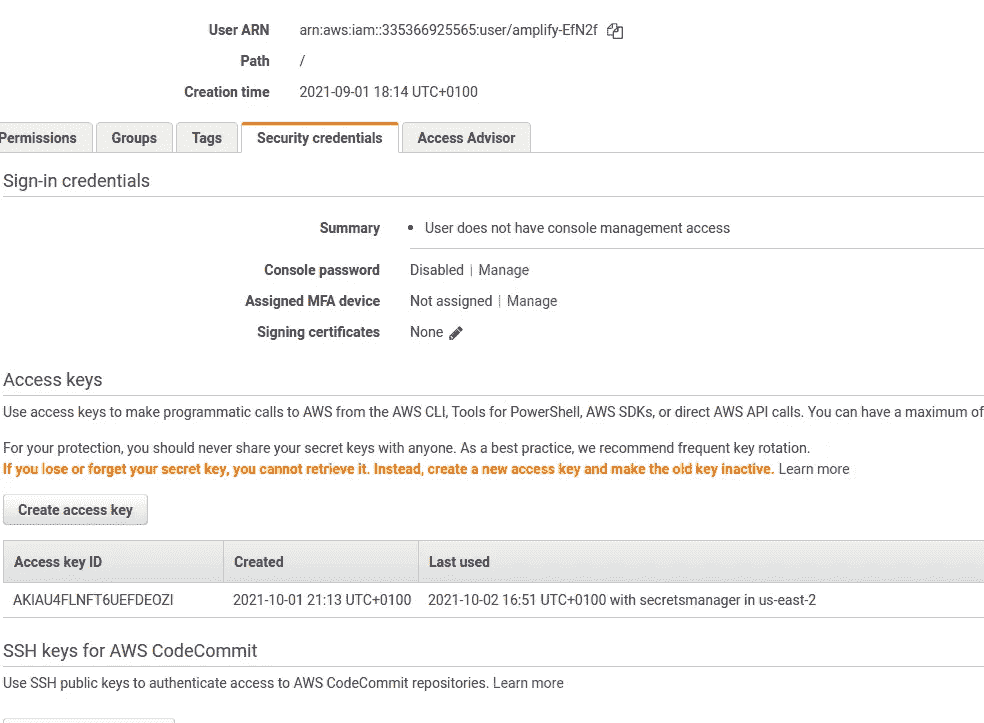

在这里您将找到您的访问密钥 ID，然后您将必须生成一个新的访问密钥。
将以上按键添加到 Doppler，与您的 AWS secret manager 同步。

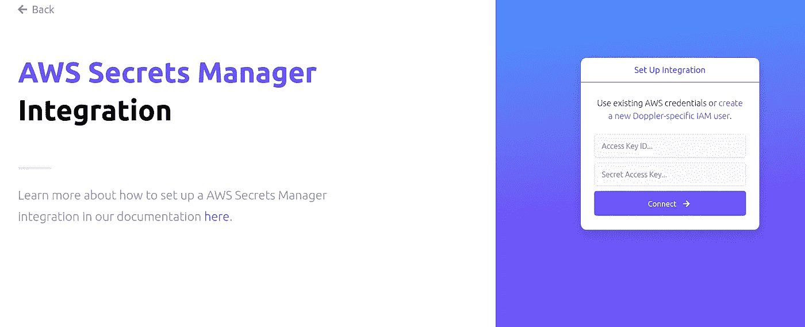

从 AWS secrets manager 添加访问密钥

Doppler 需要权限来与我们的 AWS secret manager 集成，这些策略可以很容易地以 JSON 格式添加。

如果您已经有一个 IAM 用户，并且想要添加一个新的策略，这是非常容易的。
在 AWS 搜索框中搜索关键字 IAM，会显示 IAM AWS 功能，点击它，然后选择用户。
第一个打开的选项卡是权限选项卡

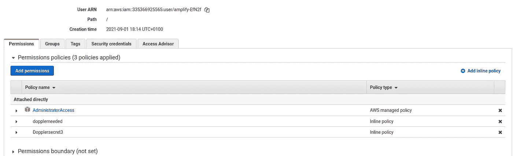

权限选项卡

单击 Add Inline Policy 创建一个自定义策略，为其命名并以 JSON 格式添加这些策略

```
{
    "Version": "2012-10-17",
    "Statement": [
        {
            "Sid": "AllowSecretsManagerAccess",
            "Effect": "Allow",
            "Action": [
                "secretsmanager:GetSecretValue",
                "secretsmanager:DescribeSecret",
                "secretsmanager:PutSecretValue",
                "secretsmanager:CreateSecret",
                "secretsmanager:DeleteSecret",
                "secretsmanager:TagResource",
                "secretsmanager:UpdateSecret"
            ],
            "Resource": "*"
        }
    ]
}
```

此外，在添加了将 Doppler 与 AWS secret manager 集成的密钥之后，我们需要配置 Doppler 环境。

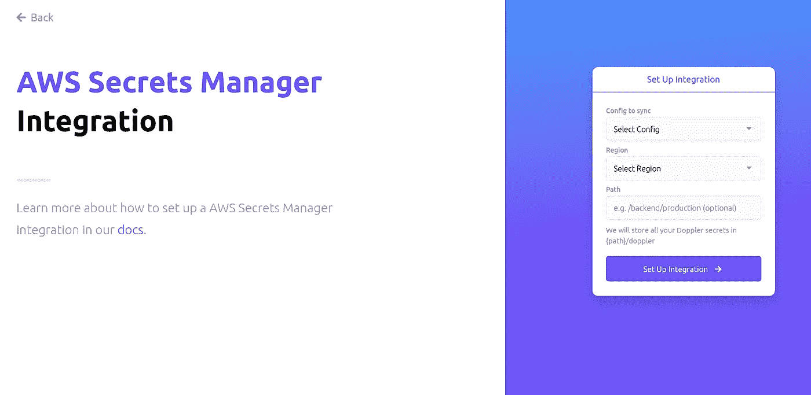

选择配置文件和路径

选择配置同步，AWS 地区，我的是 US-east-2，并选择性地选择一个路径在多普勒，你所有的秘密从 AWS 将被储存。

## 将 JWT 令牌保存到多普勒

要获得我们的 JWT 令牌，在用户登录后，在您的浏览器搜索栏上查看，我们将复制令牌并将其存储在多普勒上

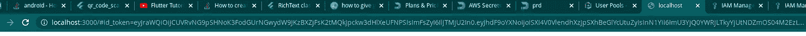

现在，这个主题最有趣的部分是将这个秘密令牌存储在多普勒上。

将新项目同步到 AWS 后，在多普勒仪表板上打开新创建的项目。

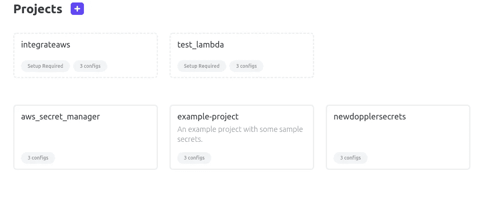

选择一个项目

选择您创建并与 AWS 同步的新项目，我将选择

```
newdopplersecrets
```

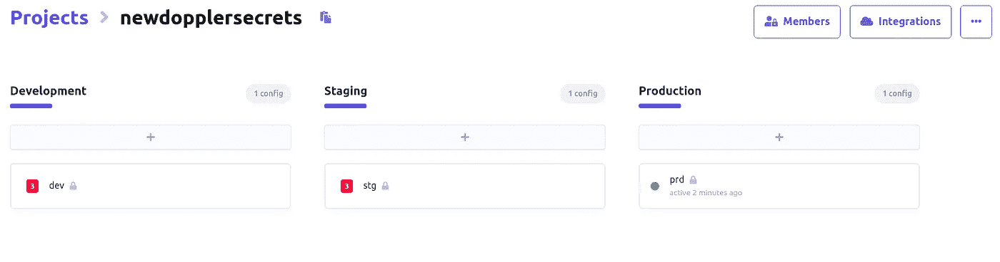

回想一下，您在同步到 AWS 时选择了一个环境，在我的例子中，我选择了

```
Production(prd)
```

这就是为什么根据上面的图像，prd 是绿色的，因为它是活跃的。

我们将单击活动环境，导航到一个新页面，在这里我们可以添加想要上传到 AWS 上的秘密。

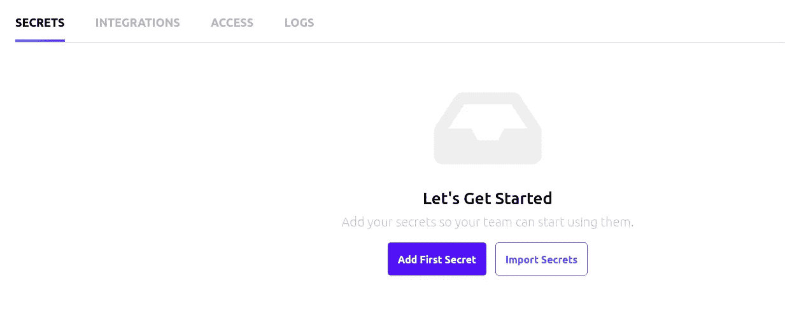

添加新秘密

上面的图像应该是我们将看到的下一页，单击添加第一个秘密按钮，添加我们之前从浏览器复制的 JWT 令牌。
您可以添加任何密钥名和令牌作为值

```
BASE_URL : [https://doppler.com](https://doppler.com)BEARER_TOKEN : eyJraWQiOiJCUVRvNG9pSHNoK3FodGUrNGwydW9JKzBXZjFsK2tMQkJpckw3dHlXeUFNPSIsImFsZyI6IlJTMjU2In0.eyJhdF9oYXNoIjoiN19fa3VxOG5nV1hiN3ZEZmNTSTJaUSIsInN1YiI6ImU3YjQ0YWRjLTkyYjUtNDZmOS04M2EzLTlkNGMyMDc1ZmM0NiIsImVtYWlsX3ZlcmlmaWVkIjp0cnVlLCJpc3MiOiJodHRwczpcL1wvY29nbml0by1pZHAudXMtZWFzdC0yLmFtYXpvbmF3cy5jb21cL3VzLWVhc3QtMl9KM2ppVmtrbGIiLCJjb2duaXRvOnVzZXJuYW1lIjoiY2xzeWZyaWRheSIsImF1ZCI6IjIzcmRjdTRhZjFxdDc5MzRsMmE5cTZxbXM1IiwiZXZlbnRfaWQiOiJjNzdkZjdjZS1hZGE1LTQ4YmYtODM2YS0yNzJmYjViMmJkYjkiLCJ0b2tlbl91c2UiOiJpZCIsImF1dGhfdGltZSI6MTYzMzE3NDI4NiwiZXhwIjoxNjMzMTc3ODg2LCJpYXQiOjE2MzMxNzQyODYsImp0aSI6IjY5NjhiZjZkLWEwYzAtNDkyZi04ODA0LWQ0ZjE2OTRkMWY4YiIsImVtYWlsIjoiY2xzeWZyaWRheUBnbWFpbC5jb20ifQ.U43PFIzcIJOk0MHmCr1a87WKXE4LIosl7ZvoO6Eo27d_rnxGHeUyrP4r0xH9XUeAH7zQR6e4Uk75hCNI1RgD0wpgbaOrmVfnZGnnrBBJTVN9BKs2ZrcPd_53ky8vwSNKAaTYlqvCNRnzARZim85HCYdL0aJaqz-R0jteyb0_7aEvaum2RMHG6RYJ0aYP46fNv8TaYW9imlvGs774kKzLmnHuIHwfN74iHxs68tcT0HcTHMUWqlo08uIZ3szceLszRqmSc7DjU24-Y1qvcsMh01eHbUDq-pdmZTUqaQ1uVTY1vBs-EhlrYNKOr8P-oBga6CiwXWXTfPmf_BYM2pTtvwPASSWORD : 0123456789
```

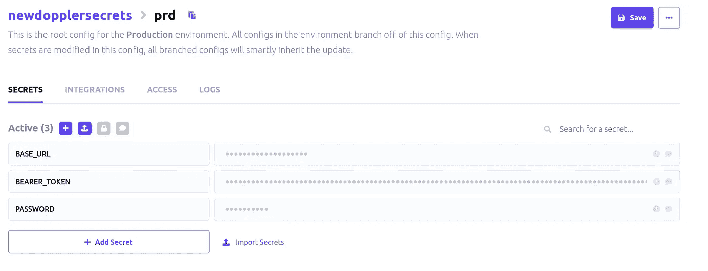

添加密钥和值后，您的秘密应该看起来像上面的图像，我们应该点击右上角的保存按钮来保存我们的秘密。

此外，单击下一个名为“集成”的选项卡，我们应该会看到这一点

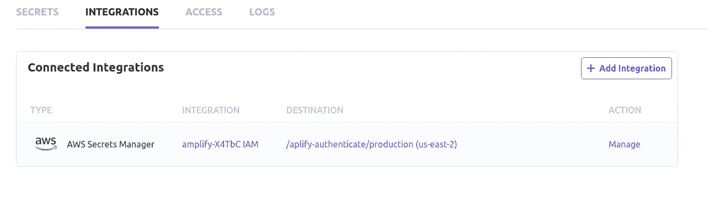

现在让我们点击文本*管理*在极端情况下，它应该会引导我们到一个新的网页，我们可以点击同步上传我们所有的秘密到 AWS 秘密管理器。

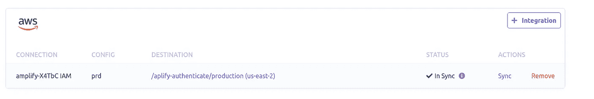

点击**同步**文本，我们所有的秘密将被添加到 AWS 秘密管理器。

为了确认我们所有的秘密都是从 doppler 上传到 AWS 的，点击 DESTINATION 选项卡下的链接，就像上面的图片一样，我们应该会看到 Doppler 这个名字被添加到我们在 AWS 中创建的项目名称中。

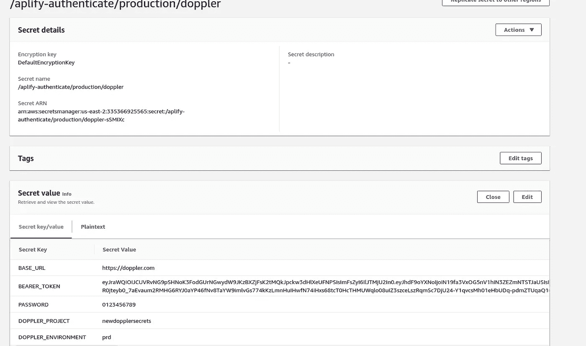

万岁，我们刚刚在多普勒上保存了我们的秘密，并成功地将其推送到 AWS，在那里我们可以访问它们以供使用，每当我们更新多普勒上的秘密时，它就会自动在 AWS 上更新。

# 结论

我们已经到了本教程的结尾。我们了解了如何使用 AWS Cognito 来创建使用其托管 UI 的用户。

我们还学习了如何创建一个 lambda 函数，并将 lambda 函数与一个 API 网关集成在一起，该网关帮助我们向用户提供 JWT 令牌——然后查看如何在 Doppler 中存储该令牌。