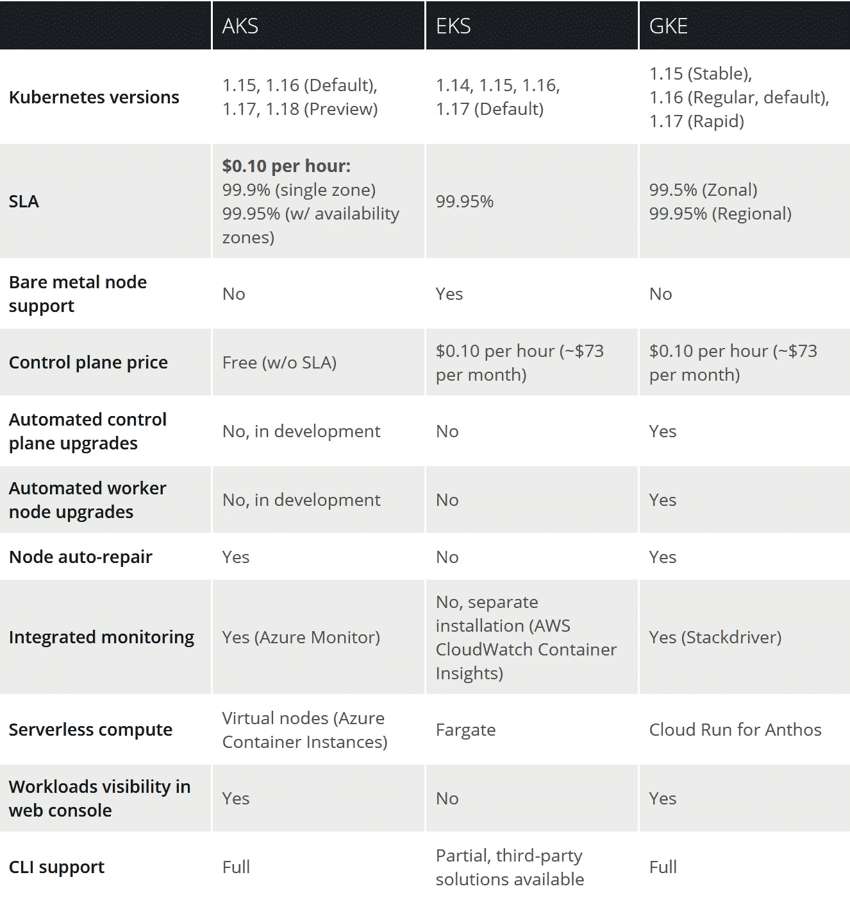
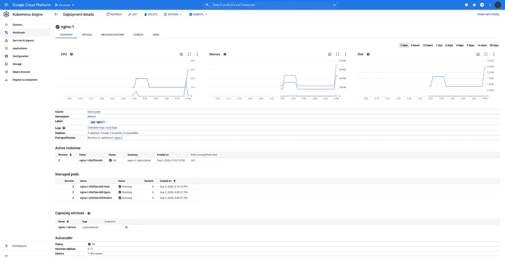
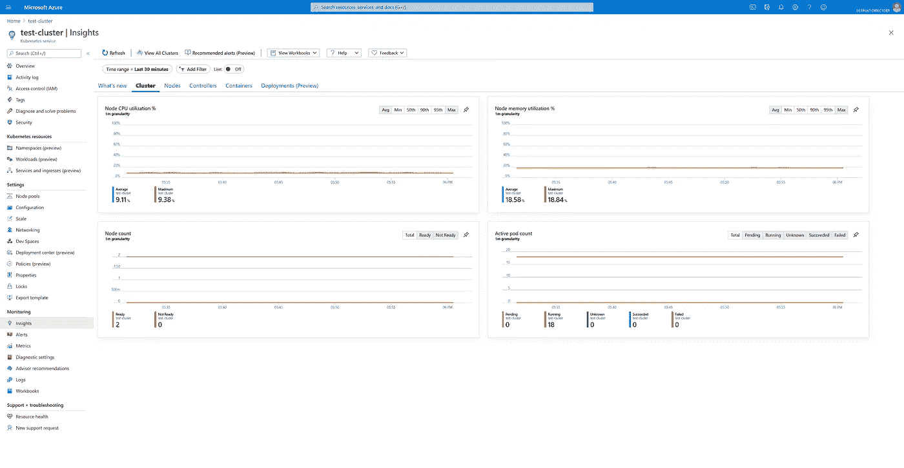
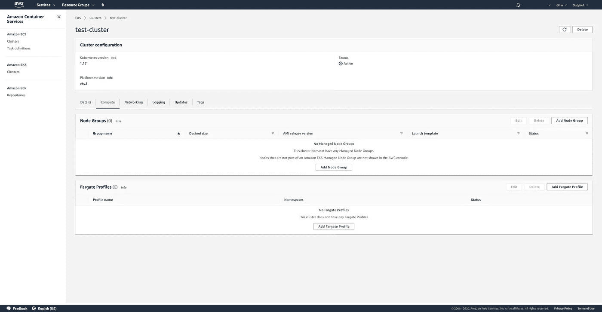

# 托管 Kubernetes 服务比较:GKE 与 EKS 与 AKS

> 原文：<https://betterprogramming.pub/managed-kubernetes-services-compared-gke-vs-eks-vs-aks-df1ecb22bba0>

## 比较三个最受欢迎的托管 Kubernetes 平台的功能和整体体验

伊恩·巴塔格利亚在 [Unsplash](https://unsplash.com?utm_source=medium&utm_medium=referral) 上拍摄的照片

随着 Kubernetes 成为容器编排的事实上的解决方案，托管的 Kubernetes 服务已经随处可见，云提供商在他们的产品上投入了大量的精力。然而，选择服务通常意味着要考虑大量的因素，如果没有广泛的研究，这些因素很难进行比较。

让我们看看亚马逊弹性 Kubernetes 服务(EKS)，谷歌 Kubernetes 引擎(GKE)，和 Azure Kubernetes 服务(AKS)，并比较他们的功能，以及他们的整体体验。

*注意:这些服务往往发展得非常快，所以当你读到它们的时候，其中的一些细节可能已经过时了。*

# **简介**

虽然大多数托管的 Kubernetes 服务已经存在不到三年，但有一项服务远远领先于潮流。鉴于 Kubernetes 最初是由谷歌开发的，谷歌 Kubernetes 引擎早于其竞争对手三年于 2015 年发布也就不足为奇了。其最大的竞争对手 AKS 和 EKS 都在 2018 年推出，让 GKE 在平台的成熟度和功能支持方面取得了巨大的领先优势。

Azure Kubernetes 服务和亚马逊弹性 Kubernetes 服务都是在 2018 年发布的，与大多数其他云提供商的发布时间相似，这意味着它们都有相同的时间来成熟和获得功能。尽管这些平台相对年轻，但自推出以来发展迅速。

# 特征比较

## 管理负担

正如上面的功能表所示，GKE 在为您提供更多服务方面处于领先地位。自动化控制面板和工作节点升级，以及节点自动修复，无需手动输入即可保持集群健康。AKS 支持节点自动修复，但不支持自动升级(根据微软的说法，这是开发中的)。EKS 不支持任何自动升级或节点修复。

## 监视

GKE 和 AKS 都直接集成了各自平台的监控工具。两者都有设计良好的现代界面，使得查看日志、查看资源使用情况和设置警报变得非常简单。总体而言，GCP 在拥有设计最精良的网络界面方面超过了 Azure，但 Azure 的界面也足够好。

EKS 支持将日志记录和监控作为一个单独安装的特性，称为 CloudWatch Container Insights。虽然集成工作良好，并提供了全面的指标，但 AWS 的 CloudWatch 界面使用起来往往令人沮丧，界面过时，布局混乱。您可能更喜欢设置第三方监控和日志记录解决方案。

## **无服务器计算**

GKE 为 Anthos 提供了一个无服务器的计算功能，称为云运行。这为您提供了托管云运行无服务器容器平台的所有常见优势，包括部署高度可扩展的工作负载，这些工作负载可以根据请求扩展到零，同时利用您自己的集群资源，而不是使用 Google 的托管云运行基础架构。然而，这并没有改变您通常的 Kubernetes 工作负载和部署的运行方式。它为受益于无服务器模式的工作负载提供了不同的部署选项。

AKS 的无服务器功能被称为虚拟节点，允许您运行由 Azure 容器实例支持的 Kubernetes pods，而不是完整的虚拟机，从而实现更快、更细粒度的扩展。与 Cloud Run for Anthos 不同，该计算选项运行您现有的 Kubernetes 工作负载，而不是一个完全独立的部署选项。这意味着您可以通过针对特定工作负载在虚拟节点上运行来无缝采用虚拟节点。

EKS 提供与亚马逊的无服务器容器平台 Fargate 的集成。类似于 AKS 的虚拟节点特性，该选项允许您将 pods 作为容器实例运行，而不是在完整的虚拟机上运行。然而，Fargate 需要使用亚马逊的应用负载平衡器(ALB)，而 Azure 的虚拟节点实现不需要您使用任何特定的负载平衡器。

## 开发工具

Google 提供了一个名为 Cloud Code 的特性，它是一个 VS 代码或 IntelliJ 扩展，允许您直接从 IDE/代码编辑器中部署、调试和管理您的集群。这也包括与 Cloud Run 和 Cloud Run for Anthos 的直接集成。

微软提供了类似的功能，在 VS 代码中有一个 Kubernetes 扩展。然而，除此之外，AKS 还有一个独特的功能，即通往 Kubernetes 的桥梁。这允许您运行本地代码，就像它是集群中的一个服务一样，允许您运行和调试本地代码，而不必在本地复制依赖项。

谷歌和微软的 Kubernetes 扩展都支持任何 Kubernetes 集群的通用功能，这些功能可以通过`kubectl`或 Kubernetes API 获得，这意味着你也可以将它们用于 EKS 集群。然而，除了这种通用的功能之外，还没有集成 EKS 的专用开发工具。

# 摘要

## **谷歌 Kubernetes 引擎(GKE)**

迄今为止最易用、功能最丰富的托管 Kubernetes 解决方案。如果你对任何云平台都没有特别的忠诚，只是想要最好的 Kubernetes 体验，那就别再找了。

谷歌云控制台中的 GKE 工作负载视图。

考虑到 Kubernetes 是由谷歌设计的，GKE 为托管的 Kubernetes 设立标杆的事实并不令人惊讶。GKE 也比它的竞争对手领先了近三年——有充足的时间来成熟和获得特性。

GKE 提供了丰富的开箱即用体验，通过谷歌出色的 Stackdriver ops 工具以及从 GCP web 控制台全面了解您的工作负载和资源使用情况，为您提供集成的日志记录和监控。GKE 的 CLI 体验还让您能够完全控制您的集群配置，使集群的创建和管理变得非常简单。简而言之，GKE 集群是生产就绪的开箱即用型产品，拥有您立即开始部署工作负载所需的一切。

有了 Google 为您管理的这么多东西，如果您希望完全定制您的集群，您会失去一点控制权。然而，除此之外，GKE 很难被指责。这是最好的 Kubernetes 管理经验，无与伦比。

## **Azure Kubernetes 服务(AKS)**

强大的开发工具和快速的 Kubernetes 更新带来了出色的开箱即用体验。对于那些已经在微软/Azure 生态系统中的人来说，这是显而易见的选择，对于其他人来说，这是 GKE 的有力替代。

Azure 门户中的 AKS 集群洞察视图。

虽然它没有达到 GKE 的高度，但 AKS 有很好的开箱即用体验，具有日志记录、监控和指标等功能。尽管 GKE 仍然提供更全面的指标和功能，但一个新的 Azure 门户功能现在让您可以全面了解您的集群工作负载。经过一系列的重新设计，Azure 的门户网站已经从一个杂乱和令人困惑的烂摊子变成了一个真正令人愉快的体验。除了经过大幅改进的门户之外，AKS 还拥有强大的 CLI 体验，让您能够全面控制您的集群。集群易于创建和管理，并且可用于生产。

Azure 作为平台的一个缺点是，它是三个主要云提供商中最不可靠的。就正常运行时间百分比和停机次数而言，Azure 落后于 AWS 和 GCP。这并不意味着它不可用——许多大公司继续依赖 Azure——但这是需要记住的事情。

除了一些潜在的缺点，AKS 仍然是一个出色的管理 Kubernetes 服务。尽管 GKE 对大多数人来说是更好的选择，但是 Azure 有几个主要的好处。如果你已经在 Azure 上存在或者使用现有的微软工具，如 365 或 Active Directory，AKS 是一个自然的选择。对于其他人来说，免费控制平面的更便宜的价格，快速的 Kubernetes 更新，有用的 VS 代码开发工具和无缝的无服务器计算选项都意味着 AKS 是一个值得考虑的强大产品。

## **亚马逊弹性库伯内特服务(EKS)**

在功能支持、易用性和开箱即用体验方面最弱的 Kubernetes 产品。如果您必须使用 AWS，或者如果您希望能够完全控制您的 Kubernetes 集群，请选择它。

AWS 管理控制台中的 EKS 集群视图。

与 GKE 和 AKS 采用的易于使用、非常受管理的方法相比，亚马逊弹性库本内特服务(EKS)让你自己管理大量配置。您将花费大量时间手动配置 IAM 角色和策略，以及自己安装各种功能。默认情况下，您无法了解您的集群或工作负载。EKS web 界面和 CLI 非常稀少，而且仅限于少数操作。

像`terraform-aws-eks` Terraform 模块和`eksctl`命令行工具这样的第三方工具填补了 EKS 管理经验中的许多令人沮丧的空白。自动化和抽象化了相当多的集群创建和管理复杂性。`eksctl`提供了 AWS 无法提供的全功能 CLI 体验。然而，即使这些工具也只能到此为止。因为这个功能不是 EKS 固有的，即使这些工具抽象了一些复杂性，您仍然最终负责维护它。

如果您想要对您的集群有更多的控制，EKS 确实非常有效。通过在管理方面相对放手，如果你愿意，你也可以从头开始完全定制你需要的任何东西。EKS 也是这里唯一支持裸机节点和自带机器镜像的服务。

最终，EKS 最大的优势在于它是一项 AWS 服务。它生活在最强大和最成熟的云平台之一，具有坚如磐石的可靠性、广泛的非常受欢迎的服务和庞大的开发人员社区。

# **结论**

如果你在寻找最好的库伯内特体验，GKE 是最好的选择。您拥有最佳的开箱即用体验、广泛的功能支持、轻松的维护以及出色的 web 和 CLI 界面。

AKS 凭借出色的开箱即用体验、强大的无服务器计算功能和有用的 VS 代码开发功能占据了第二位，所有这些都是通过免费的控制平面提供的。

另一方面，EKS 的方法是非常不干涉的，如果这是你想要的，那就太好了。不过，对大多数人来说，如果你选择 EKS，你是为了 AWS 的实力，而不是 EKS 本身。