# 管理和分析 WebSockets

> 原文：<https://betterprogramming.pub/managing-and-analyzing-websockets-c0a051a3dec1>

## Socket 的动手教程。IO 和 WebSocket


由[萨曼莎·加德斯](https://unsplash.com/@srosinger3997?utm_source=medium&utm_medium=referral)在 [Unsplash](https://unsplash.com?utm_source=medium&utm_medium=referral) 上拍摄的照片

WebSocket 是一种计算机通信协议，通过单一 TCP 连接提供全双工通信通道。WebSocket 协议由 IETF 在 2011 年 12 月标准化为 [RFC 6455](https://datatracker.ietf.org/doc/html/rfc6455) ，而 [WebSocket API](https://www.w3.org/TR/2009/WD-websockets-20091222/) 由 W3C 在 2009 年 12 月指定。截至目前，所有主流浏览器都支持 WebSocket API。

开发 WebSocket 是为了克服基于 HTTP 的技术的局限性。与单向协议 HTTP 相比，它提供双向通信。大多数浏览器将`HTTP/1.0`或`HTTP/1.1`限制为每个原点 6–8 个 TCP 连接。幸运的是，WebSocket 只需要一个连接。

WebSocket 发送和接收数据的速度比 HTTP 快得多。它甚至比 AJAX 更快。WebSocket 请求不受同源策略的限制。它更加灵活，同时也容易受到跨站点的 WebSocket 劫持攻击。

[插座。IO](https://github.com/socketio/socket.io) 是一个支持客户端和服务器之间实时、双向和基于事件的通信的库。它是 WebSocket API 的一个“微小”包装器。虽然 WebSocket 是最低标准。IO 提供企业级 WebSocket。

在本文中，我们将了解如何使用 WebSocket/Socket。IO，以及如何使用网络面板分析它们。

# 关于插座。超正析象管(Image Orthicon)

我们将看一看 Socket。IO 优先。

为什么？

这是因为插座。IO 提供了企业级的 WebSocket，其中已经处理了很多实现细节。

## 建立工作环境

正如我们在[探索插座中所描述的。IO 处于 React 工作环境](/exploring-socket-io-in-react-working-environment-e505bf1c857c)，Socket。IO 示例构建在 [Create React App](/10-fun-facts-about-create-react-app-eb7124aa3785) 环境中。

```
npx create-react-app react-socket
cd react-socket
```

在工作环境中，我们需要一台客户机和一台服务器相互通信。为了简化任务，我们将客户机和服务器设置在同一个存储库中。

安装服务器包:`npm i socket.io`。

安装客户端包:`npm i socket.io-client`。

然后，`package.json`在`[dependencies](/package-jsons-dependencies-in-depth-a1f0637a3129)`中包含了两个额外的包:

## 设置客户端

我们创建了一个只有一个按钮的用户界面，`Click to request date from server`。点击按钮发送一个套接字。对服务器的 IO 请求。收到请求后，服务器会用当前日期进行响应。客户端接收服务器日期并将其显示在屏幕上。

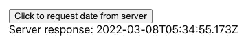

作者图片

以下`src/App.js`修改为客户端:

2 号线从`'socket.io-client'`导入`io`。

通过调用`io('http://localhost:5000')`(第 9 行)来初始化套接字，其中服务器在`'http://localhost:5000'`上运行。如果客户端和服务器位于同一原点，则不需要指定 URL。

有 3 个特殊事件需要收听:`'connect'`、`'disconnect'`和`'connect_error'`，分别在 11 号线、13 号线和 17 号线收听。

第 21 行监听自定义事件，`'responseDate'`。

我们调用`useRef`(第 6 行)来生成一个引用以保持套接字的持久性(第 23 行)。客户端请求由按钮的`onClick`方法调用(第 30 行)。

服务器响应被保存到第 21 行的状态`serverData`。然后，由第 34 行呈现。

`socket.on(eventName, listener)`是套接字中的一个方法。IO 库。套接字连接侦听指定的事件，并调用回调侦听器。

## 设置服务器

我们需要为客户端建立一个服务器来进行对话。在`server/index.mjs`中设置一个快递服务器。在下面的代码中，使用了一个 HTTP 包装器，因为当调用`app.listen`时，pure Express 服务器会创建一个新的 HTTP 服务器。

第 8 行创建了一个 Express 服务器。

第 9 行用 HTTP 包装了服务器。

第 10 行用 HTTP 包装器初始化`io`。

第 11 行从环境变量中读取端口。如果未设置，默认值为 5000。

第 13–15 行服务于由`npm run build`生成的产品网页。

第 17 行监听内置事件`'connection'`，并设置其他监听器。

第 20–26 行监听自定义事件，`'requestDate'`。收到事件后，它调用服务器日期(第 21 行)。它发出事件的日期，`'responseDate'`。不需要对要发送的内容运行`JSON.stringify()`，因为它会自动完成。对于不可序列化的对象，如 Map 和 Set，必须手动序列化。

第 28 行监听内置事件`'disconnect'`，并输出消息。

第 31 行在指定的端口启动 HTTP 服务器。

通过`node server/index.mjs`运行服务器。单击用户界面上的按钮显示服务器日期。


作者图片

## 分析套接字。超正析象管(Image Orthicon)

在插座里。例如，我们打印出了许多调试信息。其实没必要。我们可以使用[网络面板](/analyzing-javascript-ui-performance-using-network-panel-and-har-files-bff526df60b2)来检查套接字通信。该示例在 Chrome 上运行，但在其他浏览器上也类似。

打开网络面板。以下是建议的分析过程:

*   选中`Preserve log`复选框，保存跨页面加载的请求。
*   选中`Disable cache`复选框，模拟首次用户体验。
*   单击“清除”按钮，清除“请求”表中的所有请求。

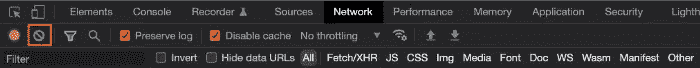

作者图片

点按该按钮几次。

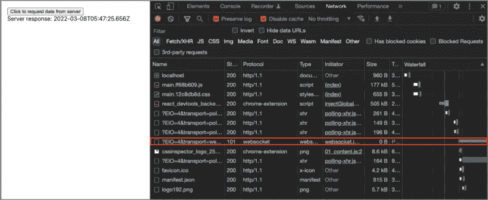

作者图片

请求表中有一些请求，但是只有一个`websocket`连接。除了查看`All`请求，我们还可以按下按钮，仅使用`WS` (WebSocket)进行过滤。

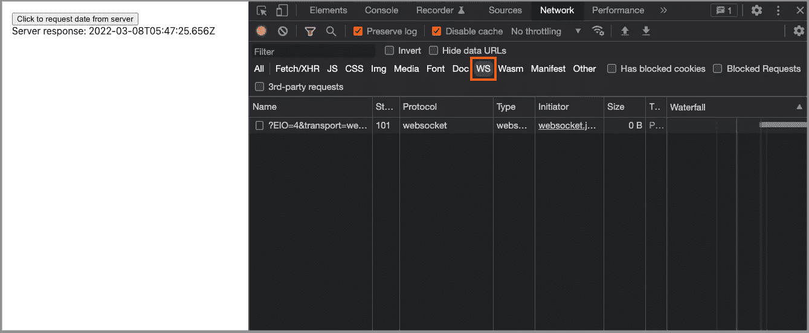

作者图片

点击 WebSocket 请求，我们可以查看所有的 Socket 通信。

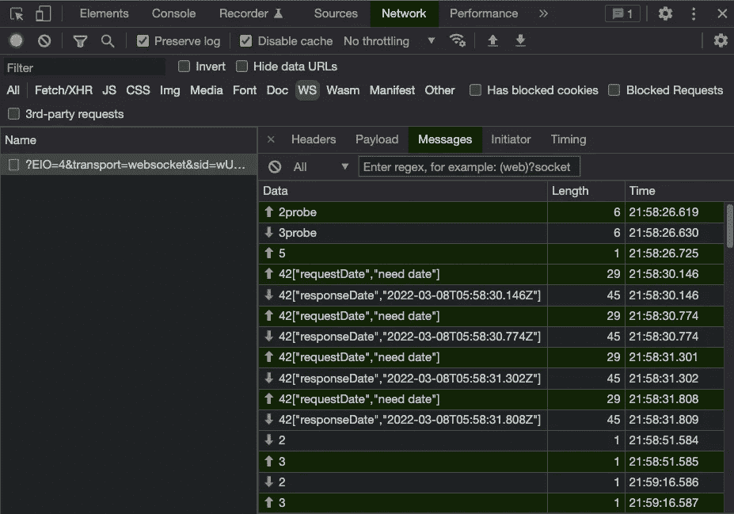

作者图片

这是插座。IO 的消息定义:

*   0 打开:当新传输打开时从服务器发送(重新检查)。
*   1 close:请求关闭此传输，但不关闭连接本身。
*   2 ping:发送探测请求。
*   3 pong:响应探测请求。
*   4 消息:发送实际的消息。
*   5 升级:插座。IO 测试浏览器是否支持 WebSocket。如果是，则升级为 WebSocket。否则，它保持 HTTP 长轮询。
*   6 noop:主要用于在接收到传入的 WebSocket 连接时强制轮询周期。

上面的截图显示了流程:客户端发送`2probe`，服务器响应`3probe`。然后客户端发送一堆`42[]`消息，其中自定义事件是`'requestDate'`，消息是`'need date'`。在接收到每个定制事件时，服务器用一个`42[]`消息响应，其中定制事件是`'responseDate'`，消息是服务器日期。当客户端空闲时，服务器用【pings，客户端返回`3`。

有了这些详细的信息，分析套接字通信就变得简单了。

# 关于 WebSocket

让我们用 WebSocket 实现同一个例子。不需要安装任何包，因为 WebSocket 是 JavaScript 的一部分。

## 设置客户端

`src/App.js`修改为 WebSocket 客户端。

通过调用 WebSocket 连接所在的`'ws://localhost:8080'`来初始化一个套接字(第 8 行)。

在第 9 行，`socket`监听内置的`open`事件。根据类型定义，套接字对象具有方法`onopen`。相反，我们使用了不寻常的方法`addEventListener`。

为什么？

这是因为 socket 对象在 socket 打开之前没有`onopen`、`onclose`、`onmessage`和`onmessage`的方法。对`onmessage`(第 11 行)、`onclose`(第 24 行)和`onerror`(第 26 行)的调用是在`addEventListener`回调(第 9-27 行)中调用的。否则，这些监听器中的每一个都需要连接到`addEventListener`。

`open`之后没有可用的插座 id。消息更简单，没有自定义事件、频道或房间。

对于字符串消息，可以直接显示(第 20 行)。

对于对象消息，客户端接收一个`Blob`(第 13 行)。如果我们试图`JSON.stringify`这个 Blob，它会抛出一个错误:`Uncaught TypeError: Converting circular structure to JSON`。我们必须用`FileReader`来解释`Blob`(第 14-18 行)。

与套接字进行比较。IO，很明显 WebSocket 是一个光秃秃的最低标准。

## 为字符串消息设置服务器

我们在`server/index.mjs`用的是同一个 Express 服务器。

第 10 行通过`new WebSocketServer.Server({ port: 8080 })`初始化`io`。

第 17 行监听内置事件`'connection'`，并在回调中设置其他监听器(第 18–26 行)。

第 20–24 行监听内置事件`'message'`。收到消息后，它调用服务器日期并将其转换为字符串(第 21 行)。字符串消息被发送回客户端(第 22 行)。

第 26 行监听内置事件`'close'`，并记录消息。

通过`node server/index.mjs`运行服务器。单击用户界面上的按钮显示服务器日期。

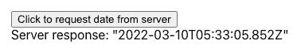

作者图片

请注意，日期是引用的。

## 分析字符串消息的 WebSocket

打开检查器并选取“网络”面板。点按该按钮几次。

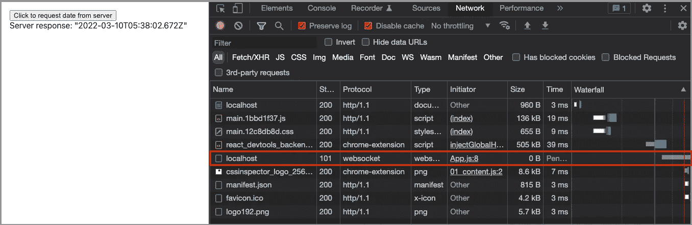

作者图片

请求表中有一些请求，但是只有一个`websocket`连接。除了查看`All`请求，我们还可以按下按钮，仅使用`WS` (WebSocket)进行过滤。

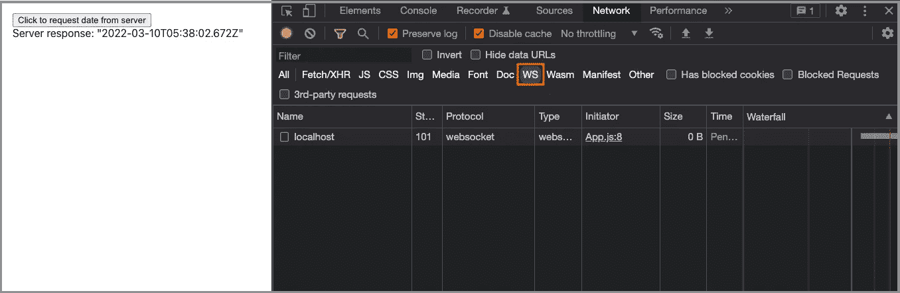

作者图片

点击 WebSocket 请求，我们可以查看所有的 Socket 通信。

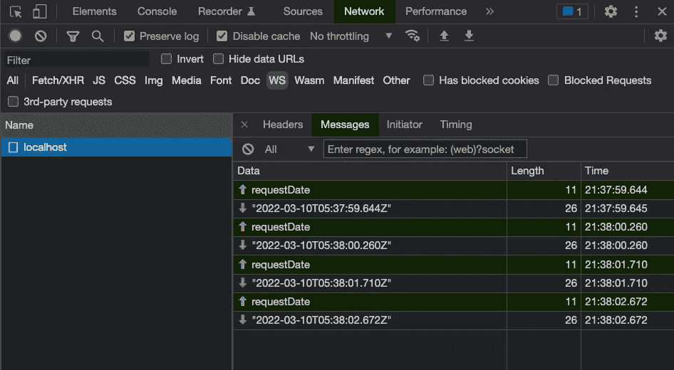

作者图片

消息流更简单:客户端发送一堆`'requestDate`。收到每条消息后，服务器都以服务器日期作为响应。

socket communicate 可以用来分析 WebSocket 实现。

## 为对象消息设置服务器

我们已经设置了客户端来处理字符串和对象(Blob)消息。下面的`server/index.mjs`发送一个`date`对象(第 22 行):

通过`node server/index.mjs`运行服务器。单击用户界面上的按钮显示服务器日期。

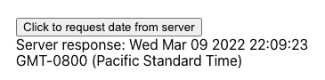

作者图片

请注意，日期格式是不同的。

## 分析对象消息的 WebSocket

在网络面板上做同样的分析。

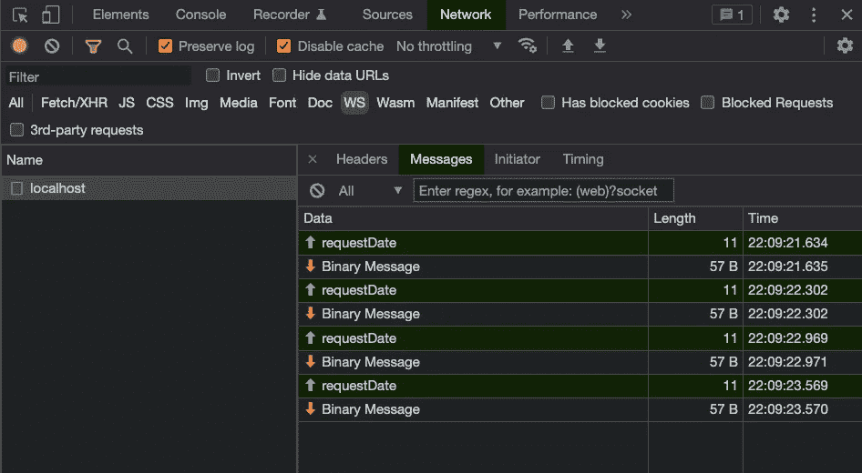

作者图片

客户端发一堆`'requestDate`。在接收到每个消息时，服务器用`Binary Message`进行响应。

点击每个`Binary Message`，显示二进制值和解释值用于分析。


作者图片

# 结论

我们已经给出了一个关于如何使用 Socket 的实践教程。IO 和 WebSocket 工作。DevTools 的网络面板是分析套接字通信的有效工具。它允许我们利用 WebSocket，而不用担心调试的难度。

感谢阅读。我希望这有所帮助。如果你有兴趣，可以看看[我的其他媒体文章](https://jenniferfubook.medium.com/jennifer-fus-web-development-publications-1a887e4454af)。