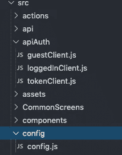

# 使用 Axios 在 React Native 中管理 API 请求

> 原文：<https://betterprogramming.pub/managing-api-requests-http-https-in-react-native-using-axios-9ebf75cbca9b>

## 了解 Axios 的基础知识


照片由[凡尔纳何](https://unsplash.com/@verneho?utm_source=unsplash&utm_medium=referral&utm_content=creditCopyText)在 [Unsplash](https://unsplash.com/s/photos/build?utm_source=unsplash&utm_medium=referral&utm_content=creditCopyText) 上拍摄

# 介绍

Axios 是一个基于 promise 的 HTTP 客户端，可以在浏览器和 node.js 环境中工作。它提供了一个 API 来处理 XMLHttpRequests 和节点的 HTTP 接口。除此之外，它还使用一个 polyfill for ES6 new promise 语法来包装请求。我们还可以拦截和取消请求，并且有内置的客户端保护来防止跨站点请求伪造。

在 React 本地项目中使用它很简单！在本文中，我们将使用 Axios 来访问 React 本机应用程序中的通用 HTTP 或 HTTPS API。我们首先向我们的项目添加 Axios。

# 安装过程

就像任何其他库一样，根据您使用的软件包管理器的模式，您可以选择这些命令中的任何一个来安装 Axios:

```
 yarn add axios

 npm install axios --save
```

在进入主要部分之前，让我们复习一些基础知识。如果你是一个初学者，请仔细阅读这篇文章，因为这些是你应该如何在你的应用程序中进行 API 调用的一些基础知识。

# 获取请求

get 方法用于执行 GET 请求。它有两个参数:端点和回调函数。

```
import React from 'react';
import axios from 'axios';

export default class Requests extends React.Component {
  state = {
    nameList: []
  }// make the GET request to fetch data from the URL then using promise function to handle response. componentDidMount() {
    axios.get(`url`)
      .then(res => {
        const nameList = res.data;
        this.setState({ nameList });
      })
  }

  render() {
   const {nameList} = this.state;
   return (
      <ul>
        { 
        nameList.map(user => <li>{user.name}</li>)
        }
      </ul>
    )
  }
}
```

# 发布请求

post 方法是向服务器发送数据的另一种方式。它有三个参数:URL、要发布的数据和一个回调函数。

```
// Rest code is same as GET post.post('access_token', {// data to be sent
  email : 'redjames@gmail.com" ,
  password: '12346'
})
.then(response => {
  if (response.data.status) {
   console.log(response);
 } 
}).catch(error => {console.log(error)});
```

你刚刚忽略了吗？我必须说我对你很有信心。

无论如何，继续…我将向您简要介绍如何同时发出多个请求。

# 在单个请求中处理多个 API URLs

在开发代码时，可能会出现这样的情况:您必须在同一个文件中进行多个 API 调用，它们可能会也可能不会同时尝试获取数据。调用的顺序可能会导致接收或发送数据的延迟。

以下是如何使用`Axios.all`功能同时拨打多个电话的方法。它同时处理多个 API 调用。如果您正在处理 React Native，您可以轻松地创建一个函数，添加此代码并在`componentDidMount`函数中调用它:

```
import axios from 'axios'; let one = "https://api.storyblok.com/v1/cdn/stories/health?version=published&token=wANpEQEsMYGOwLxwXQ76Ggtt" let two = "https://api.storyblok.com/v1/cdn/datasources/?token=wANpEQEsMYGOwLxwXQ76Ggtt" let three = "https://api.storyblok.com/v1/cdn/stories/vue?version=published&token=wANpEQEsMYGOwLxwXQ76Ggtt" const requestOne = axios.get(one); 
const requestTwo = axios.get(two); 
const requestThree = axios.get(three); axios.all([requestOne, requestTwo, requestThree]).then(axios.spread((...responses) => {   
const responseOne = responses[0]   
const responseTwo = responses[1]   
const responesThree = responses[2]   
*// use/access the results * 
})).catch(errors => {
   *// react on errors.* 
})
```

# 使用通用基本 URL 管理 URL

这是我写这篇文章的主要原因。总是需要在一个应用程序中使用多个 URL 和一个公共的基本 URL。有多种方法可以让 API 请求从这些 URL 获取数据。如果你是专业的专家，请告诉我是否有替代方案——我将不胜感激！

## 第一步

在您的应用程序中创建一个配置文件夹。此文件夹必须位于您的应用程序项目中(无论您如何命名)。添加一个文件并将其命名为 config.js。在该文件中添加以下代码:

```
export const apiConfig = {baseUrl: 'https://nameofthedomain.net/api/v1/', 
// should end with a slashclientId: '1',
clientSecret: 'xc34jamesDevV41XwKbWhrsGgHvR3hjwG8',
};// Ask your backend expert if you have no idea about client id and clientSecret if you are new to it.
```

## 第二步

在应用程序中创建另一个文件夹。将其命名为 apiAuth，并在其中创建三个文件，如下所示:



检查 config 和 apiAuth 文件夹

让我们向刚刚创建的空文件添加代码。你可能已经从它们的名字中了解了它们的含义，但是让我们深入了解更多的细节。

## A将下面的代码添加到 guestClient.js

这个文件用于进行不需要任何令牌生成或任何用户管理来维护状态的调用。这些都是简单的全球通用的 URL，具有共同的基础。我们已经在这个文件中启动了 Axios，并添加了基本 URL 和与它们相关联的头。如果有任何数据要发送，您可以按照下面代码中提到的方式发送。

拦截器基本上是为了在调用完成后从浏览器获得响应。在这一部分中，随机呼叫被分类。那些不需要任何身份验证或用户详细信息的请求被称为访客 URL。如果您仍然感到困惑:访客客户端是用于匿名访客的，该访客在没有任何身份验证和授权的情况下进行呼叫。

```
 import axios from 'axios';
import {apiConfig} from '../config/config';const client = axios.create({
  baseURL: apiConfig.baseUrl,
  headers: { 
     Accept: 'application/json'
  },
  data:{
   scope: '',
   id: 34,
});export default client;function getUrl(config) {
 if (config.baseURL) {
  return config.url.replace(config.baseURL, '');
 } 
  return config.url;
 }// Intercept all requests
client.interceptors.request.use(
 config => {
 console.log(`%c ${config.method.toUpperCase()} - ${getUrl(config)}:`,'color: #0086b3; font-weight: bold',config,);
return config;
}, error => Promise.reject(error),);// Intercept all responses
client.interceptors.response.use(
async response => {console.log(`%c ${response.status} - ${getUrl(response.config)}:`,
'color: #008000; font-weight: bold',
response,);return response;},error => {console.log(`%c ${error.response.status} - ${getUrl(error.response.config)}:`,'color: #a71d5d; font-weight: bold',error.response,);
return Promise.reject(error);
},
);
```

## 将下面的代码添加到 loggedInClient.js 中

`LoggedInClient`，顾名思义，由用户登录后需要的 API 组成，需要进行一些 API 调用以从服务器获取数据——例如，支持请求、与帐户相关的名称列表或用户详细信息。所有这些类型的请求都可以使用以下代码:

```
import axios from 'axios';
import {Alert} from 'react-native';
import AsyncStorage from '@react-native-community/async-storage';
import {apiConfig} from '../config/config';const getAccessToken = async () => {
try {
const retrievedItem = await AsyncStorage.getItem('tokenData');
if (retrievedItem !== null) {
const item = JSON.parse(retrievedItem);
console.log(item);
const authorization = `Bearer ${item.token}`;
// We have data!!
return authorization;
} return null;
} catch (error) {
// Error retrieving data
}};const loginClient = axios.create({
baseURL: apiConfig.baseUrl,
headers: {
  Accept: 'application/json',
},
});const getLoginClient = async () => {
loginClient.defaults.headers.common.Authorization = await getAccessToken();
return loginClient;
};export default getLoginClient;function getUrl(config) {
if (config.baseURL) {
return config.url.replace(config.baseURL, '');
}
return config.url;
}// Intercept all requests
loginClient.interceptors.request.use(
config => {
console.log(`%c ${config.method.toUpperCase()} - ${getUrl(config)}:`,'color: #0086b3; font-weight: bold',config,);
return config;
},error => Promise.reject(error),);// Intercept all responsesloginClient.interceptors.response.use(
async response => {if (response.status === 401) {
try {
const value = await AsyncStorage.getItem('tokenData');
if (value !== null) {
// We have data!!
AsyncStorage.clear();
NavigationService.navigate('AuthStackScreen');
}
} catch (error) {
// Error retrieving data
console.log(error, 'logged in client error');
}} console.log(`%c ${response.status} - ${getUrl(response.config)}:`,'color: #008000; font-weight: bold',response,);return response;},error => {console.log(error, 'error console');
if (error.response.status === 429) {
Alert.alert('Too many requests. Please try again later.');
} console.log(`%c ${error.response.status} - ${getUrl(error.response.config)}:`,'color: #a71d5d; font-weight: bold',error.response,);
return Promise.reject(error);
},);
```

## 将以下代码添加到 tokenClient.js

令牌客户机请求是那些我们需要生成并保存令牌作为响应的请求。例如，当我们注册一个应用程序或在注册过程中。

```
import axios from 'axios';
import {apiConfig} from '../config/config';const client = axios.create({
baseURL: apiConfig.baseUrl,
headers: {
 Accept: 'application/json',
},
 data: {
   // client_id: apiConfig.clientId,
   // client_secret: apiConfig.clientSecret,
   id: 'password',
   scope: '*',
 },
});
export default client;function getUrl(config) {
if (config.baseURL) {return config.url.replace(config.baseURL, '');}
return config.url;
}// Intercept all requestclient.interceptors.request.use(
config => {
console.log(
`%c ${config.method.toUpperCase()} - ${getUrl(config)}:`,
'color: #0086b3; font-weight: bold',config,);
return config;
},error => Promise.reject(error),
);// Intercept all responsesclient.interceptors.response.use(
async response => {
console.log(
`%c ${response.status} - ${getUrl(response.config)}:`,
'color: #008000; font-weight: bold',
response,
);
return response;
},error => {
console.log(
`%c ${error.response.status} - ${getUrl(error.response.config)}:`,
'color: #a71d5d; font-weight: bold',
error.response,
);return Promise.reject(error);},);
```

## 最后一步

我们已经完成了基本代码。现在，我们所要做的就是在需要的时候和地点在我们的文件中调用它们。

我们如何使用上面所有的代码？

总结整篇文章，你就有答案了。只需导入文件，根据 API 的性质，您可以发出 POST 或 GET 请求来分别发送或接收数据。响应是必须的，可以根据开发人员的需要进行存储和配置。查看代码以便更好地理解。

## **导入文件**

```
import loginRequest from '../apiAuth/tokenClient';
//Import the file if you are generating tokenimport getLoginClient from '../apiAuth/loggedInClient';
//Import the file if you are logged inimport guestRequest from '../apiAuth/guestClient';
//Import the file if you are using no token required API
```

## 提出请求

这里列出了 URL，并发出 post 请求来发送数据和处理响应。请注意，在请求中只调用端点，而不是整个 URL。这就是为什么我们已经走了这么远——请不要犯愚蠢的错误，再次调用整个 API URL！

```
import getLoginClient from '../apiAuth/loggedInClient';//The url is https://nameofthedomain.net/api/v1/contactSupportonButtonPress = async () => {
const {randomMesage} = this.state;
const client = await getLoginClient();
client
.post('contactSupport', {
  message: randomMessage,
})
.then(response => {
 console.log('response is', response);
})
.catch(error => {
console.log(error);});
};
```

get 方法是这样调用的:

```
import apiClient from '../../api/loggedInClient';
//The url is https://nameofthedomain.net/api/v1/flashcardsonPress= async () => {
const client = await apiClient();
client.get('flashcards')
.then(async res => {
console.log(res);
})
.catch(error => console.log(error));
},
```

# C 结论

我们已经成功地将 API 与一个公共的基本 URL 集成在一起，并向服务器发出所有类型的基本请求。

这里需要考虑的一点是，API 调用并不局限于这两种请求类型——还有更多需要探索的地方。如果您有任何与 API 处理相关的问题，请随时联系。乐意帮忙。如果你需要整个代码，请随时通过我的网站给我发电子邮件。

不断学习，不断成长！
到达[https://www.instagram.com/navigatorkumar/](https://www.instagram.com/navigatorkumar/)