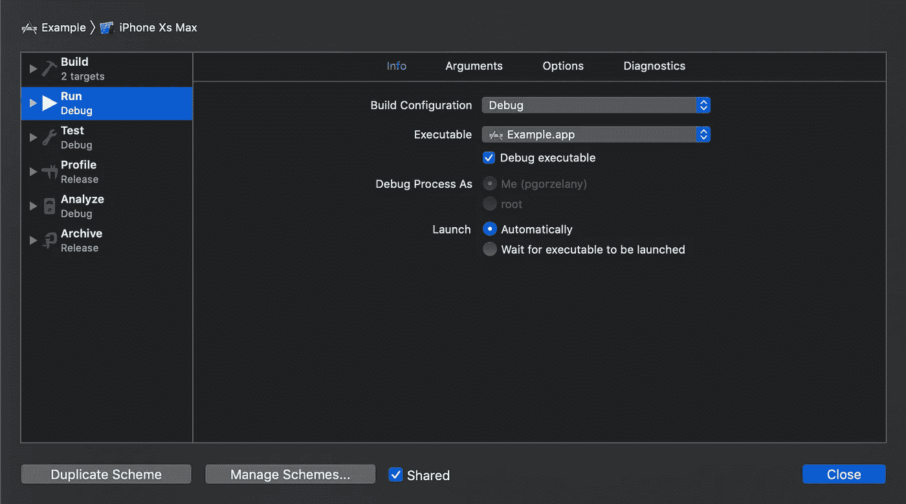
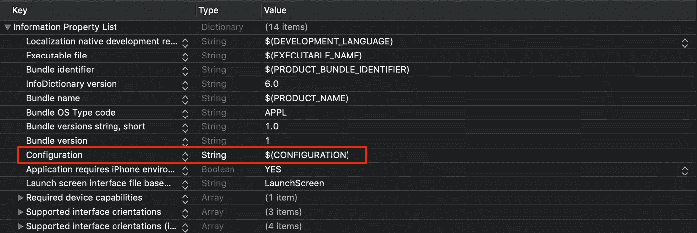
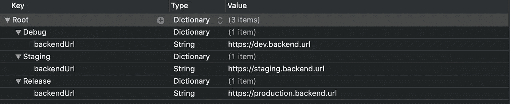

# 管理 iOS 项目中的配置相关变量

> 原文：<https://betterprogramming.pub/managing-configuration-dependent-variables-in-ios-projects-b68bfb0f9689>

## Xcode 设置的分步指南


来源: [Pixabay](https://pixabay.com/pl/photos/komputer-komputery-1245714/)

如今，几乎每个应用程序都必须连接到某种后端服务，通常，这些服务部署在多个环境中。

一个典型的例子是开发/试运行/生产环境。开发环境用于日常部署和开发人员测试他们的代码。

登台环境用于测试人员和客户测试的稳定版本。我们都知道生产环境是干什么用的。

在这篇文章中，我将一步一步地介绍我认为在 iOS 应用中处理多种环境的最直接的方法。

以下是该设置的高级概述:

*   为每个环境添加项目级配置。
*   修改`Info.plist`文件以包含一个在运行时将解析为活动配置名称的字段。
*   使用`Info.plist`文件中的活动配置，在运行时从配置文件中读取属性

# 1.为每个环境添加项目级配置

首先，您需要将所有环境添加为项目级配置。你可以通过点击 Xcode 中的*项目* - > *信息*标签来做到这一点(见下面截图)。


项目级配置示例

您现在可以通过选择*构建方案*->-*构建配置*设置中的配置来选择运行时应该使用的配置。

在下面的示例中，运行构建时选择了*调试*配置。



构建方案

# 2.修改 Info.plist 文件

好的，到目前为止我们做得很好，但是我们仍然不能做任何有用的事情。

首先，我们不知道这款应用目前运行在什么配置下。为此，我们将修改`Info.plist`文件，以包含当前活动的配置名称。



信息列表

`$(Configuration)`变量是一个特殊的环境变量，Xcode 在编译项目时会将其解析为当前的配置名称。

这意味着如果项目是在*调试*配置中编译的，那么*配置*属性下的值将是*调试*。`Info.plist`文件是存储这些信息的好地方，因为我们可以在运行时轻松地检索这些信息:

```
let activeConfigurationName = Bundle.main.object(forInfoDictionaryKey: “Configuration”) as? String
```

上面的代码将从`Info.plist`文件中获取活动的配置名，这样我们就可以在运行时使用它。

# 3.使用当前配置名称从配置文件中读取属性

我们现在可以在运行时访问当前的配置名，并且可以使用它从配置文件中读取变量。

让我们首先定义一个类似如下的`Configuration.plist`文件:



配置. plist

请注意，配置名称必须与我们在步骤 1 中定义的项目配置相同。

现在，我们可以在运行时使用活动的配置名称来访问该文件的属性:

```
let activeConfigurationName = Bundle.main.object(forInfoDictionaryKey: “Configuration”) as! Stringlet configurationFilePath = Bundle.main.path(forResource: "Configuration", ofType: "plist")!let configurationDictionary = NSDictionary(contentsOfFile: configurationFilePath)!let activeConfigurationDictionary = configurationDictionary[activeConfigurationName] as! NSDictionarylet backendUrl = activeConfigurationDictionary["backendUrl"] as! String
```

就这样，我们现在可以检索当前活动配置的`backendUrl`!

# 摘要

在本指南中，我们定义了不同的配置/环境，并进行额外的设置，以便能够在运行时获取它们。

正如你所看到的，这个过程并不简单，但也不是很难。这是博客上通常推荐的设置。它有效…

不幸的是，它也不是非常安全，因为我们主要使用字符串 API 来获取属性，并且我们必须进行大量的强制解包或防范 nils。

当以这种方式获取属性时，很多事情都可能出错:

*   如果我们在配置文件名中输入错误，应用程序将会崩溃。
*   如果配置文件的格式不正确，应用程序将会崩溃。
*   如果我们在属性名称中输入错误，应用程序将会崩溃。
*   如果我们将属性转换为错误的类型，应用程序将会崩溃。
*   如果我们尝试获取文件中未定义的属性，应用程序将会崩溃。

所有这些都发生在运行时，编译器无法防止任何错误。一定有更好的方法，对吗？

在下一篇文章中，我将介绍一个我自己编写的工具，该工具将自动完成所有这些设置，并生成一个 Swift 包装类，您可以使用该类通过 autocomplete 以类型安全的方式访问属性。敬请期待！