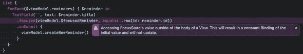

# 在 SwiftUI 列表视图中管理焦点

> 原文：<https://betterprogramming.pub/managing-focus-in-swiftui-list-views-286b139e6bca>

## 高级 SwiftUI 列表视图

## 看看 focus state——iOS 15 引入的新属性包装器

*基于 SF 符号*中“范围”图标的图像

管理焦点对于几乎任何类型的 UI 来说都是一个重要的方面——正确地管理焦点可以帮助你的用户更快更有效地浏览你的应用。在桌面用户界面中，我们希望能够通过按 tab 键来浏览表单上的输入字段，在移动设备上这一点同样重要。例如，在苹果的提醒应用程序中，光标会自动放置在你创建的任何新提醒中，当你点击 enter 键时，光标会前进到下一行。这样，您可以非常高效地添加新元素。

苹果在最新版本的 SwiftUI 中增加了对处理焦点的支持——这包括设置和观察焦点。

苹果自己的文档和其他人的[博客](https://swiftwithmajid.com/2020/12/02/focus-management-in-swiftui/)和[视频](https://www.youtube.com/watch?v=GqXVFXnLVH4)中的大多数例子都只讨论了如何以简单的形式使用它，比如登录表单。不包括高级用例，比如在可编辑列表中管理焦点。

在本文中，我将向您展示如何在允许用户编辑列表中的元素的应用程序中管理焦点状态。例如，我将使用 Make It So，这是我正在开发的一个待办事项应用程序。Make It So 是苹果提醒应用程序的复制品，其想法是计算出仅使用 SwiftUI 和 Firebase 我们可以接近原始应用程序的程度(详情见此 [Twitter 帖子](https://twitter.com/peterfriese/status/1453467058302291975)

# 如何在 SwiftUI 中管理焦点

> 一句警告:以下内容只能在 iOS 15.2 上的 SwiftUI 3 中使用，因此您需要 Xcode 13.2 测试版。在撰写本文时，还没有针对物理设备的 iOS 15.2 版本，所以目前你只能在模拟器上使用它。我相信苹果很快就会推出这款产品，他们甚至可能会对当前版本的 iOS 发布一个错误修复程序。

在 WWDC 2021 上，苹果推出了`@FocusState`，这是一个属性包装器，可以用来跟踪和修改场景中的焦点。

你可以使用一个`Bool`或者一个`enum`来跟踪你的 UI 中哪个元素被聚焦。

下面的例子使用一个带有两个案例的`enum`来跟踪一个简单用户概要表单的焦点。正如您在`Button`的闭包中看到的，我们可以通过编程来设置焦点，例如，如果用户忘记填写必填字段。

这种方法适用于只有少数输入元素的简单输入表单，但是对于显示无限数量元素的`List`视图或其他动态视图是不可行的。

# 如何管理列表中的焦点

为了管理`List`视图中的焦点，我们可以利用 Swift `enum`支持相关价值的事实。这允许我们定义一个`enum`来保存我们想要聚焦的列表元素的`id`:

这样，我们可以定义一个局部变量`focusedReminder`，它是`Focusable`枚举的一个实例，并使用`@FocusState`包装它。

当用户点击*新提醒*工具栏按钮时，我们向`reminders`数组添加一个新的`Reminder`。为了将焦点设置到这个新创建的提醒的行中，我们需要做的就是使用新提醒的`id`作为关联值来创建一个`Focusable`枚举的实例，并将其分配给`focusedReminder`属性:

这几乎就是在 SwiftUI `List`视图中实现基本焦点管理所需的一切！

# 处理回车键

现在让我们把注意力转向苹果提醒应用程序的另一个特性，它将提高我们应用程序的 UX:当用户点击 *Enter* 键时，添加新元素(并聚焦它们)。

当用户向视图提交值时，我们可以使用`.onSubmit`视图修饰符来运行代码。默认情况下，这将在用户点击 *Enter* 键时触发:

这很好，但是所有的新元素都将被添加到列表的*端*中。如果用户只是在列表的开头或中间编辑待办事项，这有点出乎意料。

让我们更新插入新项目的代码，并确保新项目直接插入到当前聚焦的元素之后:

这很好，但是有一个小问题:如果用户连续几次点击 *Enter* 键而没有输入任何文本，我们将会得到一堆空行——这并不理想。提醒应用程序自动删除空行，所以让我们看看我们是否也可以实现这一点。

如果您一直关注此事，您可能会注意到另一个问题:我们视图的代码变得越来越拥挤，我们将声明性 UI 代码与大量命令性代码混合在一起。

# MVVM 怎么样？

现在，那些一直关注我的博客和视频的人都知道我喜欢在 SwiftUI 中使用 MVVM 方法，所以让我们来看看如何引入一个视图模型来整理视图代码，同时实现一个移除空行的解决方案。

理想情况下，视图模型应该包含`Reminder`的数组、焦点状态和创建新提醒的代码:

注意我们是如何访问`createNewReminder`中的`focusedReminder`焦点状态来找出在哪里插入新的提醒，然后将焦点设置在新添加/插入的提醒上。

显然，`FocusableListView`视图也需要更新，以反映我们不再使用本地`@State`变量，而是使用`@ObservableObject`变量的事实:

这一切看起来很棒，但是当运行这段代码时，您会注意到焦点处理不再工作，相反，我们会收到一个 SwiftUI 运行时警告，提示*在视图主体之外访问 FocusState 的值。这将导致初始值的恒定绑定，并且不会更新*:

这是因为`@FocusState`符合`DynamicProperty`，只能在视图内部使用。

因此，我们需要找到另一种方法来同步视图和视图模型之间的焦点状态。对视图属性变化做出反应的一种方式是`.onChange(of:)`视图修改器。

为了在视图模型和视图之间同步焦点状态，我们可以

1.  将`@FocusState`添加回视图
2.  在视图模型上将`focusedReminder`标记为`@Published`属性
3.  并使用`onChange(of:)`同步它们

像这样:

> 旁注:这可以通过提取代码同步到`View`的扩展中来进一步清理。

至此，我们已经清理了我们的实现——视图关注于显示方面，而视图模型处理数据模型的更新以及视图和模型之间的转换

# 消除空元素

使用视图模型给我们带来了另一个好处——因为视图模型上的`focusedReminder`属性是一个已发布的属性，我们可以为它附加一个合并管道，并对属性的变化做出反应。这将允许我们检测先前聚焦的元素何时是空元素，并因此移除它。

为此，我们需要在视图模型上增加一个属性来跟踪先前聚焦的`Reminder`，然后安装一个合并管道，一旦空的`Reminder`的行失去焦点，就删除它们:

# 结论

这是一个关于如何为 SwiftUI `List` s 实施焦点管理的旋风式概述。结果看起来相当令人信服:

要了解如何在更大的环境中使用这些代码，请查看 MakeItSo 的[回购。MakeItSo 的用户界面更接近原版——毕竟，它试图尽可能地复制提醒应用程序。](https://github.com/peterfriese/MakeItSo/tree/develop)

代码存在于[开发分支](https://github.com/peterfriese/MakeItSo/tree/develop)中，这里是包含我们在这篇博文中讨论的代码的两个提交:

*   [✨实施焦点管理 peterfriese/make itso @ fbcc 56 f](https://github.com/peterfriese/MakeItSo/commit/fbcc56fe167c70d96ccd83a656cb4401b90fd940)
*   [✨删除单元格失去焦点时的空任务 peterfriese/make itso @ 0 dd0 b 72](https://github.com/peterfriese/MakeItSo/commit/0dd0b7274ef56ecbda6d20aa3562aa4a9fc0d495)

如果你想在我继续开发 MakeItSo 的过程中[跟随](https://twitter.com/peterfriese/status/1453467058302291975)，[订阅我的时事通讯](https://www.getrevue.co/profile/peterfriese)，或者[在 Twitter 上关注我](https://twitter.com/peterfriese)。

感谢阅读！

*原载于*[*https://peterfriese . dev*](https://peterfriese.dev/swiftui-list-focus/)*。*