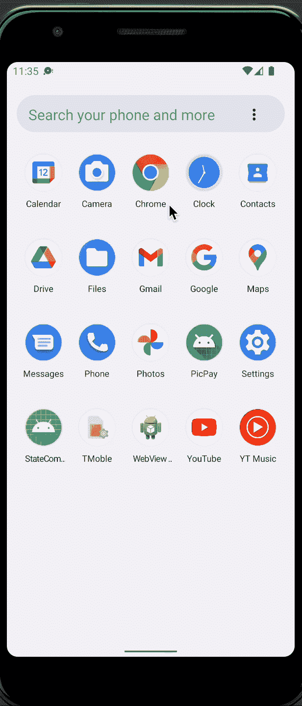
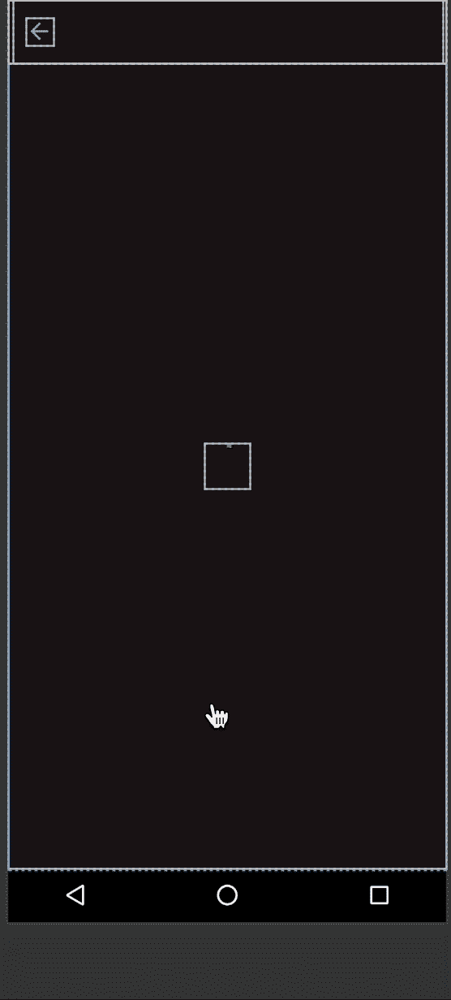
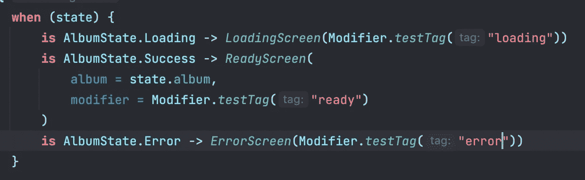

# 使用密封类管理 Jetpack 撰写 UI 状态

> 原文：<https://betterprogramming.pub/managing-jetpack-compose-ui-state-with-sealed-classes-d864c1609279>

## 使用密封类处理可组合视图的可能状态

照片由 [Anderson Rian](https://unsplash.com/@oandersonrian?utm_source=medium&utm_medium=referral) 在 [Unsplash](https://unsplash.com?utm_source=medium&utm_medium=referral) 上拍摄

更新 UI 以符合给定的状态是大多数 Android 开发人员的常规任务。最常见的工作之一是在来自 API 请求的加载、错误和成功状态之间转换。

在 XML 视图系统中管理 UI 状态是一个非常标准的过程，通常包括设置视图的属性以反映当前状态，并根据需要隐藏/显示视图。例如，隐藏加载视图，显示内容视图，并用所需的内容填充它。除了它的主要缺陷:人为错误，这个过程没有太多可谈的。

在您作为 Android 开发人员的职业生涯中，您可能会盯着一个基于视图绑定的屏幕看几分钟(对于非常复杂的布局甚至几个小时)，试图了解为什么您的 UI 没有正确更新，过了一段时间后发现您忘记了一个`myView.visibility = View.GONE`，这是一个普遍的错误，它是由手动更新每个可能状态的视图造成的。

# 状态和重组

Jetpack Compose 旨在通过使用`State`类来创建实际的反应式屏幕，更改状态的值会触发依赖于该相同状态的可组合函数的重新组合，换句话说，如果我们的状态对象持有一个字符串值，则每次更改时都会触发一个新的组合，提供更新的字符串值，而无需手动设置方法。这对每一个组合`State<T>`都是有效的，所以如果我们的 UI 状态保存在一个状态对象中，我们可以自动更新 UI 的每一个状态变化。

但是说够了，让我们做一些真正的代码。

# 设计我们的 UI 状态

首先，让我们创建一个负责描述屏幕可能状态的密封类，这个特殊的用例需要 3 种不同的情况:加载、出错和就绪。

Gist1:创建 UIState 密封类

注意，在这个场景中，包含任何数据的唯一状态是`Success`，这是因为我们的用例不需要任何加载或错误状态的附加信息。

# 处理状态更改

我们的用例遵循 MVVM 模式，因此屏幕的当前状态将存储在视图模型中。

一个私有的`MutableStateFlow`将用于保存 UI 状态，一个公共的 StateFlow 为我们的 Compose 视图传播这个信息，一个模拟的实现使用一个延迟来模拟由异步请求引起的加载状态。

因为我们知道一旦 ViewModel 被实例化，就会启动一个 API 请求，所以我们可以安全地假设屏幕的起始状态是 loading。

# 对状态变化做出反应

AlbumState 设置就绪后，我们将转到 UI，让它根据存储在 ViewModel 中的当前状态进行反应和重组。

这个布局由两个不同的可组合函数组成，`AlbumScreen`包含注入的`ViewModel`，以及它的无状态伴随内容，负责布局配置。

内容包含一个默认的材质设计框架，该框架包含一个顶栏和一个`when`案例，负责通知每个`AlbumState`应该显示什么。当运行应用程序时，我们可以看到我们的行为正在按预期工作。

# 预览多个状态

预览可以帮助开发人员看到正在编写的合成 UI 的可视化表示。

为了避免重新启动应用程序来查看每个状态的视觉结果，我们可以使用一个带注释的预览功能和一个`PreviewParameter`提供程序来呈现我们所有状态的唯一预览。

通过这样做，我们可以断言两件事:每个屏幕的布局都是正确设计的，并且所有可能的状态都是互斥的。

声明一个`PreviewParameterProvider<T>`允许在预览注释函数中使用这个提供者，它的工作方式是为包含在值序列中的每个值生成一个新的预览。

现在，在“设计”选项卡中，我们可以看到为每个状态生成的其他预览:

# 单元测试 UI 状态

屏幕状态现在存储在 ViewModel 中，所以编写单元测试来保证状态被正确更新是很有趣的。由于 UI 的状态是 StateFlow，我们可以使用 Turbine 库来更容易地收集我们的流的每个值。

> 下面的测试是用 Kotlin 协同程序版本 1.6.1 编写的。测试 API 可能会根据您使用的版本而变化。

# UI 状态检测测试

插装测试对于保证组件显示给定状态的正确布局非常有用。这些测试可以用 UI 测试的组合标准库来编写。

在这种情况下，对于每种状态，将使用不同的 composable，因此可以添加一个测试标签用于我们的测试。测试标签将作为我们测试的标识符，所以我们可以断言哪个组件显示在屏幕上。

# 什么时候应该对 UI 状态使用密封类？

当 UI 有一组互斥的布局时，密封状态非常有用。这种方法(如果正确实现的话)保证了在任何给定的时间只有一个屏幕状态是可见的，避免了同时呈现多个状态可能导致的错误。

# 何时不对 UI 状态使用密封类

当 UI 不需要互斥的布局时，使用密封类来处理状态可能一点用都没有，有时，甚至是一个只会增加状态管理复杂性的问题。对于这些情况，最好使用包含所需信息的单个数据类。

完整的示例代码可从以下网址获得:

[https://github.com/Alaksion/ComposeStateSample](https://github.com/Alaksion/ComposeStateSample)