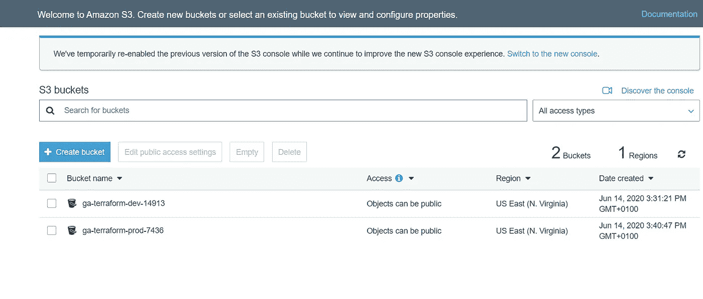
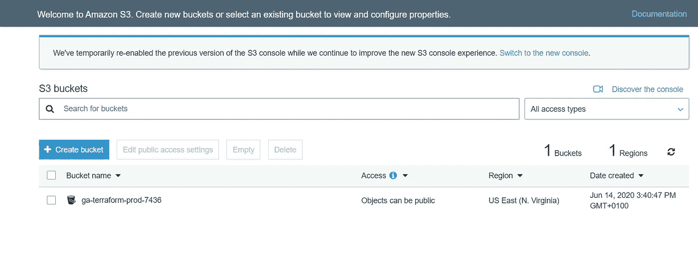
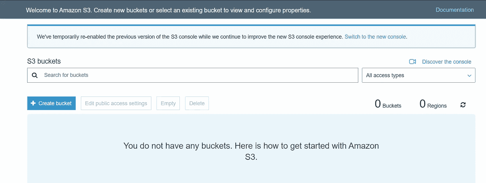

# 在 Terraform 中管理多个环境

> 原文：<https://betterprogramming.pub/managing-multiple-environments-in-terraform-5b389da3a2ef>

## 如何使用 Terraform 工作空间管理多个状态


约翰·奥诺兰在 [Unsplash](https://unsplash.com?utm_source=medium&utm_medium=referral) 上拍摄的照片。

[Terraform](https://www.terraform.io/) 彻底改变了我们看待基础设施的方式，有了云，它是迈向“一切如代码”的垫脚石这是计算历史上的一次巨大飞跃，所有东西——包括硬件和操作系统——都被虚拟化，可以被定义为代码。

Terraform 简化了基础设施架构师、管理员和组织的生活，它有助于构建一个不断变化、比以往任何时候都更具可扩展性和弹性的计算基础设施。

Terraform 使用一组声明性的、高级的、幂等的代码来定义基础设施。基础设施管理员通常只需要声明他们想要什么样的基础设施，而不用担心内部 API 调用。

Terraform 与云无关，可以帮助您使用一个设置管理多个云配置。您还可以声明分布在云中的组件之间的依赖关系。

IaC 的一个挑战是可重用性。Terraform 建议你保持代码干爽(不要重复自己)。如果您正在管理多个环境，这一点尤其正确。

# 管理多种环境

让我们举一个我们大多数人在工作中面临的典型场景。组织通常有多种运行软件的环境。一个是开发环境，开发人员在这里开发新的软件；一个是测试环境，测试人员在这里测试开发的代码；还有一个是生产环境(或者生活环境)，终端客户在这里与软件进行交互。

通常，应用于开发环境的代码和配置转移到测试，并在测试后最终转移到生产。因此，基础设施也应该如此。

让我们来看看使用 Terraform 在多种环境中管理基础设施的方法。

## 策略 1:为每个环境创建单独的目录

这是一个显而易见的。只需为每个环境创建单独的文件夹，并为开发、测试和生产环境重复配置。典型的树看起来像这样:

嗯，这可能看起来是一个明智的开始，但有几个问题:

1.  我们现在必须维护相同配置的三个副本。
2.  这种配置不是 CI/CD 友好的，因为需要人工干预才能将代码提升到更高的环境中。

## 策略 2:使用工作空间

到目前为止，您可能已经发现，这些环境之间的唯一区别是变量值和状态文件。

我们有两个要求:

1.  应该有一种为每个环境动态指定单独变量的方法。
2.  应该有一种方法来管理每个环境的不同状态。

Terraform 提供了一种使用工作空间实现这一点的方法。

# 工作区简介

Terraform 中的工作空间只是独立管理的状态文件。

如果我们使用本地后端来存储 Terraform 状态，Terraform 会创建一个名为`terraform.tfstate`的文件来存储应用配置的状态。但是，在不同的上下文中可以使用相同的配置的情况下(例如在不同的环境中)，可能需要不同的状态，但是可能会使用相同的配置。

Terraform 默认使用工作空间，如果您没有声明工作空间，您仍然在使用默认的工作空间。当您创建一个工作空间并在那里应用您的 Terraform 配置时，Terraform 会创建一个名为`terraform.tfstate.d`的目录。在其中，它为每个工作区创建一个子目录。子目录包含特定工作区的单个状态文件，如下例所示:

让我们来看一个动手练习，了解它在现实生活中是如何工作的。

# 先决条件

1.  AWS 账户。这个练习使用一个 S3 桶，这是一个自由层服务。
2.  系统上安装的 Terraform 0.12 CLI。

# 创建 Terraform 文件

让我们为这个练习克隆这个 GitHub 库:

```
$ git clone [https://github.com/bharatmicrosystems/terraform-workspaces.git](https://github.com/bharatmicrosystems/terraform-workspaces.git)
```

将目录更改为克隆的存储库，让我们看看各个文件:

`project_name`变量是一个映射，默认为键`dev`的`ga-terraform-dev`和键`prod`的`ga-terraform-prod`。`variables.tf`文件还定义了两个名为`env`和`aws_region`的字符串变量。

`main.tf`文件声明了`aws_s3_bucket`，并且对`random_id`资源有一个隐式的依赖关系。我们使用`random_id`资源来生成一个随机数，以使 S3 桶是全局唯一的。在`aws_s3_bucket`资源中，我们在`var.project_name`映射中查找`var.env`键。

`outputs.tf`文件将桶名定义为输出。

# 部署到开发环境

让我们从第一次部署到开发环境开始。

创建一个名为`dev`的新工作空间:

```
$ terraform workspace new devCreated and switched to workspace "dev"!You're now on a new, empty workspace. Workspaces isolate their state, so if you run "terraform plan," Terraform will not see any existing state for this configuration.
```

使用`env=dev`规划您的平台部署:

应用计划:

如你所见，Terraform 创建了一个名为`ga-terraform-dev-14913`的 bucket。

# 部署到生产环境

现在，让我们对 prod 环境重复同样的操作。

创建一个名为`prod`的新工作区:

```
$ terraform workspace new prodCreated and switched to workspace "prod"!You're now on a new, empty workspace. Workspaces isolate their state, so if you run "terraform plan," Terraform will not see any existing state for this configuration.
```

用`env=prod`运行地形计划:

应用计划:

Terraform 创建了一个名为`ga-terraform-prod-7436`的新桶。

# 检查控制台中的铲斗

转到 AWS 控制台-> S3，您将看到 Terraform 为每个环境创建了两个单独的存储桶:



# 查看地形状态

列出根模块的树:

我们看到有一个`terraform.tfstate.d`目录，其中有每个工作区的子目录，每个文件夹都有其状态文件。

# 毁坏水桶

现在让我们摧毁我们创造的一切。让我们先从开发环境开始，然后转到生产环境。

切换到`dev`工作区:

```
$ terraform workspace select dev
Switched to workspace "dev".
```

执行`terraform destroy`并在提示确认时键入`yes`:

让我们检查 AWS 控制台并刷新:



如你所见，Terraform 摧毁了`dev`铲斗，但`prod`铲斗未受影响。

现在就来摧毁`prod`桶吧。

切换到`prod`工作区:

```
$ terraform workspace select prod
Switched to workspace "prod".
```

执行`terraform destroy`并键入`yes`确认:

让我们现在查看 AWS 控制台并刷新。你会发现 Terraform 删除了`prod` S3 桶。



这表明两个环境都是彼此独立运行的，并且都有它们自己的状态文件。

# 结论

Terraform Enterprise 和 Cloud 通过将工作区链接到 VCS 存储库，将工作区提升到了一个新的水平，在这里您可以直观地规划和应用您的部署。您还可以与团队协作，因为构建在一个中心位置运行，每个人都可以查看和管理。

感谢阅读！我希望你喜欢这篇文章。下一集见。