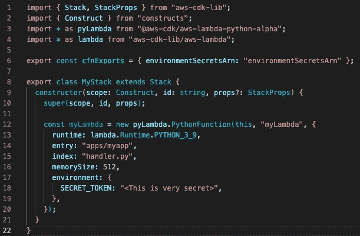
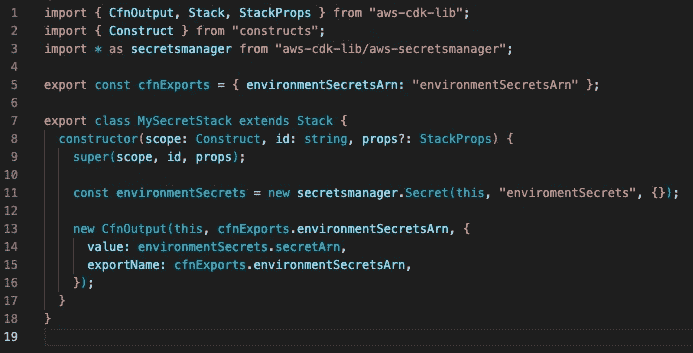
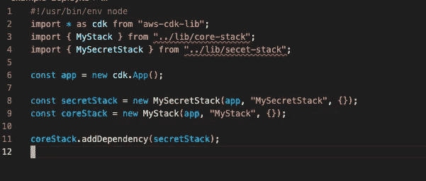
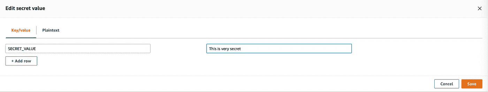
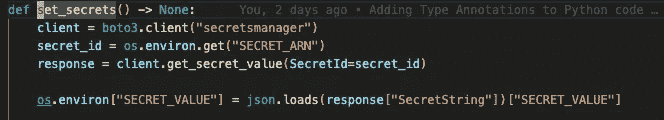

# 使用 AWS 云开发套件管理秘密(CDK)

> 原文：<https://betterprogramming.pub/managing-secrets-with-aws-cloud-development-kit-cdk-25ec1e80dfc3>

## 在 CDK 堆栈中使用机密管理器

由 [iMattSmart](https://unsplash.com/@imattsmart?utm_source=medium&utm_medium=referral) 在 [Unsplash](https://unsplash.com?utm_source=medium&utm_medium=referral) 拍摄的照片

我最近一直在做一个个人项目，在这个项目中，我决定第一次使用并了解更多关于 AWS CDK 的信息。总的来说，这是一次愉快的学习经历，但我在如何最好地存储和访问一些秘密信息方面遇到了一些困惑，这篇文章描述了我是如何解决这个问题的。

# 为什么是 CDK？

[AWS 云开发套件(CDK)](https://aws.amazon.com/cdk/) 是一个框架，允许工程师用熟悉的编程语言将他们的基础设施定义为代码，而不必手动管理他们的基础设施或编写原始云信息。

在我的项目中，我在 TypeScript 中使用 CDK，但它也可以在 Python 和 Java 等其他语言中使用。编写 CloudFormation 对我来说总是感觉乏味和冗长，我喜欢使用 CDK。

# 我的堆栈

出于这个例子的目的，我有一个 Lambda(运行 Python 应用程序)需要一个秘密令牌。

我的 Lambda 函数需要一个秘密令牌才能运行。

我可以在这里硬编码我的秘密，但是，这是一个坏主意。根据我提交此代码的位置，我可能会意外地共享信息，这些信息可能会让其他用户能够访问我的帐户或作为我的应用程序采取行动。在这里对它们进行硬编码还会导致它们在 CloudFormation 中可见，并且在控制台中对任何能够访问它的人可见。

秘密应该是秘密！

我也可以将我的`SECRET_TOKEN`设置为一个虚拟值，并在部署我的 Lambda 之后在控制台中设置真实值——Lambda 确实会加密环境变量——但这仍然会允许任何有权检查 Lamba 的人看到明文秘密。

对于某些秘密，这种方法可能还是太松懈了。此外，在开发过程中，我的 Lambda 经常被重新构建，这很快成为一个乏味的额外步骤。

# 使用 AWS 机密管理器

为了解决我的问题，我决定使用 [AWS 秘密管理器](https://aws.amazon.com/secrets-manager/)来存储我的秘密。Secrets Manager 中的 Secrets 是＄0 . 40/月，但是 Secrets 可以是一个具有多个键/值对的 JSON blob 因此您可以在一个 secret 中存储多个相关的值。

## 在 CDK

我没有预见到这个基础设施会有太大的变化，所以我创建了一个新的独立堆栈`MySecretStack`来编写 Secrets Manager 的 CDK。它只包含一个空的秘密`environmentSecrets`和一个`CfnOutput`——这是一个可以用来从堆栈中输出一个值的构造。在这种情况下，我们导出秘密的 ARN。

CDK 是我的秘密，出口是它的 ARN。

我的 Lambda 现在需要知道如何引用这个秘密，所以我没有将`SECRET_VALUE`传递给我的环境变量，而是从另一个堆栈传递了这个秘密的 ARN。注意，我还需要添加一个 IAM 策略来允许读取这个秘密，并且我需要将这个策略分配给我的 Lambda 的执行角色。

Lambda 现在引用了这个秘密的 ARN，并且有权限获取这个秘密的值。

## 部署多个堆栈

之后，我需要在 CDK 应用程序中部署这两个堆栈。我还让我的`coreStack`(包含 Lambda 的那个)，依赖于`secretStack`来确保秘密 Arn 在需要时可用。

核心堆栈依赖于 secretStack 的输出。

过了这一关，就该部署了！

## 在机密管理器中

成功部署后，我需要登录 AWS Secrets Manager 控制台，手动输入我的秘密。这是一个额外的步骤，但我不应该经常这么做，因为`SecretStack`不需要改变，除非我需要添加额外的秘密。这比我每次重新部署 Lambda 时都必须输入`SECRET_VALUE`要简单得多。

此外，如果我有需要按某种计划轮换的机密，Secrets Manager 可以定义轮换处理程序来自动解决这个问题。

添加包含我的原始 SECRET_VALUE 的新键/值对。

## 解析我的 Lambda 函数中的秘密

栈被部署，秘密值被存储在秘密管理器中，但是我需要一个额外的步骤来使用这些秘密。在我实际的 Lambda Python 应用程序代码中，我需要访问这个秘密。

我使用`boto3`来访问 Secrets Manager，并从存储在 Secret 中的键/值对中设置环境变量。还有一种方法是使用 [Lambda Powertools](https://awslabs.github.io/aws-lambda-powertools-python/latest/utilities/parameters/#fetching-parameters) 来获取秘密，我可能会转而使用它。

请注意，以这种方式检索秘密确实会产生一点额外的成本，因为您需要为 Secrets Manager 的请求支付费用(每 10，000 次 API 调用 0.05 美元)，然而，在我目前使用的应用程序中，这是可以忽略不计的。

根据存储在 Secrets Manager 中的值设置环境变量。

## 为什么不直接在 CDK 解决这个秘密？

我可以使用`[SecretValue](https://docs.aws.amazon.com/cdk/api/v2/docs/aws-cdk-lib-readme.html#secrets)` [构造](https://docs.aws.amazon.com/cdk/api/v2/docs/aws-cdk-lib-readme.html#secrets)通过 CDK 直接解决它，而不是解决应用程序代码中的秘密。由于 Secrets Manager 检索秘密的成本，使用动态引用会稍微便宜一些，但是有一些[额外的考虑事项](https://docs.aws.amazon.com/AWSCloudFormation/latest/UserGuide/dynamic-references.html)要记住——并且`SecretValue`构造本身建议直接在代码中解析 Lambda 函数中需要的秘密。

正如我上面提到的，这是我使用 AWS CDK 的第一个项目——我还在学习！如果你对我有意见或建议，我很想听听！