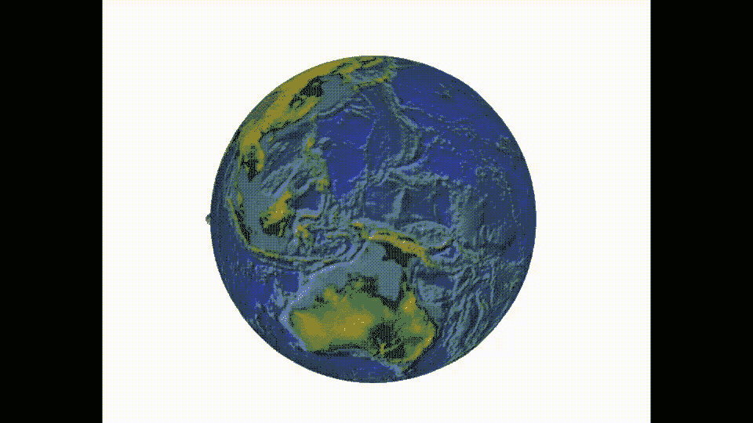
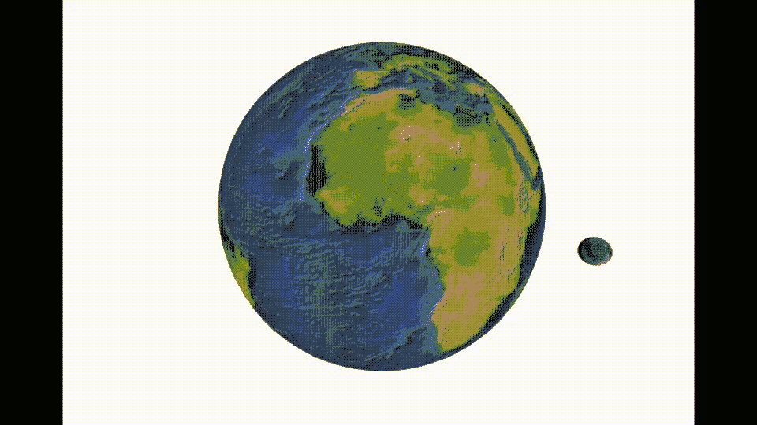
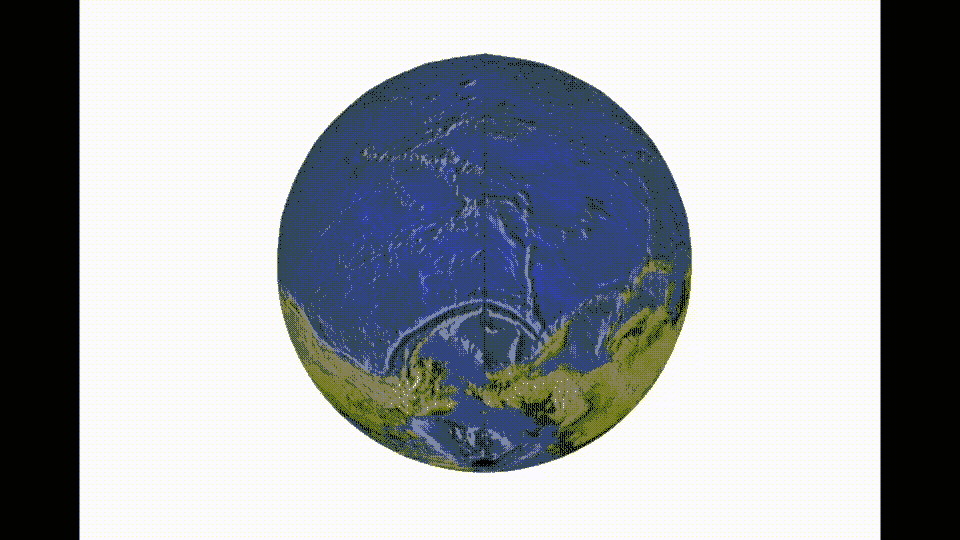
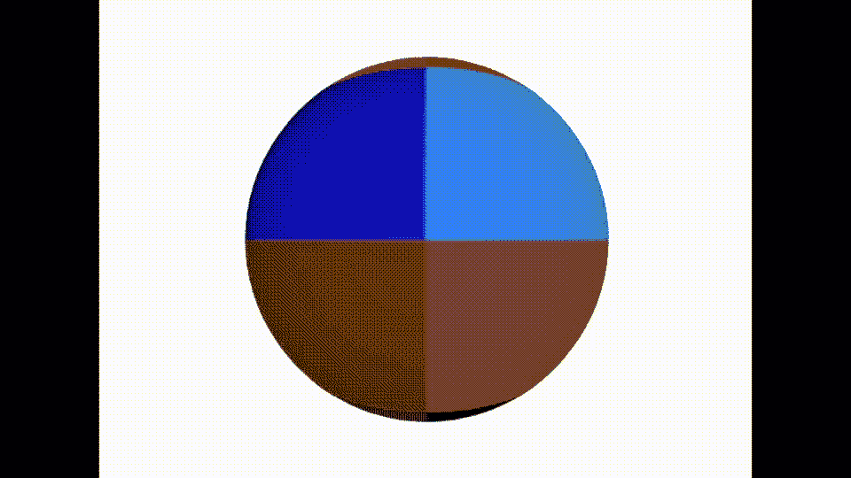

# 在 SwiftUI 下的 SceneKit 中管理摄像机

> 原文：<https://betterprogramming.pub/managing-the-camera-in-scenekit-under-swiftui-6608e7a0de52>

## 穿越相机管理陷阱之旅


在我前几周发表的一篇[文章](/3-ways-to-rotate-objects-in-scenekit-86ed8c2f5490)的结尾，我给出了一个在 SceneKit 中进行旋转的黄金标准的例子，实际上是在大多数计算机图形编码中，即四元数。

在这篇文章中，我想更深入/实际地看看如何使用它们来管理 3D 编码中同样令人困惑的方面，即相机。

我先来一张动画 GIF。行星和月球之一。使用此代码拍摄的地球和月球旋转的卫星图像。

其中的订阅由一个计时器触发，该计时器每秒向每个订阅发送一个值。



现在，客户，想象一下 SpaceX 希望你用龙飞船取代月球。但很明显，他们不希望它有一半时间消失在星球后面；他们想让你跟着船。

# 旅程

你知道如何旋转物体吗？我们看到的是一件轻而易举的事，但摄像机却是另一回事。你开始使用我在这篇[论文](https://medium.com/analytics-vidhya/shapes-with-paths-using-swiftui-part1-fb7250d3dce8)中用来构建圈子的相同技术——用那些旧的最爱 s in 和 cos。然后，使用欧拉几何体围绕行星水平和垂直旋转预先构建的路径，并将摄影机附加到该路径。预先计算好的轨迹。


正如你所看到的，这是一次很棒的飞越，但是月球——龙模块在这张 GIF 中仍然是一个很小的角色。事实上地球也变成了这样，我们不会提到行星的扭曲或形状奇怪的月亮。

希望问题很明显；您需要旋转相机来跟随旋转的行星—您可以使用以下代码完成这项任务:

我在这里做的是将预先计算的位置与地球的旋转相匹配，以便地球/相机保持对齐。我向你保证，这是相同的代码，只是更多的旋转进行。



这样效果更好；至少一切都在镜头里，但它并不完美——有一个小故障——你不需要做这么多的计算。

好的——更简单的数学，你可以使用约束来做同样的事情[你从`UIKit`开始就记得这些]。你可以约束相机，使其焦点保持在地球上；让`SceneKit`计算一下。更好的是，你也可以限制距离。

bon——这个效果更好。没有故障，也没有复杂的数学运算。唯一剩下的问题是月球，也就是我们的龙模块仍然在框架之外。你需要改变预先计算好的路径来更好地跟随月亮。



现在，虽然我们使用四元数来旋转行星，到目前为止，我们只是为相机使用了预烘焙的路线。

要做一些更动态的事情，你需要像这样使用代码。在其中，我决定使用两个四元数，然后使用`simd`库中的`slerp`函数选择它们之间的最短路径。神奇的数字 0.5 表示中心点。

通过 HUD 使用它，您可以水平或垂直移动，或者同时向两个方向移动。它看起来不错，但要注意，我们正在走向一个编码员的兔子洞。

改变地球的外观，让你的疯狂变得更加明显，并在混合物中加入一些牙膏来显示路径。

通过改变约束中 gimble-lock 周围的限制或在每次通过时动态重新计算角度来更改路径。

结果看起来像这样，一个 GIF 显示了丑角色的地球——有一个非常好的地球映射路线穿过它。



一条显示四元数计算的路径，描绘了行星向上攀爬，环绕，然后水平穿过赤道的概况。

所有这些使我想到了本文的结尾。我希望你在这里学到了一些东西，并像我写它一样喜欢阅读它。试着在你自己的版本中使用`slerp`，并在这个过程中获得一些乐趣。

```
**Want to Connect?**Join me on [LinkedIn](https://www.linkedin.com/in/mark-lucking-4631049/) to connect, collaborate or just a chat.
```