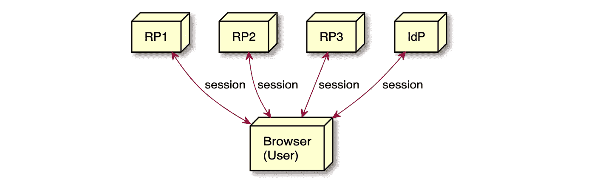
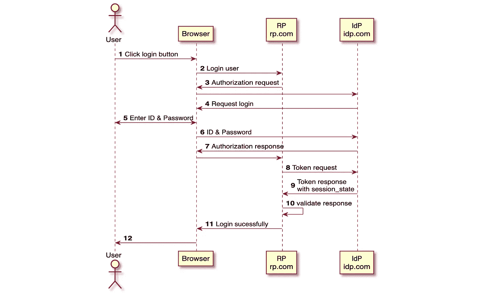
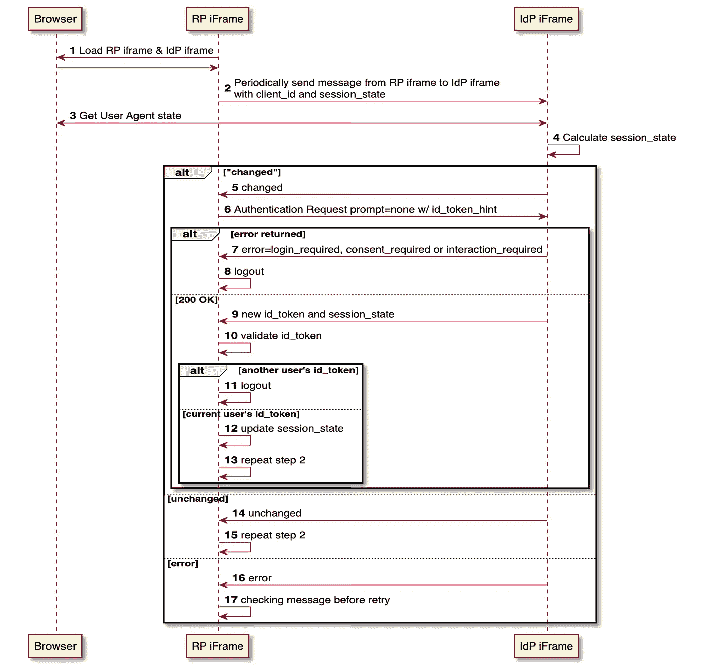
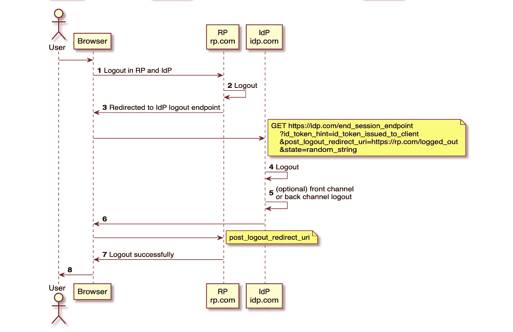
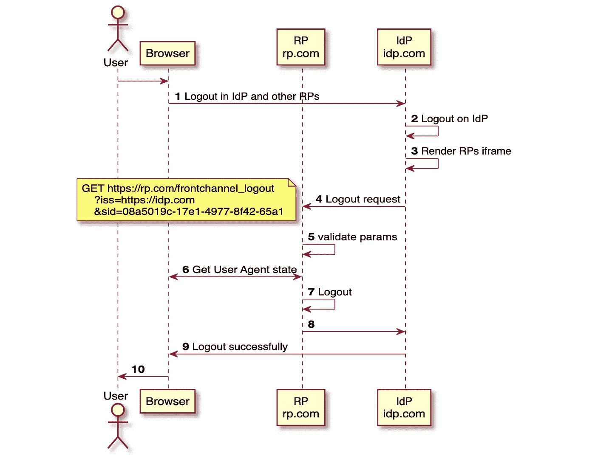
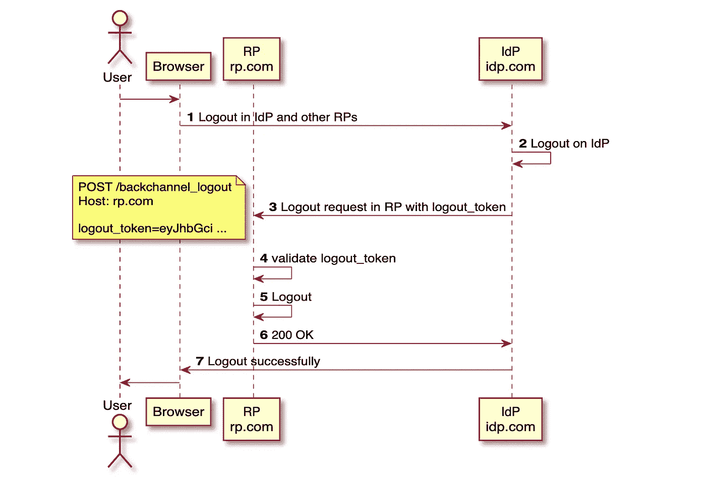

# 管理用户会话和 OpenID 连接注销

> 原文：<https://betterprogramming.pub/managing-user-sessions-and-openid-connect-logout-eb886facd321>

## 深入研究四个 OpenID 连接注销规范

[马太·亨利](https://unsplash.com/@matthewhenry?utm_source=medium&utm_medium=referral)在 [Unsplash](https://unsplash.com?utm_source=medium&utm_medium=referral) 上拍照

对违反策略或安全问题的及时响应确实需要令牌发放者(IdP)和依赖方(RP)之间的“对话”。这种双向对话给了我们两个重要的能力。

依赖方可以注意到何时发生了变化(例如，客户端来自新的位置)并告知令牌发放者。

它还为令牌发放者提供了一种方式，告知依赖方由于帐户泄露、禁用或其他问题而停止尊重给定用户的令牌。

在本文中，让我们深入研究四个 OpenID Connect 注销规范，看看它在今天是否仍然适用。

# 依赖方(RP)和身份提供商(IdP)中的会话

在 OAuth2 世界中，有两个会话，它们是 RPs(依赖方)和 IdP(身份提供者)中的会话。

当某个事件发生时，RP 和 IdP 可能想要相互通信，并且可能需要某个动作(例如:注销或重新认证)。

*   (在 IdP 中)用户帐户被删除或禁用
*   (在 IdP 中)密码已更改或重置
*   (在 IdP 中)IdP 检测到帐户接管风险
*   (在 IdP 中)从 IdP 注销，然后也在 RP 中注销
*   (在 RP 中)从 RP 中注销，然后也在 IdP 中注销

OpenID Connect 的注销功能在以下规范中定义:

*   [OpenID 连接会话管理 1.0](https://openid.net/specs/openid-connect-session-1_0.html) —定义基于 iFrame 的注销功能。
*   [OpenID Connect RP 发起的注销 1.0](https://openid.net/specs/openid-connect-rpinitiated-1_0.html) —定义 RP 发起的注销功能。
*   [OpenID Connect 前通道注销 1.0](https://openid.net/specs/openid-connect-frontchannel-1_0.html) —定义一种注销机制，该机制通过用户代理在被注销的 IdP 和 RPs 之间使用前通道通信。
*   [OpenID Connect 反向信道注销 1.0](https://openid.net/specs/openid-connect-backchannel-1_0.html) —定义一种注销机制，该机制使用 IdP 和被注销的 RPs 之间的直接反向信道通信。

让我们深入研究一下这些规范，看看它们在今天是否仍然适用。

# OpenID 连接会话管理 1.0

在 OpenID Connect 中，我们仍然有相同的流程来获取 ID 令牌，但是，对于支持会话管理的 IdP，在返回令牌时，IdP 还会在认证响应中返回`session_state`参数(下图中的步骤 9)。这个`session_state`值最初是在 IdP 服务器上计算的，随后同一个`session_state`也被用户代理中的 IdP 帧重新计算。

IdP 支持会话管理在认证响应中返回 session_state。

然后，RP 通过从 RP 将 IdP 的端点加载到 iFrame 中来监视用户在 IdP 的登录状态，然后使用 Javascript 向 iFrame 发送消息。

1.  RP 从自身加载一个不可见的 iframe。IdP 有一个名为`check_session_iframe`的端点，RP 将这个不可见的 iframe 加载到自身中。
2.  RP 使用`client_id`和`session_state` :
    `win.postMessage("clientid" + " " + "session state", idp.com")`周期性地从 RP iframe 向 IdP iframe 发送消息
3.  在 cookie 或 HTML5 本地存储中获取 IdP 的用户代理状态。
4.  IdP 验证消息，重新计算`session_state`，并将结果发送回 RP iframe。
5.  如果结果是`changed`，这意味着由于 IdP 上的一些用户活动(例如:登录、注销、会话添加)，会话已经改变。
6.  RP 在 iframe 中尝试一个`prompt=none`请求来获取新的 ID 令牌和会话状态，将旧的 ID 令牌作为`id_token_hint`发送。
7.  如果请求返回错误`error=login_required`、`consent_required`或`interaction_required`，
8.  那么它需要将这种情况作为注销来处理。
9.  如果请求返回新的 ID 标记和会话状态，请验证 ID 标记。如果 ID 令牌属于另一个用户，则作为注销来处理这种情况。如果 ID 令牌是针对同一个当前用户的，RP 会更新会话状态的值，并重复步骤 2 以保持轮询。

14.如果`check_session_iframe`返回`unchanged`，表示会话未改变，重复步骤 2 继续轮询。

16.如果`check_session_iframe`返回`error`，意味着 IdP iframe 无法处理请求(例如:格式错误的消息语法消息)。RP 应考虑在再次发送给 IdP 之前检查邮件。

这种方法的优点是我们有接近实时的会话同步。缺点是，在第 3 步中，IdP 在 iframe 中的 Javascript 代码获取 cookie 或 HTML5 本地存储中的用户代理状态。RP iFrame 和 IdP iFrame 通常在不同的域中，因此这是第三方上下文。随着最近的更新，浏览器正朝着默认完全阻止第三方 cookies 的方向发展，以阻止一些用于跨网站跟踪用户活动的机制。此外，使用 Safari 的 ITP，用 JavaScript 创建的 cookies 和脚本可写存储只有 7 天的有效期。这意味着每次 RP iframe 调用 IdP 的`check_session_iframe`，即使用户登录 IdP 并且没有会话改变，IdP 也不能获得用户代理状态并总是返回`changed`，导致**无限循环的重新认证**。所以这个规范以后可能不再管用了。

# OpenID Connect RP 启动的注销 1.0

该规范描述了一个从 RP 发起的请求，该请求通过将用户的用户代理重定向到 IdP 的注销端点来告知 IdP 注销。

1.  RP 和 IdP 中的用户请求注销
2.  在 RP 中注销(例如:删除 cookies)
3.  重定向至 IdP 注销端点`end_session_endpoint`，该端点可通过 OpenID Connect Discovery 的响应获得。其他参数有:
    `id_token_hint`(推荐):之前发给客户端的 ID 令牌。`post_logout_redirect_uri`(可选):执行注销后 IdP 应该重定向到的 URL(步骤 6)。
    `state`(可选):如果包含，则在步骤 6，IdP 在重定向请求中将该值传回 RP。
4.  在 IdP 中注销(例如:删除 cookies)
5.  (可选)IdP 可能通过使用前通道或后通道注销来触发从其他 RP 的注销
6.  IdP 在`post_logout_redirect_uri`重定向到 RP 端点。
7.  如果返回`state`，验证`state`，并成功注销。

RP 发起的注销可以与 OpenID 连接会话管理、OpenID 连接前通道注销或 OpenID 连接后通道注销分开使用或结合使用。

# OpenID 连接 OIDC 前频道注销 1.0

该规范定义了一种注销机制，该机制通过用户代理在 IdP 和被注销的 RPs 之间使用前端通道通信。

1.  用户在 IdP 和其他 RPs 中请求注销
2.  在 IdP 中注销(例如:删除 cookies)
3.  IdP 在客户端注册过程中呈现先前注册了`frontchannel_logout_uri`端点的所有 RPs iFrame。
4.  IdP 加载 iFrame 中的每个 RP `frontchannel_logout_uri`端点。IdP 可以添加这些查询参数:
    `iss`:发布前通道注销请求的 IdP 的发布者标识符。
    `sid`:会话的标识符。
    两个参数都可以从 ID 令牌中检索。
5.  RP 验证参数(如果有)
6.  在 cookie 或 HTML5 本地存储中获取 RP 的用户代理状态。
7.  在 RP 中注销(例如:删除 cookie)
8.  向 IdP 返回成功注销。

该规范的缺点与 OpenID 会话管理相同。随着最近的更新，浏览器正朝着默认完全阻止第三方 cookies 的方向发展。在步骤 6 中，当由 IdP 在 iframe 中呈现时，RP iframe 可能无法访问 RP 的登录状态，因为 iframe 与 IdP 的页面来自不同的地方。**所以这个规范以后可能不再管用。**

# OpenID 连接反向通道注销 1.0

该规范定义了注销机制，该机制使用 IdP 和被注销的 RPs 之间的直接反向信道通信。

1.  用户在 IdP 和其他 RPs 中请求注销
2.  在 IdP 中注销(例如:删除 cookies)
3.  IdP 使用`logout_token`向 RPs 创建反向信道注销请求，RPs 之前在客户端注册过程中注册了`backchannel_logout_uri`端点。`logout_token`是一种类似于 ID 令牌的 JWT。
4.  验证`logout_token`。关于令牌以及如何验证它的更多细节，请看一下规范。
5.  在 RP 中注销。为了注销，RP 应该有一个从后端终止用户会话的方法。
6.  向 IdP 返回成功注销。

该规范的优点是 RP - IdP 之间的通信比用户代理更可靠，并且不受阻止第三方 cookies 的影响。缺点是 RP 需要有一个方法来从后端管理用户会话，这可能比简单地清除 cookies 和 HTML5 本地存储状态更复杂。

# 结论

在本文中，我们讨论了 4 个 OpenID Connect 注销规范。请注意，在撰写本文时，只有 OpenID Connect 反向通道注销和 RP 发起的注销不受阻止第三方 cookies 的影响。通过支持 OpenID 注销，RP 和 IdP 可以在整个系统中保护他们的用户和数据，因为它可以确保 SSO 会话中没有活动会话会被劫持或误用。

# 参考

*   [转向实时策略和安全实施](https://techcommunity.microsoft.com/t5/azure-active-directory-identity/moving-towards-real-time-policy-and-security-enforcement/ba-p/1276933)
*   [OpenID 连接单点注销](https://curity.io/resources/learn/openid-connect-logout/) (curity.io)