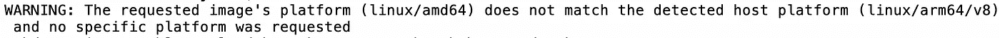
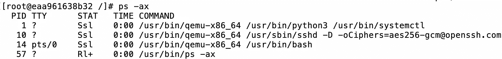
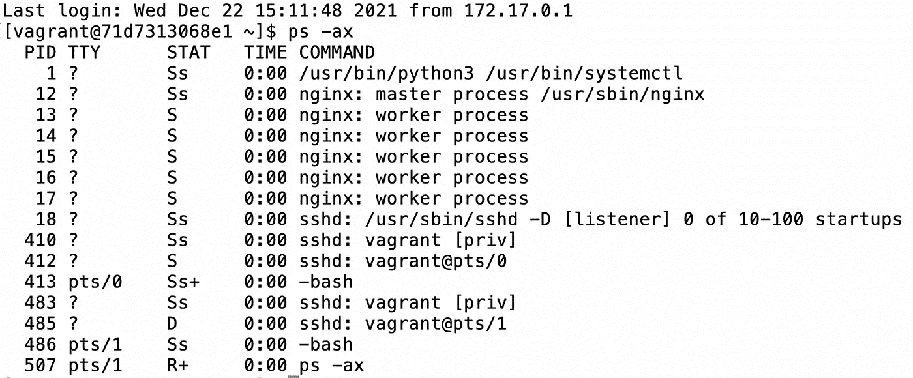
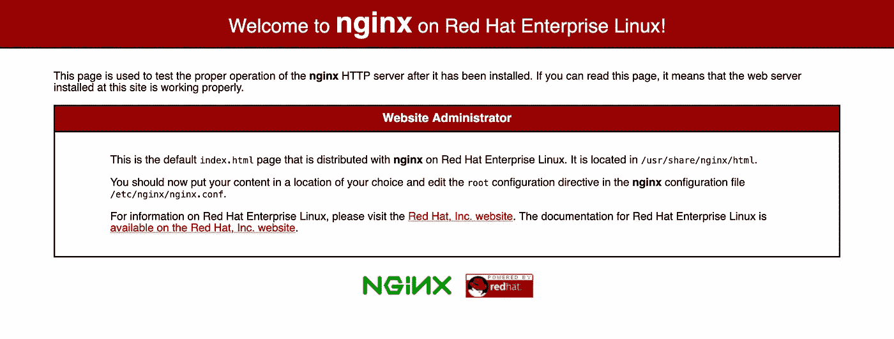

# 在新 Mac 电脑 M1 和 M2 上运行虚拟机

> 原文：<https://betterprogramming.pub/managing-virtual-machines-under-vagrant-on-a-mac-m1-aebc650bc12c>

## 当 VirtualBox 不再工作时，寻找一个工作的虚拟机替代


[天一马](https://unsplash.com/@tma?utm_source=medium&utm_medium=referral)在 [Unsplash](https://unsplash.com?utm_source=medium&utm_medium=referral) 上拍照

如果你看到了这篇文章，你可能已经升级到一台崭新的 Macbook Pro 或运行新 M1 处理器的类似产品。

在你按下“立即购买”按钮之前，可能没人会告诉你，你用[vagger](https://www.vagrantup.com/)和 [Virtualbox](https://www.virtualbox.org/) 精心打造的所有现有 x86–64 机器将不再运行！

# 为什么不管用？

您的虚拟机不再运行的主要原因是 VirtualBox 在您的 Mac 上作为虚拟机管理程序运行，依赖底层处理器执行指令，而不是通过软件提供处理器仿真。

这一点很重要，因为旧的英特尔版本的 Mac 能够直接在底层硬件上运行 x86–64 版本的您最喜爱的应用程序。新的 M1 是一个完全不同的芯片组(ARM ),由于 VirtualBox 不是一个 CPU 模拟器，它无法为你运行那些现有的镜像。

# 远离 VirtualBox

在 2021 年底深入研究这个话题后，我觉得可行的选择相对较少。

让机器重新运行的“最快”选择是迁移我的 VirtualBox。vdi 文件转换为开放格式，如. qcow2，并在真正的仿真器下运行，如 [UTM](https://getutm.app/) 。

如果您需要以最小的改动快速启动虚拟机，这可能是您的最佳选择。这也可能是 Windows VM 的唯一真正选择，因为目前还没有可以合法购买并在 ARM 上运行的 Windows 商业版本。

还有其他有用的文章讨论这个特殊的解决方案，但是在安装 UTM 之后，您可能正在寻找的命令是这样的:

```
qemu-img convert -f vdi -O qcow2 myvirtualbox.vdi myreplacementvm.qcow2
```

然后，您可以连接新的. qcow2 磁盘并启动。

## 你为什么不这么做？

它很慢，比运行虚拟机管理程序慢得多。这是一个令人惊叹的工程，我真的很感谢那些建造它的人，但即使在我的 32Gb 内存的 Macbook Pro 上，模拟 Windows 的运行速度也非常慢。

对我来说更重要的是，UTM 没有流浪汉的支持。:(

所以回到绘图板…

## Windows 应用程序的补充说明

我的 Windows 虚拟机在那里只是为了运行一个不存在于 Mac 上的 Windows 应用程序，当 Wine 在 Mac OS 上放弃 32 位仿真后停止运行时，我切换到运行一个完整的虚拟机。

从那时起，时间在流逝，Codeweavers 的奇迹工作者有了一款名为 [Crossover](https://www.codeweavers.com/crossover/) 的产品，可以在 M1 Mac 电脑上完美运行。

它显然仍然依赖于苹果自己的 Rosetta 2，但我的 Windows 应用程序在我的本机 Mac 环境中运行迅速，完美无缺。如果你只需要运行一个 Windows 应用程序，这是你花的最划算的 59 美元。但是我跑题了..

# 为流浪者获得支持

我遇到的最大障碍是让流浪者来支持我运行的虚拟机。我在 guest CentOS VM 下运行了许多开发环境，而 Vagrant 和 VirtualBox 的结合使得按需启动这些环境、共享机器以及让我的主机 Mac 不受每个项目的影响变得轻而易举。

转移到 M1 阻止了所有这些工作。

虽然早期，我们看到其他虚拟化提供商，如 VMWare 和 Parallels 致力于将在 M1 上运行的 x86 仿真。在撰写本文时，它们仍处于早期开发阶段，或者缺乏您期望从 VirtualBox 获得的支持和功能，或者不被 vagger 作为提供者支持。

我最关心的是速度，尤其是在 UTM 下运行 Windows 之后。仿真在可执行文件和主机操作系统之间增加了一个复杂的层，使用时可能会牺牲一些速度。

根据您的使用情况，这对于您来说可能是可以忽略的或者可以接受的，但是正如您将进一步看到的，我个人在使用仿真时遇到了严重的性能问题。

# 介绍 Docker

好了，我说了。

Docker 是一个令人惊叹的产品，但它似乎确实与工程师有点爱恨交加的关系。对于这个项目，虽然这是一个不错的选择，特别是如果你按照我下面描述的方式配置它。

它当然不是完美的。它不像 VirtualBox 那样多功能(例如，为您提供主机可访问的虚拟网络)，它不是为在一个容器下运行整个操作系统而设计的，而且它比使用 VirtualBox 作为提供商更“复杂”。

但我成功了。

## Docker 作为 x86–64 仿真器

您知道 Docker 将在 Mac 的 M1 上运行 x86–64 映像吗？通过 [QEMU](https://www.qemu.org/) 的魔力，你可以启动基于 Linux/x86–64 的 Docker 容器，QEMU 会模拟它。

简单地在 docker 文件中指定它，如下所示:

```
FROM — platform=linux/x86–64 centos:latest
```

很整洁，是吧？

是的，也不是。

虽然它启动了，但随后所有的东西都会被模拟，包括您启动的子流程。

看看我们启动时会发生什么:



警告:请求的映像平台(linux/amd64)与检测到的主机平台(linux/arm64/v8)不匹配，并且没有请求特定的平台

当我们登录时，查看已经启动的流程:



在 M1 (ARM)处理器上模拟运行 x86_64 进程的 CentOS

注意每个子进程都运行在 qemu-x86_64 下？

很聪明，但也相对资源密集。

不过，确实管用！请记住，我们正在 arm64 处理器上运行 x86 进程！

进一步发展这个模型，我安装了`nginx`和`php-fpm`来测试我的一个开发环境。我将在本文的后面解释我如何在一个容器上运行它们，但是这次试验中最重要的是执行速度。

对于一个通常在 200 毫秒内启动的应用程序，每个 PHP 页面请求平均需要 2 秒钟才能启动和运行。

在隔离了网络和文件系统活动之后，很明显 PHP 脚本执行是主要的瓶颈。

这使我得出结论，如果可能的话，应该避免模仿。

# 那么还有什么选择呢？

我在这里的目标是能够找到一个可行的替代 VirtualBox 运行 CentOS(或类似的),由我的 M1 Mac 上的流浪者管理。

为了提高速度，我需要运行原生 ARM 映像。

为了方便起见，容器必须“感觉”像一个完整的虚拟机。

为了完整性，我需要能够管理这一切下的流浪者。

解决方案是在 Docker 下运行兼容操作系统的 ARM Docker 映像。

# Fedora 来拯救

我用 Docker CentOS 8.5 容器开始了项目的这一部分。如果不是因为我需要一个高于 7.2 的 PHP 支持版本，我可能会坚持使用它。

如果您的依赖项已经就绪，您可以为您选择的`systemd`操作系统切换出以下内容。Fedora 35 支持 PHP 8.0，这对于我的开发项目来说是完美的。

## 运行 Docker 单个容器

Docker 被设计为运行多个容器，每个容器都运行自己单独的、谨慎的服务(例如，一个用于`nginx`，一个用于`php-fpm`等)。然而，正如我所说的，我希望它“感觉”像一个虚拟机。

我的解决方案是将 Fedora 35 作为一个单独的容器启动。

然而，对大多数人来说，第一个“陷阱”是没有可用的 systemd，因为你不希望同时运行多个服务。此外，需要来自主机的许可，这些许可具有安全性考虑(—特权模式)，并且很难或几乎不可能转移来宾停靠容器以有效运行。

有各种各样的方法可以解决这个问题，在以前的项目中，我使用了“主管”来启动多个流程。

然而，为了保持“虚拟机”的氛围，这次我用最优秀的[https://github.com/gdraheim/docker-systemctl-replacement](https://github.com/gdraheim/docker-systemctl-replacement)替换了`/usr/bin/systemctl`

我会让你点击链接阅读文件，但第一段就说明了一切:

```
This script may be used to overwrite “/usr/bin/systemctl”.
It will execute the systemctl commands without SystemD!
```

那是什么意思？这意味着你可以使用如下命令:

```
systemctl run nginx
```

但是同样重要的是，这意味着您可以将容器的引导过程(PID 1)替换为`systemd`。

在您的 Docker 文件中，您只需从上面的 repo 中复制相关文件，并使用它作为启动命令，如下所示:

```
RUN yum -y install python3
COPY src/docker-systemctl-replacement/files/docker/systemctl3.py /usr/bin/systemctl
RUN chmod 755 /usr/bin/systemctl
```

假设您将源文件和回购文件放在一个名为`src`的目录中，它的作用是:

*   安装 python3
*   用`systemctl3.py`覆盖`systemctl`的容器副本
*   使替换可执行

就是这样！现在，在启动时，您有一个满的`systemd`容器在运行。

# 把所有的放在一起

以下 docker 文件将启动一个“熟悉的”M1 兼容的、ARM64 版本的 Fedora 35(或更高版本)。

## 重要说明

我假设从这一点开始，你已经安装了 Docker 和 vagger(自制软件是很好的选择):

```
brew install --cask docker
brew install vagrant
```

在开始之前，创建一个名为`src`的子目录，并首先将`gdraheim/docker-systemctl-replacement`拉至该子目录:

```
mkdir src
cd src
git clone [https://github.com/gdraheim/docker-systemctl-replacement.git](https://github.com/gdraheim/docker-systemctl-replacement.git)
cd ..
```

然后编辑 docker 文件，如下所示:

```
FROM fedora:latest
ENV container docker# Perform a package update
RUN dnf -y update# Add some familiar utilities
RUN dnf -y install procps htop grep findutils iputils iproute

# Add sshd server so we can 'vagrant ssh' later
RUN dnf -y install openssh-server openssh-clients passwd sudo; 
RUN mkdir /var/run/sshd
RUN ssh-keygen -t rsa -f /etc/ssh/ssh_host_rsa_key -N ''
RUN useradd --create-home -s /bin/bash vagrant
RUN echo -e "vagrant\nvagrant" | (passwd --stdin vagrant)
RUN echo 'vagrant ALL=(ALL) NOPASSWD: ALL' > /etc/sudoers.d/vagrant
RUN chmod 440 /etc/sudoers.d/vagrant
RUN mkdir -p /home/vagrant/.ssh
RUN chmod 700 /home/vagrant/.ssh
ADD https://raw.githubusercontent.com/hashicorp/vagrant/master/keys/vagrant.pub /home/vagrant/.ssh/authorized_keys
RUN chmod 600 /home/vagrant/.ssh/authorized_keys
RUN chown -R vagrant:vagrant /home/vagrant/.ssh# Allow public key authentication for 'vagrant ssh' in Fedora 35
RUN sed -i 's/^#PubkeyAuthentication yes/PubkeyAuthentication yes/i' /etc/ssh/sshd_config
# This softens a crypto policy that prevents vagrant completing ssh setup
RUN sed -i 's/^Include \/etc\/crypto-policies\/back-ends\/opensshserver.config/#Include \/etc\/crypto-policies\/back-ends\/opensshserver.config/i' /etc/ssh/sshd_config.d/50-redhat.conf# As the container isn't normally running systemd, /run/nologin needs to be removed to allow SSH
RUN rm -rf /run/nologin# Let's install and enable nginx for fun - just to prove this works!
RUN dnf -y install nginx
RUN systemctl enable nginx# Install the replacement systemctl command
RUN yum -y install python3
COPY src/docker-systemctl-replacement/files/docker/systemctl3.py /usr/bin/systemctl
RUN chmod 755 /usr/bin/systemctl

CMD /usr/bin/systemctl
```

现在让我们快速构建它并检查错误:

```
docker build --rm -t mynewvm .
```

假设它是干净的，你现在可以在 Docker 下运行这个机器，但是让我们跳过前面的步骤，通过 vagger 启动它。

# 将流浪者加入其中

在这一点上，你应该有一个完整的 Docker 容器，但在未来，我们可以让流浪者为你构建和启动容器。

在 docker 文件所在的目录下，运行:

```
vagrant init
```

现在编辑这个流浪者文件，如下所示:

```
Vagrant.configure("2") do |config|

  config.vm.define "default",primary: true do |master|
    config.vm.network "private_network", ip: "192.168.21.100"
    config.vm.network "forwarded_port", id: "ssh", host: 2222, guest: 22
    config.vm.network "forwarded_port", id: "nginx", host: 8080, guest: 80
  end

  config.vm.provider "docker" do |d, override|
    d.build_dir = "."
    d.remains_running = true
    d.has_ssh = true
  end

end
```

这个文件只是一个简单的例子，但是它将:

*   定义“默认”容器
*   添加一个容器 IP 192 . 168 . 21 . 100
*   将主机端口 2222 映射到容器端口 22，以便进行 SSH 访问
*   将主机端口 8080 映射到容器端口 80，用于 HTTP 访问(这包括一个 nginx 演示)
*   告诉 vagger 使用同一目录中的 docker 文件构建 docker 容器
*   容器应该保持运行
*   那个流浪汉应该安装一个 SSH 密钥

然后运行:

```
vagrant up
```

过了一会儿，您的 Docker 容器(或虚拟 VM！)应该发射成功。

你可以在 docker 下查看:

```
docker ps
```

回到命令提示符后，运行:

```
vagrant ssh
```

这将使您登录到新启动的计算机。

快速环顾四周，应该也能确认`nginx`已经启动并正在运行:



通过 ps -ax 查看您在 systemd 下运行的流程

从您的主机操作系统(您的计算机)中，您还应该能够获取端口 8080 上的默认`nginx`登录页面:

```
[http://localhost:8080](http://localhost:8080)
```



nginx 在端口 8080 上运行端口转发

就是这样！

您现在可以安装和添加额外的服务，并像往常一样在`systemd`下运行它们。

## 我希望这篇文章对你有用。我能要求你帮个忙作为回报吗？

您是否可以考虑跟随我，这样我就可以继续积极参与中型合作伙伴计划？

灵媒现在需要 100 个追随者才能继续。我希望你能成为他们中的一员。

只需点击“关注”按钮。

这是我不断在 Medium 上发表新文章的最好激励之一。

谢谢你，祝你好运！