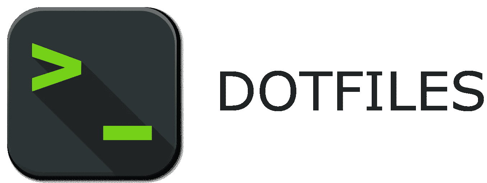
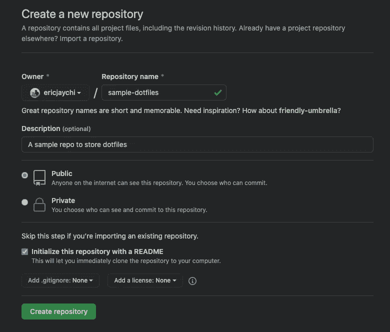
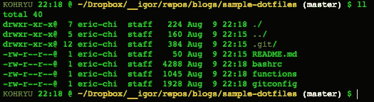
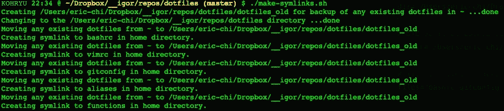
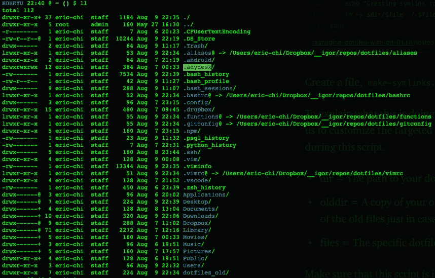

# 用 Git 管理你的点文件

> 原文：<https://betterprogramming.pub/managing-your-dotfiles-with-git-4dee603a19a2>

## 简化备份过程



作者图片

完整的源代码可以在这里找到:【https://github.com/ericjaychi/sample-dotfiles 

在今天的文章中，我们将讨论如何备份你可爱的网络文件。这些包括像`.vimrc`、`.bashrc`和`.gitconfig`这样的文件。请记住，这只是我备份它们的方式。您可以随意备份它们。毕竟，我只是网上的一个陌生人。

这将允许你很容易地把你的点文件放到任何一台机器上，只要它是基于 UNIX 的系统，并且保持你的点文件总是被备份。

作为参考，我使用了迈克尔斯马利博客上的这篇博文，并对我想备份的杂项文件做了一些调整。原文可以在这里找到:[http://blog . small ey creative . com/tutorials/using-git-and-github-to-manage-your-dot files/](http://blog.smalleycreative.com/tutorials/using-git-and-github-to-manage-your-dotfiles/)。我强烈推荐你去看看，因为我用这种方式备份我的点文件已经有一段时间了，而且几乎每天都用。当我得到一台新电脑时，它也节省了我大量的时间。

# 目录

*   第一步。创建存储库
*   第二步。将您的点文件添加到存储库中
*   第三步。make-symlinks.sh 脚本
*   第四步。更新您的点文件

# 第一步。创建存储库

我喜欢做很多假设，这很糟糕，但这个案例也不例外。我假设你知道 Git 是什么。如果你不知道 Git 是什么，我建议你研究一下，因为它对程序员来说是一个非常重要的工具。

首先，我将创建一个名为`sample-dotfiles`的新存储库。请记住，您可以随意命名这个回购协议。

在本文中，我将使用 GitHub，但是您可以随意使用任何您喜欢的服务来管理存储库。请记住，如果你的网站文件中有敏感信息，那么我建议将这个回购设为私有。或者你只是不想让其他人看到，我会建议将回购设为私有。



在 GitHub 中创建新的 repo

好了，一旦我们为我们的点文件创建了新的 repo，让我们继续通过复制 GitHub 上的克隆按钮将它克隆到我们的主机上。

```
git clone git@github.com:{github_user_name}/sample-dotfiles.git
```

或者，如果您使用的是 HTTPS:

```
git clone https://github.com/{github_user_name}/sample-dotfiles.git
```

现在你已经建立了你的回购协议，你会问自己，“哦，难道我们不只是把所有东西都加到这个回购协议中，然后把它送上去吗？”是也不是。我们想要把我们的点文件保存在它们原来的地方，通常是在我们用户的主目录中。我们将使用这个回购来存储我们的原始点文件的符号链接，这将使它看起来像什么都没有改变。这是最完美的编程魔术。

# 第二步。将您的点文件添加到存储库中

取决于你如何设置你的点文件，它们可以都在一个文件中，也可以分成不同的文件，就像我的一样。不管你是如何设置你的点文件的，只要把你想备份的都拿走就行了。通常情况下，如果你在 Mac 上，它们位于类似`/Users/eric-chi`的目录中；如果你在安装了 Linux 的机器上，它们位于类似`/home/eric-chi`的目录中。

在这个例子中，我希望备份一个简单的`.bashrc`、`.functions`和一个`.gitconfig`。如果您有其他项目，如`.vimrc`或`.aliases`，请随时将它们添加到回购中。请记住，对于您想要添加的每个点文件，此过程都是相同的。

为了简单起见，我还决定去掉文件前面的`.`,这样我就可以区分实际的点文件和回购文件中的点文件。

请记住，我们将这些复制到回购中。我们不会移动他们的！



这就是我现在回购的资产。到目前为止很简单——我们没有做任何太疯狂的事情。这种方法的美妙之处在于我们将使用符号链接。当我们加载这些文件时，我们的计算机不会识别出差异。它会将它们视为用户根目录中的文件，即使我们要将文件放入回购中。现在我们将使用迈克尔斯马利的脚本来填充这些符号链接。

# 第三步。make-symlinks.sh 脚本

这就是神奇之处。就像我之前提到的，我们只是在我们的主目录上创建符号链接来同步我们的点文件 repo。没别的了。为此，我们将使用以下脚本:

创建一个文件，`make-symlinks.sh`并将这段代码放入 dotfiles repo 中。

为了解释这是做什么，这个脚本定义了几个变量，允许我们定制目标文件以及将在这个脚本中使用的目录。

*   `dir` =我们创建的点文件存储库的路径
*   `olddir` =脚本运行后旧点文件的副本。它会保留旧文件的记录，以防万一，这样你就可以随时恢复。
*   `files` =要备份的特定点文件

确保这个脚本在 dotfiles repo 中，这样当你向上推它的时候，它会跟着一起移动，然后你可以在任何机器上克隆这个 repo，并准备好这个脚本。

现在我们已经创建了`make-symlinks.sh`文件，我们将继续运行脚本来创建符号链接。

根据您创建文件的方式，您可能需要授予它权限，以便您可以执行它:

```
cd /Users/eric-chi/Dropbox/__igor/repos/blogs/sample-dotfiles
chmod +x make-symlinks.sh
```

显然，你是想改变路径来匹配你的路径。完成后，继续运行脚本。

```
./make-symlinks.sh
```

您的终端将运行并创建各自的符号链接。



我在这里使用我实际的点文件回购，但同样的概念适用。

如果你看一下你的主目录，不管它是`/Users/eric-chi`还是`/home/eric-chi`，你应该看到我们存储在 repo 中的所有点文件都有各自的符号链接。



请注意创建的不同符号链接。

太棒了。我们已经根据在`make-symlinks.sh`文件中的配置创建了所有的符号链接。现在我们需要开始讨论更新我们的文件。

# 第四步。更新您的点文件

这部分非常简单，这也是我如此喜欢这种方法的原因。每当你想给你的点文件添加一个新的更新时，你需要做的只是像平常一样在你的主目录中打开点文件。像往常一样编辑它，然后保存文件。一旦您在文件中添加了新的更改，它将自动生效，因为它是一个符号链接，更新您的 repo 中的文件。因此，当你去你的点文件回购，你应该看到未分级的变化。然后，您可以将您的更改推送到 GitHub，保存您的更改，从而允许您始终将您的点文件备份在 GitHub 上，并能够将您的点文件拖到您想要的任何机器上。

如果你想在不同的电脑上安装不同的版本(一个用于工作，一个用于个人)，这也是可以做到的。只需为每台计算机创建一个分支，并像这样管理它。

假设你换了电脑，你想把你所有的点文件都带过来。嗯，超级简单。你需要做的就是把 Git 安装到你的新机器上，拉下你的 dotfiles repo，然后运行`make-symlinks.sh`文件，就像我们在步骤 3 中做的那样。运行之后，一切都恢复正常。

你甚至可以使用这个 repo 来存储不同的设置。我存储所有备份设置，如 VSCode 和 iTerm。当然，它们不会与`make-symlinks.sh`文件一起工作，但我使用这个回购作为我所有设置的一站式商店。我变得懒惰，也存储更大的文件，如。这里的 zip 与 IntelliJ 相关，如果有必要的话，我会使用 Git LFS。但总的来说，这是一个非常酷的工具，它可以让你对你的点文件进行版本控制，并在你从一台计算机转移到另一台计算机时节省你的时间。

嗯，就这样吧！如果您的文件中有敏感信息，或者如果您不希望有人窥探您的点文件，您可以将回购设为私有。

如需了解博客原文，请点击此处:[http://blog . small ey creative . com/tutorials/using-git-and-github-to-manage-your-dot files/](http://blog.smalleycreative.com/tutorials/using-git-and-github-to-manage-your-dotfiles/)。

源代码:【https://github.com/ericjaychi/sample-dotfiles 

下一集再见！