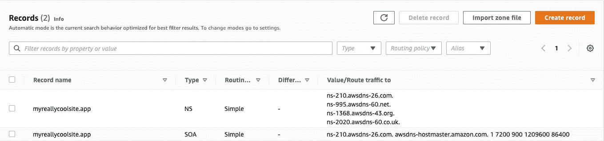
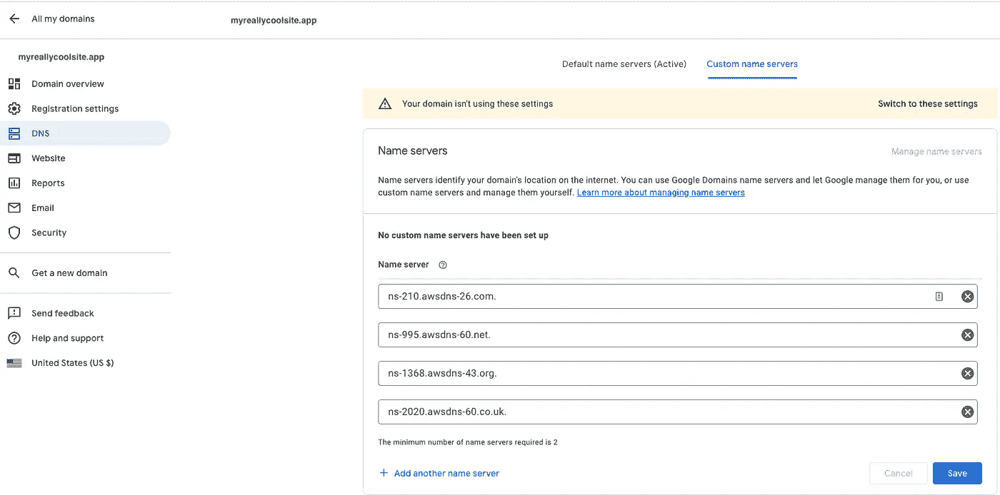
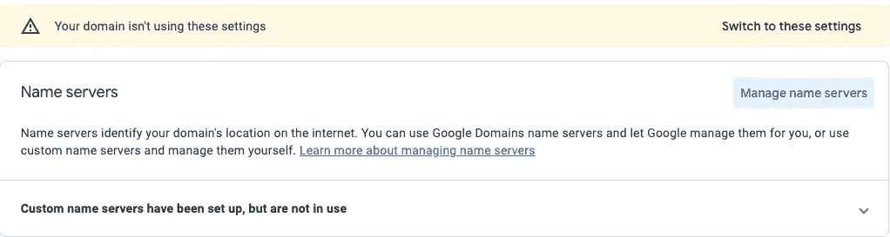
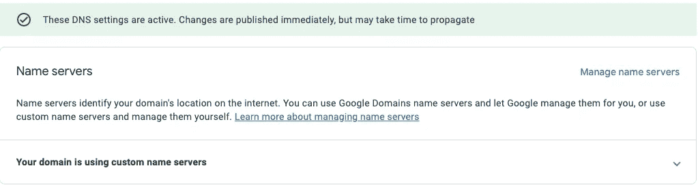

# 在 Amazon Route 53 中管理您的 Google 域名

> 原文：<https://betterprogramming.pub/managing-your-google-domains-in-amazon-route-53-b39bb1cce064>

## 当您的域名不在 53 号公路上时的分步指南

由[克里斯多佛·高尔](https://unsplash.com/@cgower?utm_source=medium&utm_medium=referral)在 [Unsplash](https://unsplash.com?utm_source=medium&utm_medium=referral) 拍摄的照片

你可以直接在亚马逊 Route 53 注册一个新的域名，但遗憾的是，并不是所有的顶级域名(TLD)都支持。您可以在此查看 Route 53 [目前支持的顶级域名列表，但是开发者可能会遇到的几个显著的例外是`.app`和`.dev`。](https://docs.aws.amazon.com/Route53/latest/DeveloperGuide/registrar-tld-list.html)

幸运的是， [Google Domains](https://domains.google.com/) 允许你注册这两个域名，虽然如果不支持 TLD，你不能将域名转移到 Route 53，但你仍然可以在那里管理它。

*注意:在本指南中，我使用域名* `*myreallycoolsite.app*` *纯粹是作为一个例子——我并不拥有这个域名，事实上，如果你真的喜欢它，在撰写本文时它似乎是可用的。*

# 为什么要在 53 路管理你的域名？

您可能想知道在 Route 53 中管理您的域有什么好处——特别是因为 Route 53 不是 AWS 中的免费服务。以下是迁移到 53 号公路的一些理由:

## 合并

如果你的架构的其余部分已经在 AWS 中了——那么这就让你不必为了管理这一件事而切换出 AWS。

此外，如果您使用基础设施即代码(IaC ),如 CloudFormation 或 AWS CDK，您可以将托管区域定义为代码，而不是手动配置它们。然而，如果您没有与其他 AWS 服务紧密相关，这可能对您无关紧要。

## 便利

我之前写过[如何将 AWS Amplify 应用程序路由到 Google 域](/routing-an-aws-amplify-app-to-a-google-domain-7ca06fe88f0)，但是如果您的域已经在 Route 53 中，就不需要我在本文中描述的手动步骤了——AWS ACM 证书可以自动验证。

您还可以在 Route 53 中构建`Alias (A)`记录，这将让您直接为 AWS 中的其他资源起别名，比如 CloudFront、负载平衡器等。

## 路由功能

谷歌域名是快速注册域名的好方法，但是如果你想或需要进入高级路由政策，Route 53 提供了许多不同类型的路由。

# 步骤 1:在 Amazon Route 53 中添加一个新的托管区域

首先，您需要在 53 号公路上创建一个新的托管区域。

您可以通过单击“创建托管区域”并输入您的域名和可选描述来完成此操作。类型应该是“公共托管区域”。填写完详细信息后，您可以单击按钮创建托管区域。

如果你正在使用 IaC，你不必通过控制台做这一步，而应该参考`HostedZone` [云形成](https://docs.aws.amazon.com/AWSCloudFormation/latest/UserGuide/aws-resource-route53-hostedzone.html)或 [CDK 构造](https://docs.aws.amazon.com/cdk/api/v2/docs/aws-cdk-lib.aws_route53.HostedZone.html)。

为 myreallycoolsite.app 创建新的公共托管区域

*请注意，AWS* [*内的托管专区不是免费的*](https://aws.amazon.com/route53/pricing/) *，它们的起价为 0.50 美元/月。*

# 步骤 2:检索您的名称服务器记录

现在我已经创建了我的托管区域，Route 53 已经自动创建了两个记录，一个 NS(名称服务器)记录和一个 SOA(授权开始)记录。此时，我们对 NS 记录中的四个值感兴趣。

记录路线 53 自动创建。

# 第三步:更新谷歌域名

在谷歌域名中，首先导航到你的域名，然后到左边菜单中的“DNS”。在顶部，确保选择“自定义名称服务器”。在 Route 53 的 NS 记录中输入 4 台服务器，然后单击“保存”。

输入您的 NS 记录到谷歌域名

# 步骤 4:激活设置以使用自定义名称服务器

根据您在 Google Domains 中的设置配置，您刚刚配置的域名服务器可能没有被使用。

您的域没有使用这些设置。

在这种情况下，单击“切换到这些设置”将快速轻松地解决问题。但是，请注意，如果您在 Google 域中配置了任何特殊的 DNS 记录，它们将停止工作，除非您将它们迁移到 Route 53。

您的 DNS 设置处于活动状态！

*请注意，传播这些 DNS 更改需要一些时间。它可能需要长达 48 小时，但通常会快得多！*

我希望这能对你有所帮助，祝你好运！