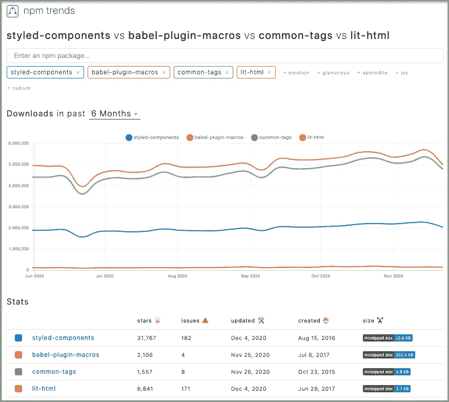

# 使用模板文字操作 JavaScript 字符串

> 原文：<https://betterprogramming.pub/manipulating-javascript-strings-using-template-literals-f7070412099f>

## JavaScript 模板文本、标记模板文本和众所周知的标记库简介


作者照片。

有没有写过类似这样的代码？

控制台消息显示`1 + 2 + 3 = 6`。

输出是漂亮的，但是组成它的代码是丑陋和混乱的(第 4 行)。让我们通过使用模板文字和标记模板文字来美化它。

# 模板文字

根据 [MDN Web 文档](https://developer.mozilla.org/en-US/docs/Web/JavaScript/Reference/Template_literals):

> 模板文字是允许嵌入表达式的字符串文字。
> 
> …
> 
> 模板文字用反斜杠(```)字符而不是双引号或单引号括起来。"

模板文字允许占位符(`${ }`)。`${expression}`中的任何`expression`都将被求值并插入到字符串中。

例如，前面的代码可以实现为:

在模板文字格式中，第 4 行看起来更简洁。

模板文字可以嵌套。在反勾号模板中，您可以在占位符(`${ }`)中插入内部反勾号。

这里有一个例子:

第 4 行是一个纯模板文字。

第 5 行是嵌套的模板文字。

4、5 线均输出`20`。

源代码中插入的换行符是模板文字的一部分。使用模板文字来组成多行字符串更容易。

以下代码将在控制台输出中保留该形状:

# 标记的模板文字

标记模板文字是模板文字的更高级形式。它们在模板文字之前有一个函数。这个函数称为 tag 函数，它可以对模板文字执行操作，并返回被操作的字符串(或任何内容)。

标记函数的第一个参数包含一个从其模板文本派生的字符串值数组。剩下的参数是模板文本中的表达式。

我们创建下面的函数`myTag`来返回参数:

以下是纯文本的用法:

第一个参数是一个数组:`[“This is a plain string”, raw: array(1)]`。

以下是多行模板文字的用法:

第一个参数是一个数组:`[“
— — — — — — -
| | |
| * | * |
| | |
— — — — — — -
”, raw: Array(1)]`。结果保留回车键。

当模板文本是带插值的字符串时，第一个参数是从非占位符字符串的值派生的数组。其余的参数是占位符表达式。换句话说，第二个参数是第一个插值值(`1`)，第三个参数是第二个插值值(`2`)，依此类推。

第一个自变量是`[“The first value is “, “, and the second value is “, “.”, raw: Array(3)]`，第二个自变量是`1`，第三个自变量是`2`。

以下是更多带标记的模板文字及其控制台消息的示例:

到目前为止，我们已经使用了函数声明来定义标记函数。标签函数也可以是函数表达式。不管是函数声明还是函数表达式，标记函数都可以在其函数体中使用其他模板文字和标记模板文字。

您可能已经注意到，在 tag 函数的第一个参数中有一个`raw`属性。它类似于`String.raw`，它保留输入的原始字符串，不处理转义序列。

第 5 行显示新行开始一个新行。

第 9 行显示换行符用`String.raw`保留。

第 12 行使用`String.raw`，对结果没有影响。

第 17-38 行是第 39 行使用的`tabValues`函数。这个例子展示了如何使用 tag 函数的参数和原始值。

# 众所周知的标签库

自 ES2015 以来，已标记的模板文字一直可用。它已经应用于许多图书馆。



来源:[国家预防机制趋势](https://www.npmtrends.com/)

*   `[styled-components](https://github.com/styled-components/styled-components)`采用带标签的模板文字来支持用 JavaScript 编写 CSS。在[另一篇文章](https://medium.com/better-programming/styled-components-a-css-in-js-approach-755f6a196c42)中有详细描述。
*   `[babel-plugin-macros](https://github.com/kentcdodds/babel-plugin-macros)`使用带标签的模板文字来[启用编译时处理](/an-introduction-to-javascript-compile-time-processing-f77571e71dfd)。
*   `[common-tags](https://github.com/zspecza/common-tags)`是 ES2015+中处理字符串的模板文字标签。
*   是一个高效的、富于表现力的、可扩展的 HTML 模板库。

## 常见标签示例

`common-tags`导出一堆有用的预煮模板标签供消费。[创建 React App](https://medium.com/better-programming/10-fun-facts-about-create-react-app-eb7124aa3785) 默认包含包。这些标签功能非常方便。

标签正确地缩进了数组以及字符串替换中的换行符。

第 9 行打印出没有`html`标签的结果字符串。结果在注释中(第 10-13 行)。第 10 行多了一个换行符，第 12 行的对齐方式不正确。

第 20 行打印出带有`html`标签的结果字符串。结果在注释中(第 21-25 行)。对齐和缩进是正确的。

`safeHtml`标签类似于`html`。此外，它对替换字符串进行安全的 HTML 转义。

第 15 行使用了`safeHtml`标签。安全 HTML 转义应用于动态生成的代码(第 22-24 行),这些代码显示在注释(第 21-25 行)中。

`oneLineCommaListsAnd`标签将数组替换内联为逗号分隔的列表，最后一个列表前面是单词`and`。此外，字符串呈现在一行上。

第 4 行使用了`oneLineCommaListsAnd`标签。如果不涉及 i18n，组合字符串是非常有效的。

`common-tags`里有很多有趣的标签。尝试它们很有趣。

`common-tags`也公开了一个创建你自己的模板标签的接口。创建模板标签甚至更有趣。

## lit-html 示例

`lit-html`提供使用模板文字编写 HTML 模板的功能。它提供两个主要出口:

*   `html`:用于产生`TemplateResult`的模板标签。
*   `render()`:将`TemplateResult`渲染到 DOM 容器的函数。

它需要安装软件包:

```
npm i lit-html
```

我们可以在`package.json`的`[dependencies](https://medium.com/better-programming/package-jsons-dependencies-in-depth-a1f0637a3129)`中看到新的包:

```
"devDependencies": {
  "lit-html": "^1.3.0"
}
```

下面是一个向 ID 为`test`的元素呈现问候消息的例子。

# 结论

在本文中，我们探讨了 JavaScript 模板文本、标记模板文本和众所周知的标记库。它们可以有效地操作字符串等等。

然而，也有理由考虑避免标记的模板文字。据说用字符串写代码违反了软件工程的基本法则，因为它给类型检查、林挺、格式化、i18n、优化、编译等带来了挑战。

嗯，凡事都有利有弊。你自己做选择。

感谢阅读。我希望这有所帮助。你可以在这里看到我的其他媒体出版物[。](https://medium.com/@jenniferfubook/jennifer-fus-web-development-publications-1a887e4454af)