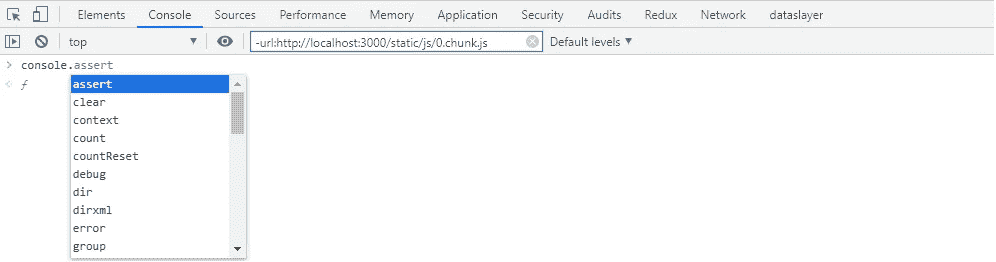
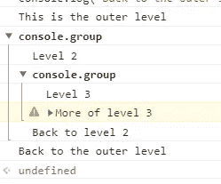
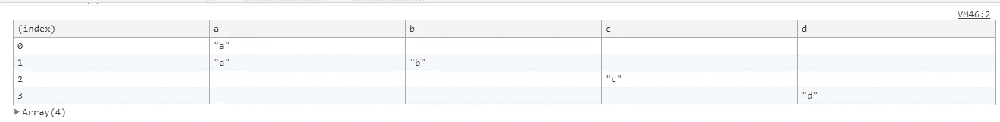

# JavaScript 中有许多令人惊叹的控制台方式

> 原文：<https://betterprogramming.pub/many-awesome-ways-to-console-in-javascript-292bfbd2dfe8>


乔恩·泰森在 [Unsplash](https://unsplash.com/photos/82ZEOTntP8g) 上的照片

从初学者到有经验的人，我们都使用`console.log()`来调试我们的 JavaScript 代码，但并不是所有人都知道有多少种方法可以使用 JavaScript 控制台来改进我们的调试。



安慰

我将在这里只列出重要的和令人敬畏的。

先说我们的老朋友:`console.log()`。

# **console.log()**

通常我们以最简单的方式使用它，像`console.log(object/string)`。但是`console.log()`提供了许多变化。

## 一起记录字符串和变量

为了做到这一点，我过去常常这样做:

```
console.log(`${variable name} is good`)
```

但是我在这里真的不需要用 ES6。我可以简单地这样写:

```
console.log(“%s is good”,variable name)
```

使用`%s`表示字符串，`%o`表示对象，`%d`表示数字或小数。

有时我会同时记录太多的`console.log()`实例(坏主意)。在这种情况下，有时我会弄不清应该检查哪个日志来调试我的代码。这里也有我们想要的东西。

## 将 CSS 添加到日志中

```
console.log("%c Hello world 🎉",'color:red')
//It will print whole string Hello world in red color, now you can easily diffrentiate among logs
console.log("%c Hello%c World 🎉",'color:red','color:green')
//can do something like this too to make it colorful :)
```

# console.assert(assertion，obj)

如果您希望仅在特定条件为假或真时打印日志，这将非常有用。

仅当断言(任何布尔表达式)为假时，它才打印日志。

```
//this can be reduced to 
if(value !== 1000){
console.log(value)
}
//this
console.assert(value===1000,{value:value,msg:"value is not 1000"})
//or like this
console.assert(value===1000,"value is not 1000") 
```

# console.count()和 console.countReset()

其中一个简单的用例是，如果您想检查一个函数被调用了多少次，每次都返回不同的值。

为了解决这个问题，您不需要使用 count 变量并在每次调用函数时递增它。只需使用`console.count()`，使用`console.countReset()`重置计数器。

```
setInterval(() => {
let r= Math.random()
console.count()
if(r<1){
console.countReset()
}}, 3000)
```

# console.error()

你们大多数人可能都知道这个，但只有少数人使用这个。

但是你应该用它来区分你的信息日志和错误日志。您应该在 API 调用函数的 catch 块中使用它。

# console.group()和 console.groupEnd()

如果您想以嵌套的方式显示日志，这非常有用。

`console.group()`开始一个程序块，`console.groupEnd()`结束该程序块。

```
console.log("This is the outer level");
console.group();
console.log("Level 2");
console.group();
console.log("Level 3");
console.warn("More of level 3");
console.groupEnd();
console.log("Back to level 2");
console.groupEnd();
console.log("Back to the outer level");
```

日志:



# console.table()

这太棒了。您可以使用`console.table()`来打印数组或对象。它给出了对象或数组的表格可视化。

```
let a= [{a:'a'},{a:'a',b:'b'},{c:'c'},{d:'d'}]
console.table(a)
```

日志:



# console.time()、console.timeLog()和 console.timeEnd()

这些真的很酷，在特定情况下很有用，比如当你想比较哪种算法更快时。它给出了从计时器开始算起的时间值，单位为毫秒。

```
//start timer
console.time("a") //give a label like a here
//to know current time 
console.timeLog("a")
//to stop the timer after your algo finished it's work
console.timeEnd("a")//a: 3798.983154296875ms  as you can see it is very precise
```

# console.warn()

就像`console.error()`一样，通过使用它，你可以将你的警告与错误和信息分开。

```
console.warn("I am a warning , Please don't ignore me 😢!!")
```

# 清除所有日志的时间

为此，我们有:

```
console.clear();
```

感谢你阅读这篇文章。编码快乐！