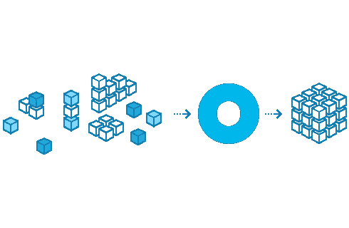

# 地图与平面地图与压缩地图

> 原文：<https://betterprogramming.pub/map-vs-flatmap-vs-compactmap-c75f66b904a6>

## 比较这些功能以及何时使用它们



# 地图

所以，让我们假设你需要将一个整数数组转换成一个字符串数组。您可以创建自己的简单解决方案:

自定义地图示例

它达到了预定的目标，但是如果你能改进它呢？

此时，您做了一个简单的从一种类型到另一种类型的映射。Swift 有一套高阶函数帮助您转换数据。

让我们修改代码，使用一个`map`函数。

地图示例

你看到这种力量了吗？超级简洁易懂。它接受您的转换闭包，并将其应用于数组的每个成员。

现在我们可以对`map`函数有一个定义了:

Map 返回一个数组，其中包含将给定闭包映射到序列元素的结果。

# 紧凑地图

那`compactMap`呢？要理解它，你需要玩弄它。

假设我们的`arrayOfIntegers` 常量有一些`nil`值，你不希望它们被映射到相应的字符串，而是忽略它们。

首先想到，它也是一个映射，所以我使用的是`map`函数。

错误的地图示例

编译器不喜欢它，并警告您:

```
String interpolation produces a debug description for an optional value; did you mean to make this explicit?
```

您可以使用`String`初始化器`“\(String(describing: $0))”`来包装它，但是这只会消除警告，您的最终结果将是`[“Optional(1)”, “Optional(2)”, “nil”, “Optional(4)”]`

嗯，这不是你想要的…你可能会想:“哦，我可以使用我的自定义映射函数，检查它是否是`nil`。”

是的，你可以做到这一点，它将完美地工作，但 Swift 知道如何帮助你，这里有`compactMap` 结合我们以前学习的`map`。

带链接的压缩映射示例

这里有两个步骤:

*   `compactMap`清理序列，因此，你得到一个非可选的整数序列。
*   `map`将其转换成字符串。

没有`map`也能做到。

带有过滤示例的压缩映射

`compactMap`帮助您同时消除零值和映射。它接受你的序列并产生一个更好的序列。虽然简单。

这里是`compactMap`的定义。

`compactMap`返回一个数组，该数组包含用此序列的每个元素调用给定转换的非零结果。

# 平面地图

我们旅程的最后一部分是`flatMap`。这只怪兽可能比`map`或`compactMap`更难理解，但它不是火箭科学。

想象我们的`arrayOfIntegers`正在增长，你需要以某种方式构建它。你以一种由奇数和偶数数组组成的方式构造了它。

你的任务是将它映射到一个没有零值的数组中。

```
let arrayOfIntegers = [[1,3,5,nil],[2,nil,6]]
```

哦，你可能觉得这越来越难了，但是别担心，我们也会解决的。

您已经知道如何删除零值。用`compactMap`就可以了，但是这个数组数组……`flatMap`来救援呢！

平面图示例

同样，要理解这一点有两个步骤:

*   平坦化你的阵列。申请`.flatMap { $0 }`后，收到`“[Optional(1), Optional(3), Optional(5), nil, Optional(2), nil, Optional(6)]”`。
*   `compactMap`删除零值，从而得到最终结果`[1, 3, 5, 2, 6]`。

这里是`flatMap`的定义。

`flatMap`返回一个数组，该数组包含用此序列的每个元素调用给定转换的连接结果。

# 结论

高阶函数还有很多其他的用例。这是我们今天发现的要点:

*   如果您需要简单地将一个值转换成另一个值，那么使用`map`。
*   如果需要删除零值，则使用`compactMap`。
*   如果您需要将结果向下拉平一级，则使用`flatMap`。
*   也可以将这些功能串联起来，以达到预期的效果。

这里有一个 [GitHub 库](https://github.com/Cr1xus/higher-order-functions)和`.playground`文件。

感谢您的关注和时间！