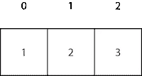
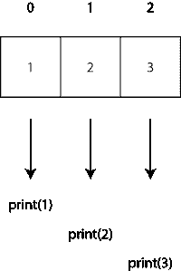
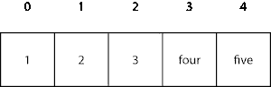
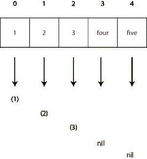

# Swift 中的映射

> 原文：<https://betterprogramming.pub/mapping-in-swift-a6d6132a38af>

## 映射和紧映射是重要的高阶函数


照片由[捕捉人心。](https://unsplash.com/@dead____artist?utm_source=unsplash&utm_medium=referral&utm_content=creditCopyText) on [Unsplash](https://unsplash.com/@dead____artist?utm_source=unsplash&utm_medium=referral&utm_content=creditCopyText)

Swift 有很多很酷的功能。其中之一是使用高阶函数，今天本指南将重点介绍`map`和`compactMap`。

难度:初学者| **简单** |普通|挑战

# 先决条件

*   能够产生一句“你好，世界！”iOS 应用程序(指南[此处](https://medium.com/swlh/your-first-ios-application-using-xcode-9983cf6efb71))
*   对[可选值](https://medium.com/@stevenpcurtis.sc/simply-optionals-in-swift-or-not-ee63c3999e16)和[功能](https://levelup.gitconnected.com/functions-in-swift-7e488190a011)的一些理解

# 术语

**数组** : 同一类型的一系列有序对象

**集合**:可以被遍历(次数不限)的元素序列，可以通过索引下标访问

**连接在一起的:连接在一起的**

`**compactMap**`:返回一个数组的函数，该数组包含将闭包映射到集合元素的非零结果

`**Map**`:返回一个数组的函数，其结果是将闭包映射到集合的元素上

**高阶函数**:以函数为自变量，或返回函数的函数

# 地图

## 应用函数的传统方法

传统的方法包括迭代一个集合，并对集合中的每个成员应用一个函数。

我们的集合可以是 Swift 的任何一种集合类型，但是这里我们将使用一个`Integer`数组。`let arr = [1,2,3]`。



我们希望对数组的每个元素运行相同的函数——我们可以简单地`print`数组的每个元素。

我们可以遍历数组并对每个元素应用`print`函数。

```
for i in 0..<arr.count { 
    print (arr[i])
}
```

作为替代方案(因为我们在每个元素上执行该功能)，我们可以使用 Swift 的`forEach`。

```
arr.forEach { (elem) in 
    print (elem)
}
```

或者我们可以打印数组中的元素。

```
for element in arr {
    print (elem)
}
```

这向我们展示了如何对数组中的每个元素应用相同的`print`函数。



`print`应用于数组的每个元素

但是有另一种选择…

## 使用映射来应用函数

**将** `**map**` **应用到数组**

`Map`对集合进行操作，并将函数依次应用于每个元素。

```
arr.map({ (element: Int) in
    return print(element)
})
```

通过使用 Swift 的类型推断，我们可以只返回名为`$0`的第一个参数，这是传递到闭包的第一个参数的简写(实际上这里将表示从`array`依次传递的每个元素)。

```
arr.map({ return print($0) })
```

这可以进一步减少，因为 Swift 可以推断出函数的结果是从闭包返回的。

**删除退货条款**

这为我们提供了以下信息:

```
arr.map{ print($0) }
```

`map`功能相当于执行与上面应用功能的传统方法一节中所示相同的动作。这为我们提供了使用高阶`map`函数的选项。

然而，本质上，我们仍然在做同样的事情。也就是说，我们将一个函数(`map`，如果你愿意的话)应用于数组的每个元素:


所示的语法确实很短。然而，我们应该意识到，就函数的效率而言，我们依赖于编译器优化。如果您使用(例如)一个`for`循环编写自己的函数，并添加自己的优化，您手工制作的函数可能会更高效。

**映射更复杂的示例**

我们可以创建自己的函数给一个元素加 1(我说的是复杂的例子)。

```
func addOne(a: Int) -> Int {
    return a + 1
}
```

然后，通过使用`map`高阶函数，这可以应用于数组的每个元素。

```
arr.map{addOne(a: $0)}
```

# 紧凑地图

还有更高阶的函数。`compactMap`与使用返回可选结果的函数相关。

现在我们可以获取一个新的数组，它将数字和单词的组合作为`String`存储在`Array`中。`let arr = ["1", "2", "3", "four", "five"]`



每个元素的类型实际上都是字符串——所以当我们想要将元素转换为`Int`时，这只对三个元素有效:1、2 和 3。但是当应用于“四”和“五”时，该函数将返回`nil`。



正在讨论的函数只是简单的`Int()`，并会返回如上的结果。

```
arr.compactMap{Int($0)}
```

因此，它返回一个只包含元素`[1, 2, 3]`的数组，不包含任何返回的`nil`元素。

和以前一样，我们可以创建自己的函数，然后使用`compactMap`以这种简洁的方式映射元素，忽略可选的。

好东西！

# 结论

我们可以对集合使用这些高阶函数，而不仅仅是`arrays`。

使用这些高阶函数有一种特定的风格，函数式编程可能会让你习惯。在任何情况下，你都应该习惯于它们的使用，以及它们会给你带来什么好处——尤其是因为有很多教程希望你熟悉它们的用法。

总之，编码快乐！