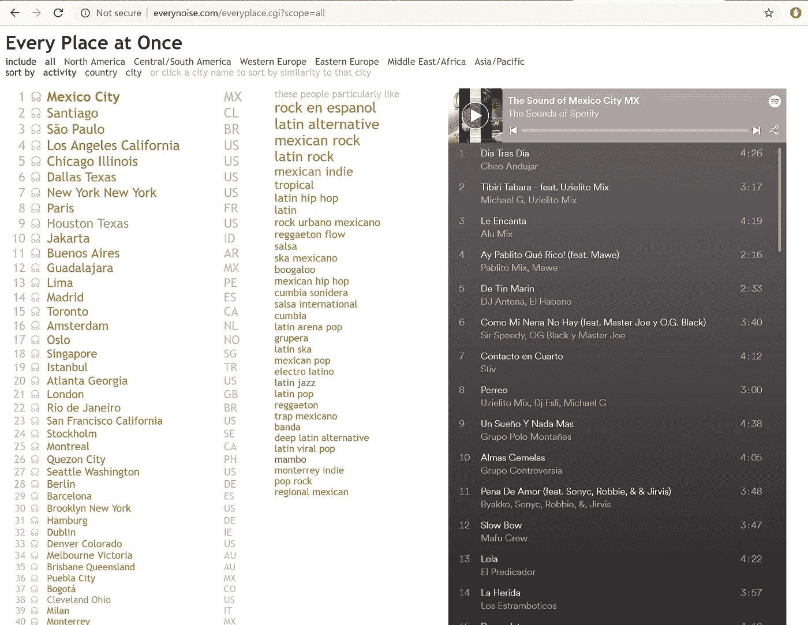
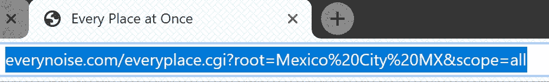
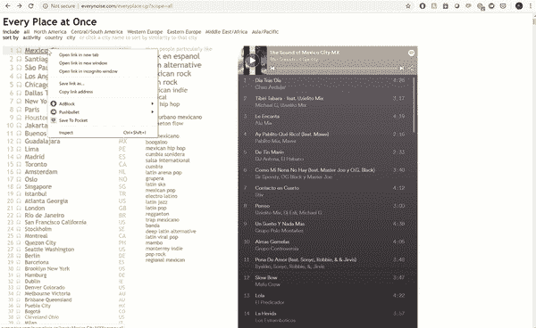
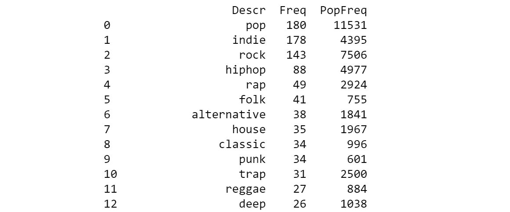
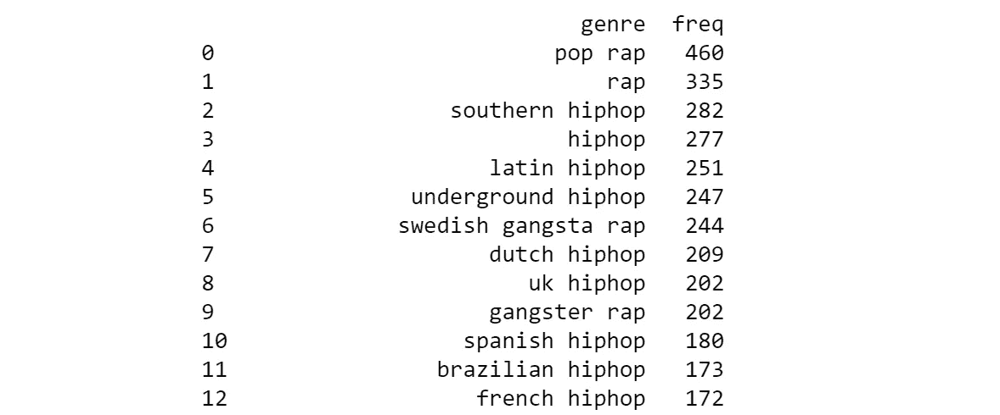
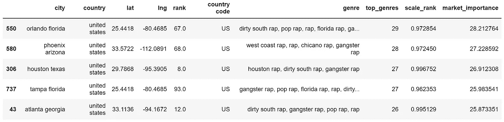
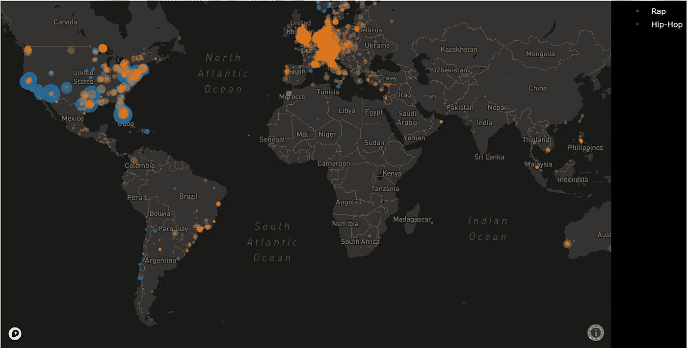
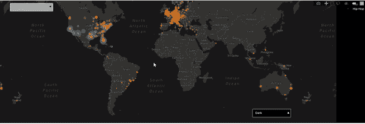
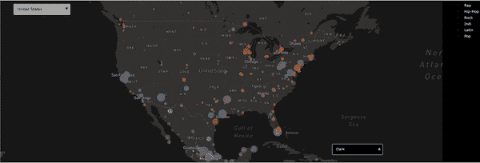

# 用各种噪音和情节映射音乐

> 原文：<https://betterprogramming.pub/mapping-music-with-everynoise-9ccb03db4f08>

## 通过位置抓取音乐类型流行度并创建一个交互式地图


去年，我读到了这篇关于布伦特·法亚兹的文章，这位歌手为了保持独立，拒绝了 25 万美元的预付款。他不需要一个标签，法亚兹的经理能够利用 Spotify 听众数据联系粉丝并计划音乐会。

作为一名业余音乐家和数据科学家，我对艺术家利用数据保持自力更生的前景感到非常兴奋。这个故事激励我建立一些免费的东西来帮助音乐人推销自己。

本文介绍了我如何:

*   使用 Python 的 [Beautiful Soup](https://www.crummy.com/software/BeautifulSoup/bs4/doc/) 和 [urllib](https://docs.python.org/3/library/urllib.html) 库收集了关于音乐流派流行程度的数据。
*   使用 [Plotly](https://plot.ly/) 创建了一个互动的城市市场地图。

这篇文章是写给有 Python 编码经验的人的。它将涵盖网页抓取和 Plotly 绘图的具体应用，但没有太多细节。

关于网络抓取的更多信息，请查看这篇文章[或者仔细看看我在 GitHub](https://medium.com/datadriveninvestor/web-scraping-17b6891f9da4) 上的[代码。](https://github.com/losDaniel/Music-Marketing)

第一个挑战是找到一个有用的免费数据源。我浏览了几十个网站、文章、报告和排名，直到我偶然发现了 Everynoise.com。

这个由 Spotify 的格伦·麦克唐纳创建的网站，分解了所有可以想象的音乐流派的数据。该网站的一个页面列出了 Spotify 使用的每个城市的热门音乐流派。

通过与其他[文章](https://newsroom.spotify.com/2018-11-19/mexico-city-is-now-the-worlds-music-streaming-mecca/)进行比较，我能够确认该页面列出了拥有最多 Spotify 听众的城市。



*每个地方一次。*http://everynoise.com/everyplace.cgi?scope=all[的截屏](http://everynoise.com/everyplace.cgi?scope=all)

来自每一种噪音的数据都有可能显示销售特定音乐流派的最佳城市，所以我决定收集这些数据并绘制成地图。

对于这个项目，我使用 Python 的 [urllib](https://medium.com/@nick3499/urllib-request-request-urlopen-gzip-675de5842922) 和 [Beautiful Soup](https://medium.com/@feliciaSWE/easy-web-scraping-with-python-beautifulsoup-afc7191d6432) 模块，这使得检索任何页面的 HTML 源代码变得很容易，只需要几行代码。

```
from bs4 import BeautifulSoup
import urllib.request as urllibdef fresh_soup(url): 
  # when making requests identify as if using the Mozilla Browser
  hdr = {‘User-Agent’: ‘Mozilla/5.0’} 
  # make a url request using the specified browser
  req = urllib.Request(url,headers=hdr)   
  # retrieve the page source
  source = urllib.urlopen(req,timeout=10).read()
  soup = BeautifulSoup(source,”lxml”)   
  return soup
```

为了完成剩下的工作，我开始浏览网站，并绘制出它是如何组织的。

我很快注意到，当我点击一个城市的名字时，它显示了顶级流派的排名，并通过在末尾添加一个搜索词来改变网址。



这意味着我可以通过将每个城市的名称或链接放在一起，得到每个地方最受欢迎的流派。组装这个列表需要一次抓取*页面的每一个地方。*

为此，我右键单击第一页上的第一个城市名称，然后单击 inspect。这在我的浏览器上打开了页面源代码。我悬停在一些代码行上，找到了每个城市的链接。



立刻检查每个地方

带有`tr`标签和类别`datarow`的每一行都包含一个城市的名称和链接。这些是在`table`区。

有了页面源代码，我使用`table = soup.find_all('table')`收集了所有`table`元素的列表，发现第二个表是我感兴趣的。命令`table.find_all('tr')`给了我表格中的每一行。

在每一行中，信息都存储在带有`a`标签的第一个元素中。幸运的是，Beautiful Soup 提供了对 HTML 属性的轻松访问。我用`a.text`表示城市名，用`a['href']`表示原始链接。

```
def get_cities():
    # url for a list of every city listed in everynoise
    origin = '[http://everynoise.com/everyplace.cgi?root=all'](http://everynoise.com/everyplace.cgi?root=all')
    # get the formatted page source
    soup = fresh_soup(origin) 
    # retrieve a list of all table tags and grab the second table
    table = soup.find_all('table')[1]
    links = []
    # loop through every row in the table
    for row in table.find_all('tr'): 
        # extract the ['icon','city name','country code']
        elements = [a.text for a in row.find_all('a')] 
        # there was only ever one tag which had the link in it
        link = [a['href'] for a in row.find_all('a')][0]   
        # save each link in a (city,country,link) tuple
        links.append((elements[1], elements[2], link))                                      
    return links
```

我收集了我的城市名称和链接列表，但是有些城市有非英语字符，导致错误的网址。我创建了一个函数，使用来自`urllib.parse`的`quote`方法来纠正它们。

```
from urllib.parse import quotedef clean_url(url): 
   non_conformists = [s for s in url if s not in string.printable] 
   for s in non_conformists:
      # and use the quote function to translate them          
      url = url.replace(s,quote(s))   

   return url
```

构建 scraper 的下一步是从每个城市链接中检索流派。我重复了*右键单击→检查*过程，以了解在哪里可以找到每个城市的热门流派，然后编写了一个函数，循环遍历这些城市，导航到每个链接，并将热门流派保存到一个大数据集中。

在这个过程中，我注意到，尽管是按照听得最多到最少的顺序排列的，位于顶部的音乐类型也比底部的字体要大。

这意味着市场的竞争力可以根据有多少类型共享字体大小来表征。我使用了[正则表达式](https://docs.python.org/3/library/re.html)包来获取每种风格的字体大小。

```
import pandas as pd
import re def genre_popularity(links, filename):
   # create a dataset where you will store everything
   everynoise_popularity = pd.DataFrame()

   # each link is a (city, country, link) tuple
   for link in links:   
       soup = fresh_soup(link[2]) # find the table with the most popular genres
       genres = soup.find_all('div', {'class':'note'}) # if we find a table we proceed
       if len(genres)>0:
          # get the table
          genres = soup.find_all('div', {'class':'note'})[0]
          # and every row in the table excluding the header
          genres = genres.find_all('div')[1:]
          popularity = []
          genre = []          for element in genres:
             # use the font-size as a proxy for popularity
             popularity.append(re.findall('font-size: ([0-9]+)%;', str(element))[0])

             genre.append(element.text) df = pd.DataFrame({"Popularity":popularity,"Genre":genre})
          df['City'] = link[0] 
          df['Country Code'] = link[1]
          everynoise_popularity =   everynoise_popularity.append(df,ignore_index=True,sort=False) everynoise_popularity.to_csv(filename)                                                 
   return everynoise_popularity
```

就这样，我完成了每一个噪音的刮刀。

接下来，我需要添加地理信息。我从 simplemaps.com 的 T2 得到了每个城市的经度和纬度。

城市名称与每个噪音数据并不完全匹配，所以我使用了[模糊匹配器](https://pypi.org/project/fuzzymatcher/)库来合并这两个数据集(我使用该库是因为它直接处理数据框；其他库如 [FuzzyWuzzy](https://github.com/seatgeek/fuzzywuzzy) 可能会产生更好的匹配)。

最终数据集中的每一行都是流派-城市对，包含流派在城市中的排名和受欢迎程度、城市的地理信息等。


下一个大挑战是创造一种合理的方法来衡量城市市场对特定流派的重要性。这需要从每个噪声数据中超过 1500 个独特的子类型中选择目标类型。



描述流派和子流派最常用的 13 个词



名字中带有“rap”或“hiphop”的 13 个最常见的子流派

为了更好地理解可用的流派，我在*流派*栏中获得了每个术语中每个单词的*频率，以及它们在独特流派中出现的频率(top table， *Freq* )和原始排名( *PopFreq* )。*

我选择绘制说唱音乐的最佳市场，所以我找到了说唱音乐和嘻哈音乐这两个词来识别感兴趣的流派和子流派，并将它们收集到相关子流派的列表中(底部表格)。

在定义了目标类型之后，我开始创建一个衡量市场重要性的标准。

该指标考虑了三个因素:

*   同城排名出现了多少个相关子流派。
*   这些子流派在城市排名中的排序。
*   城市在可用城市列表中的顺序(Spotify 市场的相对规模)。

[创建指标的所有代码](https://github.com/losDaniel/Music-Marketing/blob/master/target_practice.py)都放在一个函数中，该函数能够根据提交的关键字识别单个流派市场( *hiphop* 市场和 *rap* 市场)或集体市场( *hiphop* 或 *rap* 市场)。

这将允许创建详细但潜在广泛的市场图表。



根据市场重要性的衡量标准，顶级 rap 市场的数据集

最后一个挑战是绘制音乐市场地图。

我在 Plotly 中使用了`Mapbox`功能，这非常简单。只需要两个参数就可以创建一个阴谋人物:`data`和`layout`。

`data`参数是绘图图形对象的列表(绘图类型、绘图设置和原始数据)。`layout`的论点允许额外的调整和数字元素。

我为每个数据集(rap 和 hiphop)创建了一个`Scattermapbox` graph-object，将它们的 *lat* 和 *long* 列设置为`Scattermapbox` *的纬度和经度。*

通过`go.scattermapbox.Marker`选项，每个城市的点大小与市场重要性成比例。

最后，我加入了一个关于`opacity`的参数，这样各层就不会互相阻碍。

```
import plotly.graph_objs as go
from plotly.offline import plotdef map_plot_element(ds, data_name, opacity_value):
   element = go.Scattermapbox(  # the plot points for a Plotly map
      lat=ds['lat'],  # define the latitude data  
      lon=ds['lng'],  # define the longitude data
      mode='markers', # define the point types
      opacity=opacity_value,
      marker=go.scattermapbox.Marker(
         # marker size based on market importance
         size=ds['market_importance']),
      # the dataset name for the legend
      name = data_name,
      # display the city name and top genres when hovering over
      text=ds['city'].str.title()+'<br><br>'+ds['genre'].str.title().str.replace(',','<br>'), 
   )

   return elementdata = []
data.append(map_plot_element(rap_data, "Rap", 1))
data.append(map_plot_element(hh_data, "Hip Hop", 0.9))
```

layout 参数是一个字典，可以在其中设置高度、边距、字体大小和中心坐标的值。

```
layout = dict(
   height = 500,                                            
   margin = dict( t=0, b=0, l=0, r=0 ),      # margins  
   font = dict( color='#FFFFFF', size=11 ),  # set font properties 
   paper_bgcolor = '#000000',   # set the paper's background color 
   mapbox=dict(
      accesstoken=mapbox_access_token,
      bearing=0,
      center=dict(
         lat=0,       # set the mapbox center
         lon=0
      ),
      pitch=0,
      zoom=1.2,
      style='dark'    # set the graph style 
    ),
)
```

然后，我使用`fig = go.Figure(data=data, layout=layout)`将`data`和`layout`对象输入到`Figure`方法中，并使用`plot(fig)`绘制图形，这就产生了下图。



显示说唱和嘻哈音乐城市市场的互动地图快照

悬停在每个城市上方会显示城市名称和相关的子类型，但我觉得一些额外的元素会有助于使地图更加用户友好。

幸运的是，我可以使用布局字典来添加更新地图的菜单。

我创建了两个更新菜单，第一个是下拉菜单，修改了`dark`、`light`、`satellite`和`satellite with streets`之间的图形样式。

```
drop_down_1 = dict(        # drop down menu dict
   buttons=list([          # buttons are listed manually 
      dict(                # button 1 
         # arguments for the first button 
         args=['mapbox.style', 'dark'],  # set style to dark 
         label='Dark',                   # button text "Dark"
         method='relayout'               # relayout update method
      ),                    
      dict(                # button 2 
         args=['mapbox.style', 'light'], # set style to light
         label='Light',
         method='relayout'
      ),
      dict(                # button 3 
         args=['mapbox.style', 'satellite'], # set style to satelite
         label='Satellite',
         method='relayout'
      ),
      dict(                # button 4
         # set style to satelite with streets
         args=['mapbox.style', 'satellite-streets'], 
         label='Satellite with Streets',
         method='relayout'
      )]),
   direction = 'up',       # the menu opens upwards
   x = 0.75,               # distance from anchors 
   xanchor = 'left',       # anchor direction
   y = 0.05,        
   yanchor = 'bottom',
   bordercolor = '#FFFFFF',
   font = dict(size=11)    # font size 
)
```

第二个更新菜单列出了数据集中的所有国家，并放大到所选国家的质心。

第一步是用地图的默认中心和缩放设置创建一个默认值`World`。

使用来自[Periscopedata.com](https://community.periscopedata.com/t/63fy7m/country-centroids)的国家质心的纬度和经度，我为每个国家创建了放大按钮，并将它们添加到按钮列表中。

```
# create the first element of the scroll down list
countries=list([
   dict(
      args=[ { 
         # set the default view to the cetner of the world
         'mapbox.center.lat':0, 
         'mapbox.center.lon':0,
         'mapbox.zoom':1.2,                  # with a high zoom
         'annotations[0].text':'World View'  # titled "World View" 
      } ],
      label='World',                         # give it the layout
      method='relayout'
   )
])# loop through each country to add their data to the drop-down menu
for idx, row in country_data.iterrows():
   countries.append(
      dict(
         args=[{
            # element centers on the latitude and longitude
            'mapbox.center.lat': row['latitude'],                
            'mapbox.center.lon': row['longitude'],
            # zoom to only see the country
            'mapbox.zoom':3,                                     
            # display the country code, name and preferred sub-genre
            'annotations[0].text':'<br>'.join([row['country'],
                                               row['name'],])
         }],
      label=row['name'],
      method='relayout',
   )
)
drop_down_2 = dict(
   buttons = countries,     # buttons are the countries
   pad = {'r': 0, 't': 10},
   x = 0.03,                # space from x anchor 
   xanchor = 'left',        # anchor it to the left
   y = 1.0,                 # space from y anchor 
   yanchor = 'top',         # anchor to the top 
   bgcolor = '#AAAAAA',     # menu background color 
   active = 99,
   bordercolor = '#FFFFFF',
   font = dict(size=11, color='#000000')
)
```

将下拉菜单合并到地图中就像将它们放在一个列表中并设置为`layout`字典:`layout['updatemenus'] = [drop_down_1, drop_down_2]`中的`updatemenu` 键一样简单。



与“rap”和“hiphop”市场的世界地图互动



停用美国地图中的“说唱”、“嘻哈”、“摇滚”、“印度”、“拉丁”和“流行”市场

终于！我对音乐市场有地理上的代表性，并有能力做出更明智的决定，在哪里以及如何花费我的第一个音乐视频的营销预算！

我已经创建了两个笔记本，完成了本文中描述的[抓取](https://github.com/losDaniel/Music-Marketing/blob/master/scrape_everynoise.ipynb)和[映射](https://github.com/losDaniel/Music-Marketing/blob/master/targeting.ipynb)过程。

代码仍然可以改进，特别是城市的纬度和经度匹配仍然会导致一些不匹配。

你可以与 Datapane.com 的图表互动。