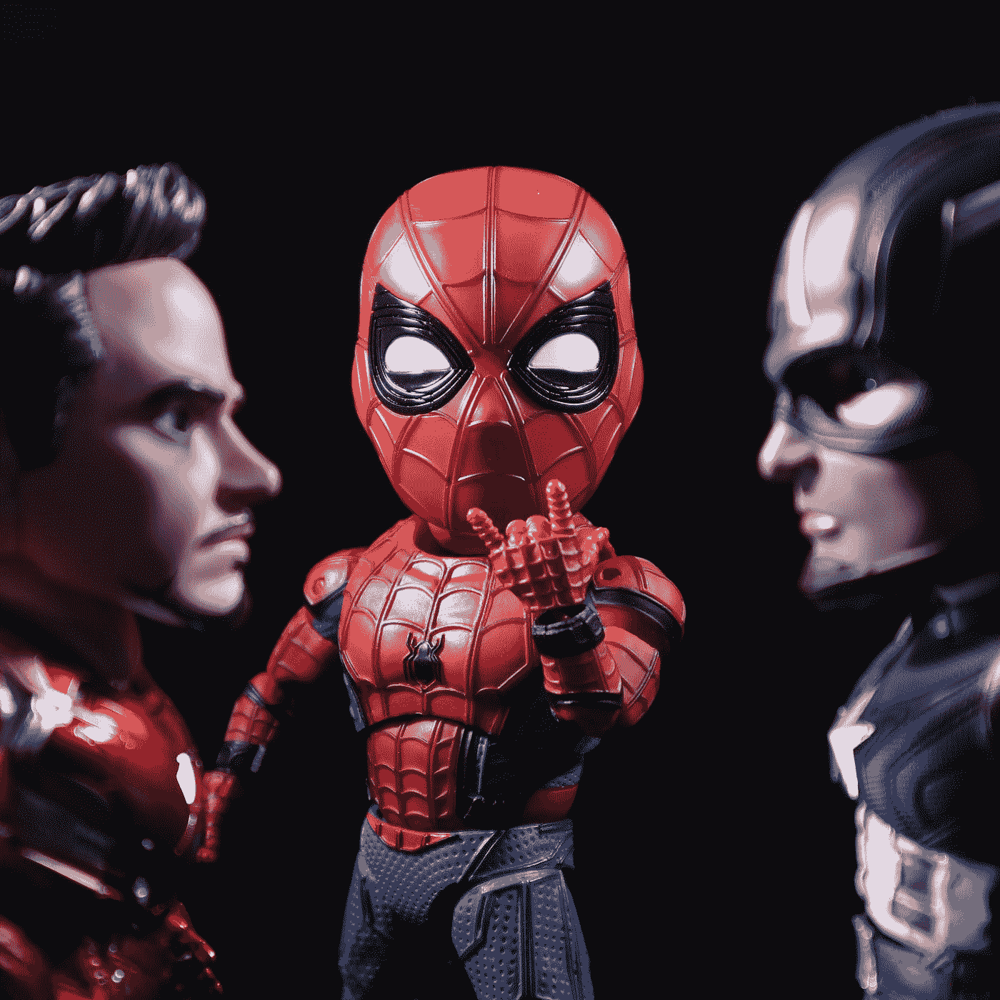
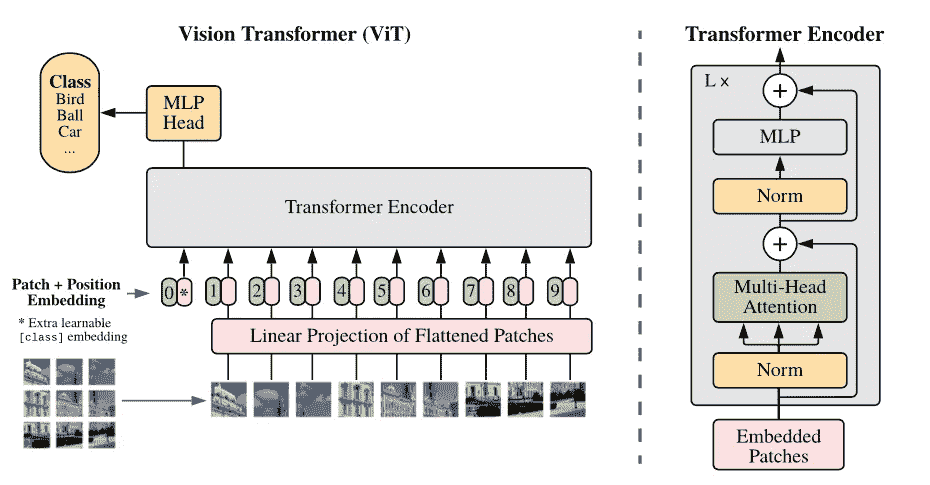
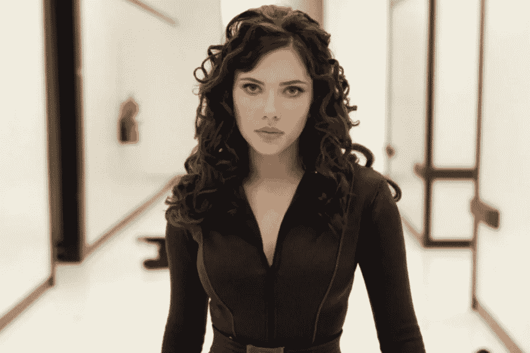

# 通过微调视觉转换器对漫威人物进行分类

> 原文：<https://betterprogramming.pub/marvel-character-classification-by-fine-tuning-vision-transformer-45c14a7d8719>

## 微调视觉转换器(ViT)来分类漫威电影角色。



[穆利亚迪](https://unsplash.com/es/@mullyadii?utm_source=medium&utm_medium=referral)在 [Unsplash](https://unsplash.com?utm_source=medium&utm_medium=referral) 上的照片

如果你只是想先试用一下模型，你可以在这里做[。](https://huggingface.co/dingusagar/vit-base-avengers-v1)

计算机视觉领域很长一段时间是由卷积神经网络(CNN)主导的。另一方面，变形金刚成为任何 NLP 任务的首选深度学习架构。但在 2021 年，随着[视觉变形金刚论文](https://arxiv.org/abs/2010.11929)的出现，变形金刚也开始参与计算机视觉任务的竞赛。

在本文中，我们对视觉转换器模型进行了微调，以检测漫威电影角色。

# **稍微了解一下视觉转换器**



[https://arxiv.org/pdf/2010.11929.pdf](https://arxiv.org/pdf/2010.11929.pdf)

视觉转换器(ViT)基本上是一个应用于图像而不是文本的普通转换器网络。如果你想了解变形金刚是如何工作的，[这个](https://youtu.be/4Bdc55j80l8)是一个很棒的视频。

如图所示，输入图像被分割成单独的小块。这些单独的补丁就像 NLP 任务中的令牌，通常使用转换器。这些单独的图像片段被展平成线性向量。然后添加位置向量以嵌入这些小块的位置信息。这些然后被传递到变换器编码器块。一个特殊的令牌 CLS 也被传递给变换器块，我们可以用它来预测图像的类别。来自变换器块的 CLS 嵌入的输出被馈送到具有 softmax 分类器的前馈网络中，以预测类别。

# **微调视觉转换器**

根据我们的图像微调 ViT 非常容易。感谢来自 [Huggingface 的棒极了的库🤗](https://huggingface.co/)。

让我们建立一个识别漫威电影角色的分类器。首先，我们需要一些不同漫威角色的图像。

## **从谷歌图片准备数据集**

```
*git clone* [*https://github.com/Joeclinton1/google-images-download.git*](https://github.com/Joeclinton1/google-images-download.git) *&& cd google-images-download && pip install -e . && cd ..*
```

上面的命令安装了一个工具，您可以使用它从 Google Images 下载图像。安装后，执行下面的命令开始下载图像。`keywords`选项应该是一串不同的搜索词，每个词代表一个类别。`limit`是每节课需要多少张图片。

```
googleimagesdownload  --keywords "Iron Man,Captain America,Thor,Spider Man,Docter Strage,Black Panther,Ant Man,Captain Marvel,Hulk,Black Widow,Hawkeye Avengers,Scarlet Witch,Vision Avengers,Bucky Barnes,Falcon Avengers,Loki" --limit 100
```

下载的文件将类似于这种格式。

```
downloads/Iron Man/ironman.jpg
downloads/Iron Man/iron_man2.jpg
.
.
downloads/Loki/loki.jpg
```

我们希望将文件分为模型的训练集和验证集。我们可以使用另一个工具[分割文件夹](https://pypi.org/project/split-folders/)来实现。通过以下方式安装:

```
pip install split-folders
```

现在，要将文件夹分割成 80–20%分割的 train 和 val 集合，请执行。在`--`后指定文件夹的名称

```
splitfolders --ratio .8 .2  -- downloads
```

现在，您应该会看到类似于此结构的文件夹。

```
output/train/Iron Man/ironman.jpg
output/train/Iron Man/iron_man2.jpg
.
.
output/train/Loki/loki.jpgoutput/val/Iron Man/ironman3.jpg
output/val/Iron Man/iron_man22.jpg
.
output/val/Loki/loki_.jpg
```

# **微调代码**

安装所需的库

```
pip install -U transformers datasets
```

导入必要的包后，我们在第 6，7 行指定数据集的位置。修改它以匹配您系统中的位置。

第 12–20 行将一个变换函数附加到数据集上，该变换函数用于将数据集库读取的原始 PIL 图像转换为适合输入模型的张量格式。我们还在转换函数中将标签信息添加到批处理中。

第 21–30 行定义了计算精确度的度量。第 34–41 行定义了来自`model_name_or_path`指定的检查点的模型和特征提取器。特征提取器的工作是对图像应用任何规范化、标准化和调整大小操作，以使其准备好被输入到模型中。

第 23 行定义了一个数据整理器函数，它将作为`dicts`列表传入的批处理转换成批处理张量的字典。

从第 44 行开始，用训练参数定义了教练对象。请参考文档以更深入地了解每个参数。`trainer.train()`应该开始训练了。之后，我们保存模型并记录指标。将创建一个包含模型权重和配置的文件夹。该文件夹的路径由 TrainingArguments 类中的`output_dir`指定。

在每类 100 张图片和当前设置的情况下，我得到了 0.8683 的测试精度。看起来有通过增加数据集大小或调整训练参数中的一些参数来改进的空间。

# **测试我们的复仇者分类器**

上面的代码使用训练好的模型来预测复仇者角色。第 6–8 行从训练模型的路径加载模型。第 11–13 行将图像下载到 PIL 图像对象中。第 16–17 行执行特征提取和预测。第 19–21 行提取最终图层预测(也称为 logit)并找到与最大 logit 值对应的类索引。

# **最后一步:享受与模型玩耍的乐趣。**

输入图像:


[https://static 1 . srcdn . com/WordPress/WP-content/uploads/2022/06/Iron-Man-Change-After-The-Avengers-Is-deep-Than-You-think . jpg](https://static1.srcdn.com/wordpress/wp-content/uploads/2022/06/Iron-Man-Change-After-The-Avengers-Is-Deeper-Than-You-Thought.jpg)

```
Predicted class: Iron Man
```

输入图像:



[https://br.glbnews.com/-/52781023297688/](https://br.glbnews.com/-/52781023297688/)

```
Predicted class: Black Widow
```

## **可选步骤:推轮毂炫耀**

如果你想把模型推到拥抱脸模型中枢，这很容易。只需在训练参数中将`push_to_hub`设为 True，你的模型就会被推送到你的拥抱脸账户。您还必须通过执行以下命令登录到 hugging face。

```
pip install huggingface_hub
huggingface-cli login
```

# **链接和引用**

[](https://huggingface.co/dingusagar/vit-base-avengers-v1) [## 丁格萨加/维特-基地-复仇者联盟-v1 拥抱脸

### 编辑模型卡这个模型是 imagefolder 数据集上 Google/vit-base-patch 16-224-in21k 的微调版本。

huggingface.co](https://huggingface.co/dingusagar/vit-base-avengers-v1) [](https://huggingface.co/blog/fine-tune-vit) [## 微调用于图像分类的 ViT🤗变形金刚(电影名)

### 就像基于变形金刚的模型彻底改变了自然语言处理一样，我们现在看到大量的论文将它们应用于所有…

huggingface.co](https://huggingface.co/blog/fine-tune-vit) [](https://arxiv.org/abs/2010.11929) [## 一幅图像相当于 16x16 个字:大规模图像识别的变形金刚

### 虽然 Transformer 体系结构已经成为自然语言处理任务的事实上的标准，但它…

arxiv.org](https://arxiv.org/abs/2010.11929)