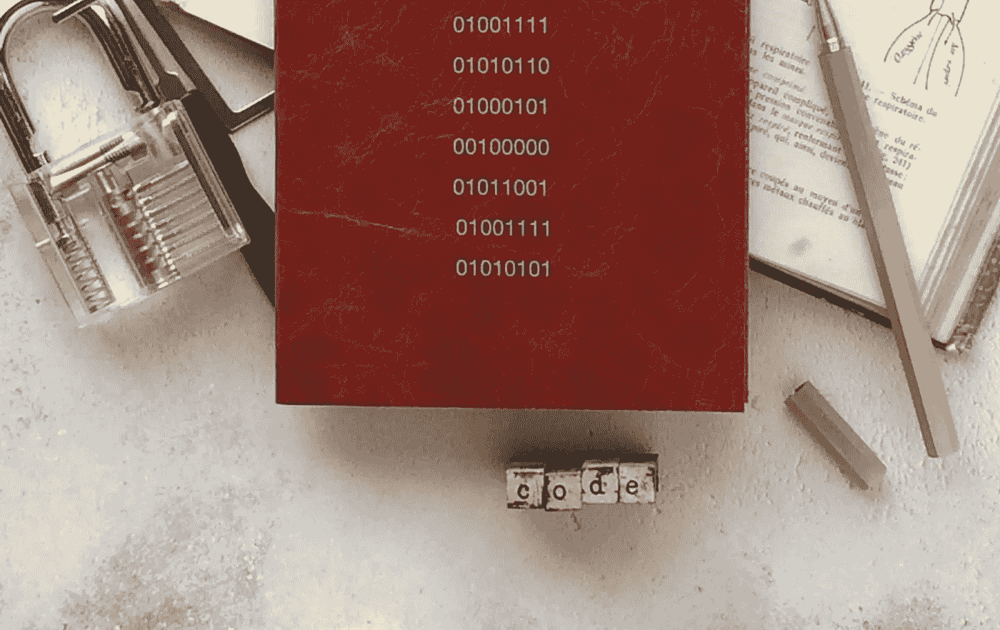

# 10 分钟掌握位运算

> 原文：<https://betterprogramming.pub/master-bitwise-operations-in-10-minutes-7842c65608d7>

## 细节决定成败——如果你弄错了，你会得到不同的答案



照片由[希望之家出版社——皮革日记工作室](https://unsplash.com/@hope_house_press_leather_diary_studio?utm_source=unsplash&utm_medium=referral&utm_content=creditCopyText)在 [Unsplash](https://unsplash.com/s/photos/binary?utm_source=unsplash&utm_medium=referral&utm_content=creditCopyText)

我最近开始学习 c 语言，这并不是因为我预见到雇主的需求会激增，也不是像我的一些朋友和同事所说的那样，因为我讨厌自己，而是因为这是提高你的计算机科学基础的一种可靠方法。回到基础(但不是一直回到基础)，迫使你面对你觉得编程最可怕的事情。

对我来说，这就是位运算——在你的机器中对单个位的直接操作。有了按位操作，你就像在二进制汤里溅水一样，几十年的抽象和语言发展让我们大多数人都忘记了它。

如果你想感受一下你的计算机和你的程序实际上是如何工作的，位操作是一种方法。这并不直观，但也没有看起来那么可怕。

因为它看起来很吓人。

这个问题来自 Kernighan 和 Ritchie 的重要著作《C 编程语言》:

> 编写一个函数 **setbits(x，p，n，y)** ，返回 **x** ，从位置 **p** 开始的 **n** 位设置为 **y** 的最右边 **n** 位，其余位保持不变。

如果这是一个令人困惑的问题，不要担心，因为下面的解决方案可以让一切变得清晰:

啊，是的，当然。没想到那一点多傻啊。

不要让那串象形文字吓到你。到本文结束时，您将确切地知道如何分解它，理解每个部分，并可视化每个步骤的二进制转换。

它假设您对二进制有足够的了解，能够接受一个位可以是 0 或 1，您乐于从右向左阅读二进制，并且您理解十进制数是如何表示的。

# 经营者


由[亚历山大·辛恩](https://unsplash.com/@swimstaralex?utm_source=unsplash&utm_medium=referral&utm_content=creditCopyText)在 [Unsplash](https://unsplash.com/s/photos/binary?utm_source=unsplash&utm_medium=referral&utm_content=creditCopyText) 上拍摄的照片

这里的主角是按位运算符。让我们快速浏览一下。

## &(按位与)

不要试图将它与您可能熟悉的逻辑 AND (&&)的定义联系起来，更简单的方法是记住这个定义:

> &通过将两个操作数中任何不为 1 的位设置为 0 来组合操作数。

换句话说，&用于关闭位。

例如:

```
x = 11111111
y = 00000000
x & y
 => 00000000
```

这里， *x* 由设置为 1 的 8 位组成(255 的二进制表示)。 *y* 由设置为 0 的 8 位组成。&将*和*中任何不为 1 的位设置为 0。因为 *y* 没有 1，所以一切都变成了 0。

```
x = 10101010
y = 01010101
x & y
 => 00000000
```

在这个版本中， *x* 和 *y* 都有 4 位设置为 1，但是这 1 位没有一个相互对齐。在每个位置，要么 *x* 为 1，要么 *y* 为 1，但不能同时为 2。正如我们所知，&将*两个操作数*中任何不为 1 的位设置为 0。再一次，一切都变成了 0。

```
x = 00111100
y = 00001111
x & y
 => 00001100
```

这个更有意思。 *x* 和 *y* 都有 4 个 1 位，但是在两个地方都只有*都是* 1。因此，除了开始都是 1 的那两个地方，所有东西都被设置为 0。

## |(按位或)

忘记你所知道的逻辑 OR (||)，接受这个新的定义:

> |通过将操作数中任何一个为 1 的位设置为 1 来组合操作数。

这使得|的开开关变成了关开关。

示例:

```
x = 11111111
y = 00000000
x | y
 => 11111111
```

*y* 全是 0，但是因为|只需要在*或者*操作数中看到 1，而 *x* 全是 1，所以输出也全是 1。

```
x = 10101010
y = 01010101
x | y
 => 11111111
```

*x* 和 *y* 中的 1 没有一个排成一行，但是因为*的每个位置*至少有一个 1，所以返回值中的一切都是 1。

```
x = 00111100
y = 00001111
x | y
 => 00111111
```

这里，除了最左边的两位，每个位置的 *x* 和 *y* 中至少有一个位置为 1。因为那些都是 0，所以它们保持为 0。其他都是 1。

## ^(按位异或)

按位异或在操作数具有不同位的每个位置设置 1，如果它们相同则设置 0。例如:

```
x = 10101010
y = 01010101
x ^ y
 => 11111111
```

x 和 y 中的每一位都是不同的，所以输出中的每一位都是 1。

```
x = 11001100
y = 11001100
x ^ y
 => 00000000
```

在这里，情况正好相反。每一位都是一样的，所以一切都被设置为 0。

## << (left shift)

Left shift shunts bits to the left by the number of places you specify, filling the space created with 0-bits.

```
x = 00000011
x << 2
 => 00001100
```

*x* 左移两个位置，导致两个新的 0 填充 1 留下的空间。

因为二进制的工作原理是，每一列代表 2 的连续幂(1，2，4，8，16…)，所以左移两个位置相当于乘以 4。

```
2 ^ 2 places = 4.
```

更大的移位对应于乘以 2 的更大幂次。

另一个例子:

```
x = 11111111
x << 4
 => 11110000 OR 111111110000
```

出于本教程的目的，当移动超过左端时，数据会丢失。实际上，数据是否丢失将取决于您使用的数据类型的容量。

在这个例子的开始， *x* 是一个 1 字节的数(8 位== 1 字节)。将它移位 4 个位置后，它占用 12 位，因此至少需要 2 字节的空间。

如果将该操作的结果赋给像 C char 这样的 1 字节数据类型，那么最左边的 4 个 1 将会丢失，从而产生 1 字节值 11110000。像 int 这样较大的数据类型可以处理额外的位。

## > >(右移)

左移的反义词。

对于右移，总是会有数据丢失。从右边掉下来的部分永远消失了。右移位左侧的空格用零填充。

```
x = 00110011
x >> 2
 => 00001100
```

正如左移相当于乘以 4，右移相当于除以 4(整数除法——没有小数点)。

## ~(某人的补充)

一的补码运算符只是反转二进制字中的每一位。1 变成 0，0 变成 1。

```
x = 00001111
~x
 => 11110000
```

这是非常有用的。你会经常看到符号~0，意思是“给我足够的 1 来填充所有可用空间”。正如我将要演示的，这被用来创建“屏蔽”，隔离二进制单词中要被删除、替换或移动的段。

# 二进制解题


照片由[克里斯里德](https://unsplash.com/@cdr6934?utm_source=unsplash&utm_medium=referral&utm_content=creditCopyText)在 [Unsplash](https://unsplash.com/s/photos/circuit?utm_source=unsplash&utm_medium=referral&utm_content=creditCopyText) 上拍摄

现在我们知道的足够多，可以开始解决我们的问题了:

> 编写一个函数 **setbits(x，p，n，y)** 返回 **x** ，将从位置 **p** 开始的 **n** 位设置为 **y** 的最右侧 **n** 位，其余位保持不变。

换句话说，我们需要取一个二进制字， *x* ，用从 *y* 开始的相同大小的二进制块替换位置 *p* 处的 *n* 宽的二进制块。

有几点需要注意:首先，position *p* = 0 位于二进制字的右侧*处。其次，每当我使用“二进制单词”时，那只是意味着“一些二进制”——任何自包含的二进制代码。*

我们来分解一下。

## 面具

> 从位置 **p** 开始的 n 个**位**

每当您看到处理一系列 *n* 位的位操作问题时，您可能想要使用*掩码*。

掩码就是一大块长度与输入二进制数相同的 1 和 0。输入中任何你想改变的都被设置为 0，其他的都保持不变。这样，当您运行`input & mask`时，两者中为 1 的所有内容都将保持不变，并且输入的现有 0 将保持为 0(因为虽然它们在掩码中为 1，但它们在输入中不是 1)，但是输入中与您在掩码中创建的 0 区域重叠的所有 1 都将被设置为 0。

```
mask  = 11100011
input = 11010111
input & mask
     => 11000011
```

您已经在 input 中创建了一个 0 填充的区域，该区域可以设置为您想要的值，并且您已经完成了该操作，而没有更改关于 input 的任何其他内容。

## 为 *x* 创建一个遮罩

为了演示，我们将使用这些值:

```
x = 10110101
p = 5
n = 3
y = 01001111
```

首先，我们来解构一下这个表达式的左边。总是从一个棘手的问题开始，把它分解成最小的组成部分。

```
~0 << n
```

用英语来说，这表示“创建一个足够大的 1 的字段来填充我正在工作的空间，然后将它向左移动 *n* 个位置。”当你左移时会发生什么？空出的位置用零填充。

```
~0 << 3         
=> 11111111 << 3   
=> 11111000
```

但是我们看到了这个:

```
~(~0 << n)
```

括号外的额外补码运算符表示“取(~0 << n) and invert it again”.

```
~(11111000)
=> 00000111 
```

Currently, our mask has an *n* )的结果——与 *x* 的开头对齐的 1 的宽度块。但是这样不好，因为我们需要一大块从位置 *p* 开始的 0！

每当你需要在一个二进制单词中移动位置时，移位就是你的首选。

```
~(~0 << n) << (p + 1 - n)
=> 00000111 << (p + 1 - n)
=> 00000111 << (5 + 1 - 3)
=> 00000111 << 3
=> 00111000
```

为什么(p + 1 -n)？所有的移动都是相对于该字的右侧，因此我们正在计算移动 3 位数据块的*端*(即右侧)必须移动的位数，以便它的起始位置位于位置 *p* = 5。

我们加 1 是因为位置是零索引的(我们从 0 开始计数)，但是大小 *n* 不是。如果我们不加 1，我们的掩码将会移位 1 位。

我们的掩码中的 1 现在与我们想要在 *x* 中改变的位对齐。但是你想用蒙版*改变*的区域应该总是 0。当您对输入和掩码应用按位 AND 时，输入中 0 区域内的所有内容都将被关闭。我们需要在表演前做最后一次翻转。

```
~(~(~0 << n) << (p + 1 - n))
=> ~(00000111 << 3)
=> ~(00111000)
=>   11000111
```

我们有一个完整的面具。当 x 和 mask 与&组合时，掩码的 0-区域将关闭 x 中任何相应的 1，留下一个区域准备用 *y* 的第一个 *n* 位填充。

我们表达式的整个左侧解析为:

```
(x & ~(~(~0 << n) << (p + 1 - n)))
=> x & 11000111
=> 10110101 & 11000111
=> 10000101
```

在 *x* 和掩码中所有不为 1 的值现在都为零。其他一切都没变。

## 从 y 中提取目标位

挑战的下一部分是隔离“y 的最右边的 *n* 位”。让我们再一次深入到表达式左边最小的部分，并从那里开始构建，但这次要快一点。

```
~(~0 << n)
=> ~(11111111 < 3)
=> ~(11111000)
=> 00000111
```

首先，我们根据需要创建尽可能多的，用~0 填充可用空间。然后我们左移 3 个位置，最后将其全部反转以创建一个掩码，当用&应用于 *y* 时，除了最右边的 3 位之外的所有内容都将被关闭。

```
y & ~(~0 << n))
=> y & 00000111
=> 01001111 & 00000111
=> 00000111
```

由于 *y* 中的前 3 位一开始都是 1，当与掩码组合时，它们都保持为 1。其他的都是 0。

最后，我们需要移动这 3 位来对齐我们刚刚在 *x.* 中创建的空的、填充了 0 的空间，正如你现在所知道的，这意味着移位。

```
((y & ~(~0 << n)) << (p + 1 - n))
=> 00000111 << (5 + 1 - 3)
=> 00000111 << 3
=> 00111000
```

非常好。曾经是最右边的 3 位的 *y* 现在与我们在 *x.* 中创建的 0 填充的洞完全对齐

# 合并侧面

概括地说，我们为 *x* 的位置 *p* 处的 3 位创建了一个 0 的掩码，并使用&将其与 *x* 组合在一起，以创建一个 3 位 0 的区域。我们的左手边现在是 10000101。

然后我们为最右边的 3 位 *y* 创建了一个掩码，使用&将其与 *y* 组合，这样除了这 3 位之外的所有内容都被关闭。这个 3 位的块被左移，与我们在 *x.* 中创建的空间完全对齐，我们右边的大小现在是 00111000。

为了用右边的 3 位来填充左边的 0 位，我们需要按位“或”,它打开任何一个操作数为 1 的值。

```
LHS | RHS
=> 10000101 | 00111000
=> 10111101
```

嗒哒！

这就是了。解决任何按位运算问题的过程都是将其缩减到最小的部分，考虑您必须构建的掩码和需要移动的位置以解决每个部分，然后使用按位运算子& and |将掩码和部分组合起来。

在这个问题中我们没有使用按位异或(^)，但是[找到另一个](http://www.learntosolveit.com/cprogramming/Ex_2.7_invert.html)，尝试一下，有创意！就像二进制本身一样，涉及位运算的问题是一个深入到基础知识，然后从构建块逐步构建复杂解决方案的问题。

现在，走出去，用计算机时代的问题给你的朋友留下深刻印象。