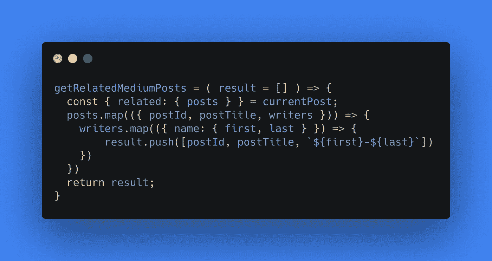

# JavaScript 中的主析构

> 原文：<https://betterprogramming.pub/master-destructuring-in-javascript-6871d1fe5f6c>

## 学习关于在 ES6 中析构数组和对象的所有知识



图片来源:作者

# 从 ES5 迁移到 ES6

对象和数组析构是我们已经使用了一段时间的东西。我们可能认为这是理所当然的，因为在 ES5 中，当我们想要将对象属性赋给外部变量时，我们需要这样做:

```
function foo(){
    return {a:1, b:2, c:3};
}var tmp = foo(), a = tmp.a, b = tmp.b, c = tmp.c;
```

我们必须调用函数，然后将属性值赋给新变量。

随着 ES6 的出现，我们可以使用析构来简化它。

```
var { a, b, c } = foo();console.log( a, b, c ); // 1 2 3
```

不需要临时变量，我们可以简单地调用函数，通过一些新的语法，我们能够立即捕获对象的属性值。当然，这也以同样的方式适用于数组:

```
function foo() {
    return [1,2,3];
}var [a, b, c] = foo();console.log( a, b, c ); // 1 2 3
```

既然我们已经掌握了基础知识，让我们看看如何最大限度地利用析构。

## 值->目标

当析构的时候，你必须明白到底发生了什么。

```
var { a, b, c } = foo();
console.log(a, b, c); // 1 2 3 var { a:a, b:b, c:c } = foo();
console.log(a, b, c); // 1 2 3
```

这两种析构方式是相同的。我们可以把它改写成这样:

```
var { a:x, b:y, c:z } = foo();
console.log(x, y, z); // 1 2 3
```

当我们声明新对象时，我们这样定义它们:`var o = { a: 1 };`。这里`a`是我们的目标变量，1 是我们分配给该目标的值。对于析构来说，情况正好相反:`x`是我们的目标，`a`变成了我们赋予目标的值。因此，解构对象被写成“值:目标”，而不是“目标:值”了解这一点将使我们更好地理解下面几节中的析构语句。

## 默认值

有时候你要析构的对象没有特定的字段。相反，您可能希望给该字段一个特定的值。

```
var { blogId, blogText, blogComments = [] } = getMostRecentBlog();
```

在上面的例子中，如果博客上没有可用的评论，我们将总是析构，以便`blogComments`有一个空数组。这在 React 中很有用，在 React 中，您可能只想通过调用 map 函数来呈现列表，而不必确保它不是未定义的！

我们甚至可以更进一步，例如:

```
var a = 100, b = 200, c = 300;
var dummyObject = { a : { b : 400}, b : { c : a } };( { a: a = { b: b } } = dummyObject );
( { b: c = { b: c } } = dummyObject );
( { c: b = { b: c } } = dummyObject );
```

你能算出`a`、`b`和`c`的最终值吗？这个例子表明，有时候析构对于下一个读者来说可能很难理解。重要的是要认识到，析构是为了让一切更具可读性而创建的。然而，在这里，我们可能会说它不是。你是否会在你的代码中使用这样的东西是由你决定的。

另外，注意析构模式周围的`( .. )`。这是必要的，因为否则，花括号会被错误地认为是块语句的开始，而不是对象的开始。

如果你花时间计算这些值，结果是`a` = `{b: 400}`、`b` = `{b:{c: 100}}`和`c` = `{c: 100}`。

## 未分配的值

当我们使用默认值时，是因为我们想确保我们要析构的对象总是返回一个属性值。然而，有时有一些我们不想捕捉其值的属性。

如你所见，可以将对象分解成更少的赋值。这让我们可以过滤掉我们不需要的数据。注意，对于数组，我们必须使用逗号来跳过一个元素。

我们还可以在数组中使用 spread 运算符来捕获子数组。

```
var dummyArray = [ 1, 2, 3, 4, 5 ];
var [a, ...b, c] = dummyArray;
console.log(a, b, c); // 1 [2, 3, 4] 5
```

使用 spread 操作符，我们能够捕获第一个、最后一个以及中间的所有元素。

## 交换变量

析构的许多用途之一是变量的交换。大多数时候，当开发人员需要交换变量时，他们会将其中一个值赋给一个临时变量，然后复制这些值。有了析构，我们可以更容易地做到这一点。

这是你工具箱里的一个不错的小工具。有一天，我们可能会看到这种情况出现在新的语言中。

## 链接分配

当析构一个对象时，一个赋值链总是拥有我们要析构的对象/数组的全部值。考虑一下这个:

```
var arr = [ 1, 2, 3 ];
var a, b, c;[a, b] = [c] = [1,2,3];
console.log(a, b, c); // 1 2 3
```

通过执行以下操作，对象也可以做到这一点:

```
var dummyObject = { a:1, b:2, c:3 };
var a, b, c;{ a } = { b, c } = dummyObject;
console.log(a, b, c); // 1 2 3
```

## 嵌套解构

最后，嵌套我们的析构语句是可能的。考虑这个例子:

```
var dummyObject = { a: { b : 100 } };
var { a : { b: b } } = dummyObject;
console.log(b); // 100// same as
var { a : { b } } = dummyObject;
```

还记得我们之前的“价值:目标”符号吗？当您想要深入了解对象的值时，可以使用嵌套。在上面的例子中，我们有我们的值`a`，我们将它赋给我们的目标`{ b: b }`，这是一个新的析构语句。所以我们将对象的值`a.b`赋给一个名为`b`的新变量。(速记:这个赋值也可以写成`{ b }`。)这有多好听？我们现在可以想去多深就去多深！

一个实际的例子是，我们试图获取用户写的第一篇博客的`blogTitle`。试着真正理解这个例子。一旦点击，你就可以使用析构来处理任何东西。

# 结论

在本文中，我们已经讨论了尽可能最好地使用析构的所有知识。永远记住可读性是关键。如果你在阅读你自己的析构赋值时有困难，可能会有一个更好的解决方案。

我希望你学到了一些东西，其中一些帮助你成为一个更好的 JavaScript 开发人员。祝你好运！