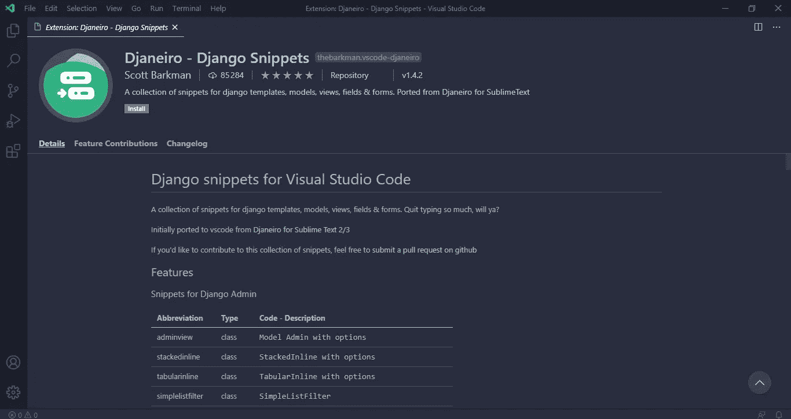
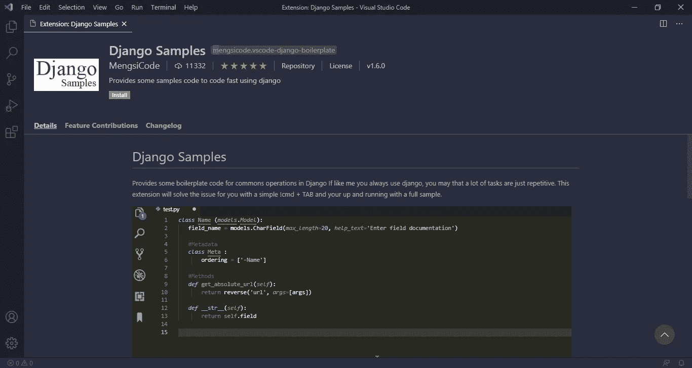
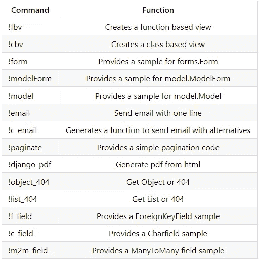
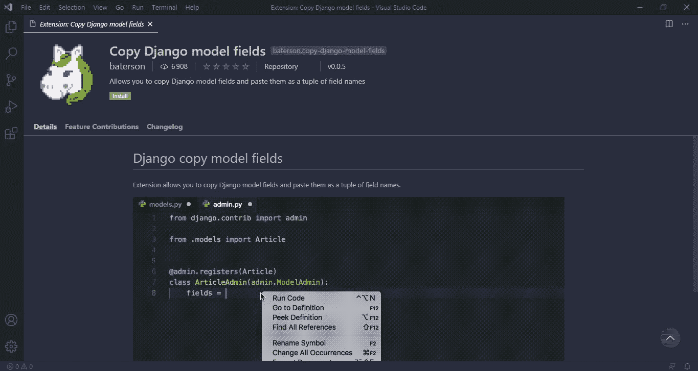

# 3 VS 代码扩展，用于 Django 中更快的 Web 开发

> 原文：<https://betterprogramming.pub/master-django-with-these-vs-code-extensions-for-fast-web-development-a4e0c29cc362>

## 让您的编码生活更轻松

布莱克·康纳利在 [Unsplash](https://unsplash.com?utm_source=medium&utm_medium=referral) 上拍摄的照片

我们将在这里发现三个 VS 代码扩展，它们将帮助我们在 Django 中更快更有效地编码。

# **1。Djaneiro — Django 片段**

Djaneiro — Django 片段

*别敲那么多了！*

使用 Django 模板、模型、视图、字段和表单的 Django 片段，您将在编写代码时节省大量的时间和精力。

## Django 模板示例

仅仅通过写:

*   `csrf` → ``
*   `block` → ` `
*   `for` → ` `
*   ….

[在此安装 Django 片段](https://marketplace.visualstudio.com/items?itemName=thebarkman.vscode-djaneiro)。

[GitHub 链接](https://github.com/ScottBarkman/vscode-djaneiro)

# 2.Django 样本

Django 样本

Django 中有很多常见的操作，比如创建一个新的模型或新的表单。

使用 Django Samples VS 代码扩展，您只需点击一个简单的！cmd +回车。

## 您可以使用的命令

在这里安装 Django 样本。

[GitHub 链接](https://github.com/MengsiCode/django_samples)

# 3.复制 Django 模型字段

复制 Django 模型字段

“复制 Django 模型字段”是另一个自动完成且节省时间的 VS 代码扩展。

从一个模型中获取字段以在另一个文件中使用它们变得如此简单和快速，只需通过“复制模型字段”功能将模型复制到“粘贴模型字段”功能即可。

1.  选择模型。
2.  点击“复制模型字段”
3.  转到文件以粘贴字段。
4.  单击粘贴模型字段。

[在此安装“复制 Django 模型字段”](https://marketplace.visualstudio.com/items?itemName=baterson.copy-django-model-fields)

[GitHub 链接](https://github.com/baterson/copy-django-model-fields)

希望这些 VS 代码扩展对你以后的项目有所帮助。

我将很高兴知道你是否和我一起尝试这些扩展。