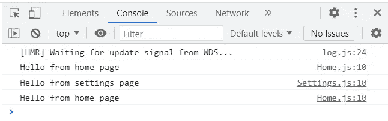

# 动态导入如何帮助提高 JavaScript 应用程序的性能

> 原文：<https://betterprogramming.pub/master-dynamic-imports-in-under-5-minutes-a0a06a4f43ae>

## 掌握动态导入以提高应用程序的速度

阿诺·弗朗西斯卡在 [Unsplash](https://unsplash.com/s/photos/programmer?utm_source=unsplash&utm_medium=referral&utm_content=creditCopyText) 上的照片

如果您曾经开发过大型 React 应用程序，您会知道动态呈现组件和/或库的能力可以让您的应用程序获得更好的性能。随着您的小应用程序变得越来越大，它的 JavaScript 包也会变得越来越大，这会导致很长的加载时间。

你的应用程序加载的时间越长，人们就越不可能等到它完成后再转向另一个应用程序。这就失去了潜在的客户，这反过来会导致更少的转换，让你少赚钱。

那么，随着代码的积累，我如何确保我的应用程序快速加载呢？

当然是通过代码分解。

我们在 React 中引入代码分割的最常见方式之一是通过动态导入。代码分割更多的是高级主题的中间，但是我在这里解释它是如何工作的，除了混乱。

在我们深入 React 中的动态导入之前，我们必须首先熟悉什么是代码分割，以及为什么它对我们很重要。

# 代码分割

代码分割是将应用程序的 JS 包“分割”成更小的包的行为，这些包在加载时动态呈现。一旦我们开始一个新的 React 应用程序，我们所有的代码都被累积成一个包。从这里开始，我们添加到应用程序中的特性越多，添加到捆绑包中的代码就越多。

任何 React 应用程序的包大小应该只有 500KB。这可能看起来很小，特别是对于较大的应用程序，但这是一个很好的基准，可以确保我们的应用程序为用户加载得足够快。

我们可以这样看待代码分解:假设你的任务是用手推车在工地上搬运 1000 块砖。如果你真的想的话，你可以试着把所有的 1000 块砖都装进手推车里——假设的话——然后在一次旅行中把它们都运走。这种方法的缺点是，考虑到这些砖块不会很轻，它可能会花费你很长时间。好处是你只需要做一次旅行，而不是多次。

负荷越大，你就会越慢。

另一方面，你可以用 100 块砖头或任何其他组合进行 10 次单独的旅行。这种方法的缺点是您必须进行多次旅行，但优点是您可以比第一种方法更快地让它们穿过工地。

由于速度和效率是软件游戏的名称，第二种方法对这种情况最有意义。在拆分我们的 JS 包时也可以这么说。

那么，我们如何着手对未来的应用程序进行代码拆分呢？

# 动态导入

如果您熟悉 React，那么您应该知道将代码分割引入应用程序的一个简单方法是使用动态导入语法。

让我们来看两个稍微不同的例子，它们完成了同样的事情。

静态导入

上面的例子演示了我们如何在 React 中使用静态导入。这里我们从我们的`Math`库中静态导入`multiply()`方法。

而下面的例子展示了我们如何通过在`handleMultiplication()`中动态导入`multiply()`方法来实现相同的功能。每次我们单击按钮，两个随机数的乘积就会被记录到控制台。

动态导入

那么哪个选项更好呢？

令人惊讶的是，这是第一个选项。即使我们在第二个例子中动态地导入我们的方法，这种方式也不比第一个更有效。老实说，可能会更糟。

但我记得你说过动态导入库会带来更好的性能？

尽管我们有机会在应用程序中的任何地方使用动态导入，但这并不意味着我们应该这样做。

让我们看一个更有用的例子。

假设我们的应用程序有几个页面，`Home`和`Settings`。当我们的应用程序加载时，用户会看到主页，并可以通过单击`Change Page`按钮切换他们想要显示的页面:

请注意 home 和 settings 组件几乎是彼此的精确副本。

这两个组件都动态导入我们的`pageData()`方法，为了简单起见，该方法返回当前显示的页面。

当我们在页面之间切换时，我们可以看到，随着每个组件的呈现，我们的输出会根据所显示的页面而变化。

为什么这和静态导入`pageData()`有什么不同？

假设用户很少导航到设置页面。如果这个页面从来没有被访问过，那么我们就没有必要加载随之而来的数据。当我们在`useEffect()`中动态导入我们的方法时，我们实际上是在“延迟加载”我们的数据，从长远来看，这最终为我们节省了一些性能。

通过这样做，我们避免了加载用户可能不需要的冗余代码。这反过来又减少了应用程序初始加载时所需的代码。

# 结论

在我们的应用程序中实现更好的性能可能是一项艰巨的任务，但却是值得的。像代码分割这样的编程方法是提高应用程序性能的有效方法。关于如何分割 JavaScript 包，有各种各样的主题，但是这个主题是最简单的。

正如我们刚刚看到的，有些时候使用动态导入是最好的，也可以增加冗余。所以我们必须明智地使用它，不要随便用它。

我希望这能让您有所了解，并为您未来或现有的应用程序增加一些性能。

感谢您的阅读。下一集见。