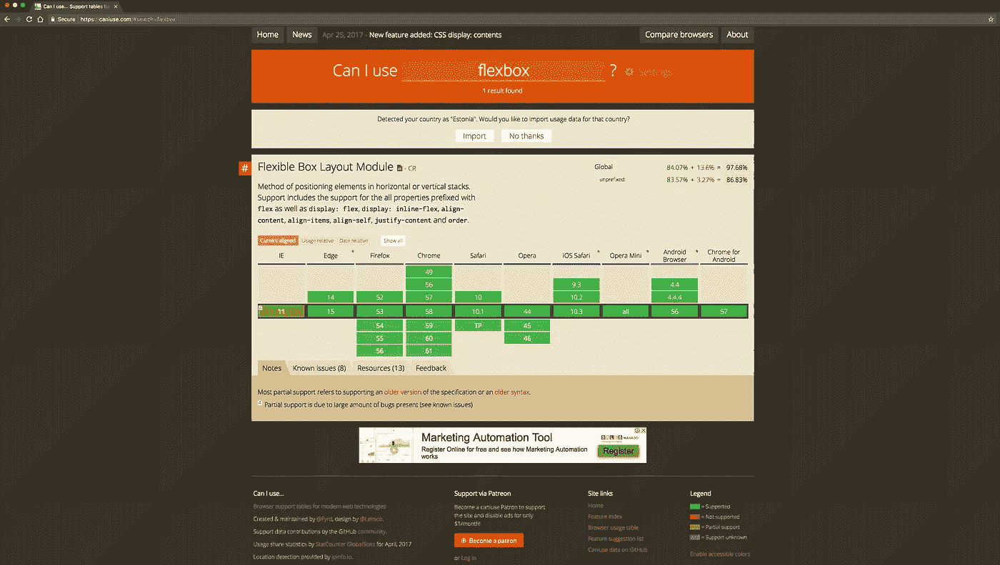
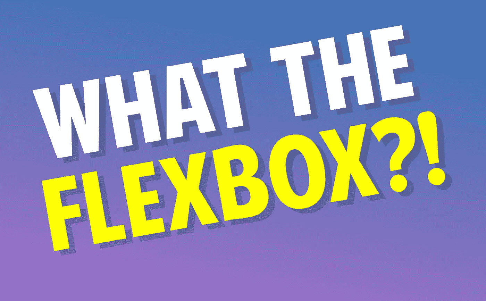

# 免费掌握 Flexbox 的这 3 门精彩课程！

> 原文：<https://betterprogramming.pub/master-flexbox-with-these-3-fantastic-courses-for-free-432b1fcd4361>

由[在](https://unsplash.com/@helloquence?utm_source=unsplash&utm_medium=referral&utm_content=creditCopyText) [Unsplash](https://unsplash.com/search/photos/learning?utm_source=unsplash&utm_medium=referral&utm_content=creditCopyText) 上拍摄的

Flex 无疑是一个非常方便的工具。大多数新的 CSS 框架使用`flex`作为它们的网格。使用 Flex 定位元素变得轻而易举——绝对值得您花费时间。

所有现代浏览器都支持 [Flexbox](https://css-tricks.com/snippets/css/a-guide-to-flexbox/) 。甚至`react-native` [也使用 Flexbox](https://facebook.github.io/react-native/docs/flexbox.html) 进行布局——这意味着您可以将新学到的技能应用到原生移动开发中。

理解 Flexbox 的工作原理不会花你太多时间。

[https://caniuse.com/#search=flexbox](https://caniuse.com/#search=flexbox)

***让我们得到伸缩！***

# **1。通过示例了解 Flexbox**—免费

由 [Laracasts](https://laracasts.com/series/learn-flexbox-through-examples) 提供。在过去十年中，Flexbox 无疑是 CSS 最重要的补充之一。唯一的问题是有一点学习曲线。相信我，你会想学这个的。一旦你做到了，你就会对它赞不绝口。

老师— [拉腊卡斯特](https://medium.com/u/d163b3776f15?source=post_page-----432b1fcd4361--------------------------------)

# 2. ***什么是 Flexbox？*** — *自由*

一个简单的，[免费的 20 个视频课程](https://flexbox.io/)将帮助你掌握 CSS Flexbox。

教师— [韦斯·博斯](https://medium.com/u/86a55cd7983b?source=post_page-----432b1fcd4361--------------------------------)

# 3. ***CSS FlexBox 必备* — F** *ree*

DevTips 是一个关于网页设计和开发的 YouTube 频道。在这个视频中，他们谈到了 CSS3 Flexbox。立即使用 FlexBox 所需的一切。

老师——特拉维斯·尼尔森

# 结论

现在去学些对你有益的东西吧！

一旦你完成了课程，测试你的技能，这个很酷的 Flexbox 游戏。

 [## Flexbox 青蛙

### 一个学习 CSS flexbox 的游戏

flexboxfroggy.com](https://flexboxfroggy.com/)