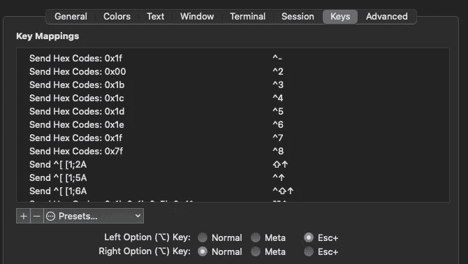
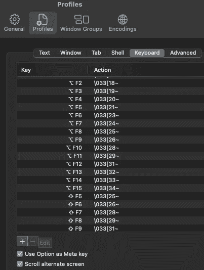
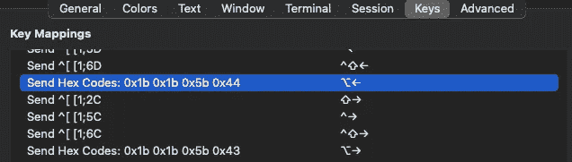
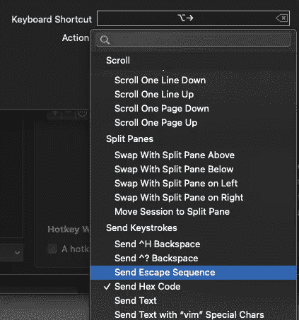
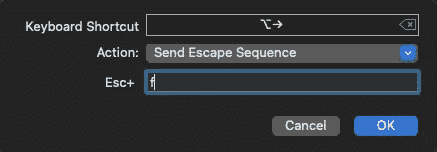
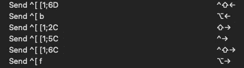
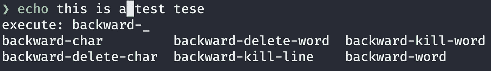

# 像忍者一样掌握 Mac/Linux 终端快捷键

> 原文：<https://betterprogramming.pub/master-mac-linux-terminal-shortcuts-like-a-ninja-7a36f32752a6>

## 学习终端忍者的秘密，以提高生产力


照片来自 [irasutoya](https://www.irasutoya.com/) 。

本文的主要焦点是 macOS，但是许多键盘快捷键和命令也适用于 Linux。我将向您展示一些让您与普通终端用户有所不同的技巧。

我们将涵盖:

*   设置 macOS 终端配置。
*   查找键盘快捷键。
*   探索内置命令函数，包括如何搜索命令历史。
*   查找命令名。
*   寻找关键序列。
*   如何将命令名绑定到供个人使用的按键序列。

卷起袖子，让我们开始吧！

# 使用 Ctrl-E 和 Ctrl-A 移动光标

如果您使用的是 macOS，您的默认 shell 是 ZSH(从 Catalina 开始)。让我们看看你的 ZSH 版本:

```
$ zsh --version
zsh 5.8 (x86_64-apple-darwin20.0)
```

`Ctrl-a`将光标移动到行首，而`Ctrl-e`将光标移动到行尾。但是你如何一个字一个字地前后移动光标呢？


# 将光标向后/向前移动一个单词

`backward-word`或“后退一个字符”的 Bash 绑定是`Meta-b`。对于`forward-word`或“前进一个字”，是`Meta-f`。由于 escape 键是元键，`Esc-b`和`Esc-f`应该可以。

在 iTerm 和内置终端上，`Esc-b`将光标向后移动一个单词，`Esc-f`将光标向前移动一个单词。但是每次都需要松开`Esc`键。否则，它将键入`B`或`F`。松开`Esc`键不方便。让我们将`Esc`键分配给`Option`键，这样您就不需要每次都释放它。

# 如何在 macOS 上禁用特殊字符

按下`Option-b`和`Option-f`会得到什么？如果你得到`∫ ƒ`，那么你需要修改终端首选项。让我们将`Esc`分配给`Option`键。

## iTerm2

[iTerm2](https://towardsdatascience.com/the-ultimate-guide-to-your-terminal-makeover-e11f9b87ac99) 是终端的替代品，在 MAC 上工作。iTerm2 和内置的终端提供了丰富的快捷方式，可以高效地移动和编辑。

对于 iTerm2 用户，在首选项>配置文件>键中选择`Esc+`作为“左选项键”。然后你可以用`Option-b`来表示上一个单词，用`Option-f`来表示下一个单词。



iTerm2 首选项>配置文件>密钥。

你的`Esc`键被称为“元键”或修饰键。通过将左`Option`键设置为另一个`Esc`键，我们可以将它用作修饰键。

## 内置终端

对于内建终端，请在“偏好设置”>“描述文件”>“键盘”中设置“将选项用作元键”。



内置终端偏好设置>配置文件>键盘。

现在`Option-b`和`Option-f`应该作为`backward-word`和`forward-word`工作。

# iTerm2 中的 Option-RightArrow 和 Option-LeftArrow

`Option-RightArrow`和`Option-LeftArrow`作用于内置端子`forward-word`和`backward-word`，但不会作用于 iTerm2。让我们也修理这些。

进入 iTerm2 首选项>您的默认配置文件名称>密钥。我有以下`Option-LeftArrow`的键映射:



我的 iTerm2 上的默认键映射。

按`+`添加键盘快捷键。在“键盘快捷键”中按下`Option-RightArrow`，在动作栏中选择“发送转义序列”然后在`Esc+`字段中，输入`f`。



将发送转义序列分配给我的 iTerm2 上的选项右箭头。



在我的 iTerm2 上向 Esc+添加 f。

现在我们有了`Option-RightArrow`的`^[f`。在按键映射中，`^[`符号表示“转义”。



任务完成。图片作者。

使用`b`对`Option-LeftArrow`进行同样的操作。

现在`Option-RightArrow`和`Option-LeftArrow`应该按预期工作。

# 快捷键

## 光标移动

您可以使用键盘快捷键在命令行中移动光标。

按住`control`键时，字母键产生相同的控制字符，而不管`[shift](https://www.wikiwand.com/en/Shift_key)`或`[caps lock](https://www.wikiwand.com/en/Caps_lock)`键的状态如何。换句话说，键产生的是大写字母还是小写字母并不重要。括号内是 ZLE 命令名，我们将在本文后面使用它(ZSH 有自己的行编辑器——ZSH 行编辑器，简称为`zle`)。

*   `Ctrl-A`将光标移动到行首(`beginning-of-line`)。
*   `Ctrl-B`将光标向后移动一个字符(`backward-char`)。
*   `Ctrl-E`将光标移动到行尾(`end-of-line`)。
*   `Ctrl-F`将光标向前(右)移动一个字符(`farward-char`)。
*   `Opt/Alt-b`将光标向后移动一个单词。我们已经在本文的第一部分解决了这个问题。
*   `Opt/Alt-f`将光标向前移动一个单词。我们已经在本文的第一部分解决了这个问题。

在 macOS 上，`fn-LeftArrow`将光标移动到行首，`fn-RightArrow`将光标移动到行尾。

## 文本编辑

您可以在命令行中使用快捷键删除字符、交换字符、剪切、清除和猛拉来编辑文本。

*   `Ctrl-D`删除光标下的一个字符(`delete-char-or-list`)。
*   `Ctrl-H`删除光标前的一个字符(`backward-delete-char`)。
*   `Ctrl-K`将光标所在的行剪切到剪贴板的行尾。命令名叫做`kill-line`。可以用`Ctrl-y`粘贴(`kill-line`)。
*   `Ctrl-T`将光标与前一个字符交换(`transport-chars`)。
*   `Ctrl-U`清除到行首(BASH)。ZSH 解围了。我们稍后将更改这个(`backward-kill-line`)。
*   `Ctrl-W`剪切光标前的单词(`backward-kill-word`)。
*   `Ctrl-Y`从剪切命令中拉出/粘贴最后一个东西(`yank`)。
*   `Opt/Alt-T`将单词与前一个单词互换(`transpose-words`)。
*   `Opt/Alt-d`从光标处删除单词(`kill-word`)。
*   `Opt/Alt-delete`删除光标前的单词。
*   `Opt/Alt-c`将光标下的字符大写，并移动到单词末尾(`capitalize-word`)。

## 流程和其他

*   `Ctrl-C`终止/停止当前进程。
*   `Ctrl-Z`暂停/终止当前进程`fg`返回进程。
*   `Ctrl-J`与`RETURN` / `ENTER`键(`accept-line`)相同。
*   `Ctrl-L`清除屏幕(`clean-screen`)。
*   `Ctrl-M`与`RETURN` / `ENTER`键(`acceopt-line`键)相同。

# 搜索命令历史记录

`Up Arrow`和`Down Arrow`键返回命令历史。您的`~/.history`文件包含您所有的命令历史。接下来的四个命令可以更有效地搜索历史。

`Ctrl-R`的绑定键是`history-incremental-search-backward`。这将搜索先前使用的命令，并返回最新的命令。要循环选择，您可以重复使用`Ctrl-R`。它会在您键入时显示下一个匹配的历史项目。

可以使用`Ctrl-S`向前搜索。使用`Ctrl-R`后，可以通过`Ctrl-S`改变搜索方向。

要退出历史搜索模式，使用`Ctrl-G`。


Ctrl-r 和 Ctrl-s 的作用。

*   `Ctrl-R`和`Ctrl-S`取一个以上的字，而后面的`ESC-p`和`ESC-n`取一个字。
*   `ESC-p`转到历史中以单词(`history-search-backward`)开始的上一行。
*   `ESC-n`转到历史中以单词(`history-search-forward`)开始的下一行。
*   `ESC-p`和`ESC-n`简单地在与第一个单词匹配的历史条目中循环。


Esc-p 和 Esc-n 正在运行。

# 查找编辑器命令名

你可以通过使用`bindkey`或`bindkey -L`找到你所有的编辑器命令和按键绑定。大多数命令名都有连字符的形式，比如`history-search-backward`。该列表会告诉您所有的终端键绑定。

```
$ bindkey -L
bindkey "^@" set-mark-command
bindkey "^A" beginning-of-line
bindkey "^B" backward-char
bindkey "^D" delete-char-or-list
bindkey "^E" end-of-line
bindkey "^F" forward-char
bindkey "^G" send-break
...
...
```

参见[我的 macOS 的所有输出](https://gist.github.com/shinokada/17a8cef8f7d24cd2d483936a60cd89a2)。`^A`表示`Ctrl-A`，`^[`表示`escape`键或`option`键(我们在本文的第一部分中设置了这一点)。所以比如说，`"^[^H" backward-kill-word`就是按下`Opt-Ctrl-h`的意思。它向后删除一个单词。

你可以发现`Ctrl-y`的作用是什么:

```
$ bindkey '\C-y'
"^Y" yank
```

或者您可以使用`grep -F`命令从键中找到命令名。`-F`将一个模式解释为一组固定的字符串。

```
$ bindkey | grep -F "^Y"
"^Y" yank
$ bindkey | grep -F "^[[A"
"^[[A" up-line-or-history
```

# 寻找关键序列

你多久使用一次功能键？如果你不是像我一样使用功能键，可能要绑定功能键。

按键序列是一个或多个输入事件的序列。功能键、控制键、退出键和箭头键都有它们自己的键序列。

我们可以找到这些关键序列。`read`或`cat`命令找到按键序列。让我们找出从 F12 到 F1 的功能键序列。键入`read`或`cat`后，在终端上按回车键。按下`fn-F12`和`fn-F11`找出按键顺序。

```
$ read
^[OP   # output from F1
^[OQ   # output from F2
^[OR   # output from F3
^[OS   # output from F4
^[[15~ # output from F5
^[[17~ # output from F6
^[[18~ # output from F7
^[[19~ # output from F8
^[[20~ # output from F9
^[[21~ # output from F10^[[24~ # output from F12
```

*注意:在我的 macOS 上，F11 绑定了“显示桌面”。我只是让它保持原样。*

`SHIFT-Function`键怎么样？

```
$ read
^[[1;2P  # SHIFT-F1
^[[1;2Q  # SHIFT-F2
^[[1;2R  # SHIFT-F3
^[[1;2S  # SHIFT-F4
^[[15;2~ # SHIFT-F5
...
```

您可以找到箭头的按键顺序:

```
^[[A # up-arrow
^[[B # down-arrow
^[[C # right-arrow
^[[D # left-arrow
```

同样，`^[`代表转义字符，shell 将`^[`称为`\e`。

# 如何将编辑器命令绑定到按键序列

现在我们知道了功能键序列和命令名，我们可以将它们绑定在一起。

请注意，当使用控制键时，小写或大写并不重要。但是当使用其他键时，如`opt`键，字母大小写很重要。

```
# ctrl-u or ctrl-U
^U
# opt-u
^[u
# opt-U. It is different from opt-u
^[U
```

将以下内容添加到`~/.zshrc`:

```
# This binds Ctrl-u to backward-kill-line
bindkey '^U' backward-kill-line# This binds Opt-u to kill-whole-line. Remember we changed the opt key to Esc.
bindkey '\eu' kill-whole-line
```

您可以在终端上检查它:

```
$ bindkey -L | grep -F "^U"
bindkey "^U" backward-kill-line
bindkey "^X^U" undo$ bindkey -L | grep -F "^[u"
bindkey "^[u" kill-whole-line
```

让我们给`backward-kill-line`绑定一个功能键:

```
# binding F1 to backward-kill-line. F1 key sequence is ^[OP.
bindkey '\eOP' backward-kill-line# binding Opt-p/Esc-p to history-beginning-search-backward 
bindkey '\ep' history-beginning-search-backward
```

接下来，让我们绑定`function-12`键来执行`forward-word`命令。

记得用`\e`表示`Esc`，`\b`表示退格，`\t`表示`Tab`。

# 额外小费

如果您知道一个命令名，您可以使用`Esc-x`来执行它。

输入命令时，可以按`Esc-x`显示`execute:`执行 ZSH 命令。键入一个单词并按下`Tab`显示可用的命令。



Esc-x 在行动。

# 结论

我希望您现在已经非常熟悉命令行导航和最佳实践。这些知识将节省您与 shell 交互的时间，找到有用的命令名，并在 ZSH 中创建键盘快捷键。

现在，您知道如何:

*   用`bindkey -L`找到所有的按键绑定。
*   用`read`找到按键序列。
*   开始使用键盘快捷键，包括历史搜索。
*   将功能键绑定到 ZLE 命令。

编码快乐！

**通过** [**成为**](https://blog.codewithshin.com/membership) **会员，获得媒体上所有故事的访问权限。**


[https://blog.codewithshin.com/subscribe](https://blog.codewithshin.com/subscribe)

[](/9-terminal-commands-you-can-start-using-today-7b9b0e273894) [## 您今天就可以开始使用的 9 个终端命令

### 提高效率的终端命令

better 编程. pub](/9-terminal-commands-you-can-start-using-today-7b9b0e273894) [](https://towardsdatascience.com/the-ultimate-guide-to-your-terminal-makeover-e11f9b87ac99) [## 终端改造的终极指南

### 今天你将度过的最好的 11 分钟:程序员的终端提示

towardsdatascience.com](https://towardsdatascience.com/the-ultimate-guide-to-your-terminal-makeover-e11f9b87ac99)