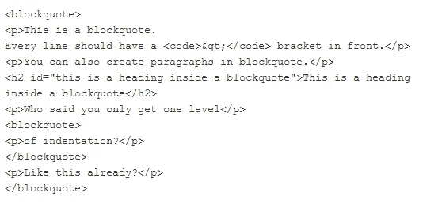

# 十分钟后大减价

> 原文：<https://betterprogramming.pub/master-markdown-in-ten-minutes-ce9721c51eb>

## 使用 Markdown 设计内容的完整指南


由 [Unsplash](https://unsplash.com/s/photos/html?utm_source=unsplash&utm_medium=referral&utm_content=creditCopyText) 上 [Greg Rakozy](https://unsplash.com/@grakozy?utm_source=unsplash&utm_medium=referral&utm_content=creditCopyText) 拍摄的照片

2004 年，著名的苹果评论员和在线博客作者，[约翰·格鲁伯](https://daringfireball.net/)，厌倦了写冗长费力的 HTML 标签来恰当地格式化他的内容。这种挫败感导致了为网络写手创建纯文本格式写作语法: [Markdown](https://daringfireball.net/projects/markdown/) 。

Markdown 是为内容创建者提供的纯文本到 HTML 的转换工具。它允许你快速地为网络设计易读、易写的内容，并神奇地将其转换成干净、结构化的 HTML。

让我们举一个快速降价的例子:

```
I’m not *crazy*. My **mother** had me [tested](https://www.youtube.com/watch?v=mr6XHJ7qcSE).
```

这将成为:

引用自《生活大爆炸》

只需几个额外的字符，Markdown 就能让丰富的文档格式化变得快速而美观。

想象用 HTML 写下同样的一行:

```
I’m not <em>crazy</em>. My <strong>mother</strong> had me <a href="https://www.youtube.com/watch?v=mr6XHJ7qcSE">tested</a>.</p>
```

HTML 标签增加了许多行内干扰。他们使文件难以阅读。对于不熟悉 HTML 的人来说，这是不可能的。

在 Markdown 中格式化文本有一个非常平缓的学习曲线。本文旨在用不到十分钟的时间让您熟悉语法。

# 基本语法

随着减价越来越受欢迎，各种不同口味和规格的减价品应运而生。

例子包括[普通标志](https://commonmark.org/)、 [GitHub 风味降价](https://github.github.com/gfm/)和[降价附加](https://michelf.ca/projects/php-markdown/extra/)。但是所有应用程序都支持约翰·格鲁伯的原始设计文档中概述的基本元素。

Markdown 的设计非常注重可读性。因此，您会发现它的语法简单而直观。

以下是您最常用的元素:

## 段落

段落就是一行或多行连续的文本，由一行或多行空行分隔。如果两行需要转换成段落，你必须在它们之间留一个空格。看一看:

```
This is paragraph 1.
No empty line in between, so I am still on paragraph 1.This seems like paragraph 2.Shouldn't this be paragraph 3 then.
```

输出:通过简单地留出一个空行来定义段落

注意:多个空行将被渲染为一个空行或一个`<p>`标签。如果需要添加多个空行，参见[这个关于堆栈溢出的问题](https://stackoverflow.com/questions/20543454/create-two-blank-lines-in-markdown)。

但是，如果我们需要软换行符，而不是一个新的段落。想象写下下面这首诗:

来源:[链接](https://pun.me/pages/funny-poems.php)

我们需要单行分隔符`<br>`，而不是空行。这可以通过在每一新行后插入两个空格来实现。

您可能会发现很难看到空格，下面代码片段中的每个`(space)`代表键盘上的一个空格。

```
I eat my peas with honey.(space)(space)  
I've done it all my life.(space)(space) 
It makes the peas taste funny.(space)(space)  
But it keeps them on the knife!
```

## 头球

在 Markdown 中，标题是通过在一行前面加上`#`符号来创建的。哈希的数量表示标题的级别。

一个散列被转换成一个`H1` ( [HTML 标题标签](https://www.w3schools.com/html/html_headings.asp))，两个散列被转换成一个`H2`等等。总共有六个级别可供你使用，但是对于大多数写作来说，你很少需要超过三个级别。

```
# Heading 1 
## Heading 2
### Heading 3
#### Heading 4
##### Heading 5
###### Heading 6 
```

输出:标题是通过前缀#符号创建的

我们也可以对`<h1>`和`<h2>`使用 [Setext 样式的](https://en.wikipedia.org/wiki/Setext)标题，分别用等号(`=`)和连字符(`-`)给所需的标题加“下划线”。

```
This is a level 1 header
=============

This is a level 2 header
-------------
```

输出:Setext 样式标题

## 批量报价

有时候，你需要特别注意不同来源的引用或强调重要的一点。如此艰难的时期需要 Markdown 的块引用语法。块引号使用电子邮件样式的`>`尖括号表示。

我设计了一个有点复杂的例子来帮助你理解 Markdown 背后的核心思想:可读性。

假设您希望看到以下输出:

输出:块引号非常有用

用 HTML 来设计它看起来会像这样:



用 HTML 编写相同的 blockquote

让我们来看看如何使用 Markdown 实现同样的功能。

```
> This is a blockquote. 
> Every line should have a `>` bracket in front.
> 
> You can also create paragraphs in blockquote.
>
> ## This is a heading inside a blockquote
> Who said you only get one level
>> of indentation?
>
> Like this already?
```

我希望我已经阐明了我的观点。

## 短语强调:斜体和粗体

使用 Markdown 可以很容易地将文本设计成*斜体*或**粗体**。

要使 Markdown 中的短语变为斜体，请用下划线(`_`)或星号(`*`)将它括起来。例如，`_hello_`会变成*你好*。

类似地，要在 Markdown 中将短语加粗，用两个下划线(`__`)或两个星号(`**`)将它括起来。例如，`__hello__`会变成**你好**。

您也可以通过使用三重星号(`***`)或三重下划线(`___`)来一起使用它们。让我们来看看:

```
*I am italics.*
_And so am I._**I am bold.**
__And so am I.__***I swing both ways.***
**_As do I!_**
*__And me also!__*
___ME TOO!___
```

输出:用斜体表示不重要，用粗体表示强调

## 列表

original Markdown 支持两种类型的列表:有序的(带数字的列表)和无序的(带项目符号的列表)。

要创建一个无序列表，在列表中的每一项前加一个星号(`*`)。也可以用加号(`+`)和连字符(`-`)代替。每个列表项也有自己的一行。

例如，Markdown 中的待办事项列表可能如下所示:

```
**To Do List**
* Write a Markdown Tutorial
* Add jokes in it
* Apologize for the stupid puns
* Do laundry
```

这将导致:

另一方面，有序(编号)列表的开头是数字，后面是句点，而不是星号:

```
1\.  Apple
2\.  Orange
3\.  Banana
```

输出:

注意:实际上你可以把数字按任何顺序排列。你可以从 2 开始，而不是 1。无论你做什么，输出都是一样的。

我们还可以增加列表的深度，创建子列表。要添加新的级别，只需在每个星号前缩进或添加一个额外的空格。看一看:

```
* Item One
* Item Two
  * Sub-Item One
  * Sub-Item Two
    * Sub-Sub-Item One
  * Sub-Item Three
* Item Three
```

这导致:

您可以使用相同的语法编写多段列表项。

*   如果你在项目之间放置空行，你将得到`<p>`标签。
*   如果在行尾添加两个空格，就会得到一个`<br>`标签。

```
1\. A list item with a line break.  
   This is the same paragraph. This is a new paragraph in the same item.
2\. Second item in the list.
```

输出:

## 链接

Markdown 中有两种不同类型的链接，内嵌链接和引用链接。两者的结果完全相同。

要创建内联链接，请使用方括号(`[ ]`)将链接文本括起来，然后将链接括在括号(`( )`)中。例如，要创建一个到这个搜索引擎的超链接，你写:

```
For further research, [use](www.ecosia.org)
```

注意:您也可以添加一个 HTML 标题属性，如下:`For further research, [use](www.ecosia.org "hover title")`

引用链接实际上是对文档中另一个地方的引用。您使用文档中其他地方定义的名称来引用您的链接。看一看:

```
* Here is a [reference link][Chaitanya Baweja] to my profile. 
* References are case-insensitive. So, this would work as well.  [reference link][chaitanya baweja].
* Can be done with [numbers][1] as well. Somewhere in the document, you would define all the names
[Chaitanya Baweja]: [https://medium.com/@chaitanyabaweja1](https://medium.com/@chaitanyabaweja1)
[1]: [https://www.numberphile.com/](https://www.numberphile.com/)
```

这导致:

使用引用链接的一个主要好处是可以在一个点上更新同一个地方的多个链接。

## 形象

添加图像的语法与链接语法非常相似。唯一的区别是你需要在图片前加一个感叹号(`!`)。

以下示例演示了内嵌和引用样式的图像:

```
Inline Image
 Reference style image
![alt text][image path][image path]: /path/to/img.png
```

以上两个示例生成了相同的 HTML 代码:

```

```

# 高级语法

我希望到现在为止，你已经熟悉了降价的基本原则。Markdown 有许多“扩展”实现，可以提供更多功能。

这些包括表格、任务列表、代码突出显示等。并非所有的实现都支持这些新增功能，但是这些功能被广泛使用，因此值得关注。

## 水平标尺

您可以使用三个或三个以上的星号或连字符(带或不带空格)轻松添加水平线(`<hr/>`)。

```
#### Section 1
---
#### Section 2
***
#### Section 3
- - -
#### Section 4
*********
```

输出:注意各部分之间的水平线

## 自动链接

我们可以通过将链接或者甚至是电子邮件地址用尖括号(`<>`)括起来来创建自动超链接。

```
<http://ecosia.org/> is equivalent to
[http://ecosia.org/](http://ecosia.org/).  
It works for email as well: <john.doe@rediffmail.com>
```

输出:自动链接也适用于电子邮件地址

## 转义字符

假设您希望键入**bold**，而不会变成 **bold** 。在星号(`*`)前使用反斜杠(`\`)将防止任何*意外*转换为 HTML。

```
I want to say \*\*bold\*\* without being **bold**.
```

对转义字符使用反斜杠

## 任务列表

语法非常类似于普通的无序列表。你只需要在每一项前加一个符号表示完成与否。完成由`[x]`表示，未完成由`[]`表示。

```
**To Do List**
- [x] Write a Markdown Tutorial
  - [x] Add jokes in it
  - [x] Apologize for the stupid puns
- [ ] Do laundry
```

## 桌子

在 GitHub 风格的 Markdown 中，您可以使用竖线`|`和连字符`-`创建表格。我们使用连字符创建每一列的标题，然后使用管道来分隔每一列。

```
| First Column | Second Column | Third Column |
| :----------- | :-----------: | -----------: |
| Left-align   | Center-align  | Right-align  |
| Item 1       | Item 2        | Item 3       |
```

注意:您必须在表格前包含一个空行，以便表格正确呈现。

你可以在 GitHub 上的 Markdown [中找到更多关于表格的细节。](https://help.github.com/en/github/writing-on-github/organizing-information-with-tables)

我个人不太喜欢 Markdown 中的牌桌。它们可能很麻烦，而且还有其他问题，比如堆栈溢出的问题。

## 删除线

用两个波浪号(`~~`)将短语括起来。

```
~~this phrase is deleted.~~
```

## 密码

如果你正在写一个编程博客，你肯定会使用代码片段来引导你的读者通过一个特定的语法。

*   对于一个简单快速的`code`代码片段，在代码片段周围使用一个反勾。
*   对于指定多行代码，缩进四个空格或一个制表符**T5 会将整个段落变成一个代码块。**

```
We can show a simple `<html>` code snippet by surrounding the `code snippet` in back-ticks.If we need an entire code block, indent the block with 4 spaces. This is first line of code
    This is second line of code
```

这导致:

注意:任何&符号(`&`)和尖括号(`<`或`>`)都被自动转换成 HTML 实体。

现在，对于大多数语言来说，你可能想要一些额外的特性，比如语法高亮。这在 Markdown 的各种扩展中都有，比如 GitHub 风格的 Markdown。

我们用三个记号(`````)将代码括起来，并指定使用的编程语言。在下面的例子中，我们使用 Python。

```
To check which elements of a list are even, do the following:```python
for number_i in given_list:
    if number_i%2 ==0:
        print(number_i," is even")
```
```

这将导致:

## 嵌入 HTML

最后，如果你需要额外的功能，你可以在 Markdown 文档中使用普通的 HTML。Markdown 支持所有常规的 HTML 元素。例如:

```
This part in **Markdown**.  
<p>This part in <strong>HTML</strong>.</p>
```

# 结论

引用约翰·格鲁伯的话:

> “Markdown 格式语法的首要设计目标是尽可能提高可读性。
> 
> 这个想法是，Markdown 格式的文档应该像纯文本一样发布，而不要看起来像是用标签或格式说明标记的。

Markdown 已经成为学者、科学家、作家和许多其他人事实上的写作标准。用 Markdown 编写的文档可以很容易地在各种平台上共享。

GitHub 和 Reddit 正在使用 Markdown 来设计他们的评论。许多流行的编辑器，如 [Atom](https://atom.io/) 为 Markdown 提供了内置支持。

随意使用 HTML 进行高级格式化。因为 Markdown 支持所有常规的 HTML 标签，所以你可以用它做任何事情。

我强烈建议你通过写你的第一份 Markdown 文档来巩固这些想法，并对基础有所了解。

# 有用的工具

1.  [大胆的火球——降价介绍](https://daringfireball.net/projects/markdown/basics)
2.  [降价完成教程](https://www.markdowntutorial.com/)
3.  [掌握 Markdown GitHub 指南](https://guides.github.com/features/mastering-markdown/)
4.  [迪林杰:支持云的降价编辑器](https://dillinger.io/)