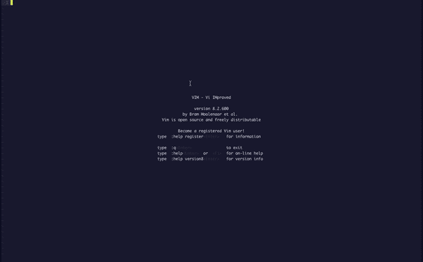

# Python 开发的主 Vim

> 原文：<https://betterprogramming.pub/master-vim-for-python-development-d5573d8d6640>

## 如何使用和设置 Vim 进行生产开发


[Goran Ivos](https://unsplash.com/@goran_ivos?utm_source=medium&utm_medium=referral) 在 [Unsplash](https://unsplash.com?utm_source=medium&utm_medium=referral) 上的照片

Vim 是一个高度可配置的文本编辑器，可以更有效地创建和编辑任何类型的文本。我在这里没有足够的空间来描述 Vim 的所有优点和特性，但是我使用这个编辑器的主要原因是，您可以对它进行修改来做您想做的任何事情:使用通用配置、创建定制命令、定制配置等等。

也许您听说过 Vim 很难使用和配置——嗯，这是真的。这就是为什么今天我要向您展示我是如何为 Python 编程设置 Vim 的。我已经构建了完美的 Python 开发 IDE。多年来，我尝试过 PyCharm、Atom、Sublime Text、Spider 和其他优秀的 ide，但是我用 Vim 构建的 ide 是最好的:更简单、更快，最重要的是，它具有我想要的配置。此外，我们将要构建的代码编辑器是完全免费的。

# 试映

这是我的 Vim 现在的样子:



我的 Vim 代码编辑器

如您所见，我构建了一个具有高级自动完成功能的漂亮编辑器，能够快速执行我们的代码。显然，你也可以改变主题，因为它没有其他的好。太好了！

请记住，我选择保持我的编辑器非常轻。您可以添加更多的功能—我们稍后会看到如何添加。

# 下载 Vim

幸运的是，安装 Vim 既简单又快速。

## Mac 用户

要在 Mac 上安装 Vim，你需要`HomeBrew`。要安装`HomeBrew`,请打开您的终端并键入以下内容:

```
/bin/bash -c "$(curl -fsSL [https://raw.githubusercontent.com/Homebrew/install/master/install.sh](https://raw.githubusercontent.com/Homebrew/install/master/install.sh))"
```

一旦你安装了`HomeBrew`，你就可以安装`Vim`:

```
brew install vim
```

## Linux 用户

对于这些类型的程序，Linux 安装总是最容易的:

```
sudo apt-get install vim
```

## Windows 用户

在 windows 上安装 Vim 不如在 UNIX 上快。遵循[这八步指南](https://www.instructables.com/id/Install-and-Write-First-Text-File-Using-Vim-on-Win/)。

现在到了最好的部分——修改 Vim 的配置以构建一个完美而快速的 Python 代码编辑器。

# 下载 Vundle

在编辑 Vim 配置之前，我们必须安装 Vundle:

```
git clone https://github.com/gmarik/Vundle.vim.git ~/.vim/bundle/Vundle.vim
```

# 配置。vimrc 文件

著名的`.vimrc`**(也可能不是)。*也许你已经在某个地方听过这个文件的名字，但不知道它到底是什么。嗯，每次我们想在代码编辑器中添加一些东西时，我们都会修改这个文件。*

*在修改之前，我们先创建:`touch .vimrc`。*重要提示:该文件需要在您的主目录中。**

*现在，我们可以向该文件添加一些代码:*

*简单，但是高效。让我们来看看为了创建这个文件我到底做了什么。*

*在第三行，我告诉 Vim 我希望显示我写的代码行。然后，在第五行到第十二行，我设置了 Vundle。*

*Vundle 对 Vim 来说就像个饭桶。*

*然后我们下载`nerdtree`包，让我们的目录树显示在左边，还有`spacecamp`:Vim 的黑暗主题。*

*最后一个包是`auto-pairs`。这对 Python 编程来说是必不可少的，因为它有助于我们结束引号和括号。*

*在第 24 行，我选择 F2 键在左边显示`/Users/tommasodeponti/Desktop`目录。*

*第 30-31 行:我们将使用 F3 来执行当前的 Python 文件。然后我重新映射了一些命令，以便能够更快地进入我的 Vim 编辑器:*

```
*Ctr-H --> Move to the left
Ctr-L --> Move to the right
Ctr-J --> Move to the bottom
Ctr-K --> Move to the top*
```

*在最后一行，我选择了`spacecamp`作为我的代码编辑器的主题。*

# *最后一步*

*我们接近终点了。*

*您需要做的最后一件事是重启 Vim。它最初会打印出一些错误——只需按 Enter 键。当你进入的时候，输入:`:PluginInstall`。这将使用 Vundle 来安装我们想要的所有软件包。再次重启 Vim，一切都准备好了。*

# *使用风筝自动完成*

*如果您试图用新编辑器键入一些代码，您可能会注意到没有自动完成功能。我们需要安装[Kite](https://kite.com/)——可能是 Python 最好的代码完成引擎。请在此下载[风筝](https://kite.com/download/)。安装完成后，打开 Vim，编辑器中就会有强大的代码自动完成功能。*

# *如何将我自己的配置添加到 Vim？*

*这是至关重要的一步。当我们将编辑器的配置添加到`.vimrc`文件中时，我们只添加了一些配置——您可能想要更多。这一步可能很棘手——如果你有任何问题，请留下评论。*

## *在谷歌上搜索*

*一切从这里开始。在互联网上搜索您想要的配置和“vim”比如我想改变 Vim 的配色方案。我在谷歌上搜索“牛逼配色 vim”。我发现[恶狼](https://github.com/sjl/badwolf)，我喜欢它。*

## *修改。vimrc 文件*

*现在我们需要安装 BadWolf 配色方案。我们打开`.vimrc`文件，对于我们已经安装的其他包，我们在`Plugin 'jiangmiao/auto-pairs'`行输入:`Plugin 'sjl/badwolf'`。然后我们修改。从`colorscheme spacecamp`到`colorscheme badwolf`的 vimrc 文件。*

## *重启 Vim 并安装插件*

*关闭 Vim 并重新打开它(当 Vim 将显示错误时，只需单击 Enter)，然后键入`:PluginInstall`。等到它显示“完成！”通过在您的终端上键入`vim`再次启动 Vim。你安装了 BadWolf。*

# *给 Mac 用户的提示*

*如果你是 Mac 用户，这个提示会很有趣。尤其是如果你是一个终端爱好者。不要用，默认的 Mac 终端肯定很棒，但是没有 [ITerm2](https://www.iterm2.com/) 那么棒。请在这里下载[。它是默认终端的替代品，具有改进的外观和许多自定义功能。](https://www.iterm2.com/)*

# *结论*

*我们今天构建的代码编辑器是迄今为止我用过的最好的 Python 代码编辑器。此外，我还有很多其他配置可以尝试。*

*另一方面，Vim 很难使用。我已经用了一段时间，花了两到四天的时间来学习基础知识。然而，当你习惯了，它会比只在键盘上工作更有效率。*