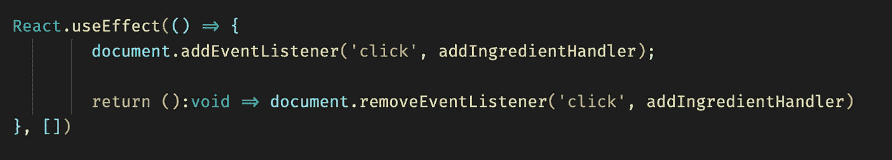
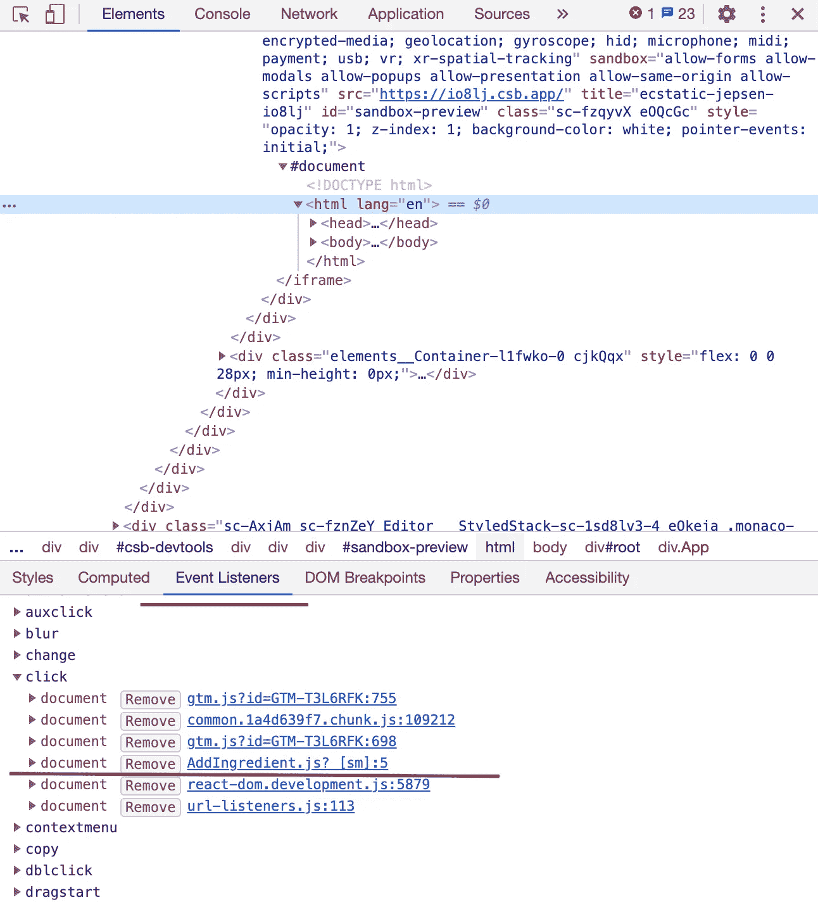
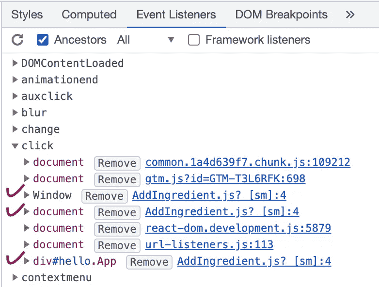
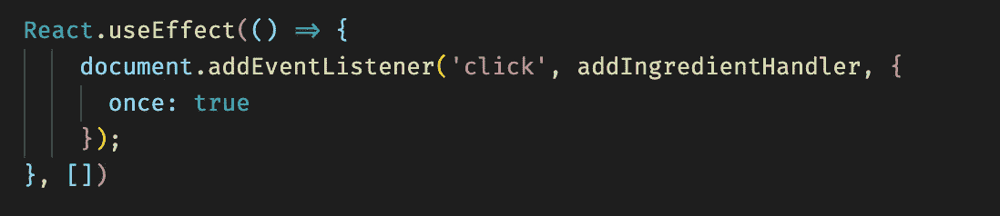
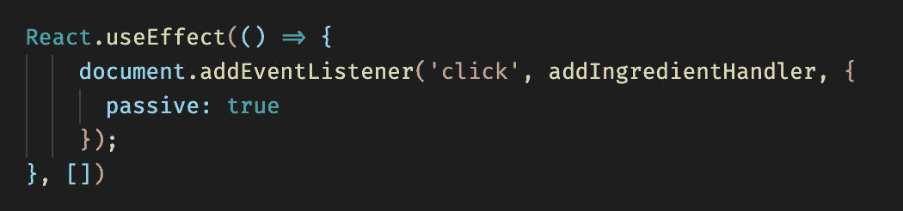
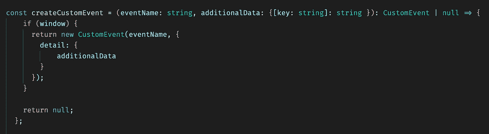
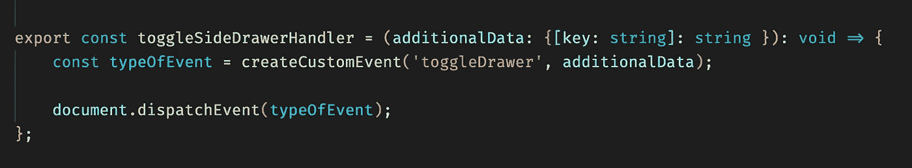

# 掌握事件监听器的反应技巧

> 原文：<https://betterprogramming.pub/master-your-react-skills-with-event-listeners-ebc01dde4fad>

## 在 React 等中创建自定义事件监听器

照片由 [Unsplash](https://unsplash.com/s/photos/plane-show?utm_source=unsplash&utm_medium=referral&utm_content=creditCopyText) 上的[尼克·费因斯](https://unsplash.com/@jannerboy62?utm_source=unsplash&utm_medium=referral&utm_content=creditCopyText)拍摄

如果您曾经在前端或后端处理过 JavaScript 项目，那么您应该非常熟悉通过内置事件模块将事件附加到文档、元素或窗口对象的模式。

React 在这个核心 JS 模块上创建了一个抽象层来公开所谓的合成事件包装器，通过它我们可以操纵和访问 React 中的虚拟 DOM 元素。在大多数情况下，我们只需要将函数传递给 React 为我们公开的一个合成事件处理程序。

但是在某些情况下，我们需要一些不同的东西:一些更符合我们需求的东西，一些更灵活的东西。有些情况下，使用合成事件甚至全局状态的传统方法根本不够好，或者不太合理。

对于这些情况，使用纯 JavaScript 事件监听器可能是我们正在寻找的解决方案。这正是我们都爱反应的原因，不是吗？归根结底，这只是 JavaScript。

如果你继续阅读，这是你可以从这篇文章中期待的:

*   如何正确添加、清理和监控事件侦听器？
*   事件监听器性能和优化策略。
*   如何以及为什么我们想要创建自定义事件侦听器。
*   能够证明其用途优于更传统的“反应式”实现的用例。

# 如何正确地添加、清理和监控我们的事件侦听器

在我们深入研究代码和实现之前，我想澄清一些我觉得在 React 和 JavaScript 中添加事件时被误解的地方。我们可以在代码中向窗口、文档或元素对象添加事件侦听器。根据我们期望的行为，我们需要考虑将侦听器添加到哪个位置。

在任何情况下，我都强烈建议在组件的安装阶段附加这样的侦听器来作出反应，以避免任何意外的行为。

这是我们在功能组件中的做法:

添加事件侦听器

当我们不再需要侦听器时，清理并删除它们是绝对重要的；在这种情况下，这将是组件卸载的时间。如果我们不清理侦听器就让它们四处游荡，那么我们的应用程序可能会出现严重的性能和意外的行为问题，所以请格外小心地处理这个问题。

另一种确保我们的侦听器在我们想要的地方，或者相反，确保我们在某个操作之后成功地删除了侦听器的方法是检查和监视我们的侦听器。我们如何做到这一点？

这很容易。下面是 Chrome 开发工具的一个例子:

当我们打开开发人员工具并导航到我们感兴趣的元素时——在我们的例子中是 HTML 文档，因为我们在文档级别附加了侦听器——我们实际上可以看到我们的事件侦听器附加到 DOM，等待执行。

由于我使用了 [codesandbox.io](https://codesandbox.io/) 作为示例，我们可以看到一些附加的监听器。如果我们在 Event Listeners 选项卡内的窗口、文档和元素对象上有一些侦听器，它看起来会是这样的:

附加了多个侦听器。

如果您仔细查看最后一个屏幕截图，您会发现除了 click 事件上的附加事件侦听器之外，还有名为“contextmenu”和“auxclick”的事件；这些肯定不是默认值，而是从 codesandbox.io 添加到全局事件名称空间的自定义事件。

稍后，您将有机会在*“我们如何以及为什么要创建定制事件监听器”一节中看到我们如何创建自己的定制事件*

# 事件监听器性能和优化策略

我将再次强调，为了避免事件侦听器出现任何问题，我们必须在不再需要它们时(通常在组件卸载阶段)适当地添加(在组件的安装阶段)和清理。

此外，您已经看到了如何通过开发人员工具监视所有事件侦听器，以及如何仔细检查我们的代码是否按照我们预期的方式执行和行为。现在我们已经很好地理解了如何处理和观察我们的侦听器，让我们看看如何确保它们被配置为最佳性能。

第三个参数可用于 addEventListener 方法，它允许我们指定一些方便的选项，如 **once** 属性。

一次属性选项

> `- once` A `[Boolean](https://developer.mozilla.org/en-US/docs/Web/JavaScript/Reference/Global_Objects/Boolean)`表示`listener`添加后最多调用一次。如果`true`，`listener`会在被调用时自动移除。
> [Mozilla 文档](https://developer.mozilla.org/en-US/docs/Web/API/EventTarget/addEventListener)

如果我们有一个用例希望我们的事件监听器只执行一次，那么将 **true** 传递给 **once** 属性会非常有用。文档说，当我们通过这个选项时，它会在我们的侦听器被触发后自动删除，所以我们不必担心清理。

我们可用的另一个非常方便的标志是**被动**选项。在它的帮助下，我们可以大大提高听众的表现。在一个真实的场景中，仅仅通过提供这个选项，我就能够减少侦听器所连接的元素的响应时间。看起来是这样的:

被动选择

> `*- passive*` 一个`[*Boolean*](https://developer.mozilla.org/en-US/docs/Web/JavaScript/Reference/Global_Objects/Boolean)`，如果`*true*`，表示`*listener*`指定的函数永远不会调用`[*preventDefault()*](https://developer.mozilla.org/en-US/docs/Web/API/Event/preventDefault)`。如果被动监听器调用了`*preventDefault()*`，用户代理除了生成一个控制台警告之外什么也不做。参见[使用被动监听器提高滚动性能](https://developer.mozilla.org/en-US/docs/Web/API/EventTarget/addEventListener#Improving_scrolling_performance_with_passive_listeners)了解更多信息。

我很想检查使用和不使用这个选项的监听器的性能。我在一个文档中附加了 100 个事件，然后按下一个按钮，这个按钮的标题就被另一个标题取代了。这是一个非常简单的例子，但是这个测试的想法是非常简单和可重复的。结果相当决定性！

使用常规事件侦听器时，平均执行时间为 164 毫秒，但是当我使用被动选项时，平均执行时间下降到 116 毫秒，这比使用 React 时性能提高了近 30%!🤯

# 我们如何以及为什么想要创建定制的事件监听器

尽管 React 总共为我们提供了 83 个受支持的事件，但有时我们可能会陷入其中没有一个事件完全满足我们需求的境地。也许我们需要处理一个更复杂的动画或者一个触发一些 UI 变化的自定义滚动事件，或者我们只是想避免全局名称空间上点击事件的混乱和可能的重叠。

不管出于什么原因，你可能想避免在 React 中使用任何受支持的事件，我们总是可以自己创建自定义事件。这实际上比你想象的要容易。让我展示给你看:

创建自定义事件方法

所以在`*createCustomEvent*` 方法内部是大部分“魔法”发生的地方。事实上，这很简单——让我快速地向你介绍一下。

*   我们希望将两个参数传递给我们的`*createCustomEvent*` 方法:您选择的事件名称和您希望在调用该事件时传递的任何附加数据。这些额外数据所在的位置在 detail 参数中，所以这是您需要搜索它的位置。
*   在方法体内，我们首先检查窗口对象是否存在。如果没有，那么我们的事件不能被附加，因此我们返回 null。如果定义了窗口，那么我们返回 [CustomEvent 构造函数](https://developer.mozilla.org/en-US/docs/Web/API/CustomEvent/CustomEvent)，它创建我们的自定义事件并传递我们希望包含在细节对象中的任何数据。

大部分工作已经完成，我们还需要一个方法来分派我们新创建的事件。这是它的样子:

事件处理程序调度

有了这个两行方法，我们的工作就完成了。我们被锁定并加载来创建和调度`toggleDrawer`定制事件。让我们想象一下，我们需要这个事件侦听器来处理我们需要打开/关闭的抽屉。
在这种情况下，我们在文档级别上调度我们的事件，但是您可以自由地在窗口或元素对象上这样做。

快速 toggleSideDrawerHandler 演练:

*   首先，我们希望收到一个带有`*toggleSideDrawerHandler*` *，*的参数，这个数据将在以后通过我们的事件调用传递。
*   第二，我们调用已经定义的`*createCustomEvent*` 方法，并传递我们的附加数据和事件名称。
*   最后，每当这个方法被调用时，我们将调度我们新创建的`toggleDrawer`事件。

在我们创建了自定义事件方法之后，剩下唯一要做的事情就是实际使用它们。现在我们可以将`*toggleSideDrawerHandler*` 方法附加到任何元素上，在被调用后，它将调度 *toggleDrawer* 事件。在这里，你可以找到一个代码沙箱，上面例子的一个工作实现。

# 证明其使用优于更传统和“反应式”实现的用例

在 React 中使用事件监听器通常不是我们想要过度使用的。在最好的情况下，我们希望使用 React 提供的默认合成事件行为；这是最好的做法，也是应该走的路。

有例外和情况，这只是不是最佳的。对于这些情况，最好记住使用事件侦听器是一个选项。想象一下这样一种情况，我们想要在应用程序的另一端触发一个动作，而通过 prop drilling 来传递我们的方法是不可能的，或者实现全局状态管理将是一种过度的行为，并且不是真正合理的。在这种情况下，使用简单的事件监听器可能是正确的做法。

享受快乐的黑客生涯！