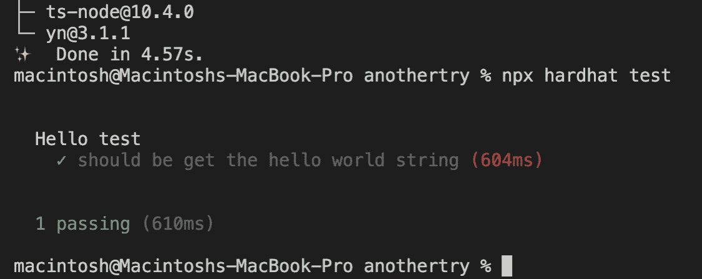
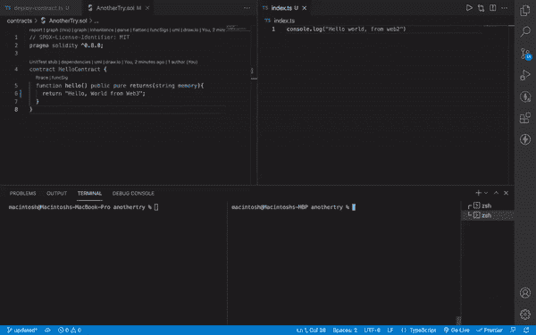

# 掌握区块链开发:使用 Hardhat-Node 和 Typescript 部署智能合约

> 原文：<https://betterprogramming.pub/mastering-blockchain-development-deploying-smart-contract-using-hardhat-node-and-typescript-9383bcdad6ee>

## 掌握 web 3 第 3 部分—部署我们的智能合同


来自@stories 的免费图片

一旦您像我们在[第 2 部分](https://aindrajaya.medium.com/mastering-blockchain-development-hardhat-implementation-on-testing-smart-contract-with-typescript-3048b4a36052)中所做的那样测试了您的智能合约，并在[第 1 部分](https://aindrajaya.medium.com/mastering-blockchain-development-first-step-to-implement-ethereum-hardhat-and-typescript-74807c691129)中制作了您的第一个智能合约，您就可以将它部署到以太坊网络中。

或者你也可以使用复制以太坊主节点的 Hardhat 节点到你的个人电脑上，然后你也可以将你的智能合约部署到 Rinkeby，Goerli，Ropsten，还有 Kovan 等以太坊测试网中。

但是在第 3 部分教程中，我们将尝试使用 Hardhat Node 在本地网络上部署智能合约。

# 部署流程

我们必须创建一个新文件来处理我们的部署过程，您可以使用任何您喜欢的名称。但它必须以`.ts`结尾，因为我们使用 typescript。我们将这些部署文件放在哪里？首先，您必须创建一个名为`scripts`的文件夹，然后您可以将您的部署文件放在这个文件夹中。

下面是命令行:

```
//Go to root folder of your project
$ mkdir scripts && cd scripts$ touch deploy-my-contract.ts
```

之后，您可以在该文件中编写一些代码。

在您编写了处理部署过程的代码之后。我们可以测试一下。但是在运行部署脚本之前，您还必须运行 Hardhat 节点实例，它将为我们本地计算机上的测试和部署目的提供一堆以太坊地址(就像 Truffle 的 Ganache 一样，如果您知道的话)。

这是命令行:

1.  首先，您应该打开一个新的终端并编写以下命令:

```
$ npx hardhat node
```

2.第二步，您可以在默认终端中测试并编写命令:

```
$ npx hardhat run scripts/deploy-contract.ts --network localhost
```

> 注意:
> `—-network,` 它将选择您将用来部署您的合同的网络，在`--network`命令之后，它可以是 Rinkeby、Mainnet 或 localhost。
> `localhost,`这意味着您将在本地网络上部署您的合同，或者脚本将告诉您在哪里运行(使用 hardhat 节点实例)

# 试验结果

这是我们测试的结果:



# 结论



Web 2 和 Web 3 的区别

我们所做的是尝试一个简单的例子，通过使用以太坊的副本来进行 dApp 开发。当我们尝试实现 web3.0 而不是 web2.0 时，会发生一些不同的过程

有一个 [RPC](https://techterms.com/definition/rpc) (远程过程调用)请求，当我们调用我们的`hello()`函数并显示在我们的终端控制台上时发生。但是我们还需要与我们的 Web 浏览器通信，所以在第 4 部分的下一个教程中，我将使用提供服务的工具来将我们的 hello dApp 与浏览器集成，我们将配置元掩码，还将使用 typescript 配置 Webpack，并向我们的浏览器显示`Hello, World from web3`。

少了什么？还有一些问题需要解决，比如关于`pure`的解释，还有我们智能合同文件中的`memory`。这个问题可以在本系列文章之后讨论。谢谢大家！